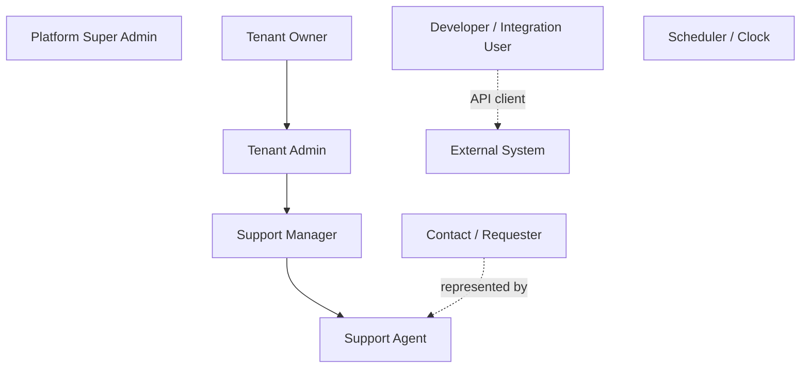

# Personas and actors

Actors are what the use-case diagram shows; personas give them motivation so that UI and priorities can be judged against a person rather than a role name.

## Actor hierarchy

Roles inherit downward in *permissions*, not in code: each role is a permission bundle ([security](../03-architecture/security.md)).

## Personas

### Priya — Support Manager at a 12-agent SaaS company (primary persona)

- Runs two teams (Billing, Technical). Spends the morning re-assigning tickets that piled on the same two agents overnight.
- Wants: fair automatic assignment she can override; a dashboard that shows SLA risk *before* breach; a reason attached to every automatic decision so she can defend it to the team.
- Success: "I stopped opening the queue at 8 a.m. to shuffle tickets."

### Arjun — Support Agent

- Handles 15–25 tickets a day. Hates duplicate tickets from the same outage and losing internal context when a colleague takes over.
- Wants: a focused "my tickets" view sorted by real priority; duplicate suggestions at the top of a new ticket; internal notes distinct from customer replies; keyboard-friendly UI.
- Success: "The system tells me what to do next and why."

### Meera — Tenant Admin / Owner at a company running Smart Helpdesk on-premise

- Responsible for setup: teams, skills, categories, SLA policies, roles, integration credentials.
- Wants: sensible defaults; settings screens that explain their effect on the algorithms; a single-server install she can back up.
- Success: "It ran on our VM with one Ansible command and the backup restores."

### Rahul — Integration Developer at a customer

- Needs to create tickets from an internal monitoring tool and receive status changes back.
- Wants: OpenAPI docs he can read at `/docs/api`, a client-credentials flow, webhooks with signatures he can verify, delivery logs for debugging.
- Success: "I integrated in an afternoon without asking anyone."

### Sam — Platform Super Admin (vendor)

- Creates tenants, suspends non-paying ones, checks platform health. Must not casually browse tenant data.
- Success: "Tenant onboarding is a form, not a runbook."

### The Requester (contact) — Not a user in the MVP

Contacts exist as data; they receive email notifications on public replies and resolution. A customer portal is V1 ([backlog](../../roadmap/09-v1-backlog.md)).

### The Examiner — evaluates the academic deliverable

Needs to see, in under twenty minutes, that the algorithms are ours, that they work, that they were evaluated, and that tests exist. The [demo plan](../12-academic/demo-plan.md) is written for this persona.

### Non-human actors

- **Scheduler / clock**: drives SLA warning/breach evaluation and webhook retries.
- **External system**: anything calling the API or receiving webhooks.
