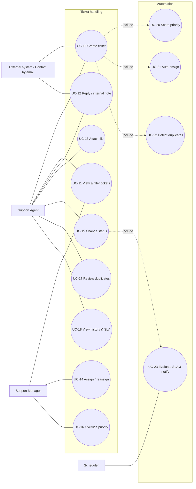
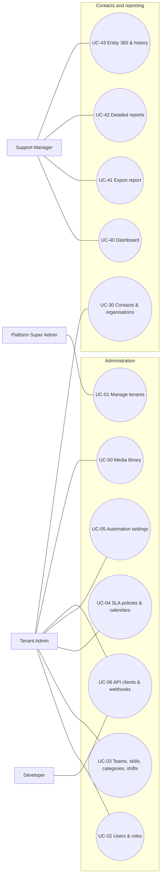

# Use cases

Numbered use cases are the source for the use-case diagram, the functional requirements ([functional-requirements.md](functional-requirements.md)), the E2E tests ([roadmap/05-testing-plan.md](../../roadmap/05-testing-plan.md)) and the report's Chapter 3.

## Use-case diagrams (MVP)

The use cases are drawn in two diagrams so that each fits on a report page.

### Ticket handling and automation

### Administration, contacts and reporting

## Use-case specifications

Format: ID, actors, preconditions, main flow, alternative flows, postconditions, related requirements. Only flows with non-obvious rules are spelled out; simple CRUD cases list rules only.

### UC-01 Manage tenants (Platform Super Admin)

- **Main flow:** create tenant (name, slug, owner email, plan) → system creates tenant record, default roles/permissions, default categories, default SLA policy, default settings, owner user with invitation → tenant reachable at `slug.<platform-domain>` (SaaS) or as the single tenant (on-prem).
- **Alternatives:** suspend tenant (all logins and API calls return 403 `tenant_suspended`); reactivate.
- **Rules:** super admin cannot open tenant business screens; the MVP has no "impersonate" feature (V1 with audit).

### UC-02 Manage users and roles (Tenant Admin)

- Invite user by email with role; user sets password via signed link. Assign one or more roles; roles are tenant-scoped permission bundles; custom roles allowed. Cannot remove the last Tenant Owner. All changes go to the security audit log.

### UC-03 Manage teams, skills, categories (Tenant Admin)

- Skills are free-form named competencies. Categories require zero or more skills and may have a default team. Agents have skills, team memberships, weekly capacity (max concurrent open tickets) and availability (`available`, `away`, `offline`).

### UC-04 Manage SLA policies (Tenant Admin)

- Policy = per priority: first-response target and resolution target (minutes), warning fraction, escalation actions. One default policy per tenant; optional per-organisation-tier policies. Editing a policy affects future tickets and recomputes open, unbreached timers (rule documented in [sla](../04-domain/sla.md)).

### UC-05 Manage priority and assignment settings (Tenant Admin)

- Edit weights for priority factors and assignment factors, thresholds for P1–P4, duplicate suggestion threshold; a live preview shows how a sample ticket would score. Settings stored as tenant settings (JSONB) with validated schema.

### UC-06 Manage API clients and webhooks (Tenant Admin / Developer)

- Create OAuth2 client → receive client id + secret once. Create webhook subscription (URL, events, secret) → test delivery → view delivery log → retry failed delivery → disable.

### UC-10 Create ticket (Agent, or External System via API)

- **Preconditions:** contact exists or is created inline; category chosen.
- **Main flow:** enter title, description, contact, category, impact, urgency, tags, attachments → system computes priority score (UC-20) → system searches duplicates (UC-22) and shows suggestions before save (UI) or returns them in the response (API) → ticket persisted as `open` → SLA timers started (UC-23) → auto-assignment runs (UC-21) → notifications and webhooks fire.
- **Alternatives:** agent marks the new ticket as duplicate of a suggestion → ticket saved with status `closed`, `duplicate_of` set, comment added to the original; manual priority override with reason.
- **Postconditions:** ticket has number, score, level, SLA timers, history entry `created`.

### UC-11 View and filter tickets

- Server-side paginated table; filters by status, priority, team, agent, category, tag, organisation, SLA state, date range; free-text search on title/description/number; sort by priority score, updated, created, SLA due; saved column visibility (client-side); bulk assign/status change on selected rows.

### UC-12 Comment: public reply or internal note

- Public reply emails the contact and is visible on the future portal; internal note is agent-only. First public reply by an agent satisfies the first-response SLA. Comment supports attachments.

### UC-13 Attach file

- Direct browser upload via presigned URL to object storage; server validates MIME/size on completion; downloads always via short-lived signed URLs; tenant-prefixed paths.

### UC-14 Assign / reassign (Manager or Agent with permission)

- Manual pick of team/agent; system shows the algorithm's ranking with explanation; assignment history entry recorded; agent notified; `tickets.assign` required. "Auto-assign now" button re-runs UC-21.

### UC-15 Change status

- Transitions constrained by the state machine in [tickets.md](../04-domain/tickets.md). `resolved` requires a resolution comment (public or internal). `pending` pauses SLA. `closed` is terminal except reopen within a configurable window. Reopen creates a history entry and restarts the resolution timer per policy.

### UC-16 Change priority

- Manual override sets `priority_override` with reason; score is still computed and displayed; SLA timers recomputed per [sla-evaluation](../05-algorithms/sla-evaluation.md).

### UC-17 Review duplicate suggestions

- Suggestions shown on the ticket page with score breakdown; agent can "mark as duplicate", "not a duplicate" (recorded as negative feedback, used only in the evaluation dataset), or ignore.

### UC-18 View ticket history and SLA

- Timeline of status, priority, assignment, SLA events with actor and reason; SLA panel with due times, remaining, state.

### UC-20 Score priority (system)

Deterministic; runs on create, on edit of inputs, on scheduled ageing pass (hourly). Details: [priority-scoring](../05-algorithms/priority-scoring.md).

### UC-21 Auto-assign (system)

Runs after creation when tenant setting `auto_assign=true`, on "auto-assign now", and optionally on escalation. Details: [agent-assignment](../05-algorithms/agent-assignment.md).

### UC-22 Detect duplicates (system)

Runs synchronously on create (bounded candidate set) and stores suggestions. Details: [duplicate-detection](../05-algorithms/duplicate-detection.md).

### UC-23 Evaluate SLA and notify (system, scheduler)

Every minute: find timers due for warning/breach, transition, fire events, escalate. Details: [sla-evaluation](../05-algorithms/sla-evaluation.md).

### UC-30 Manage contacts and organisations

- CRUD with search; organisation has tier (`standard`, `premium`, `enterprise`) that feeds priority and SLA; external identifiers and metadata JSONB for integrations; duplicate email per tenant rejected.

### UC-40 View dashboard (Manager/Admin)

- KPIs and charts listed in [functional-requirements](functional-requirements.md) FR-ANL. Numbers computed by SQL aggregates with a short cache.

### UC-42 Run detailed report (Manager, Admin)

- **Main flow:** open Reports → choose a report from the catalogue → set period, comparison, grouping and filters → system returns KPI tiles, chart and table → user drills into a number → record list → record 360 page.
- **Rules:** results respect the user's view permissions (an agent with `reports.view` but without `contacts.view` does not see contact reports); every parameter is in the URL; durations state whether they are business or wall-clock time.

### UC-43 View entity 360 and history

- **Main flow:** open a ticket, contact, organisation, agent, team or category → overview metrics and related records → History tab shows the change timeline with actor and old/new values → choose "as of" date → system shows the reconstructed attributes and highlights differences from today.
- **Rules:** requires `history.view`; excluded attributes (secrets, message bodies) never appear.

### UC-41 Export report

- CSV or XLSX export of any report table or the filtered ticket list, generated as a background job, stored in the media library `Reports` folder, with a signed download link and an in-app notification.
