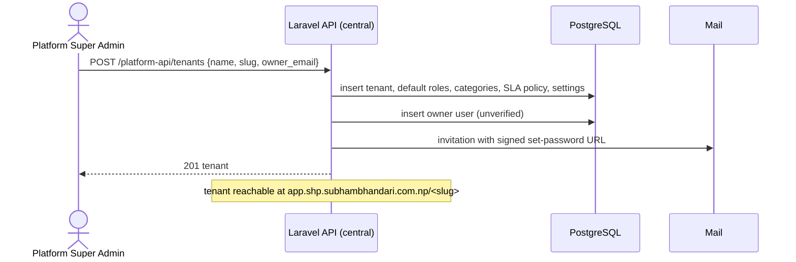
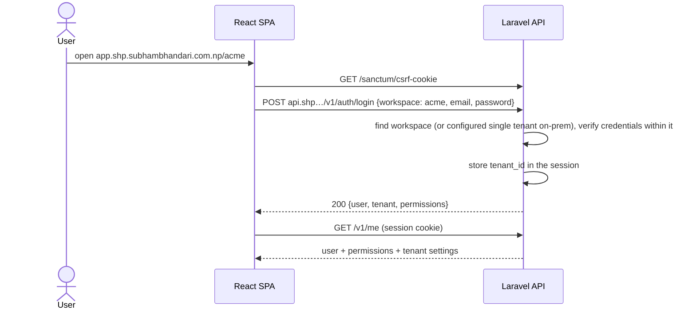
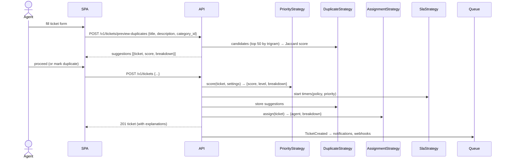
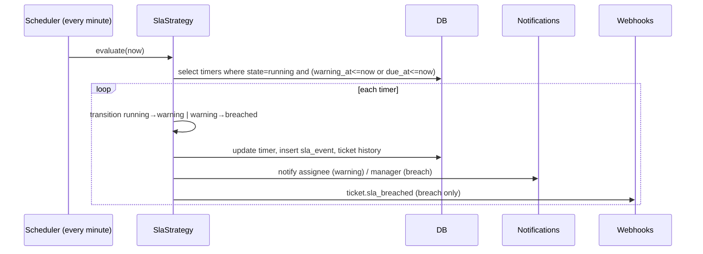

# User flows

Flows are drawn as activity/sequence diagrams that the report reuses. Each flow names the API endpoints it exercises so the E2E tests and the docs stay aligned.

## F1 — Tenant onboarding (SaaS)

## F2 — Login and tenant resolution (SPA)

Details and the on-prem variant are in [03-architecture/tenancy.md](../03-architecture/tenancy.md) and [07-api/authentication.md](../07-api/authentication.md).

## F3 — Golden path: ticket creation with automation

## F4 — Agent works the ticket

Open ticket → read duplicate suggestions and SLA panel → add internal note → public reply (satisfies first response; email to contact) → set `in_progress` → set `pending` (SLA paused) → contact reply recorded by agent → `in_progress` (SLA resumed) → `resolved` with resolution comment → auto-close after N days or manual close → optional reopen.

## F5 — SLA warning and breach

## F6 — Integration developer

Create OAuth2 client in Settings → `POST /oauth/token` (client_credentials) → `POST /v1/tickets` with bearer token → register webhook → receive `ticket.status_changed` with `X-Helpdesk-Signature` → verify HMAC → view delivery log and retry from the UI.

## F7 — Dashboard and export

Manager opens Dashboard → KPI tiles and charts load from `/v1/dashboard` → clicks "Export tickets CSV" → job enqueued → in-app notification with signed download link.

## F8 — Tenant isolation (negative flow, tested)

User of Tenant A requests `/v1/tickets/{uuid of tenant B ticket}` → 404 (not 403, to avoid existence disclosure). Same for attachments, contacts, comments, webhook logs, analytics, and search. Broadcast channel `tenant.{B}.tickets` authorisation denied. Signed URL for B's attachment not obtainable via A's session.
