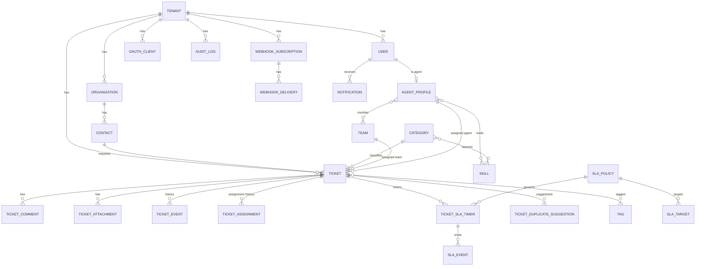

# Data architecture

Full entity list and columns: [08-database/entities.md](../08-database/entities.md). Indexing: [08-database/indexing.md](../08-database/indexing.md). Decisions: [ADR-0005](../adr/0005-postgresql.md), [ADR-0013](../adr/0013-identifiers.md).

## Entity relationship overview

## Principles

1. **Every application-plane table has `tenant_id`** (even secondary tables) for RLS and simple index prefixes.
2. **UUID v7 keys**, `timestamptz` in UTC, `created_at/updated_at` everywhere; soft deletes only where product semantics need them (contacts archive, tickets never deleted in MVP).
3. **JSONB where the shape is open or per-tenant**: `tenant_settings.data`, `priority_explanation`, `assignment explanation`, `duplicate breakdown`, `metadata`, `external_ids`, `escalation` config, webhook payloads. Size-limited and schema-validated in PHP; never queried in business rules except settings reads.
4. **Derived data is materialised when it is queried by the scheduler**: `due_at`, `warning_at`, `priority_score`, `active_ticket_count`. Recomputation is explicit and evented.
5. **Enums as text with check constraints** (not PostgreSQL enum types, which are painful to migrate).
6. **Counters** (`tenant_counters`) under row locks for ticket numbers.
7. **History is append-only** (`ticket_events`, `sla_events`, `audit_logs`, `webhook_deliveries`); no updates except delivery state.
8. **Search vector** stored generated column; trigram indexes on names/titles.
9. **Constraints over trust**: composite uniques with `tenant_id`, FKs with `ON DELETE RESTRICT` for domain objects and `CASCADE` for pure children (comments, events).

## Volumes and growth (architectural targets)

| Table | MVP test size | Growth driver | Mitigation planned |
|---|---|---|---|
| tickets | 100k in one tenant, 2M total | tickets per tenant | composite indexes `(tenant_id, status, ...)`, partial index on open tickets |
| ticket_events | ~10× tickets | activity | index `(tenant_id, ticket_id, created_at)`; monthly partitioning in V1 |
| ticket_sla_timers | 2× tickets | | partial index on running timers |
| audit_logs | moderate | admin actions | partitioning V1 |
| webhook_deliveries | events × subscriptions | integrations | retention job (30 days) |
| notifications | users × events | | prune read notifications after 90 days |

## Transactions and locking

- Ticket creation: single transaction; counter row `FOR UPDATE`; algorithms run inside (bounded) so the ticket is never visible half-initialised; events dispatched after commit.
- Assignment: `SELECT ... FOR UPDATE` on the ticket row to prevent double assignment; agent `active_ticket_count` updated in the same transaction and verified nightly by a reconciliation command.
- SLA sweep: `FOR UPDATE SKIP LOCKED` on due timers so a second worker never double-fires.
- Optimistic concurrency for ticket edits: `version` column check returning 409 `stale_update` (Should-have).

## Migrations

Per module under `Database/Migrations`, loaded by providers; squashed only at release boundaries; RLS and extension statements via `DB::statement`; every migration reversible or explicitly marked irreversible. Details: [08-database/migrations.md](../08-database/migrations.md).
