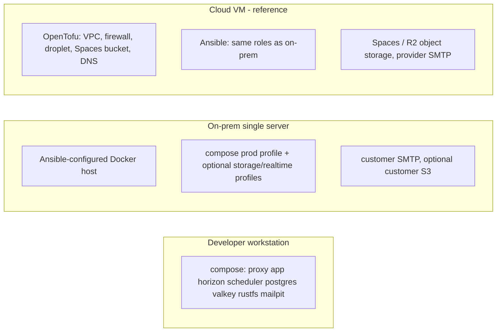

# Deployment architecture

Decision: [ADR-0012](../adr/0012-deployment-architecture.md). Operational details: [09-infrastructure](../09-infrastructure/docker.md).

## Topologies

The same images and Compose files run everywhere; profiles and env differ. Hosting is provider-agnostic ([ADR-0017](../adr/0017-cloud-agnostic-deployment.md)): Ansible against any Linux VM is the mandatory, tested path; OpenTofu provider modules (DigitalOcean, Hetzner, AWS, GCP) are optional. Terraform provisions; Ansible configures; Docker packages ([09-infrastructure/terraform.md](../09-infrastructure/terraform.md), [ansible.md](../09-infrastructure/ansible.md)).

## Processes (one backend image)

| Service | Command | Replicas | Health |
|---|---|---|---|
| `app` | nginx + php-fpm (image default) | 1 (scalable) | `GET /up` |
| `horizon` | `php artisan horizon` | 1 | `horizon:status` |
| `scheduler` | `php artisan schedule:work` | exactly 1 | heartbeat cache key checked by health |
| `reverb` | `php artisan reverb:start` | 1 (profile `realtime`) | TCP 8080 |
| `proxy` | Caddy | 1 | `/healthz` |
| `postgres`, `valkey`, `rustfs` | official images | 1 | `pg_isready`, `valkey-cli ping`, HTTP |

## Deploy procedure (prod)

1. Build and push images tagged by git SHA (CI).
2. Ansible `deploy.yml`: pull images → `php artisan down --secret` (maintenance, MVP accepts short window) → `migrate --force` (owner role) → `horizon:terminate` → `compose up -d` → `up` → smoke check `/health`.
3. Rollback: previous image tag + `migrate:rollback` only if the release was flagged reversible.

## Edge and TLS

Caddy serves a fixed set of hosts ([ADR-0021](../adr/0021-host-layout-and-tenant-resolution.md)): `shp`, `app.shp`, `api.shp`, `admin.shp`, `monitor.shp`, `docs.shp`, `files.shp` and `mail.shp` under `subhambhandari.com.np`, each with an ordinary ACME certificate; on-prem uses a customer certificate or `tls internal`, optionally in single-host mode; dev uses `tls internal` for `*.shp.localhost`. Security headers are applied at the edge ([security.md](security.md)).

## Environment matrix

| Setting | Dev | On-prem | Cloud |
|---|---|---|---|
| `APP_ENV` | local | production | production |
| `PLATFORM_DOMAIN` | shp.localhost | the customer's host, e.g. helpdesk.corp.local | shp.subhambhandari.com.np |
| `HOST_LAYOUT` | split | single (usual) or split | split |
| `TENANCY_SINGLE_TENANT` | unset | slug | unset |
| `MAIL_MAILER` | smtp (mailpit or mail profile) | smtp → bundled Stalwart (`mail:587`), optionally `MAIL_RELAY_HOST` | smtp → Stalwart or provider transport |
| `MAIL_INBOUND_DRIVER` | imap (Stalwart) | imap | imap or provider webhook |
| `FILESYSTEM_DISK` | s3 (rustfs) | s3 (rustfs/garage/customer) | s3 (Spaces/R2) |
| `BROADCAST_CONNECTION` | log/reverb | log/reverb | log/reverb |
| `TELESCOPE_ENABLED` | true | false | false |
