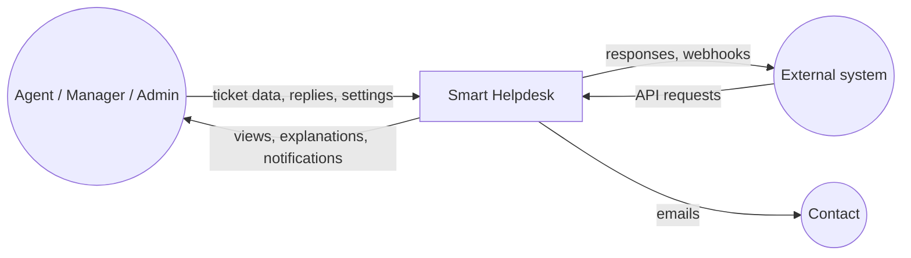
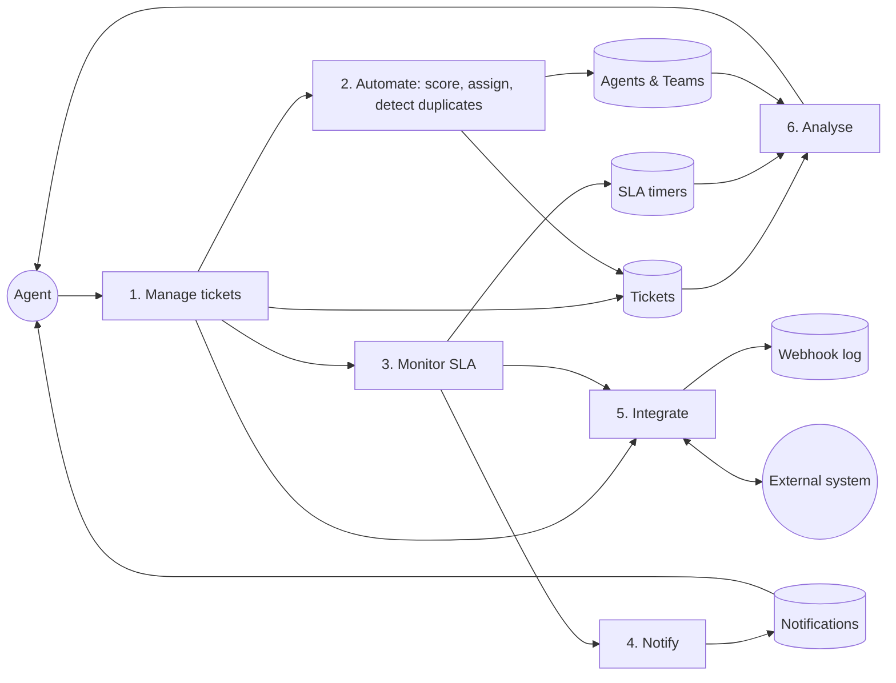
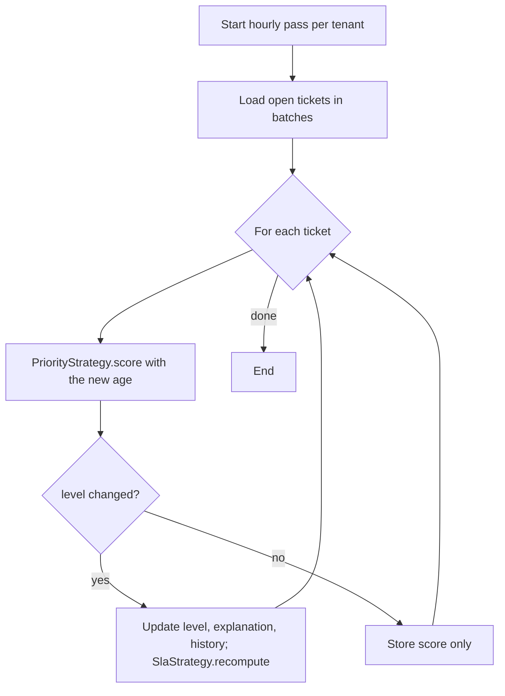
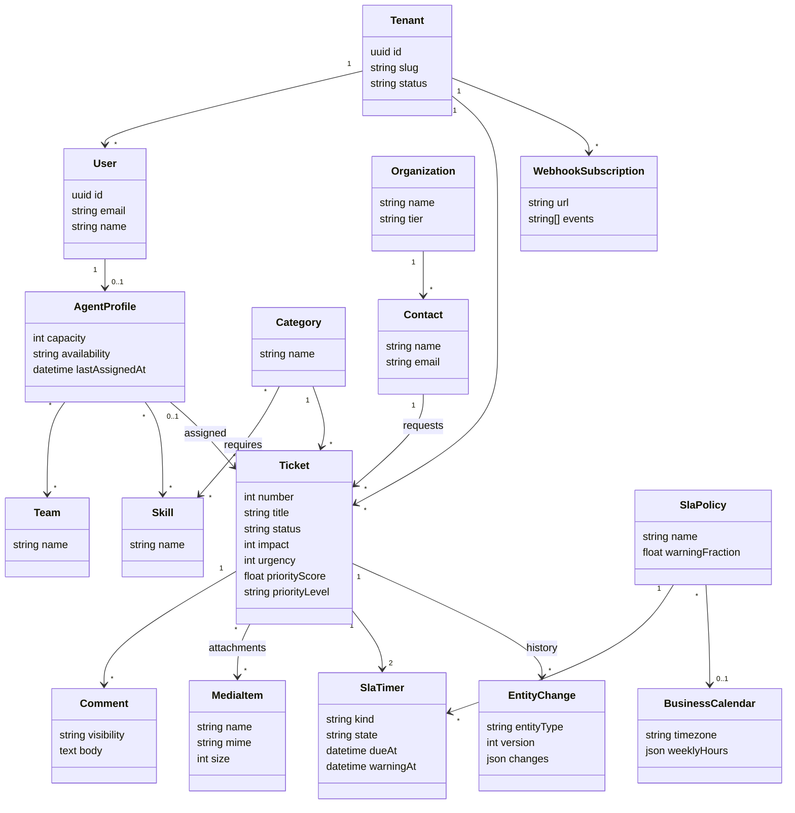
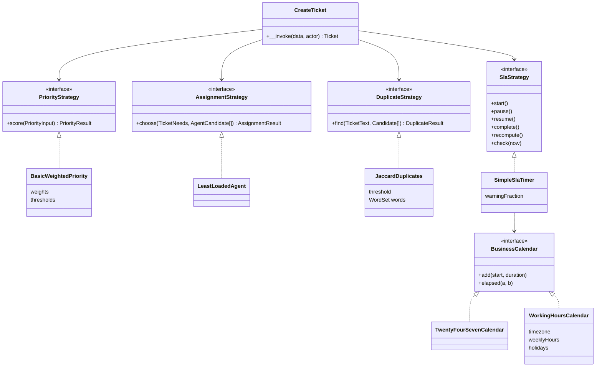
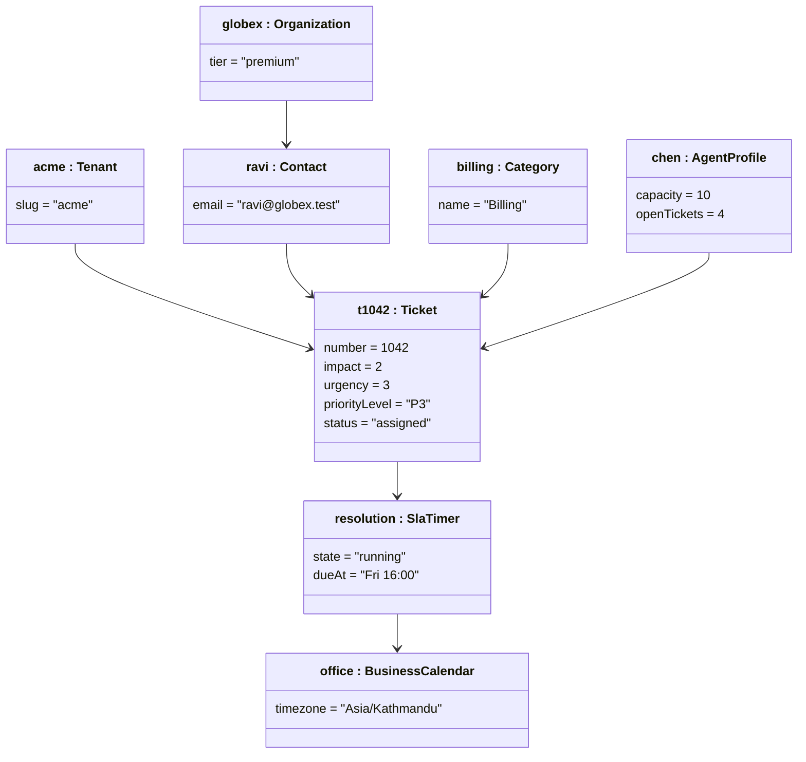

# Diagram inventory

All diagrams are Mermaid in the documents listed; the report exports them as images. This page is the index and the home of diagrams that do not belong to one page.

| Diagram | Location |
|---|---|
| System context (C4-1) | [overview.md](overview.md) |
| Containers (C4-2), module dependencies (C4-3) | [overview.md](overview.md) |
| Deployment topologies | [deployment.md](deployment.md) |
| Control/application planes | [tenancy.md](tenancy.md) |
| Use-case diagram | [02-product/use-cases.md](../02-product/use-cases.md) |
| Sequence: onboarding, login/tenant resolution, ticket creation, SLA sweep | [02-product/user-flows.md](../02-product/user-flows.md) |
| Sequence: upload, realtime, webhook delivery | [storage.md](storage.md), [realtime.md](realtime.md), [07-api/webhooks.md](../07-api/webhooks.md) |
| State: ticket lifecycle | [04-domain/tickets.md](../04-domain/tickets.md) |
| State: SLA timer (orthogonal regions) | [05-algorithms/sla-evaluation.md](../05-algorithms/sla-evaluation.md) |
| ER diagram (overview / full) | [data.md](data.md), [08-database/entities.md](../08-database/entities.md) |
| Activity: assignment, duplicate detection | [05-algorithms/agent-assignment.md](../05-algorithms/agent-assignment.md), [duplicate-detection.md](../05-algorithms/duplicate-detection.md) |
| Data-flow diagrams (level 0/1) | below |
| Roadmap dependency graph | [roadmap/01-dependency-graph.md](../../roadmap/01-dependency-graph.md) |

## Data-flow diagram, level 0

## Data-flow diagram, level 1

## Activity: automatic re-evaluation pass (hourly)

## Class diagram: domain model

## Class diagram: replaceable algorithm strategies

## Object diagram: one seeded ticket

