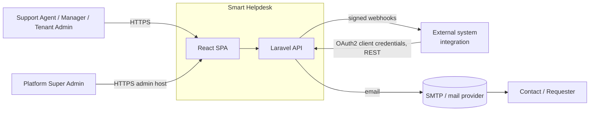
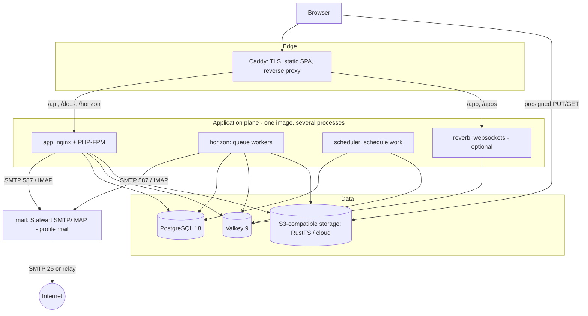
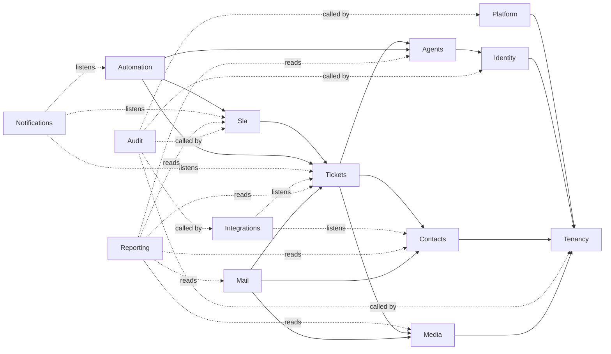

# Architecture overview

Smart Helpdesk is a **modular monolith**: one Laravel 13 API, one React SPA, PostgreSQL, Valkey, S3-compatible object storage, and worker processes, packaged as Docker images and run by Compose on a workstation, an on-prem server or one cloud VM. Decisions: [ADR index](../adr/README.md).

## System context (C4 level 1)



## Containers (C4 level 2)



## Backend modules (C4 level 3)



Arrows point from dependant to dependency. Dotted arrows are event listeners or read-only queries; they never create import cycles. Details: [backend.md](backend.md).

## Request lifecycle (tenant request)

1. The SPA at `app.shp.subhambhandari.com.np/acme` calls `api.shp.subhambhandari.com.np/v1/...`; Caddy terminates TLS and proxies the `api` host to the `app` container.
2. `ResolveTenantFromPrincipal` (session tenant, API client tenant, or the single-tenant setting) loads the tenant ([ADR-0021](../adr/0021-host-layout-and-tenant-resolution.md)), runs bootstrappers (cache/storage/queue prefixes, `SET app.current_tenant`, `setPermissionsTeamId`).
3. `auth:sanctum,api` authenticates the session or token; `EnsureTenantMembership` asserts `user.tenant_id = tenant.id`.
4. Route → FormRequest (validation + `can:` permission) → Controller → Action/Query → JsonResource.
5. Actions run in a transaction, write domain history/audit, and dispatch events; listeners queue notifications, webhooks and broadcasts with tenant context serialised.
6. `tenancy()->end()` on terminate resets connection settings.

## Cross-cutting concerns and where they live

| Concern | Mechanism | Doc |
|---|---|---|
| Tenant isolation | stancl bootstrappers + global scopes + RLS + tests | [tenancy.md](tenancy.md) |
| Authentication / authorisation | Sanctum, Passport (client credentials), spatie permissions, policies | [security.md](security.md) |
| Configuration layers | code → env → platform settings → tenant settings → flags | [configuration.md](configuration.md) |
| Errors | RFC 9457 problem details, error codes, frontend mapping | [error-handling.md](error-handling.md) |
| Files | S3 disk, presigned URLs, tenant key prefixes, media library | [storage.md](storage.md), [04-domain/media.md](../04-domain/media.md) |
| Email | bundled Stalwart mail server or relay; inbound email-to-ticket | [04-domain/email.md](../04-domain/email.md), [ADR-0018](../adr/0018-mail-server.md) |
| Realtime | broadcast events, polling, Reverb | [realtime.md](realtime.md) |
| Async work | Horizon queues per concern, tenant-aware jobs | [11-operations/queues.md](../11-operations/queues.md) |
| Time | injectable `Clock`, UTC everywhere, `BusinessCalendar` interface | [05-algorithms/sla-evaluation.md](../05-algorithms/sla-evaluation.md) |
| Observability | JSON logs with request/tenant ids, health endpoint, Horizon | [11-operations/observability.md](../11-operations/observability.md) |
| Deployment | Compose profiles, Caddy, OpenTofu, Ansible | [deployment.md](deployment.md) |

## Repository layout

```text
smart-helpdesk/
├── backend/            Laravel 13 application (app/Modules/*)
├── frontend/           React SPA (Vite)
├── infra/
│   ├── compose/        base.yaml, dev.yaml, prod.yaml, demo.yaml
│   ├── caddy/          Caddyfile templates
│   ├── tofu/           modules/, providers/{none,digitalocean,aws,gcp,hetzner}, envs/reference
│   └── ansible/        inventory, playbooks, roles
├── experiments/        datasets/ and results/ for the academic evaluation
├── docs/               this documentation
├── roadmap/            the plan
├── compose.yaml        includes infra/compose/*
├── justfile            task runner
└── .mise.toml          tool versions
```

## Quality attributes (summary)

Targets and how they are met are in [02-product/non-functional-requirements.md](../02-product/non-functional-requirements.md): isolation by construction and tests; p95 list latency < 300 ms at 100k tickets via indexes and server-side paging; background work off the request path; portability by configuration; accessibility via the design system.
