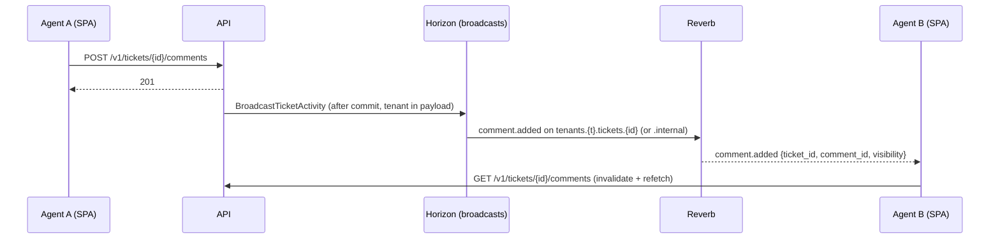

# Realtime architecture

Decision: [ADR-0009](../adr/0009-realtime-transport.md). Built in M3-16 (Should); this page describes what was built.

Polling is the baseline and never stops. With Reverb running, the server also sends small "something changed" events over a WebSocket, and the SPA refetches the affected queries at once. If the socket drops, the SPA falls back to the same polling it used before.

## Switches

Live updates are on only when all of these hold:

| Switch | Where | Effect when off |
|---|---|---|
| Compose profile `realtime` | `COMPOSE_PROFILES` (dev root `.env`; production `.env`, rendered by Ansible from `realtime_profile`) | no `reverb` container |
| `BROADCAST_CONNECTION=reverb` | same `.env`; Compose passes it to every backend container (`log` by default) | nothing is queued or broadcast (`Realtime\Support\RealtimeSwitch`); `POST /v1/broadcasting/auth` answers 404 |
| `REALTIME_ENABLED=true` | same `.env`; the proxy writes it to `config.json` (`realtime.enabled`, `key`, `host`, `path`), and the backend uses it as the default of `features.realtime` | the SPA never opens a socket |
| workspace `features.realtime` | tenant settings section `features` (default: `REALTIME_ENABLED`) and `GET /v1/me` → `tenant.features.realtime` | that workspace broadcasts nothing and its SPA polls only |

## Channels

All channels are private and belong to one workspace. `Realtime\Support\Channels` holds the names and the authorisation rules, and `src/lib/realtime/channels.ts` mirrors the names.

| Channel | Events | Who may join |
|---|---|---|
| `tenants.{tenant}.tickets` | `ticket.created`, `ticket.updated`, `ticket.assigned`, `ticket.status_changed`, `ticket.priority_changed` | workspace member with `tickets.view` |
| `tenants.{tenant}.tickets.{ticketId}` | the same ticket events for that ticket, and `comment.added` for public replies | `tickets.view`, and the ticket exists in the session's workspace (tenant scope and row-level security) |
| `tenants.{tenant}.tickets.{ticketId}.internal` | `comment.added` for internal notes | as above, plus `comments.internal` |
| `tenants.{tenant}.users.{userId}` | `notification.created` | that user only |

### Authorisation

`POST /v1/broadcasting/auth` (`realtime.auth`, on the api host in the `tenant` route group; documented in the API reference) takes `socket_id` and `channel_name` and returns the Pusher signature `{"auth": "<key>:<hmac>"}` without a `data` wrapper. The tenant comes from the session, as on every other route. API client tokens get 403 from `RestrictApiClients`. The `{tenant}` segment of the channel name is only compared with the session tenant and is never used to select one. A Globex user asking for any `tenants.<acme>.…` channel gets 403 before anything is looked up. Unknown channel shapes, malformed ticket ids and tickets of another workspace also get 403. The callbacks are registered on the answering broadcaster for each request, not at boot, so they always sit on the configured connection. With the `log` or `null` broadcaster the endpoint answers 404, because those drivers would sign any channel.

Internal notes have their own channel, so a member without `comments.internal` never receives even the id of one. The SPA joins the internal channel only when the user has that permission, and the server refuses it for everyone else.

## Events and payloads

Payloads carry ids and names of changed things, never ticket content (titles, bodies and customer data stay behind the API). The SPA only invalidates queries and refetches through the API, which applies the usual permissions.

| Domain event (after commit) | Broadcast (`broadcastAs`) | Payload |
|---|---|---|
| `TicketCreated` (synchronous hook; the queued listener waits for the commit) | `ticket.created` | `ticket_id` |
| `TicketUpdated` | `ticket.updated` | `ticket_id`, `fields` (names of the changed fields) |
| `SlaWarning`, `SlaBreached` | `ticket.updated` | `ticket_id`, `fields: ["sla"]` |
| `TicketAssigned` | `ticket.assigned` | `ticket_id`, `agent_id` |
| `TicketStatusChanged` | `ticket.status_changed` | `ticket_id`, `from`, `to` |
| `PriorityChanged` | `ticket.priority_changed` | `ticket_id`, `from`, `to` (P1–P4) |
| `CommentAdded` | `comment.added` (public or internal channel) | `ticket_id`, `comment_id`, `visibility` |
| `NotificationSent` on the inbox channel | `notification.created` | `kind` |

## Server

- Module `Realtime` (listeners only; no module imports it, enforced by the architecture test): `Listeners\BroadcastTicketActivity`, `Listeners\BroadcastNotificationCreated`, `Events\TicketActivity`, `Events\TicketCommentAdded`, `Events\NotificationCreated`, `Support\Channels`, `Support\RealtimeSwitch`, `Health\ReverbCheck`, and the authorisation controller.
- **Queued after commit on its own connection.** `BroadcastTicketActivity` implements `ShouldQueueAfterCommit`, so a change that rolls back is never announced and the request never waits for Reverb. It is queued only when `RealtimeSwitch::enabled()` holds (a WebSocket broadcaster and the workspace flag), checked in the request. It uses the `redis-broadcasts` queue connection (`broadcasts` queue, `block_for` 5 s), which Horizon's `supervisor-broadcasts` (one process) serves. A blocking pop picks a broadcast up at once, where an idle shared worker would first sleep for up to 3 s. With a `database` or `sync` default queue (tests), the listener stays on the default connection.
- **Tenant context.** stancl's `QueueTenancyBootstrapper` stores the tenant in the job payload and initialises it in the worker. The listener takes the channel tenant from the event and refuses (with a log line) to broadcast when the event's tenant is not the worker's.
- **Broadcast "now" inside the job.** The broadcast events implement `ShouldBroadcastNow`, because the job is already queued. `Support\SafeBroadcast` catches a failed publish (Reverb stopped) and logs `realtime.broadcast_failed`, so an outage fills neither `failed_jobs` nor retries (`tries = 1`). The next poll or the reconnect refetch (below) covers the lost event.
- **Bell.** Notifications no longer use Laravel's `broadcast` channel. `BroadcastNotificationCreated` listens to `NotificationSent` for `TenantDatabaseChannel`. It runs inside the queued notification job, in the workspace, and sends `notification.created` to the recipient's channel.
- **Publishing** goes to Reverb on the internal network (`REVERB_HOST=reverb`, `REVERB_PORT=8080`, `REVERB_SCHEME=http`, Guzzle timeout 3 s, connect timeout 2 s) through `config/broadcasting.php`.
- **Reverb** (`config/reverb.php`): `php artisan reverb:start --host=0.0.0.0 --port=8080` in the backend image (`ext-uv` installed), one instance (`REVERB_SCALING_ENABLED=false`). `allowed_origins` is the SPA host (`app.<domain>`, or the domain itself in the single layout; `REVERB_ALLOWED_ORIGINS` overrides it). Client events are refused (`accept_client_events_from=none`, since the SPA only listens).
- **Proxy.** Caddy routes only the socket to Reverb: `/app/*` on the api host, and `/api/app/*` with the prefix stripped in the single-host layout. Reverb's `/apps` HTTP API (publishing) is not exposed: the app reaches it on the internal network.
- **Health.** `ReverbCheck` (a TCP connect to Reverb) is part of `/v1/health` when `BROADCAST_CONNECTION=reverb`.

## Client

- `src/lib/realtime`: `RealtimeProvider` (inside the authenticated shell, `routes/$workspace/_app.tsx`), `RealtimeSubscription`, `useRealtime`, channel names and event names, and `realtimeEchoOptions`.
- `@laravel/echo-react` 2.5 (`configureEcho`, `useEcho`, `useConnectionStatus`) with the Reverb (Pusher protocol) connector from `pusher-js` 8.6. The socket goes to `wss://<realtime.host><realtime.path>/app/<key>` on 443. Channel authorisation uses a custom handler that posts to `/v1/broadcasting/auth` with the session cookie and the `X-XSRF-TOKEN` header, like every other API call. The stock Pusher authorizer would send neither cross-origin.
- `RealtimeProvider` configures Echo only when `config.json` has `realtime.enabled` with a key and host **and** the session's workspace has `features.realtime`. Otherwise nothing connects, no subscription mounts, and no indicator shows.
- `<RealtimeSubscription channel events invalidate>` renders nothing. While live updates are on, it joins the channel through `useEcho` and invalidates the given query-key prefixes. Events arriving within 150 ms coalesce into one refetch (a bulk change sends one event per ticket). When the connection comes back after `offline` or `reconnecting`, it refetches once, because events sent while the socket was down are not replayed.
- Subscriptions: the ticket list (`tenants.{t}.tickets` → the list queries), the ticket detail (ticket events → detail, history, SLA; `comment.added` → comments, history, detail; the internal channel only with `comments.internal`), and the notification bell (`notification.created` → notifications and `/me`).
- **Polling is unchanged** and is the fallback: list 30 s, ticket detail 10 s, bell 30 s, and `refetchOnWindowFocus`. The architecture draft raised the intervals to 120 s while connected. That was not built, so the page shows the same data with or without the socket, only sooner.
- **Connection indicator** (`components/layout/connection-indicator.tsx`, in the topbar next to the bell): hidden while live updates are off. Otherwise it is an icon with its state as accessible name and tooltip: *Live updates on*, *Connecting to live updates…*, *Reconnecting to live updates…*, *Live updates offline; refreshing every 30 seconds*. The state is shown by shape and text, not by colour alone. A polite live region announces only going offline and coming back after a drop, and only after the state has held for 2 s, so a flapping socket stays quiet.

## Sequence (Reverb enabled)

## Verified (2026-09-22, dev stack, profile `realtime`)

Two Playwright contexts (Meera, Owner; Chen, Agent) on the same Acme ticket. A public reply posted by Meera appeared in Chen's comments 0.78 s after the 201. From the start of the POST it took 0.92–1.0 s: the request itself takes 0.15–0.23 s in development, where opcache is off. An internal note behaved the same. The first comment after page load took about 1.5 s. A Globex session asking for an Acme ticket channel got 403, and Chen's own internal channel got 200. With `docker compose stop reverb`, Chen's indicator went to offline after about 11 s. The ticket detail kept polling at its 10 s interval, and the page showed no error. After `docker compose start reverb` the indicator came back on (5 s after a short outage, up to 35 s after a longer one, per pusher-js back-off), and the comment posted during the outage appeared through the reconnect refetch.

Tests: `tests/Feature/Realtime/ChannelAuthorizationTest.php` (cross-tenant refusal for every channel shape, per-ticket checks, the internal channel, the bell channel, API clients, validation, 404 without Reverb), `BroadcastEventsTest.php` (mapping, channels and payloads, no content in payloads, queued after commit on `broadcasts` with the tenant in the payload and restored in the worker, nothing queued with realtime off, a failing Reverb swallowed, the bell), `ReverbCheckTest.php`, and on the SPA `src/lib/realtime/realtime.browser.test.tsx` (fake Echo connector `src/test/fake-echo.ts`: subscriptions, refetch within 1 s, internal channel only with the permission, coalescing, reconnect catch-up, indicator states with an axe scan, nothing with the flag off) and `echo-options.test.ts`.

## Not built / later

- Presence ("who is viewing this ticket"), whispers (client events are off), and Redis scaling for several Reverb instances (ADR-0009 §Migration).
- Longer polling intervals while connected.
- Live updates on other pages (contacts, dashboard, reports), which keep polling or refetch on focus.
