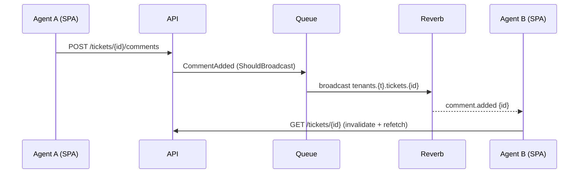

# Realtime architecture

Decision: [ADR-0009](../adr/0009-realtime-transport.md).

## Channels

| Channel | Type | Events | Subscribers |
|---|---|---|---|
| `tenants.{tenant}.tickets` | private | `ticket.created`, `ticket.updated`, `ticket.assigned`, `ticket.status_changed`, `ticket.priority_changed`, `sla.state_changed` (IDs only) | any tenant user with `tickets.view` |
| `tenants.{tenant}.tickets.{ticketId}` | private | `comment.added`, `ticket.updated` | users viewing the ticket |
| `tenants.{tenant}.users.{userId}` | private | `notification.created` (id, title) | that user |

Authorisation (`routes/channels.php`): resolve tenant from channel name, assert equals session tenant, then permission. Payloads never contain ticket content; the SPA refetches via Query.

## Client behaviour

- MVP: polling intervals (list 30 s, ticket detail 10 s, notifications 30 s) + `refetchOnWindowFocus` + invalidation on own mutations.
- With `features.realtime` on: `useEcho` subscriptions per route that call `queryClient.invalidateQueries`; polling intervals raised to 120 s as a safety net; connection state shown in the topbar.

## Server

- Events implement `ShouldBroadcast`; `broadcastOn()` returns the channels above; `broadcastWith()` returns minimal payload; queued on `broadcasts` queue.
- `BROADCAST_CONNECTION=log` (MVP) or `reverb`. Reverb service: `php artisan reverb:start --host=0.0.0.0 --port=8080`, `REVERB_SCALING_ENABLED=false` (single instance), `allowed_origins` = tenant hosts, `ext-uv` installed. Caddy proxies `/app` and `/apps` to `reverb`.
- Health: Reverb included in the health endpoint when enabled.

## Sequence (Reverb enabled)

