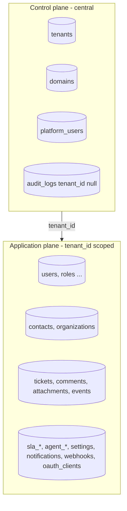

# Tenancy architecture

Decision: [ADR-0006](../adr/0006-multi-tenancy-model.md). This page is the implementation contract; every item has a test in the isolation suite ([10-quality/testing.md](../10-quality/testing.md)).

## Planes



Control-plane tables have no `tenant_id` and are reachable only from platform routes on the central domain. Application-plane tables all have `tenant_id uuid NOT NULL REFERENCES tenants(id)`.

## Tenant resolution

Decision: [ADR-0021](../adr/0021-host-layout-and-tenant-resolution.md). All tenants share `app.{PLATFORM_DOMAIN}` (SPA, workspace slug in the path) and `api.{PLATFORM_DOMAIN}` (API). The tenant is never taken from a client-supplied value after login.

| Request | Mechanism | Example |
|---|---|---|
| Pre-authentication (login, accept invitation, reset password) | `workspace` slug in the body or the signed link → `tenancy()->initialize()` for that request only | `POST api.shp.localhost/v1/auth/login {workspace:"acme", …}` |
| SPA session | `ResolveTenantFromPrincipal` reads `tenant_id` stored in the session at login, before the user is loaded | SPA at `app.shp.localhost/acme/tickets` |
| API client (bearer) | tenant from `oauth_clients.tenant_id` of the token's client | `Authorization: Bearer …` on `api.shp.localhost/v1/tickets` |
| Central (platform) | `admin.{PLATFORM_DOMAIN}` host; platform guard; tenancy not initialised | `admin.shp.localhost` |
| On-prem single tenant | `TENANCY_SINGLE_TENANT=acme` (and optionally `HOST_LAYOUT=single`): the configured tenant for every request | `helpdesk.corp.local` |
| Inbound email | workspace or ticket UUID in the recipient address, verified | `ticket+<uuid>@shp.localhost` |

Order of middleware on the `tenant-api` group (host `api`): `ResolveTenantFromPrincipal` → `EnsureTenantActive` (403 `tenant_suspended`) → `auth:sanctum,api` → `EnsureTenantMembership` (loaded user or client has the resolved `tenant_id`; else the session is destroyed and 401) → `SetPermissionsTeam` (before `SubstituteBindings`) → `SubstituteBindings` → throttle. `sessions`, `oauth_clients`, `oauth_access_tokens` and `personal_access_tokens` are read before initialisation, so they are central tables (no RLS) that still carry `tenant_id`.

The workspace segment in SPA URLs is presentation only: the SPA compares it with `/v1/me` and redirects on mismatch.

## Bootstrappers (run on `tenancy()->initialize()`)

| Bootstrapper | Effect |
|---|---|
| `CacheTenancyBootstrapper` | cache tag `tenant:{id}` on every cache call; permission cache re-initialised |
| `FilesystemTenancyBootstrapper` (configured for the `s3` disk) plus our `AttachmentPath` helper | keys under `tenants/{id}/`; local `storage_path` suffix for temp files |
| `QueueTenancyBootstrapper` | tenant id in job payload; re-initialise in worker before `handle`; `end()` after |
| `RedisTenancyBootstrapper` | prefix `tenant:{id}:` for direct `Redis::` calls (rate limiters use explicit keys with tenant id) |
| `RlsTenancyBootstrapper` (ours) | RLS and change capture: `set_config('app.current_tenant', '{id}', false)`, plus `app.actor_type`, `app.actor_id`, `app.request_id` for the trigger; on `end()` all four set to `''`; re-applied after a reconnect or a rollback; also `setPermissionsTeamId()` |

`DatabaseTenancyBootstrapper` stays disabled until a tenant is placed on a dedicated database.

## Model rules

- Primary models (`BelongsToTenant`): users, contacts, organizations, tickets, categories, tags, teams, skills, agent_profiles, sla_policies, ticket_sla_timers, business_calendars, notifications, report_ticket_facts, report_daily_snapshots, saved_reports, report_exports, entity_changes, webhook_subscriptions, oauth_clients (via extension), audit_logs (nullable variant), tenant_settings, exports, media_items, media_folders, inbound_emails (nullable until routed).
- Secondary models (`BelongsToPrimaryModel` through the primary relation) **also carry `tenant_id`** for RLS and simple indexing: ticket_comments, mediables, ticket_events, report_ticket_intervals, agent_shifts, calendar_holidays, ticket_assignments, ticket_duplicate_suggestions, sla_events, webhook_deliveries, agent_skills, team_members.
- Global models: tenants, domains, platform_users, migrations, jobs, failed_jobs, cache.
- A reflection test asserts every model in `app/Modules/*/Models` is in exactly one of the three lists.

## Row-level security

```sql
ALTER TABLE tickets ENABLE ROW LEVEL SECURITY;
ALTER TABLE tickets FORCE ROW LEVEL SECURITY;
CREATE POLICY tenant_isolation ON tickets
  USING (tenant_id = NULLIF(current_setting('app.current_tenant', true), '')::uuid)
  WITH CHECK (tenant_id = NULLIF(current_setting('app.current_tenant', true), '')::uuid);
```

Generated by one migration looping over the tenant table list. Runtime role `helpdesk_app`: `GRANT SELECT, INSERT, UPDATE, DELETE`, no ownership, `NOBYPASSRLS`. A separate read-only `helpdesk_backup` role with `BYPASSRLS` exists only for `pg_dump` ([backups.md](../09-infrastructure/backups.md)). Central/platform code paths run without the setting and therefore see zero tenant rows. No PgBouncer in the MVP.

### As built (M3-07)

The SQL contract, the setting lifecycle and the tests are in [08-database/tenancy.md](../08-database/tenancy.md). In short:

- `TenantTables::all()` drives the migration (`…_enable_row_level_security`) and the isolation test; a later tenant table calls `TenantTables::enableRowLevelSecurity()` in its own migration. The policy reads `NULLIF(current_setting('app.current_tenant', true), '')::uuid`; unset, a tenant table shows nothing and refuses inserts.
- Policies are `FORCE`d, so the owner is filtered too. **No runtime code uses the owner connection**; it only runs migrations (and the E6 experiment's trigger toggle on the test database). Platform provisioning, platform audit entries and every sweep that spans tenants initialise each tenant with `$tenant->run()` instead of bypassing the policies; `sla:evaluate` and `webhooks:retry-due` visit every active tenant rather than first reading due tenant ids across all of them.
- The setting is session-level (`set_config(…, false)`), written on initialise and cleared on end, re-applied after a reconnect and after a rollback, and cleared before every central queue job; our `Tenant::run()` restores the previous context also when the callback throws. `SET LOCAL` was rejected because requests and jobs are not one transaction each.
- Nullable tables: `audit_logs` and `roles` treat the central context as the NULL tenant (`IS NOT DISTINCT FROM`); `roles` also lets every tenant read the global roles, which only the central context writes (`SyncPermissionCatalogue` uses `tenancy()->central()`).
- Tests run as the app role. Every request in a test starts in the central context and the test body gets its own context back afterwards (`Tests\TestCase::call()`); `actingAsTenantUser()` puts the test body inside the tenant; factories store each row inside its own tenant (`ForTenant::store()`); `findInAnyTenant()` reads a row by id when a test does not know its tenant.

## Other isolation points

| Surface | Rule |
|---|---|
| Broadcast channels | `tenants.{tenantId}.*`; authorisation callback compares `$tenantId` with the session tenant |
| Cookies | shared `.{PLATFORM_DOMAIN}` session cookie for `app`/`api`; platform admin cookie host-only on `admin` with a different name |
| Storage | keys generated server-side under `tenants/{id}/`; presigned URLs only for objects whose DB record belongs to the tenant |
| Logs | Monolog processor adds `tenant_id`, `request_id`, `user_id` |
| Rate limits | keys `rl:{tenant}:{user|client}:{route}` |
| Scheduler | commands iterate tenants explicitly (`Tenant::active()->cursor()` with `$tenant->run(...)`); no command reads tenant rows across tenants (row-level security, M3-07) |
| Horizon / Telescope / health | central domain only, platform admin gate |
| Search | scopes always inside the tenant global scope; RLS backstop |
| Exports | job stores under tenant prefix; download link is a tenant-scoped resource |
| Uniqueness | every unique index includes `tenant_id`; validation rules scoped |
| IDs | UUID v7; cross-tenant lookup → 404 |

## As built (M1-06)

| Piece | Where |
|---|---|
| Package configuration | `backend/config/tenancy.php`: our `Tenant`, `Domain` and UUID v7 generator, empty `central_domains` (hosts never identify tenants), package routes off |
| Bootstrappers | `RlsTenancyBootstrapper` (ours), plus stancl's cache, filesystem and queue bootstrappers |
| Middleware groups | `tenant` (`ResolveTenantFromPrincipal` → `EnsureTenantActive` → `auth:sanctum` → `EnsureTenantMembership`), `tenant.guest` (`InitializeTenancyFromWorkspace` → `EnsureTenantActive`), `platform` (`EnsureCentralContext`), all declared in `bootstrap/app.php` with the priority list adjusted so tenancy runs before authentication and membership right after it |
| Module routes | `app/Modules/<M>/Routes/api.php` (tenant, `/v1`), `Routes/public.php` (pre-authentication, `/v1`), `Routes/central.php` (pre-authentication outside any workspace, `/v1`, e.g. the workspace finder), `Routes/platform.php` (`/platform-api`). Hosts are bound only when `HOST_LAYOUT=split` |
| Model conventions | `App\Modules\Tenancy\Concerns\BelongsToTenant` and the table registry `Support\TenantTables`, documented in the module README |
| Tables | `tenants`, `domains`, `tenant_counters`, `tenant_settings`, plus `users`, `sessions`, `password_reset_tokens` and `personal_access_tokens` reshaped for tenancy |

Deviations from the plan above:

- **RedisTenancyBootstrapper is off.** The one Valkey connection also carries the queues, so
  prefixing its keys per tenant would hide jobs from the workers. Direct `Redis::` keys must include
  the tenant id themselves.
- **`suffix_storage_path` is off**, so logs, compiled views and framework caches stay shared; only
  the disks are prefixed, with keys under `tenants/{id}/` on `s3`, `s3-presign` and `local`.
- **Row-level security** arrived with M3-07; see §Row-level security, as built (M3-07) below.
- **`sessions.tenant_id` and `sessions.guard` exist but are not written yet**; the login endpoint
  (M1-08) fills them. The resolver reads the tenant from the session payload.
- **`personal_access_tokens.tenant_id`** was the MVP stand-in for `oauth_clients.tenant_id`; since
  M3-04 `oauth_clients` and `oauth_access_tokens` carry a NOT NULL `tenant_id` and are credential
  tables (`TenantTables::CREDENTIALS`, no RLS). The resolver reads the tenant of a Passport token from
  `oauth_access_tokens` by the JWT's `jti`. Sanctum tokens use UUID keys so the token string never
  carries an incrementing id.
- **`User` still lives in `App\Models`** until M1-08 moves it into the Identity module.
- A user whose session names another tenant is logged out with a `critical` log line
  (`tenancy.membership_mismatch`) and a 401.

## Provisioning

`ProvisionTenant` action (Platform module): create tenant (slug validated against the reserved list) → seed roles/permissions (global roles referenced, tenant custom none), default categories, default SLA policy with four targets, default automation settings (weights/thresholds), tenant counters row, owner user with invitation. Idempotent per slug. Suspension flips `status`; middleware rejects. Deletion is soft (`archived_at`) in the MVP with a V1 hard-delete job.

### As built (M1-07)

`ProvisionTenant` creates the tenant, its `tenant_counters` row and its primary `domains` row
(`app.<domain>/<slug>`), then creates the owner user without a password and sends the invitation
mail. Everything is `firstOrCreate`, so a second run for the same slug adds only what is missing and
audits `tenant.created` once. The defaults that need tables from later tasks are not seeded yet:
roles (M1-09), categories (M2-02) and the SLA policy with its targets (M2-06). Settings fall back to
`config/helpdesk.php` until `tenant_settings` rows exist (M2-01).

| Surface | Detail |
|---|---|
| API | `GET/POST /platform-api/tenants`, `GET/PATCH /platform-api/tenants/{tenant}`, `POST …/suspend`, `POST …/reactivate`, plus `POST /platform-api/auth/login`, `POST /platform-api/auth/logout` and `GET /platform-api/me` |
| Guard | `platform` session guard over `platform_users`, with its own cookie (`SESSION_PLATFORM_COOKIE`, host-only on the admin host) applied by `UsePlatformSession` before the session starts |
| Commands | `php artisan platform:create-tenant <slug> <name> --owner=<email>`, `php artisan platform:create-admin` |
| Audit | `tenant.created`, `tenant.updated`, `tenant.suspended`, `tenant.reactivated`, `platform_user.logged_in`, `platform_user.created`, all with a null tenant |
| Provisioning context | The action runs on the runtime connection (app role). It creates the control-plane rows centrally and seeds everything else inside `$tenant->run()`, which row-level security requires; the owner connection would gain nothing because the policies are forced (M3-07). |

## Migration path to dedicated databases

Flag `tenants.placement = 'shared' | 'dedicated'`; for dedicated tenants enable `DatabaseTenancyBootstrapper` and run tenant migrations on their database; scopes and RLS remain harmless. Documented in [roadmap/10-future-architecture.md](../../roadmap/10-future-architecture.md).
