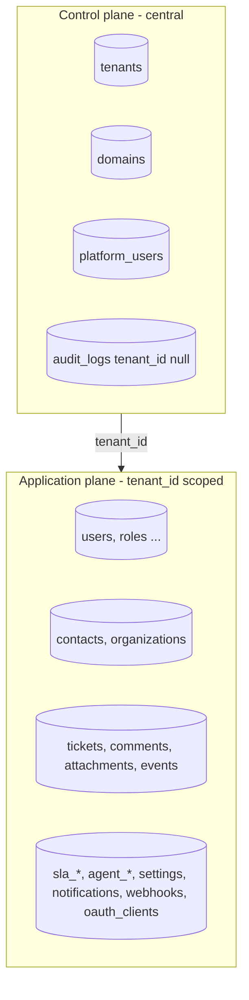

# Tenancy architecture

Decision: [ADR-0006](../adr/0006-multi-tenancy-model.md). This page is the implementation contract; every item has a test in the isolation suite ([10-quality/testing.md](../10-quality/testing.md)).

## Planes



Control-plane tables have no `tenant_id` and are reachable only from platform routes on the central domain. Application-plane tables all have `tenant_id uuid NOT NULL REFERENCES tenants(id)`.

## Tenant resolution

Decision: [ADR-0021](../adr/0021-host-layout-and-tenant-resolution.md). All tenants share `app.{PLATFORM_DOMAIN}` (SPA, workspace slug in the path) and `api.{PLATFORM_DOMAIN}` (API). The tenant is never taken from a client-supplied value after login.

| Request | Mechanism | Example |
|---|---|---|
| Pre-authentication (login, accept invitation, reset password) | `workspace` slug in the body or the signed link → `tenancy()->initialize()` for that request only | `POST api.shp.localhost/v1/auth/login {workspace:"acme", …}` |
| SPA session | `ResolveTenantFromPrincipal` reads `tenant_id` stored in the session at login, before the user is loaded | SPA at `app.shp.localhost/acme/tickets` |
| API client (bearer) | tenant from `oauth_clients.tenant_id` of the token's client | `Authorization: Bearer …` on `api.shp.localhost/v1/tickets` |
| Central (platform) | `admin.{PLATFORM_DOMAIN}` host; platform guard; tenancy not initialised | `admin.shp.localhost` |
| On-prem single tenant | `TENANCY_SINGLE_TENANT=acme` (and optionally `HOST_LAYOUT=single`): the configured tenant for every request | `helpdesk.corp.local` |
| Inbound email | workspace or ticket UUID in the recipient address, verified | `ticket+<uuid>@shp.localhost` |

Order of middleware on the `tenant-api` group (host `api`): `ResolveTenantFromPrincipal` → `EnsureTenantActive` (403 `tenant_suspended`) → `auth:sanctum,api` → `EnsureTenantMembership` (loaded user or client has the resolved `tenant_id`; else the session is destroyed and 401) → `SetPermissionsTeam` (before `SubstituteBindings`) → `SubstituteBindings` → throttle. `sessions`, `oauth_clients`, `oauth_access_tokens` and `personal_access_tokens` are read before initialisation, so they are central tables (no RLS) that still carry `tenant_id`.

The workspace segment in SPA URLs is presentation only: the SPA compares it with `/v1/me` and redirects on mismatch.

## Bootstrappers (run on `tenancy()->initialize()`)

| Bootstrapper | Effect |
|---|---|
| `CacheTenancyBootstrapper` | cache tag `tenant:{id}` on every cache call; permission cache re-initialised |
| `FilesystemTenancyBootstrapper` (configured for the `s3` disk) plus our `AttachmentPath` helper | keys under `tenants/{id}/`; local `storage_path` suffix for temp files |
| `QueueTenancyBootstrapper` | tenant id in job payload; re-initialise in worker before `handle`; `end()` after |
| `RedisTenancyBootstrapper` | prefix `tenant:{id}:` for direct `Redis::` calls (rate limiters use explicit keys with tenant id) |
| `RlsTenancyBootstrapper` (ours) | RLS and change capture: `SET app.current_tenant = '{id}'`, plus `app.actor_type`, `app.actor_id`, `app.request_id` for the trigger; on `end()`: `RESET app.current_tenant`; also `setPermissionsTeamId()` |

`DatabaseTenancyBootstrapper` stays disabled until a tenant is placed on a dedicated database.

## Model rules

- Primary models (`BelongsToTenant`): users, contacts, organizations, tickets, categories, tags, teams, skills, agent_profiles, sla_policies, ticket_sla_timers, business_calendars, notifications, report_ticket_facts, report_daily_snapshots, saved_reports, report_exports, entity_changes, webhook_subscriptions, oauth_clients (via extension), audit_logs (nullable variant), tenant_settings, exports, media_items, media_folders, inbound_emails (nullable until routed).
- Secondary models (`BelongsToPrimaryModel` through the primary relation) **also carry `tenant_id`** for RLS and simple indexing: ticket_comments, mediables, ticket_events, report_ticket_intervals, agent_shifts, calendar_holidays, ticket_assignments, ticket_duplicate_suggestions, sla_events, webhook_deliveries, agent_skills, team_members.
- Global models: tenants, domains, platform_users, migrations, jobs, failed_jobs, cache.
- A reflection test asserts every model in `app/Modules/*/Models` is in exactly one of the three lists.

## Row-level security

```sql
ALTER TABLE tickets ENABLE ROW LEVEL SECURITY;
ALTER TABLE tickets FORCE ROW LEVEL SECURITY;
CREATE POLICY tenant_isolation ON tickets
  USING (tenant_id = current_setting('app.current_tenant', true)::uuid)
  WITH CHECK (tenant_id = current_setting('app.current_tenant', true)::uuid);
```

Generated by one migration looping over the tenant table list. Runtime role `helpdesk_app`: `GRANT SELECT, INSERT, UPDATE, DELETE`, no ownership, `NOBYPASSRLS`. A separate read-only `helpdesk_backup` role with `BYPASSRLS` exists only for `pg_dump` ([backups.md](../09-infrastructure/backups.md)). Central/platform code paths run without the setting and therefore see zero tenant rows unless they explicitly use a privileged connection (`pgsql_owner`) for provisioning, which is limited to the `Platform` module and audited. No PgBouncer in the MVP.

## Other isolation points

| Surface | Rule |
|---|---|
| Broadcast channels | `tenants.{tenantId}.*`; authorisation callback compares `$tenantId` with the session tenant |
| Cookies | shared `.{PLATFORM_DOMAIN}` session cookie for `app`/`api`; platform admin cookie host-only on `admin` with a different name |
| Storage | keys generated server-side under `tenants/{id}/`; presigned URLs only for objects whose DB record belongs to the tenant |
| Logs | Monolog processor adds `tenant_id`, `request_id`, `user_id` |
| Rate limits | keys `rl:{tenant}:{user|client}:{route}` |
| Scheduler | commands iterate tenants explicitly (`Tenant::active()->each(fn => tenancy()->run(...))`) or operate on tenant-scoped rows with the setting per tenant |
| Horizon / Telescope / health | central domain only, platform admin gate |
| Search | scopes always inside the tenant global scope; RLS backstop |
| Exports | job stores under tenant prefix; download link is a tenant-scoped resource |
| Uniqueness | every unique index includes `tenant_id`; validation rules scoped |
| IDs | UUID v7; cross-tenant lookup → 404 |

## Provisioning

`ProvisionTenant` action (Platform module): create tenant (slug validated against the reserved list) → seed roles/permissions (global roles referenced, tenant custom none), default categories, default SLA policy with four targets, default automation settings (weights/thresholds), tenant counters row, owner user with invitation. Idempotent per slug. Suspension flips `status`; middleware rejects. Deletion is soft (`archived_at`) in the MVP with a V1 hard-delete job.

## Migration path to dedicated databases

Flag `tenants.placement = 'shared' | 'dedicated'`; for dedicated tenants enable `DatabaseTenancyBootstrapper` and run tenant migrations on their database; scopes and RLS remain harmless. Documented in [roadmap/10-future-architecture.md](../../roadmap/10-future-architecture.md).
