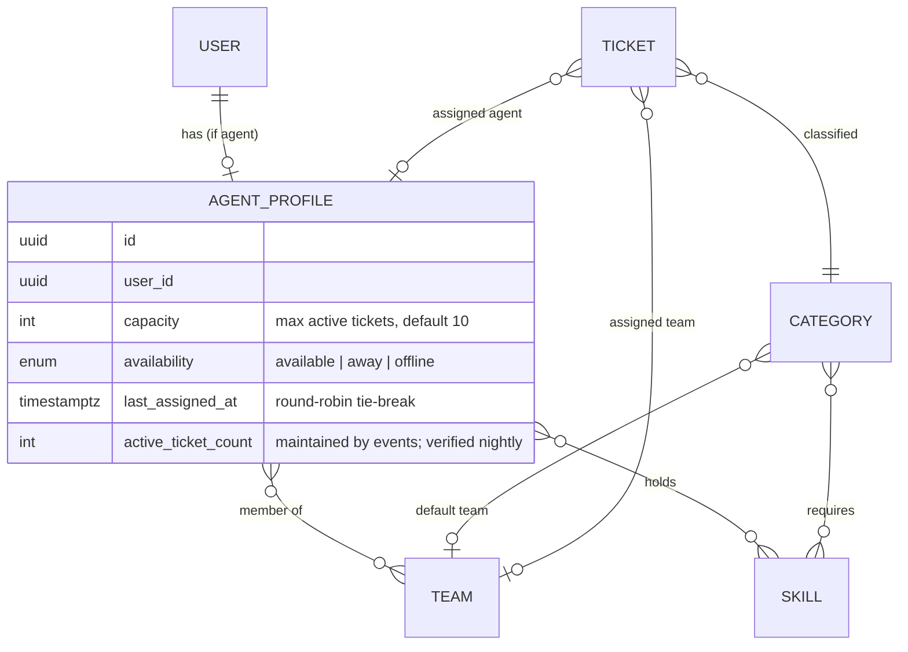

# Agents, teams, skills and categories

## Relationship model

Why a separate `agent_profiles` table rather than columns on `users`: not every user is an agent (admins, developers), and assignment queries should scan only agents.

## Eligibility (used by the baseline assignment strategy)

An agent is *eligible* for a ticket when all hold:

1. Agent belongs to the ticket's tenant and is active (user not disabled).
2. `availability = available` (and on shift when `shifts.enforce` is on).
3. `active_ticket_count < capacity`.
4. If the category requires skills: agent holds **all** of them.
5. If the ticket has a team: agent is a member of that team. If not, and the category has a default team, the ticket takes that team first.

If no agent is eligible, the ticket stays `open` with `team_id` set (if any) and a notification goes to managers; the explanation records `no_eligible_agent` with the failed rule per agent so the manager can act.

## Workload definition

`open_tickets(agent)` = tickets assigned to the agent with status assigned, in progress or pending; `load(agent) = open_tickets ÷ capacity`. The baseline strategy picks the lowest load; the fairness experiment measures the spread of `open_tickets` ([evaluation](../05-algorithms/evaluation-methodology.md)).

## Availability

`available`, `away` (temporary, no auto-assign), `offline` (no auto-assign; manager may still assign manually). **Shifts** (Should-have, [ADR-0020](../adr/0020-business-calendars.md)): `agent_shifts` hold a weekly template (weekday, start, end in the tenant calendar's zone) and date exceptions; when the tenant setting `shifts.enforce` is on, eligibility also requires the current time to fall in a shift. Rosters and leave management are V1.

## Teams

Teams are organisational and routing units only. A team lead role is not modelled; managers see all teams. Team membership changes are audited.

## MVP implementation (M2-02)

`Agents` owns `skills`, `teams`, `agent_profiles`, `team_members`, `agent_skills`, and `agent_shifts`; Tickets retains `categories` and `category_skill`. All directory tables have a tenant key, tenant-scoped relation keys and change capture. The follow-up migration installs composite foreign keys for `tickets.team_id`, `tickets.assigned_agent_id`, and `categories.default_team_id`. Pivot rows have UUID v7 identifiers so their changes can be replayed.

`AgentDirectory::forTicket` supplies `TicketNeeds` and ordered `AgentCandidate` inputs to the assignment strategy; it does not decide an assignment. It counts the actual assigned/in-progress/pending tickets and checks active users, availability, capacity, all required skills, effective team, and shifts when `shifts.enforce` is true. The setting currently falls back to `config/helpdesk.php` until M2-01 exposes tenant settings. Agent list, detail and write responses expose a live active count, and `GET /agents/{agent}/workload` returns live counts, capacity, load and counts by effective priority; the stored count is reconciled when M2-05 wires assignments.

The weekly shift template uses weekdays 0–6 (Sunday–Saturday) and local start/end times. A date exception replaces that day's weekly template; an off exception excludes the day. Cross-midnight rows are not accepted. `PUT /agents/{agent}/shifts` replaces the complete set (including an explicit empty array to clear it), rejects overlapping rows, and audits the old and new schedules. Only `shifts.manage` can replace a schedule; an Agent can read their own schedule. The Settings editor shows a seven-day grid and date exceptions and loads existing rows before allowing Save so an unchanged save cannot erase them.

The initial Settings directory has Skills, Teams, Categories, Agents and Shifts sections. Managers edit skill levels, memberships, default teams, category needs, capacity and availability; Agents can switch their own availability in the Topbar. Mutations invalidate the corresponding workspace-scoped query cache. An availability-only PATCH is allowed for the profile's own User; other profile edits require `agents.manage`. Skills, Teams and Agents use URL-bound server-mode tables; Categories uses the complete active catalogue in a semantic table. The Category default Team and Agent User forms use Comboboxes; membership and skill pickers search the server and preserve selections outside the current result page.

Category deletion returns `409 conflict` while any Ticket references it. Agent profile deletion requires `agents.manage` and returns `409 conflict` while an active Ticket is assigned to the Agent; completed Ticket assignment references are cleared by the database foreign key if the profile is removed.

### As built (M2-02)

Where this list and the paragraphs above disagree, this list describes the code.

- Agents does not import Tickets or Automation. What it needs from the ticket world is the contract `Agents\Contracts\DirectoryUsage` (active ticket count, live workload, team and skill references), bound by Automation to `Support\TicketDirectoryUsage`. The candidate pool for the strategy moved to `Automation\Queries\AssignmentCandidates` (it replaces `AgentDirectory::forTicket`).
- `shifts.enforce` is read from `config/helpdesk.php` only (`MVP-SHORTCUT` until M2-01), never from an unscoped `tenant_settings` row; a two-workspace test pins that another workspace cannot switch it on.
- `joined_at` comes from `Clock` and is stamped for new memberships only, in both `PATCH /agents/{agent}` (`team_ids`) and `PUT /teams/{team}/members`; members that stay keep their date.
- `user_id` is create-only: `UpdateAgentRequest` prohibits it, so a profile never moves to another User (422).
- Deleting a record that is still referenced answers 409 `in_use` with `meta.resource` and `meta.references`: a Team with members, tickets or categories; a Skill held by an agent or required by a category; an Agent with unfinished tickets.
- Permissions: reads need `agents.view`; agents and skills `agents.manage`; teams and membership `teams.manage`; shifts `shifts.manage` (an Agent may read their own). Items of another workspace answer 404 on every route.
- Feature tests: `tests/Feature/Agents/` (API, guards, schema, shifts, skills and teams).
