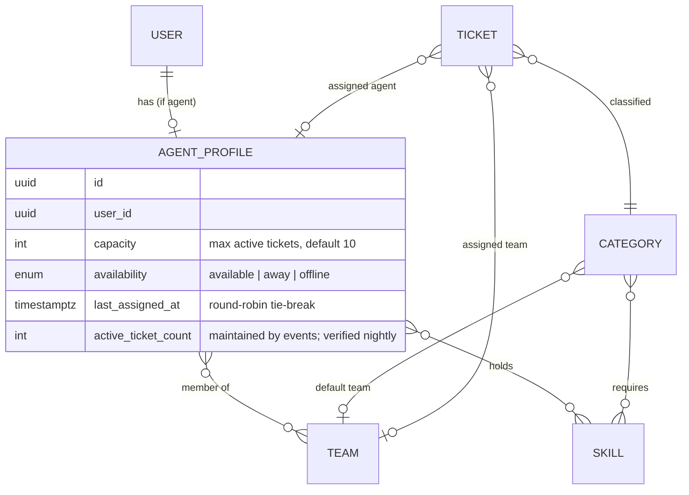

# Agents, teams, skills and categories

## Relationship model

Why a separate `agent_profiles` table rather than columns on `users`: not every user is an agent (admins, developers), and assignment queries should scan only agents.

## Eligibility (used by the baseline assignment strategy)

An agent is *eligible* for a ticket when all hold:

1. Agent belongs to the ticket's tenant and is active (user not disabled).
2. `availability = available` (and on shift when `shifts.enforce` is on).
3. `active_ticket_count < capacity`.
4. If the category requires skills: agent holds **all** of them.
5. If the ticket has a team: agent is a member of that team. If not, and the category has a default team, the ticket takes that team first.

If no agent is eligible, the ticket stays `open` with `team_id` set (if any) and a notification goes to managers; the explanation records `no_eligible_agent` with the failed rule per agent so the manager can act.

## Workload definition

`open_tickets(agent)` = tickets assigned to the agent with status assigned, in progress or pending; `load(agent) = open_tickets ÷ capacity`. The baseline strategy picks the lowest load; the fairness experiment measures the spread of `open_tickets` ([evaluation](../05-algorithms/evaluation-methodology.md)).

## Availability

`available`, `away` (temporary, no auto-assign), `offline` (no auto-assign; manager may still assign manually). **Shifts** (Should-have, [ADR-0020](../adr/0020-business-calendars.md)): `agent_shifts` hold a weekly template (weekday, start, end in the tenant calendar's zone) and date exceptions; when the tenant setting `shifts.enforce` is on, eligibility also requires the current time to fall in a shift. Rosters and leave management are V1.

## Teams

Teams are organisational and routing units only. A team lead role is not modelled; managers see all teams. Team membership changes are audited.
