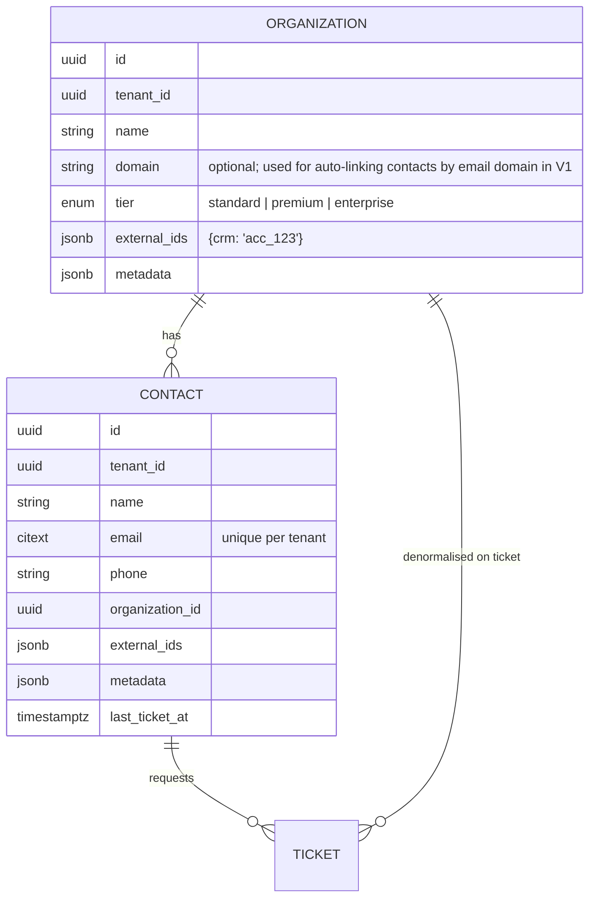

# Contacts and organisations

Contacts are the *requesters*. The model is deliberately small but shaped so that a customer portal (V1) and integrations can attach to it without migration pain.

## Entities

Tags are polymorphic (`taggables`) shared with tickets.

## Rules

- Email is unique per tenant (case-insensitive via `citext` or lower-index). Creating a ticket via API with an unknown email auto-creates the contact when `create_contact=true`.
- `tier` on the organisation feeds priority scoring (customer-tier factor) and SLA policy selection. Contacts without an organisation use `standard`.
- `external_ids` and `metadata` are JSONB with size limits (8 KB) and are returned by the API for integration round-tripping; they are never used in business rules.
- Deleting a contact with tickets is refused (409); contacts can be archived (`archived_at`).

## Not in the MVP

Portal login for contacts, merge, activity feed, custom fields, import from CSV, CRM sync. Each is in the [V1 backlog](../../roadmap/09-v1-backlog.md).

## As built (M1-15)

| Piece | Where |
|---|---|
| Tables | `organizations`, `contacts`, `tags`, `taggables` in `app/Modules/Contacts/Database/Migrations/…_create_contacts_tables.php`, with the indexes of [indexing.md](../08-database/indexing.md) |
| Cross-tenant safety | `contacts (tenant_id, organization_id)` and `taggables (tenant_id, tag_id)` are composite foreign keys, so the database refuses links across workspaces |
| Uniqueness | contact email per workspace on `lower(email)`; organisation and tag names per workspace, case-insensitively; the requests check the same rules first and answer 422 |
| Tags | `Tag` lives in the Contacts module, because Tickets may depend on Contacts but not the reverse; `HasTags` gives any model `tags()` and `syncTagNames()`; `taggables.taggable_type` stores `contact`, `organization` or `ticket` |
| History | `contacts` and `organizations` carry the change-capture trigger |
| API | `GET/POST /v1/contacts`, `GET /v1/contacts/typeahead?q=`, `GET/PATCH /v1/contacts/{contact}`, `POST …/archive` and `…/unarchive`, `GET/POST /v1/organizations`, `GET/PATCH /v1/organizations/{organization}`, `GET/POST /v1/tags`, `DELETE /v1/tags/{tag}` |

Decisions made while building:

- The contact resource always embeds its organisation summary (`id`, `name`, `tier`) and tags,
  because every contact view shows them; `include` is not needed on contacts.
- Typeahead combines `ILIKE` with trigram similarity (`%`), so a typo such as "shresta" still finds
  "Shrestha"; it returns at most ten active contacts, best match first.
- `POST …/unarchive` was added next to archive, so an archived contact can come back.
- There is no contact delete in the MVP; archive replaces it, as the rules above say.
- There are no policy classes: contact rules are permission-only (`contacts.view`, `contacts.manage`).
