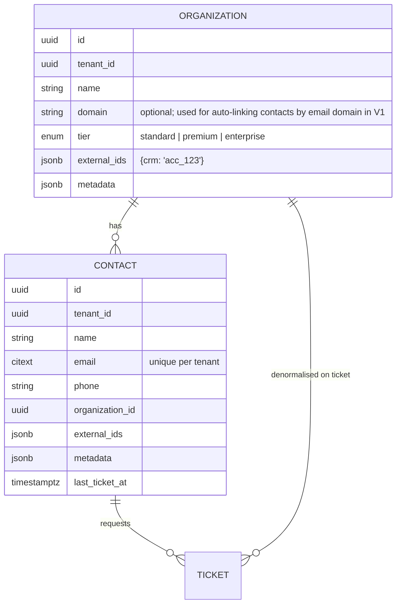

# Contacts and organisations

Contacts are the *requesters*. The model is deliberately small but shaped so that a customer portal (V1) and integrations can attach to it without migration pain.

## Entities

Tags are polymorphic (`taggables`) shared with tickets.

## Rules

- Email is unique per tenant (case-insensitive via `citext` or lower-index). Creating a ticket via API with an unknown email auto-creates the contact when `create_contact=true`.
- `tier` on the organisation feeds priority scoring (customer-tier factor) and SLA policy selection. Contacts without an organisation use `standard`.
- `external_ids` and `metadata` are JSONB with size limits (8 KB) and are returned by the API for integration round-tripping; they are never used in business rules.
- Deleting a contact with tickets is refused (409); contacts can be archived (`archived_at`).

## Not in the MVP

Portal login for contacts, merge, activity feed, custom fields, import from CSV, CRM sync. Each is in the [V1 backlog](../../roadmap/09-v1-backlog.md).
