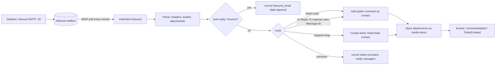
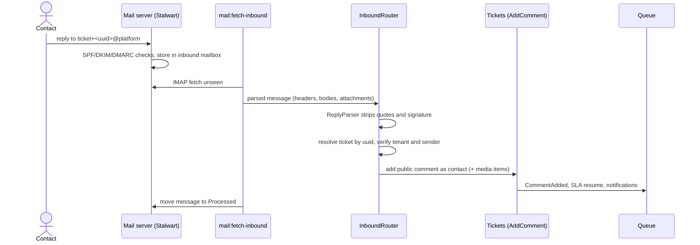
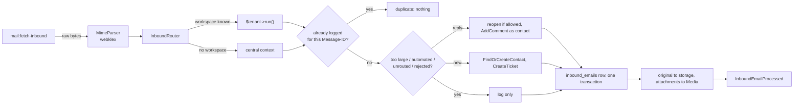

# Email channel domain

Decision: [ADR-0018](../adr/0018-mail-server.md). Notification content: [notifications.md](notifications.md). Infrastructure: [09-infrastructure/docker.md](../09-infrastructure/docker.md) §mail.

## Addresses and identities

| Purpose | Address | Notes |
|---|---|---|
| Platform sender | `Acme via Smart Helpdesk <no-reply@<PLATFORM_DOMAIN>>` | invitations and notifications to agents; DKIM-signed by the mail server |
| Tenant sender display | `Acme Support <support+acme@<PLATFORM_DOMAIN>>` | mail to contacts; name from Settings → Email; V1: verified tenant domain |
| Ticket reply routing | `Reply-To: ticket+<ticket-uuid>@<PLATFORM_DOMAIN>` | plus-address threading |
| New-ticket intake | `support+<tenant-slug>@<PLATFORM_DOMAIN>` | shown in Settings → Email |

## Inbound pipeline (Should-have)

### Sequence: contact reply becomes a comment

`inbound_emails` (tenant_id nullable until routed, message_id unique, from, to, subject, raw headers JSONB, text/html bodies, parsed reply text, state `comment|ticket|ignored|unrouted|rejected`, ticket_id, error). Idempotent on `message_id`; messages are moved to `Processed`/`Failed` IMAP folders.

Rules: only a contact whose email matches the ticket's contact (or the organisation's domain, when the setting allows) may add a public comment by email; others are recorded as `rejected` and the ticket assignee is notified. A reply to a resolved ticket within the reopen window reopens it. The original message is kept in `inbound_emails` for audit.

### ReplyParser

`App\Modules\Automation\Domain\Text\ReplyParser` keeps only the new text of a reply. It lives in `Automation`, not in `Mail`, and `Mail` calls it. It is the minimal parser of [ADR-0023](../adr/0023-minimal-replaceable-algorithms.md): it cuts at the first marker, checked line by line from the top. Line endings are normalised to `\n` first, and the result is trimmed.

| Marker | Rule |
|---|---|
| Quoted line | a line starting with `>`, also after leading spaces |
| Attribution | a line starting with `On ` that, alone or joined with up to two following lines, matches `On … wrote:` (Gmail, Apple Mail); a blank line breaks the join |
| Outlook plain text | `-----Original Message-----`, three or more dashes, any case |
| Outlook HTML as text | a line of 10 or more underscores |
| Header block | a line starting with `From: ` that is the first line or follows a blank line, and is followed within 4 lines by `Sent:`, `Date:`, `To:`, `Cc:` or `Subject:` |
| Signature separator | a line `--`, with or without a trailing space |

If nothing is left above the first marker (a bottom-posted reply), the parser returns the whole text with only the `>` lines removed. Sign-off heuristics ("Regards", "Sent from my phone") are not implemented; a sign-off above the markers stays in the reply.

### As built (M3-19)

**Pipeline.** `mail:fetch-inbound` (every minute, `onOneServer`, `withoutOverlapping`; off until `MAIL_INBOUND_ENABLED=true`) reads `INBOX` and `Junk Mail` of `inbound@<domain>` over IMAP through the `Mail\Contracts\InboundMailbox` interface (`Support\ImapInboundMailbox`, webklex/php-imap 6.2; tests bind an in-memory mailbox). Each message runs through `Mail\Actions\ProcessInboundEmail` inline and is then moved to `Processed`, whatever its outcome; a message that throws is reported and moved to `Failed`, and the run continues. Stalwart's spam filter files some plain replies under `Junk Mail` (M3-18 finding), so that folder is read too. `mail-init.sh` now allows IMAP login without TLS on the internal port 143 (MVP-SHORTCUT, V1-ML-06).

**Routing** (`Mail\Support\InboundRouter`, first match wins). The catch-all rewrites the envelope recipient, so the router reads the addresses in `To`, `Cc`, `Delivered-To` and `X-Original-To`; `Mail\Domain\InboundAddresses` only accepts our exact shapes on `MAIL_DOMAIN`.

| # | Rule | Route | Checks |
|---|---|---|---|
| 1 | `ticket+<uuid>@` | `plus_address` | the ticket id is looked up inside each active workspace (row-level security; MVP-SHORTCUT, V1-ML-07); an id no workspace knows falls through to rule 2 |
| 2 | `In-Reply-To`, then `References` newest first, naming `ticket-<uuid>.<n>@<domain>` | `thread` | the ids are the ones `TicketThread` gives ticket mail, so nothing is stored per sent message: the ticket id is read back from the Message-ID and looked up as in rule 1 |
| 3 | `support+<slug>@` of an active workspace | `intake` | a new ticket; a suspended or unknown slug is not a route |
| 4 | none of the above | — | `unrouted` (`no_route` when no address was ours, `unknown_target` otherwise), a platform row |

A ticket found by rule 1 or 2 is accepted only after two checks inside the ticket's workspace: when the message also names an intake address, it must be that workspace's (otherwise `rejected`/`tenant_mismatch`, so a forged plus-address for another workspace's ticket sent to Acme's intake is refused), and the sender must be the ticket's requester or an active contact of the ticket's organisation (otherwise `rejected`/`sender_not_allowed`). A colleague's comment names the colleague as its author.

**Outcomes** (`inbound_emails.state` and `reason`).

| State | When | Reason |
|---|---|---|
| `comment` | a reply from an allowed sender to an open, pending or reopenable ticket | — |
| `ticket` | intake mail, or a reply to a ticket that can no longer be reopened (a follow-up ticket "Follow-up to #N", same requester) | `reopen_window_expired`, `closed_as_duplicate` for follow-ups |
| `ignored` | an auto-reply or a bounce (`Mail\Domain\AutomatedMailDetector`), or a reply with nothing new in it | `auto_reply`, `bounce`, `empty_reply` |
| `unrouted` | no workspace named | `no_route`, `unknown_target`, `no_sender`, `too_large` |
| `rejected` | the workspace is known but the message is refused | `tenant_mismatch`, `sender_not_allowed`, `unknown_sender`, `sender_archived`, `no_category`, `too_large` |

- **Reply.** A resolved or closed ticket inside `tickets.reopen_window_days` is reopened first (`Tickets\Actions\ReopenTicketForRequester`: status `in_progress`, `reopen_count`+1, history `reopened` by `system` with the note "Requester replied by email"); a pending ticket resumes as for any requester reply. The comment is public, `author_type = contact`, history actor `system` (`AddComment` accepts a null user for a contact's comment). Body: the `ReplyParser` output (text part, or the HTML part through `Automation\Domain\Text\HtmlToText` when there is none), at most 20 000 characters; "Sent attachments by email." when only files came.
- **New ticket.** `Contacts\Actions\FindOrCreateContact`: a known contact by address; otherwise, when `email.create_contacts` is on (default), a new contact named after the display name, joining the organisation whose `domain` matches when `email.match_organisation_domain` is on (default); off → `unknown_sender`. The ticket goes through `CreateTicket` with `created_via = email`: title from the subject without `Re:`/`Fwd:`/`[#n]` prefixes (`Mail\Domain\SubjectLine`), description = the parsed text, impact 1, urgency 2, category "General" (or the first active one), so priority, SLA timers, duplicate suggestions and automatic assignment run through their contracts exactly as in the API.
- **Idempotency.** One row per Message-ID per workspace (`UNIQUE NULLS NOT DISTINCT (tenant_id, message_id)`), checked before any work and enforced by the index inside the transaction (a race answers `duplicate`). A message without a Message-ID is keyed by the SHA-256 of its bytes. The row, the comment or ticket and the contact commit together.
- **Originals and attachments.** After the commit the original is stored as `inbound/<id>.eml` on the media disk (tenant prefix; MVP-SHORTCUT: outside the quota and never pruned, V1-ML-09). Attachments of a `comment` or `ticket` become Media items in the `Email` folder through `Media\Actions\StoreEmailAttachment` (allow-list, 25 MiB limit, libmagic sniffing, quota; `source = email`, no uploader) and are linked to the comment (≤ 10) or ticket (≤ 50); inline parts are not stored. Every file is listed on the row with `skipped` = `type_not_allowed`, `too_large`, `empty`, `quota_exceeded`, `storage_failed`, `limit`, `inline` or `not_stored`. A crash between the commit and the attachments loses the files, not the comment.
- **Loops.** Nothing is ever mailed to an inbound sender; the rejected-mail notice is in-app.
- **Events.** `Mail\Events\InboundEmailProcessed` (after commit, inside the row's workspace). `Notifications` turns a `rejected` one into the in-app notice `inbound_email_rejected` for users with `mail.manage` and the ticket's assignee. [integrations.md](integrations.md) lists no inbound webhook event (inbound email is V1 there), so none is published.
- **Tables.** `inbound_emails` is a nullable tenant table (`TenantTables::NULLABLE`, `IS NOT DISTINCT FROM` policy): a workspace sees its rows, the central context the platform rows; `tenant_id` is set at insert and never changes. Not reportable (a delivery log); report E01 is still to be built on it.
- **Settings → Email.** `GET/PATCH /v1/settings/email` gained `create_contacts` and `match_organisation_domain` (send only the fields to change). The page shows them as switches and lists received mail (`GET /v1/inbound-emails`, `mail.manage`: when, from, subject, attachments, result and reason, ticket link; filter by result in the URL; "Load older mail"); `GET /v1/inbound-emails/{id}` returns the parsed reply, the text part and the raw headers.
- **Development.** `just mail-inject [file.eml]` delivers a message to Stalwart on port 25 (default: a new ticket for `acme`), `just mail-reply <mailpit-id> "text"` answers a message from Mailpit as its recipient with `In-Reply-To`/`References` and the original quoted, `just mail-fetch` runs the fetch now. All three use `php artisan mail:inject` (refused in production).

**Verified on the dev stack (2026-09-22)**, Stalwart in the `mail` profile, the scheduler fetching every minute:

| Check | Result |
|---|---|
| Reply to a real public reply taken from Mailpit (`just mail-reply <id> "…"`, with its In-Reply-To/References) | public comment by the contact on ticket #1125 of `acme` 41 s after delivery (`plus_address`) |
| Mail to `support+acme@shp.localhost` (`just mail-inject`) | ticket #1125 created 64 s later, `created_via = email`, priority scored (P4, 11.7), assigned, one duplicate suggestion, two SLA timers |
| Forged `ticket+<globex ticket>@` together with `support+acme@` | `rejected`/`tenant_mismatch`, logged in `globex`, no comment on the Globex ticket |
| The intake message delivered a second time | no new row, no second ticket (moved to `Processed` as a duplicate) |

Two findings fixed on the way: Stalwart answers the IMAP body fetch with the whole message, so `ImapInboundMailbox::rawMessage()` prepends the header block only when it is missing; and a message whose server-added headers end in CRLF but whose own lines end in LF lost its header block in webklex, so `MimeParser` normalises line endings first (both have tests). Rows written before the fixes stay in the dev database (two platform rows with `no_sender`, one comment on ticket #1110 carrying header text) until the next `just demo-reset`.

## Outbound

All notification mail is queued and sent through the configured mailer: `smtp` to the bundled server (default) or a provider transport. Every outgoing ticket email sets `Message-ID: <ticket-<uuid>.<n>@PLATFORM_DOMAIN>`, `In-Reply-To`/`References` to the thread, `Reply-To` as above, and `List-Unsubscribe` for contact mail. The mail server signs with DKIM and relays through `MAIL_RELAY_HOST` when configured.

### As built (M2-07)

`Mail\Listeners\SendPublicReplyToContact` mails an agent's public reply to the requester after the comment commits. Internal notes, replies recorded on behalf of the requester, and archived contacts are never mailed. `Mail\Notifications\PublicReplyToContact` is queued on `notifications` and carries only primitives.

| Header | Value |
|---|---|
| `Subject` | `[#<number>] <title>` |
| `Reply-To` | `ticket+<ticket-uuid>@<mail domain>` |
| `Message-ID` | `<ticket-<uuid>.<n>@<mail domain>>`, where `n` is the position among the ticket's public agent replies |
| `In-Reply-To`, `References` | the previous reply and the thread root `…<uuid>.0@…` |
| `List-Unsubscribe` | `<mailto:unsubscribe+<contact-uuid>@<mail domain>>` |

The comment body is user input. It is mailed as escaped text with line breaks kept, in both the HTML and the text part; it is never rendered as Markdown or HTML, so a reply cannot inject links, images or markup. The sender is the workspace's identity since M3-18 (below).

### As built (M3-18): identity, headers, mail server

**Senders.** Two kinds of mail, two senders, one DKIM-signed domain (`MAIL_DOMAIN`, default `PLATFORM_DOMAIN`):

| Mail | From | Reply-To | Built by |
|---|---|---|---|
| Public reply to the requester | `"<sender name>" <support+<slug>@<domain>>`; sender name = the `email.sender_name` setting or "<Workspace> Support" | `ticket+<ticket-uuid>@<domain>` | `Mail\Support\WorkspaceMailIdentity` (resolved by the listener, passed to the queued notification as primitives) |
| Invitation, ticket notification to an agent | `"<Workspace> via Smart Helpdesk" <MAIL_FROM_ADDRESS>` | none | `App\Support\Mail\PlatformSender` |
| Password reset, `mail:send-test` | `MAIL_FROM_NAME <MAIL_FROM_ADDRESS>` (the test names a workspace with `--workspace`) | — | Laravel defaults |

The From address is always on the mail domain, so the DKIM signature (`d=<domain>`) is aligned with it and DMARC passes on DKIM alone, also behind a relay.

**Headers.** `Mail\Support\TicketThread` is the header builder (pure; unit-tested in `tests/Unit/Mail/TicketThreadTest.php`):

| Header | Public reply to a contact (`applyConversation`) | Notification to an agent (`applyNotification`) |
|---|---|---|
| `Message-ID` | `<ticket-<uuid>.<n>@<domain>>`, `n` = position among the ticket's public agent replies | generated by the mailer |
| `In-Reply-To` | `<ticket-<uuid>.<n-1>@<domain>>` (none for `n` = 0) | — |
| `References` | root `…<uuid>.0@…` and the previous reply | root `…<uuid>.0@…`, so clients group it with the ticket |
| `List-Unsubscribe` | `<mailto:unsubscribe+<contact-uuid>@<domain>>` | — (not a list) |
| `Auto-Submitted` | — (a person's reply) | `auto-generated` (RFC 3834: auto-responders stay quiet) |
| `X-Helpdesk-Ticket` | ticket uuid | ticket uuid |

MVP-SHORTCUT: `List-Unsubscribe` is `mailto:` only, without `List-Unsubscribe-Post` one-click (RFC 8058), and the unsubscribe address is not processed yet; V1: V1-ML-04.

**Mail server.** Laravel submits to Stalwart on `mail:587` (`app@<domain>`, SMTP AUTH, internal network only). Stalwart signs with one RSA DKIM key (selector printed by `mail-init.sh`; MVP-SHORTCUT: no automatic rotation because DNS is published by hand; V1: V1-ML-05) and delivers directly to the recipients' MX hosts or, with `MAIL_RELAY_HOST`, through a smart host such as Amazon SES. Inbound port 25 accepts mail for the domain; every unknown local part (`ticket+…`, `support+…`, `unsubscribe+…`) lands in the `inbound` mailbox through the catch-all, ready for M3-19. Two findings for M3-19 from the local check: the catch-all rewrites the envelope recipient to `inbound@`, so routing must read the `To`/`Cc` headers (and `Delivered-To` if present), and Stalwart's spam filter classified a plain test reply as "possible spam", so the fetcher must also read the Junk folder or M3-19 must relax the filter for the inbound account. Only `app@` may send as any address of the domain; other accounts must match their sender. Setup, relay and DNS: [docker.md §Mail](../09-infrastructure/docker.md#mail-service-added-by-adr-0018), [production.md §Mail](../09-infrastructure/production.md#mail), [runbooks.md §Outbound mail](../11-operations/runbooks.md#outbound-mail-relay-port-25-blocked).

**Development.** Laravel keeps sending to Mailpit directly (`MAIL_HOST=mailpit`), so every mail is visible at `mail.shp.localhost` without the mail profile. Stalwart runs only when started (`just mail-init`); its relay then points at Mailpit, so a message submitted through Stalwart (`just mail-send-test to@example.com stalwart`) arrives in Mailpit with its DKIM signature, which `infra/scripts/mail-dkim-verify.py` checks without public DNS.

**Verified (2026-09-21).** Dev stack: an agent's public reply reached Mailpit from `Acme Support <support+acme@shp.localhost>` with `Reply-To`, `Message-ID`, `In-Reply-To`, `References`, `List-Unsubscribe` and `X-Helpdesk-Ticket`; `mail-init.sh` bootstrapped Stalwart on an empty volume, is idempotent on re-runs, and printed MX/SPF/DKIM/DMARC; a message submitted as `app@` with `From: support+acme@…` was relayed to Mailpit with `DKIM-Signature: d=shp.localhost; s=v1-rsa-…` and dkimpy 1.1.8 reported `DKIM pass` (a modified body fails); `inbound@` sending as `no-reply@` was refused (`501 5.5.4`); port 25 refused relaying to an outside address (`550 5.1.2`) and AUTH (`503`); a message to `ticket+<uuid>@` on port 25 was delivered to `inbound@` through the catch-all. External delivery (Gmail `dkim=pass`, `spf=pass`) needs a public host and DNS: steps in [runbooks.md](../11-operations/runbooks.md#outbound-mail-relay-port-25-blocked).

## Settings → Email (tenant)

Sender display name, intake address (read-only), DNS records to create with a check button (Could-have), toggle "create tickets from unknown senders", allowed domains for organisation matching (as built in M3-19: a switch that matches a new contact's domain against organisation domains; no separate domain list).

**As built (M3-18).** `GET/PATCH /v1/settings/email` (`mail.manage`, owner and admin). The routes are the `Mail` module's and are registered before the generic `/settings/{section}` routes, so `settings.manage` alone does not reach them. The sender name is the `email` settings section (`sender_name`, nullable, at most 80 characters, no line breaks, quotes, angle brackets, backslash or `@`): a write bumps the settings version and is audited as `settings.updated`; null or an empty string restores "<Workspace> Support". The response also carries the effective `from`, the `platform_from` of agent mail, the `intake_address`, the `reply_to_pattern`, the `mail_domain` and `dns_records` (MX, SPF, DKIM, DMARC from `Mail\Support\DnsRecords`; the DKIM record is `ready: false` until `MAIL_DKIM_SELECTOR` and `MAIL_DKIM_PUBLIC_KEY` are set from the `mail-init.sh` output). The SPA page (Settings → Email) shows the sender form with a live preview, the addresses with a copy button, and the records as a table. Not built: the DNS check button (Could-have, FR-EML-05). The unknown-sender switches and the inbound log arrived with M3-19 (§As built (M3-19)).

## Tests

Parser fixtures in `backend/tests/Unit/Automation/Fixtures/replies` (Gmail, Outlook, Outlook plain text, Apple Mail, header block; done in M1-21), plus look-alike texts that must not be cut; auto-replies and bounces (M2); routing table tests; idempotency; isolation (an inbound email never attaches to another tenant's ticket even with a forged plus-address, because the UUID is checked against the resolved tenant).

As built (M3-19):

| Suite | Contents |
|---|---|
| `tests/Fixtures/inbound/*.eml` | Gmail (multipart, wrapped attribution), Outlook (underscore separator, header block, HTML with `
`), Apple Mail (thread headers only), plain text with a signature, HTML only, auto-reply, bounce (DSN), attachments (PNG, PDF, a refused `.exe`, an inline logo); `{{TICKET}}` is replaced by the test's ticket id |
| `tests/Unit/Mail/InboundFixturesTest.php` | each fixture through `MimeParser` → `ReplyParser`/`HtmlToText` → `AutomatedMailDetector`; the HTML part cuts like the text part |
| `tests/Unit/Mail/InboundDomainTest.php`, `tests/Unit/Automation/HtmlToTextTest.php` | the pure classes, 100 % line coverage of `Mail/Domain` and `Automation/Domain/Text` (`just coverage`) |
| `tests/Feature/Mail/InboundRoutingTest.php` | every rule and its precedence, forged plus-address and cross-workspace sender, colleague author, unknown senders with both switches, reopen window and follow-ups, auto-replies, bounces, empty and oversized mail, attachments and quota, idempotency (twice → one comment, one ticket; platform rows; per-workspace ids), platform rows invisible to workspaces, no mail back |
| `tests/Feature/Mail/InboundEmailApiTest.php` | the log API (order, filters, cursor, 422s, 404 across workspaces and for platform rows, `mail.manage`), the switches, the rejected notice, `mail:fetch-inbound` with the in-memory mailbox (Inbox and Junk, Processed/Failed, duplicates, unreachable mailbox, batch size) |
| `tests/Isolation/RowLevelSecurityTest.php`, `tests/Permissions/RoleMatrixTest.php` | the nullable policy on `inbound_emails`; the log per role |
| `frontend/src/features/mail/components/email-settings.browser.test.tsx` | the log (result, reason, ticket link, URL filter), the switches, axe on the page |
