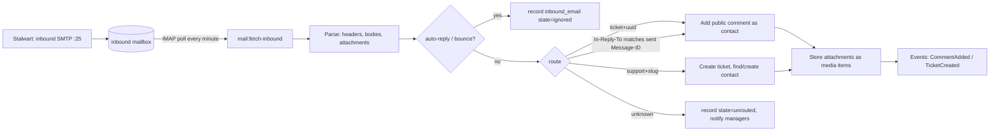
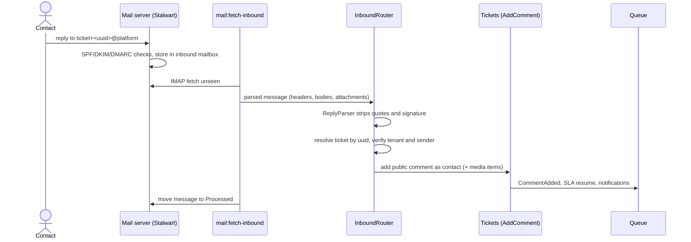

# Email channel domain

Decision: [ADR-0018](../adr/0018-mail-server.md). Notification content: [notifications.md](notifications.md). Infrastructure: [09-infrastructure/docker.md](../09-infrastructure/docker.md) §mail.

## Addresses and identities

| Purpose | Address | Notes |
|---|---|---|
| Platform sender | `no-reply@<PLATFORM_DOMAIN>` | DKIM-signed by the mail server |
| Tenant sender display | `Acme Support <support+acme@<PLATFORM_DOMAIN>>` | per-tenant local part; V1: verified tenant domain |
| Ticket reply routing | `Reply-To: ticket+<ticket-uuid>@<PLATFORM_DOMAIN>` | plus-address threading |
| New-ticket intake | `support+<tenant-slug>@<PLATFORM_DOMAIN>` | shown in Settings → Email |

## Inbound pipeline (Should-have)

### Sequence: contact reply becomes a comment

`inbound_emails` (tenant_id nullable until routed, message_id unique, from, to, subject, raw headers JSONB, text/html bodies, parsed reply text, state `comment|ticket|ignored|unrouted|rejected`, ticket_id, error). Idempotent on `message_id`; messages are moved to `Processed`/`Failed` IMAP folders.

Rules: only a contact whose email matches the ticket's contact (or the organisation's domain, when the setting allows) may add a public comment by email; others are recorded as `rejected` and the ticket assignee is notified. A reply to a resolved ticket within the reopen window reopens it. The `ReplyParser` strips quoted history (`>` lines, "On … wrote:", Outlook separators) and signatures (`-- `, common sign-off heuristics), keeping the original in `inbound_emails` for audit.

## Outbound

All notification mail is queued and sent through the configured mailer: `smtp` to the bundled server (default) or a provider transport. Every outgoing ticket email sets `Message-ID: <ticket-<uuid>.<n>@PLATFORM_DOMAIN>`, `In-Reply-To`/`References` to the thread, `Reply-To` as above, and `List-Unsubscribe` for contact mail. The mail server signs with DKIM and relays through `MAIL_RELAY_HOST` when configured.

## Settings → Email (tenant)

Sender display name, intake address (read-only), DNS records to create with a check button (Could-have), toggle "create tickets from unknown senders", allowed domains for organisation matching.

## Tests

Parser fixtures (Gmail, Outlook, Apple Mail replies; auto-replies; bounces); routing table tests; idempotency; isolation (an inbound email never attaches to another tenant's ticket even with a forged plus-address, because the UUID is checked against the resolved tenant).
