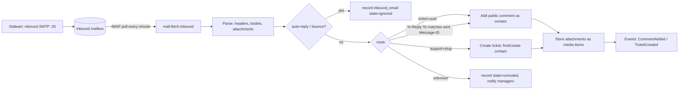
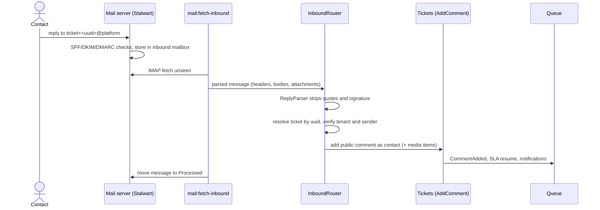

# Email channel domain

Decision: [ADR-0018](../adr/0018-mail-server.md). Notification content: [notifications.md](notifications.md). Infrastructure: [09-infrastructure/docker.md](../09-infrastructure/docker.md) §mail.

## Addresses and identities

| Purpose | Address | Notes |
|---|---|---|
| Platform sender | `no-reply@<PLATFORM_DOMAIN>` | DKIM-signed by the mail server |
| Tenant sender display | `Acme Support <support+acme@<PLATFORM_DOMAIN>>` | per-tenant local part; V1: verified tenant domain |
| Ticket reply routing | `Reply-To: ticket+<ticket-uuid>@<PLATFORM_DOMAIN>` | plus-address threading |
| New-ticket intake | `support+<tenant-slug>@<PLATFORM_DOMAIN>` | shown in Settings → Email |

## Inbound pipeline (Should-have)

### Sequence: contact reply becomes a comment

`inbound_emails` (tenant_id nullable until routed, message_id unique, from, to, subject, raw headers JSONB, text/html bodies, parsed reply text, state `comment|ticket|ignored|unrouted|rejected`, ticket_id, error). Idempotent on `message_id`; messages are moved to `Processed`/`Failed` IMAP folders.

Rules: only a contact whose email matches the ticket's contact (or the organisation's domain, when the setting allows) may add a public comment by email; others are recorded as `rejected` and the ticket assignee is notified. A reply to a resolved ticket within the reopen window reopens it. The original message is kept in `inbound_emails` for audit.

### ReplyParser

`App\Modules\Automation\Domain\Text\ReplyParser` keeps only the new text of a reply. It lives in `Automation`, not in `Mail`, and `Mail` calls it. It is the minimal parser of [ADR-0023](../adr/0023-minimal-replaceable-algorithms.md): it cuts at the first marker, checked line by line from the top. Line endings are normalised to `\n` first, and the result is trimmed.

| Marker | Rule |
|---|---|
| Quoted line | a line starting with `>`, also after leading spaces |
| Attribution | a line starting with `On ` that, alone or joined with up to two following lines, matches `On … wrote:` (Gmail, Apple Mail); a blank line breaks the join |
| Outlook plain text | `-----Original Message-----`, three or more dashes, any case |
| Outlook HTML as text | a line of 10 or more underscores |
| Header block | a line starting with `From: ` that is the first line or follows a blank line, and is followed within 4 lines by `Sent:`, `Date:`, `To:`, `Cc:` or `Subject:` |
| Signature separator | a line `--`, with or without a trailing space |

If nothing is left above the first marker (a bottom-posted reply), the parser returns the whole text with only the `>` lines removed. Sign-off heuristics ("Regards", "Sent from my phone") are not implemented; a sign-off above the markers stays in the reply.

## Outbound

All notification mail is queued and sent through the configured mailer: `smtp` to the bundled server (default) or a provider transport. Every outgoing ticket email sets `Message-ID: <ticket-<uuid>.<n>@PLATFORM_DOMAIN>`, `In-Reply-To`/`References` to the thread, `Reply-To` as above, and `List-Unsubscribe` for contact mail. The mail server signs with DKIM and relays through `MAIL_RELAY_HOST` when configured.

### As built (M2-07)

`Mail\Listeners\SendPublicReplyToContact` mails an agent's public reply to the requester after the comment commits. Internal notes, replies recorded on behalf of the requester, and archived contacts are never mailed. `Mail\Notifications\PublicReplyToContact` is queued on `notifications` and carries only primitives.

| Header | Value |
|---|---|
| `Subject` | `[#<number>] <title>` |
| `Reply-To` | `ticket+<ticket-uuid>@<mail domain>` |
| `Message-ID` | `<ticket-<uuid>.<n>@<mail domain>>`, where `n` is the position among the ticket's public agent replies |
| `In-Reply-To`, `References` | the previous reply and the thread root `…<uuid>.0@…` |
| `List-Unsubscribe` | `<mailto:unsubscribe+<contact-uuid>@<mail domain>>` |

The comment body is user input. It is mailed as escaped text with line breaks kept, in both the HTML and the text part; it is never rendered as Markdown or HTML, so a reply cannot inject links, images or markup. Sender name and branding come from configuration until the Settings service (M2-01) and the mail identity task (M3-18) exist.

## Settings → Email (tenant)

Sender display name, intake address (read-only), DNS records to create with a check button (Could-have), toggle "create tickets from unknown senders", allowed domains for organisation matching.

## Tests

Parser fixtures in `backend/tests/Unit/Automation/Fixtures/replies` (Gmail, Outlook, Outlook plain text, Apple Mail, header block; done in M1-21), plus look-alike texts that must not be cut; auto-replies and bounces (M2); routing table tests; idempotency; isolation (an inbound email never attaches to another tenant's ticket even with a forged plus-address, because the UUID is checked against the resolved tenant).
