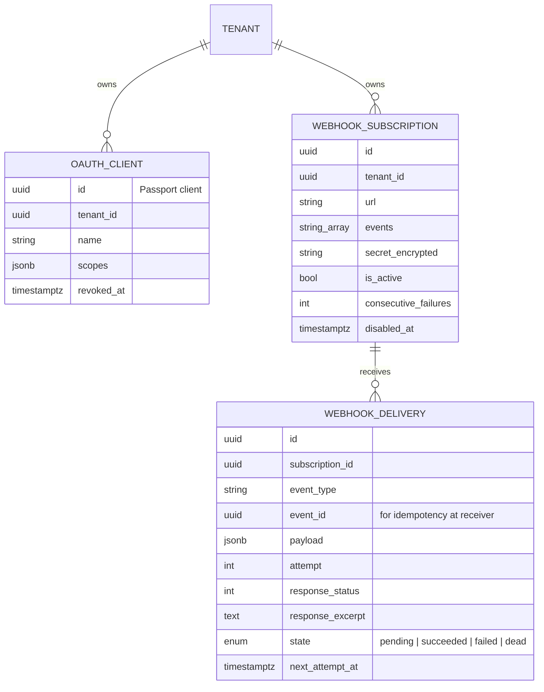

# Integrations domain (developer platform)

## MVP feature set (minimum meaningful)

1. **REST API** `/v1` for tickets, comments, attachments (metadata + presigned upload), contacts, organisations, teams, agents (read), categories, tags, SLA policies (read), webhooks (self-service). Conventions: [07-api/conventions.md](../07-api/conventions.md).
2. **OAuth2 client credentials** per tenant via Laravel Passport; each client is bound to a tenant and a permission set (scopes mirror permission names). Decision and alternatives: [ADR-0007](../adr/0007-authentication-and-oauth.md).
3. **OpenAPI 3.1 document** generated from code and served with an interactive UI at `/docs/api` ([ADR-0010](../adr/0010-api-documentation.md)).
4. **Outbound webhooks** with signing, retries and delivery log ([07-api/webhooks.md](../07-api/webhooks.md)).

Deferred to V1: authorization-code OAuth for user-delegated apps, personal access tokens, inbound email, marketplace, plugin SDK, API usage analytics.

## Entities

## Event catalogue (MVP)

`ticket.created`, `ticket.updated`, `ticket.assigned`, `ticket.status_changed`, `ticket.priority_changed`, `ticket.resolved`, `ticket.closed`, `ticket.comment_added` (public only), `ticket.sla_breached`, `contact.created`, `contact.updated`.

Each webhook payload: `{ id, type, tenant_id, occurred_at, data: { <resource> }, api_version: "v1" }`. The `data` object reuses the same JSON shape as the REST resource so integrators learn one schema.

## Tenant-scoping of API clients

A token issued to a client can only act inside the client's tenant; the tenant is taken from the client record, never from the request, so a leaked client cannot switch tenants. Client tokens have no user; audit entries record `actor_type = api_client`.

## Webhooks as built (M3-05)

Details, deviations and the live check: [07-api/webhooks.md](../07-api/webhooks.md) §As built.

- `webhook_subscriptions` and `webhook_deliveries` as in the diagram above, plus `name`, `api_version`,
  `previous_secret` (24-hour overlap after a rotation), `disabled_reason` (`manual`,
  `consecutive_failures`), `last_delivery_at`, and on deliveries `sequence_attempt`, `manual_retries`,
  `error`, `duration_ms`. Both tables carry an immutable `tenant_id`.
- The catalogue above is emitted by `DispatchWebhookEvent`; `ping` is the test event and cannot be
  subscribed to. Contacts raise the new `Contacts\Events\ContactSaved` for `contact.created` /
  `contact.updated`.
- API clients with the `webhooks:manage` scope reach exactly the webhook routes.
- Settings → Webhooks in the SPA: list with events and status, add and edit (URL + events checklist),
  secret shown once after create and rotate, enable/disable, send test, delete, and the delivery log per
  webhook with state, attempts, response and retry.
