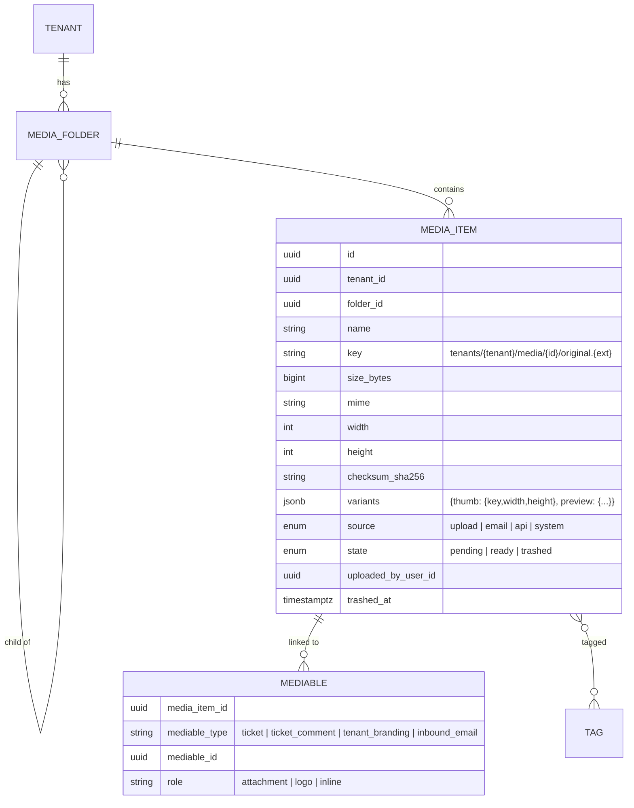

# Media library domain

Decision: [ADR-0019](../adr/0019-media-library.md). Storage mechanics: [03-architecture/storage.md](../03-architecture/storage.md).

## Rules

- Every file in the platform is a media item; ticket and comment attachments are `mediables` with role `attachment`, so the library shows "Used in #1042".
- Folders are per tenant, max depth 5; a system folder `Tickets` receives attachments uploaded from tickets; `Email` receives inbound attachments; `Branding` holds logos.
- Upload: intent (validates type/size/quota, creates `pending` item and presigned PUT) → complete (HEAD, size, MIME sniff, checksum, dimensions for images, `ready`, quota counter, variant job).
- Variants are generated asynchronously; the UI shows the original until `thumb` exists.
- Trash keeps objects for 30 days; purge deletes objects and variants and releases quota; an item linked to a ticket cannot be purged while the ticket exists (unlink first).
- Downloads and previews use short-lived signed URLs; the SPA never receives raw keys.
- Search: trigram index on `name`, filter by MIME group, folder, tag, uploader, date; sort by name/size/date.

## Permissions

`media.view` (all agents), `media.upload` (agents), `media.manage` (folders, tags, trash/purge, quota — admins/managers).

## API

`GET/POST /v1/media`, `POST /media/intent`, `POST /media/{id}/complete`, `GET /media/{id}/download`, `GET /media/{id}/variants/{name}`, `PATCH /media/{id}` (rename, move, tags), `POST /media/{id}/trash|restore`, `DELETE /media/{id}` (purge), `GET/POST/PATCH/DELETE /media/folders`, `GET /media/usage`.

## Not in the MVP

Image editing, video transcoding, public sharing links, CDN, per-tenant buckets, malware scanning.
