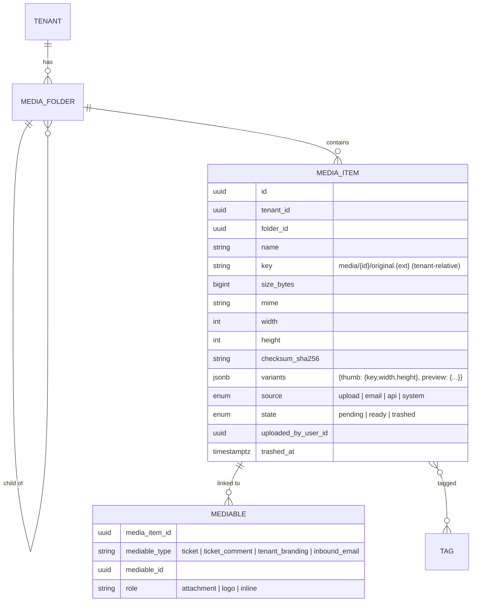

# Media library domain

Decision: [ADR-0019](../adr/0019-media-library.md). Storage mechanics: [03-architecture/storage.md](../03-architecture/storage.md).

## Rules

- Every file in the platform is a media item; ticket and comment attachments are `mediables` with role `attachment`, so the library shows "Used in #1042".
- The default workspace quota is 5 GiB (`config/helpdesk.php`); the tenant row stores the limit and the locked counter row stores used bytes.
- Folders are per tenant, max depth 5; a system folder `Tickets` receives attachments uploaded from tickets; `Email` receives inbound attachments; `Branding` holds logos.
- Upload: intent (validates type/size/quota, creates `pending` item and presigned PUT) → complete (HEAD, size, MIME sniff, checksum, dimensions for images, `ready`, quota counter, variant job).
- Variants are generated asynchronously as WebP: `thumb` fits within 240×240, `preview` within 1200×1200, preserving aspect ratio. The UI shows the original until `thumb` exists.
- Trash keeps objects for 30 days; purge deletes objects and variants and releases quota; an item linked to a ticket cannot be purged while the ticket exists (unlink first).
- Downloads and previews use short-lived signed URLs; the SPA never receives raw keys.
- Search: trigram index on `name`, filter by MIME group, folder, tag, uploader, date; sort by name/size/date.
- `mediables` uses a UUID v7 row key plus a tenant-leading unique link key. This permits the shared change-capture trigger to record attachment-link history while retaining link uniqueness.

Implementation status (M2-08): the schema, quota columns, tenant-scoped models, upload intent/complete actions, library list/usage/download routes and hourly cleanup command are in place. Ready items can be linked to Tickets (create or attachment API) and Comments (submit) with limits of 50 and 10 respectively; Comment responses and the initial UI show linked files. Folder CRUD (depth five, protected system folders), item rename/move/tag/trash/restore/purge routes and a queued image-variant job are implemented. The initial SPA uploader, library picker and Settings Media library cover folder tree, search, tag filter/edit, grid/list, item actions, quota and “Used in #…” Ticket references. OOXML container entries are checked at completion. These paths have not passed the deferred Week 2 acceptance gate.

## As built (M2-08)

| Piece | Where |
|---|---|
| Storage abstraction | `Support\MediaStorage` is the only class that names a disk: `helpdesk.media.disk` stores, `helpdesk.media.presign_disk` signs browser URLs (`s3-presign` when the disk is `s3`, else the storage disk). Keys are tenant-relative; the filesystem tenancy bootstrapper roots the disk under `tenants/{tenant_id}/`. |
| Keys | `Support\MediaKeys`: `uploads/{id}.{ext}` (staging), `media/{id}/original.{ext}`, `media/{id}/thumb.webp`, `media/{id}/preview.webp`. Built from a UUID and an allow-listed extension only; anything else throws. |
| Allow-list | `Support\AllowedMedia`: `helpdesk.media.allowed_mime` switches types on and off, `helpdesk.media.max_file_bytes` lowers the 25 MiB ceiling (a CHECK constraint). Per extension it knows the stored type, what browsers declare (`application/x-zip-compressed`, `''` for DOCX, `application/vnd.ms-excel` for CSV) and what libmagic detects. SVG, HTML and scripts have no row. |
| Names | `Support\MediaFilename::sanitise()` runs at intent and at rename; `contentDisposition()` builds the RFC 6266 header from the stored name. A rename cannot change the type (`jpg` ↔ `jpeg` is fine). |
| Inspection | `Support\FileInspector`: libmagic type, SHA-256, image dimensions, and the OOXML entries (`[Content_Types].xml` plus `word/document.xml` etc.) read from the ZIP central directory without extracting. |
| Quota | `Support\MediaQuota`: used bytes on `tenant_counters.storage_used_bytes`, reserved bytes = sum of `pending` items, limit on `tenants.storage_quota_bytes`. |
| Variants | `Jobs\GenerateImageVariants` on the `media` queue. |
| Download policy | `Support\MediaUses::canDownload()`. |
| Cleanup | `media:cleanup`, hourly. |

Upload flow:

1. **Intent** (`RegisterUpload`): under a per-tenant advisory lock, `used + reserved + size` is compared with the quota (422 `quota_exceeded`), a `pending` item is created (that row *is* the reservation) and a five-minute PUT is signed for the **staging** key, never the media key. `Content-Type` and the declared length are passed to the signer; SigV4 presigning leaves `Content-Length` unsigned, so the size is enforced at completion, not by the URL. The route is throttled to 30 intents a minute per user (429 `rate_limited`).
2. **Complete** (`CompleteUpload`), in three phases: *verify* with no transaction open (the staged object is streamed to a temporary file, then real size, detected type, dimensions or OOXML entries, checksum); *move* `uploads/…` → `media/{id}/original.{ext}`; *commit* in one short transaction that flips the item to `ready` and adds its bytes with a single atomic `UPDATE` as the last statement, because ticket numbering locks the same counter row.
3. A rejected upload becomes `failed` (which releases the reservation), its object is deleted and the answer is 422 `validation_failed` with `meta.reason`: `missing_object`, `size_mismatch`, `type_mismatch`, `undecodable_image` or `invalid_document`. A failed item is final (409 on retry).

Decisions made while building:

- Completion is idempotent: a ready item is returned as is and counted once; a retry after a crash between move and commit verifies the object at its final key; concurrent completions are kept apart by a cache lock (409 `conflict`, `meta.reason = completion_in_progress`). Only the uploader or a holder of `media.manage` may complete an upload.
- A replay of the signed PUT after completion can only write the staging key again; cleanup removes it.
- Trash keeps the bytes counted. Purge (`PurgeMedia`) works from the trash only, refuses linked items with 409 `in_use` (`meta.links`), deletes rows inside the transaction and objects after commit, and releases the bytes with `UPDATE … RETURNING old.storage_used_bytes`; a release that would go below zero is clamped and logged as `media.quota.clamped`.
- Variants: the stored dimensions are checked against `helpdesk.media.variant_max_pixels` (40 MP) **before** any decode; above it the item gets `variants.variants_skipped = pixel_limit`, after the last failed attempt `failed`. The image is decoded once and scaled down to the preview, then to the thumb; small images are never enlarged. Whatever happens, the item stays `ready` and downloadable.
- Download and variant routes answer a redirect to a five-minute signed URL. On top of tenant scope and `media.view`: an unlinked file, or one linked to something that is not a ticket, is open to every viewer; a file that only lives on tickets needs `tickets.view`; one that only lives on internal notes needs `comments.internal` as well; one visible link is enough; the uploader can always read their own file. Items that are not `ready` answer 404. A variant is signed only when the stored key equals the key the server would generate for that item.
- Folders: sibling names are unique case-insensitively (a unique index decides races, answered as 422 on `name`); depth is checked for the whole moved subtree; a folder cannot move into itself or a descendant; deleting a folder that holds folders or items (trashed ones included) answers 409 `in_use`; system folders answer 409 `conflict` with `meta.reason = system_folder`.
- The list uses `IndexMediaRequest` (a `ListRequest`): sort `name`, `size_bytes`, `created_at`; filters `folder` (ids or `none`), `type` (`image`, `document`, `text`, `archive`), `tag`, `uploader`, `trashed`, `created_between` (workspace time zone). `MediaItemResource::collection()` loads link counts, tags and ticket numbers for the page in three queries. `filter[folder_id]` and `filter[state]` remain as `MVP-SHORTCUT` aliases for the first SPA build.
- Media never imports Tickets: `mediables.mediable_type` is a plain discriminator and `MediaUses` reads `tickets` and `ticket_comments` through the query builder with an explicit tenant.
- `media:cleanup` purges `pending` and `failed` items older than one hour, staged objects older than one hour, and unlinked trash older than 30 days; one failing workspace does not stop the others.
- Not built: multipart or resumable uploads, per-folder permissions, optimistic locking on rename, unlinking from the library (links are removed from the ticket side).

Tests: `tests/Feature/Media/*` (upload flow, folders, items, trash and quota, download policy, variants, permission matrix, quota SQL) and `tests/Unit/Media/*` (filenames, keys, allow-list, inspector). Feature tests run on the `local` disk re-rooted per tenant, so keys keep their real layout.

## Permissions

`media.view` (all agents), `media.upload` (agents), `media.manage` (folders, tags, trash/purge, quota — admins/managers).

## API

`GET/POST /v1/media`, `POST /media/intent`, `POST /media/{id}/complete`, `GET /media/{id}/download`, `GET /media/{id}/variants/{name}`, `PATCH /media/{id}` (rename, move, tags), `POST /media/{id}/trash|restore`, `DELETE /media/{id}` (purge), `GET/POST/PATCH/DELETE /media/folders`, `GET /media/usage`.

## Not in the MVP

Image editing, video transcoding, public sharing links, CDN, per-tenant buckets, malware scanning.
