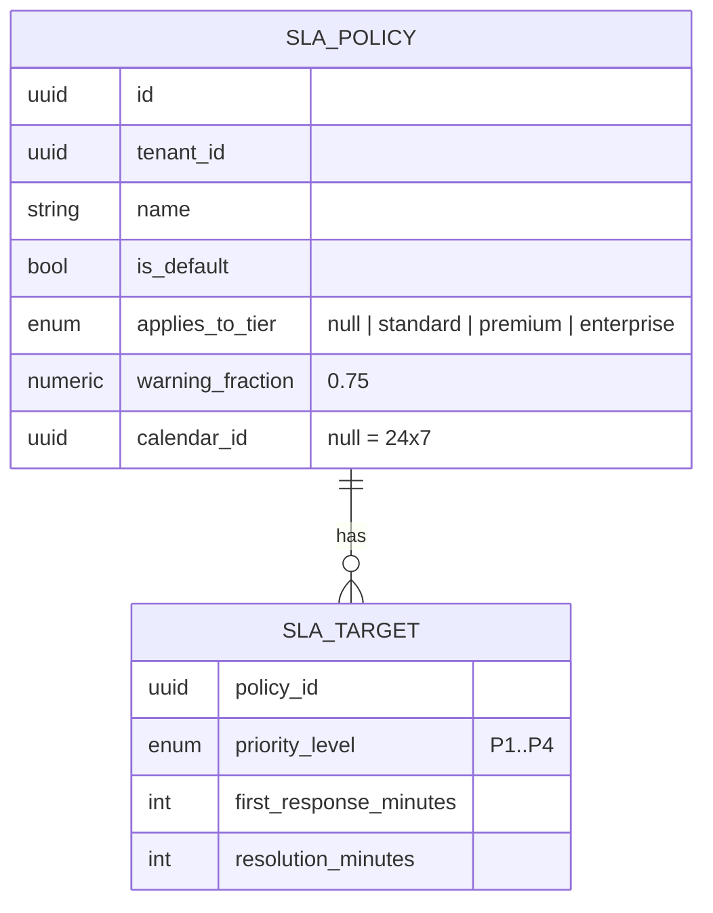

# SLA domain

## Policies

Policy selection at ticket creation: the policy whose `applies_to_tier` equals the ticket organisation's tier, else the default policy. Selection is re-run only if the ticket's organisation changes.

Default targets seeded for new tenants (calendar hours, 24×7):

| Priority | First response | Resolution |
|---|---|---|
| P1 | 30 min | 4 h |
| P2 | 1 h | 8 h |
| P3 | 4 h | 24 h |
| P4 | 8 h | 72 h |

As built in M2-03 so far: tenant provisioning seeds these targets idempotently for newly provisioned tenants; the schema migration backfills the same policy and targets for existing tenants. Ticket creation starts both timers in the same transaction and selects an Organisation-tier policy before falling back to the default. Entering pending pauses the timers; leaving pending resumes them with calendar elapsed time. Resolution meets the resolution timer, and reopening starts its next cycle. The queued evaluator records warning/breach events and ticket history. First-public-reply and priority-change hooks, policy and Business calendar/holiday management routes, ticket timer read route, and initial Settings UI are implemented, pending the Week 2 verification pass. Notification delivery remains with M2-09.

## Timers

Each ticket gets two timer rows in `ticket_sla_timers`:

| Field | Notes |
|---|---|
| `kind` | `first_response` \| `resolution` |
| `state` | `running` \| `paused` \| `warning` \| `breached` \| `met` \| `cancelled` |
| `target_minutes`, `warning_fraction` | copied from policy at start (policy edits don't silently change history) |
| `started_at` | |
| `paused_at`, `paused_total_seconds` | pause bookkeeping |
| `warning_at`, `due_at` | materialised deadlines; recomputed on resume and priority change |
| `met_at`, `breached_at` | |

The scheduler indexes on `(state, due_at)` and `(state, warning_at)` so a pass is one range scan.

## Rules

- **First response** timer is met by the first public agent comment. It is not started if the ticket is created by an agent on behalf of the contact (created in the UI) *and* the tenant setting `sla.first_response_applies_to_agent_created = false` (default `true`).
- **Resolution** timer is met on `resolved`; if reopened, a new resolution timer starts with the full target from the reopen time (Zendesk behaviour; documented in the algorithm page with the alternative).
- **Pause**: entering `pending` pauses both running timers. Resume adds the paused working time to `due_at` and `warning_at`.
- **Priority change**: the timer keeps `started_at` and gets the new target; `due_at = cal.add(started_at, new_target + paused_total)`. If that moment has already passed, the next check marks the timer breached.
- **Warning** fires once when `now ≥ warning_at` and the timer is `running`; **breach** fires once when `now ≥ due_at`. Both write `sla_events` and ticket history and send notifications.
- **Business calendars are in the MVP** ([ADR-0020](../adr/0020-business-calendars.md)): each policy references a `business_calendars` row (time zone, weekly windows, holidays) or none for 24×7; `due_at`/`warning_at` are computed through the calendar, pauses are measured in business seconds, and the timer stores `calendar_id` so later calendar edits do not move existing deadlines.
- The management API rejects changes to working hours, time zone or holidays while that Business calendar has running, warning or paused timers (409). Create a replacement calendar and move policies to it instead; existing timers retain their original calendar. Editing a policy increments its version and does not rewrite materialised timer deadlines.

## Notifications on warning and breach

Warning: the assignee (or the team's members when unassigned). Breach: the assignee and the tenant's managers. Notifications are idempotent per timer and event. Automatic priority changes, reassignment and escalation chains are future replacements ([future/sla-evaluation-advanced.md](../05-algorithms/future/sla-evaluation-advanced.md)).

## Metrics derived

SLA compliance % = met / (met + breached) over resolved timers in the period, per kind; breaches in period; average first response and resolution times from ticket timestamps (excluding paused time in V1; MVP reports wall-clock and says so).
