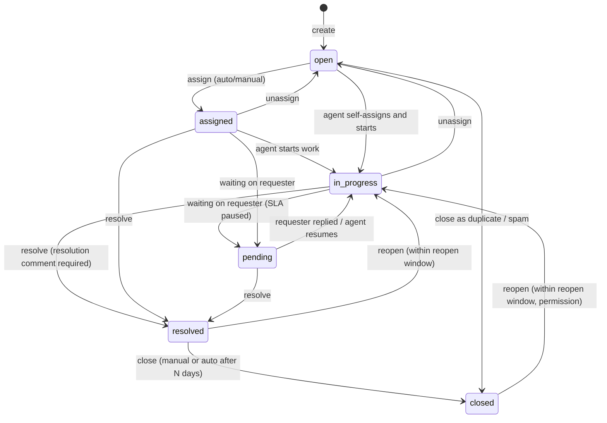

# Ticket domain

## Decision: statuses

The prompt listed `New → Open → Assigned → In Progress → Resolved → Closed`. Research of Zendesk (New/Open/Pending/On-hold/Solved/Closed), Jira Service Management (workflow-defined) and osTicket (Open/Resolved/Closed with sub-states) shows that "New" exists to mean *nobody has looked at this yet*. In our model that is exactly "open and unassigned", which is already derivable (`status = open AND assigned_agent_id IS NULL`). Two statuses meaning the same thing double the transition table and confuse SLA rules, so **`new` is merged into `open`**.

Two statuses are *added* because the algorithms need them:

- **`pending`** — waiting on the requester. Without it, SLA pause/resume has no trigger and resolution-time metrics punish agents for customer silence.
- **`reopened`** is *not* a status; it is a history event. A reopened ticket returns to `open` (unassigned) or `in_progress` (if the previous agent is still available), so that assignment rules apply uniformly.

### State machine

Transition rules are encoded in one place, `Modules/Tickets/Domain/TicketStatus.php` (enum with `canTransitionTo()`), and the API rejects any other transition with error code `invalid_transition` (422). See [07-api/errors.md](../07-api/errors.md).

| From → To | Guard | Side effects |
|---|---|---|
| any → assigned | assignee eligible (active agent in tenant) | assignment record, notification, history |
| * → pending | ticket has at least one public reply (else why wait?) — soft rule, warning only | SLA timers paused |
| pending → in_progress | — | SLA timers resumed (paused duration added to due times) |
| * → resolved | resolution comment in same request or last comment by agent | resolution SLA stopped; `resolved_at`; contact email; webhook `ticket.resolved` |
| resolved → closed | — | `closed_at`; webhook `ticket.closed` |
| resolved/closed → in_progress (reopen) | within `reopen_window_days` (tenant setting, default 14); `tickets.reopen` permission for closed | history `reopened`; resolution timer restarted from now with full target ([sla](sla.md)) |
| open → closed (duplicate) | `duplicate_of_id` set, target is not itself a duplicate | comment on the original: "Ticket #n marked as duplicate" |

## Fields

| Field | Type | Notes |
|---|---|---|
| `id` | UUID v7 | global identifier, exposed in API ([ADR-0013](../adr/0013-identifiers.md)) |
| `tenant_id` | UUID FK | scoped |
| `number` | integer | tenant-scoped sequence, unique `(tenant_id, number)`; assigned with `SELECT ... FOR UPDATE` on a per-tenant counter row |
| `title` | varchar(200) | |
| `description` | text | plain text / limited Markdown; rendered safely |
| `contact_id` | FK contacts | requester |
| `organization_id` | FK, nullable | denormalised from contact at creation for filtering |
| `category_id` | FK | |
| `team_id`, `assigned_agent_id` | FK nullable | current assignment |
| `status` | enum | above |
| `impact`, `urgency` | smallint 1–4 | inputs to priority |
| `priority_score` | numeric(5,2) | 0–100 |
| `priority_level` | enum P1..P4 | derived from score unless overridden |
| `priority_override_level`, `priority_override_reason`, `priority_override_by` | nullable | manual override |
| `priority_explanation` | JSONB | `{strategy, version, parts[]}` from the last computation |
| `duplicate_of_id` | FK self, nullable | |
| `first_responded_at`, `resolved_at`, `closed_at`, `last_customer_reply_at`, `last_agent_reply_at` | timestamptz | metrics + SLA |
| `search_vector` | tsvector generated | title + description ([08-database/indexing.md](../08-database/indexing.md)) |
| `created_by_user_id`, `created_via` | | `ui`, `api`, `email` (inbound email, M3-19), `seed` |
| `created_at`, `updated_at` | | |

Related tables: `ticket_comments` (with `visibility` = `public` \| `internal`), media items linked through `mediables` ([media.md](media.md)), `ticket_tags` (pivot), `ticket_assignments` (history of assignments with reason and explanation JSONB), `ticket_events` (history: type, actor, old/new values JSONB), `ticket_duplicate_suggestions` (ticket_id, candidate_id, score, breakdown, decision), `ticket_sla_timers` ([sla.md](sla.md)).

## Comments

| Field | Notes |
|---|---|
| `visibility` | `public` (requester sees; emailed) or `internal` |
| `author_type`, `author_id` | `user` (agent), `contact` (recorded on behalf of the requester by an agent or via API) or `client` (API client) |
| `body` | text |
| `attachments` | media items linked with `mediables` (type `ticket_comment`) |

The first `public` comment by a `user` sets `first_responded_at` and satisfies the first-response SLA. A `contact`-authored comment sets `last_customer_reply_at` and, if the ticket is `pending`, moves it to `in_progress`.

M2-07 implementation in progress: `AddComment` writes the comment, ticket timestamps, history and first-response SLA completion in one transaction. The guarded comments API hides internal notes from principals without `comments.internal`; the SPA composer toggles public reply/internal note. Public user replies enqueue a Contact email after commit. The frontend Markdown renderer constructs only paragraphs, unordered lists, bold, code and HTTPS links as React elements; raw HTML stays escaped text, so no HTML sanitiser dependency is added. This intentionally narrow allow-list must be security-tested at the Week 2 gate before M2-07 is Done.

## Invariants (tested)

1. `number` unique per tenant and gapless under concurrency (test with parallel creation).
2. A ticket can never reference a contact, category, team, agent or duplicate target from another tenant (DB check via composite FKs where practical, else application validation + isolation tests).
3. `resolved_at` set iff status ∈ {resolved, closed}.
4. Exactly one running resolution timer per ticket while status ∉ {resolved, closed}.
5. A duplicate cannot itself be a duplicate target (depth 1).

## Explanation surfaces

The ticket page shows three "Why?" panels: priority breakdown, assignment ranking (top 3 candidates with scores), duplicate suggestions with component scores. These are the academic demonstration points and come straight from the JSONB explanation columns.

## As built (M1-17)

| Piece | Where |
|---|---|
| Tables | `skills` (minimal), `categories`, `category_skill`, `tickets`, `ticket_comments`, `ticket_events`, `ticket_assignments` in `app/Modules/Tickets/Database/Migrations/…_create_ticket_tables.php` |
| State machine | `App\Modules\Tickets\Domain\TicketStatus` (`allowedTargets()`, `canTransitionTo()`, `transitionTo()`); a refused transition throws `InvalidTransition`, rendered as 422 `invalid_transition` with `meta.from`, `meta.to` and `meta.allowed` |
| Numbers | `AllocateTicketNumber` runs one `INSERT … ON CONFLICT DO UPDATE … RETURNING` on `tenant_counters` inside the creating transaction, so concurrent creations queue on the row and a rollback returns the number |
| Creation | `CreateTicket` v0: number, `open`, contact's organisation copied, tags, `created` history event, contact `last_ticket_at` |
| List | `TicketListQuery` over `IndexTicketsRequest` (see [pagination-filtering.md](../07-api/pagination-filtering.md)); `priority_level` filters and sorts on the effective level, `coalesce(priority_override_level, priority_level)` |
| API | `GET/POST /v1/tickets`, `GET /v1/tickets/{ticket}`, `GET /v1/tickets/{ticket}/history` (cursor), `GET /v1/categories` |

Decisions made while building:

- Priority stays at the P4 default with score 0 until the PriorityStrategy is wired in M2-04; the
  create action marks this with `MVP-SHORTCUT`.
- `team_id`, `assigned_agent_id` and `categories.default_team_id` have no foreign key yet, because
  `teams` and `agent_profiles` arrive in M2-02, whose migration adds the composite keys.
- Invariant 3 is enforced by a CHECK constraint (`resolved_at` set exactly when resolved or closed),
  and a ticket cannot be its own duplicate target.
- `ticket_events` is append-only for the runtime role; `tickets`, `ticket_comments`,
  `ticket_assignments` and `categories` carry the change-capture trigger (`search_vector` is never
  recorded).
- New workspaces get six default categories from `helpdesk.tickets.default_categories`.
- `php artisan tickets:seed-sample <workspace> --count=N` (not registered in production) creates
  sample tickets through `CreateTicket`, so numbers are real. It was used for the acceptance
  measurements below.

Measured on the development stack (10 000 tickets in one workspace, through Caddy with a session):

| Query | Time |
|---|---|
| Default list, first page | ≈ 140 ms end to end; the database part uses `tickets_default_sort_idx` and runs in under 1 ms |
| Filters, search, page 300 | 110–145 ms end to end |
| 20 creations in parallel | numbers 10 001–10 020, no gaps, no duplicates |

## M2-06 lifecycle progress

`PATCH /v1/tickets/{ticket}` now updates the editable ticket fields and tags, while
`POST /v1/tickets/{ticket}/transition` applies the lifecycle transitions owned by the ticket
screen. Both actions lock the ticket row, write `ticket_events`, increment the ticket version and
dispatch their domain event after commit. The transition response includes
`allowed_transitions`, filtered by the signed-in user's permissions and the workspace reopen
window, so the SPA does not duplicate those guards.

The generic transition endpoint deliberately excludes assignment and unassignment (M2-05) and
open-to-closed duplicate/spam handling (M2-10), because those operations have additional
invariants and dedicated actions. Resolving requires either a public user-authored resolution
comment in the request or a latest public user-authored ticket comment. The request comment is
temporarily persisted by `TransitionTicket`; M2-07 replaces that shortcut with `AddComment` and
its notification and SLA hooks.

The SPA now exposes the safe transitions, editable fields, stored priority explanation and
cursor-paginated history. SLA, priority override, assignment and the full comment composer remain
owned by M2-03, M2-04, M2-05 and M2-07 respectively, so M2-06 remains in progress until those
integrations can exercise the complete golden path.

## As built (M2-06, M2-07)

- `TransitionTicket` narrows the enum's table with `TicketTransitionRules` (dedicated actions, reopen window, duplicates) and then applies `TicketStatus::transitionTo()`. It maintains `resolved_at`, `closed_at`, `pending_since` and `reopen_count`.
- Resolving without a resolution comment answers 422 `resolution_comment_required` with `meta.field = comment`, unless the last comment is already an agent's public reply.
- Reopening a **closed** ticket needs `tickets.reopen`; reopening a resolved one does not. A refused reopen names its reason in `meta.reason`: `reopen_window_expired` or `closed_as_duplicate`.
- A ticket closed as a duplicate cannot be reopened (V1: an explicit unmark action), so `duplicate_of_id` and the accepted suggestion never go stale.
- A requester reply on a pending ticket moves it to `in_progress` and writes a `status_changed` history entry with actor `system` and the note "Requester replied".
- The first public agent reply sets `first_responded_at` and fires `FirstPublicReplyRecorded`; Sla meets the timer in the same transaction.
- Optimistic locking is not enforced: `version` is incremented on every write but not compared (Should-have, not built).
- Not built: `client` author type, `Idempotency-Key`, comment edit and delete.
