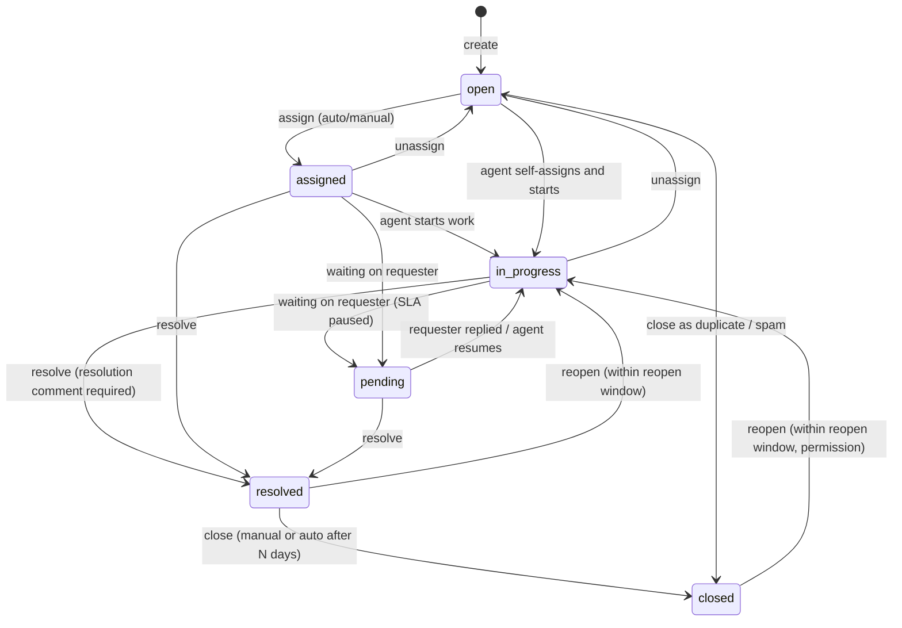

# Ticket domain

## Decision: statuses

The prompt listed `New → Open → Assigned → In Progress → Resolved → Closed`. Research of Zendesk (New/Open/Pending/On-hold/Solved/Closed), Jira Service Management (workflow-defined) and osTicket (Open/Resolved/Closed with sub-states) shows that "New" exists to mean *nobody has looked at this yet*. In our model that is exactly "open and unassigned", which is already derivable (`status = open AND assigned_agent_id IS NULL`). Two statuses meaning the same thing double the transition table and confuse SLA rules, so **`new` is merged into `open`**.

Two statuses are *added* because the algorithms need them:

- **`pending`** — waiting on the requester. Without it, SLA pause/resume has no trigger and resolution-time metrics punish agents for customer silence.
- **`reopened`** is *not* a status; it is a history event. A reopened ticket returns to `open` (unassigned) or `in_progress` (if the previous agent is still available), so that assignment rules apply uniformly.

### State machine

Transition rules are encoded in one place, `Modules/Tickets/Domain/TicketStatus.php` (enum with `canTransitionTo()`), and the API rejects any other transition with error code `invalid_transition` (422). See [07-api/errors.md](../07-api/errors.md).

| From → To | Guard | Side effects |
|---|---|---|
| any → assigned | assignee eligible (active agent in tenant) | assignment record, notification, history |
| * → pending | ticket has at least one public reply (else why wait?) — soft rule, warning only | SLA timers paused |
| pending → in_progress | — | SLA timers resumed (paused duration added to due times) |
| * → resolved | resolution comment in same request or last comment by agent | resolution SLA stopped; `resolved_at`; contact email; webhook `ticket.resolved` |
| resolved → closed | — | `closed_at`; webhook `ticket.closed` |
| resolved/closed → in_progress (reopen) | within `reopen_window_days` (tenant setting, default 14); `tickets.reopen` permission for closed | history `reopened`; resolution timer restarted from now with full target ([sla](sla.md)) |
| open → closed (duplicate) | `duplicate_of_id` set, target is not itself a duplicate | comment on the original: "Ticket #n marked as duplicate" |

## Fields

| Field | Type | Notes |
|---|---|---|
| `id` | UUID v7 | global identifier, exposed in API ([ADR-0013](../adr/0013-identifiers.md)) |
| `tenant_id` | UUID FK | scoped |
| `number` | integer | tenant-scoped sequence, unique `(tenant_id, number)`; assigned with `SELECT ... FOR UPDATE` on a per-tenant counter row |
| `title` | varchar(200) | |
| `description` | text | plain text / limited Markdown; rendered safely |
| `contact_id` | FK contacts | requester |
| `organization_id` | FK, nullable | denormalised from contact at creation for filtering |
| `category_id` | FK | |
| `team_id`, `assigned_agent_id` | FK nullable | current assignment |
| `status` | enum | above |
| `impact`, `urgency` | smallint 1–4 | inputs to priority |
| `priority_score` | numeric(5,2) | 0–100 |
| `priority_level` | enum P1..P4 | derived from score unless overridden |
| `priority_override_level`, `priority_override_reason`, `priority_override_by` | nullable | manual override |
| `priority_explanation` | JSONB | `{strategy, version, parts[]}` from the last computation |
| `duplicate_of_id` | FK self, nullable | |
| `first_responded_at`, `resolved_at`, `closed_at`, `last_customer_reply_at`, `last_agent_reply_at` | timestamptz | metrics + SLA |
| `search_vector` | tsvector generated | title + description ([08-database/indexing.md](../08-database/indexing.md)) |
| `created_by_user_id`, `created_via` | | `ui`, `api`, `seed` |
| `created_at`, `updated_at` | | |

Related tables: `ticket_comments` (with `visibility` = `public` \| `internal`), media items linked through `mediables` ([media.md](media.md)), `ticket_tags` (pivot), `ticket_assignments` (history of assignments with reason and explanation JSONB), `ticket_events` (history: type, actor, old/new values JSONB), `ticket_duplicate_suggestions` (ticket_id, candidate_id, score, breakdown, decision), `ticket_sla_timers` ([sla.md](sla.md)).

## Comments

| Field | Notes |
|---|---|
| `visibility` | `public` (requester sees; emailed) or `internal` |
| `author_type`, `author_id` | `user` (agent), `contact` (recorded on behalf of the requester by an agent or via API) or `client` (API client) |
| `body` | text |
| `attachments` | media items linked with `mediables` (type `ticket_comment`) |

The first `public` comment by a `user` sets `first_responded_at` and satisfies the first-response SLA. A `contact`-authored comment sets `last_customer_reply_at` and, if the ticket is `pending`, moves it to `in_progress`.

## Invariants (tested)

1. `number` unique per tenant and gapless under concurrency (test with parallel creation).
2. A ticket can never reference a contact, category, team, agent or duplicate target from another tenant (DB check via composite FKs where practical, else application validation + isolation tests).
3. `resolved_at` set iff status ∈ {resolved, closed}.
4. Exactly one running resolution timer per ticket while status ∉ {resolved, closed}.
5. A duplicate cannot itself be a duplicate target (depth 1).

## Explanation surfaces

The ticket page shows three "Why?" panels: priority breakdown, assignment ranking (top 3 candidates with scores), duplicate suggestions with component scores. These are the academic demonstration points and come straight from the JSONB explanation columns.
