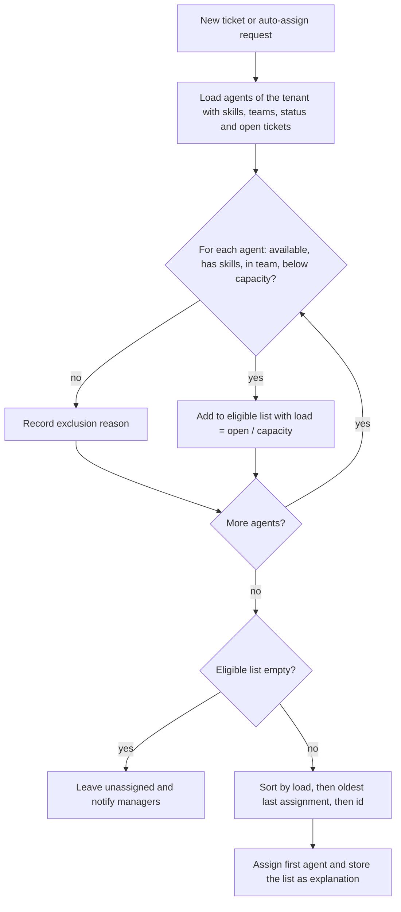

# Agent assignment — Least-Loaded Eligible Agent (academic baseline)

Contract: `AssignmentStrategy`. Baseline class: `App\Modules\Automation\Strategies\Baseline\LeastLoadedAgent` (`#[AcademicBaseline]`, `@deprecated` pointing to ADR-0023). Replaceable after the defence ([ADR-0023](../adr/0023-minimal-replaceable-algorithms.md)); richer candidate: [future/agent-assignment-advanced.md](future/agent-assignment-advanced.md). Requirements FR-AUT-04..05. Data model: [agents-and-teams.md](../04-domain/agents-and-teams.md).

M2-05 is integrated and covered by feature tests; see [Integration as built](#integration-as-built-m2-05).

## Idea

Send each new ticket to the **qualified agent who is least busy relative to their capacity**. This is the "least connections" rule of network load balancers [NGINX] combined with the skill filter used in contact centres [Gans et al.]. When two agents are equally busy, the one who received a ticket longest ago wins, which is round robin [NGINX].

## Step 1 — who can take the ticket?

An agent is **eligible** when all of these hold:

1. the agent is active and marked *available* (and, if the tenant enforces shifts, is on shift now);
2. the agent has every skill the ticket's category requires (no requirement → any agent);
3. if the ticket already has a team, the agent is in that team;
4. the agent's open tickets are fewer than their capacity.

"Open tickets" means tickets assigned to the agent in status assigned, in progress or pending.

The caller's loader builds one `AgentCandidate` per agent. It supplies `openTickets`, `capacity`, `skills`, `teamIds`, `active`, `available`, `lastAssignedAt` and `onShift`. `onShift` is computed by the loader from the agent's shifts at the `Clock`'s "now". The ticket side is `TicketNeeds(ticketId, requiredSkills, teamId, enforceShifts)`; `enforceShifts` is the tenant setting `shifts.enforce`.

The checks run in this order, and the first failing one is the recorded reason:

| # | Check | Reason code |
|---|---|---|
| 1 | agent is active | `inactive` |
| 2 | agent is available | `not_available` |
| 3 | on shift (only when `enforceShifts` is true) | `off_shift` |
| 4 | has every required skill | `missing_skill` (the explanation lists the missing skills, sorted, once each) |
| 5 | in the ticket's team (only when the ticket has a team) | `not_in_team` |
| 6 | open tickets < capacity | `at_capacity` |

An agent with capacity 0 is always `at_capacity`.

## Step 2 — pick one

```text
load(agent) = open_tickets(agent) ÷ capacity(agent)

choose the eligible agent with the smallest load;
if equal: the one whose last assignment is oldest (never assigned counts as oldest);
if still equal: the smallest agent id
```

Loads are compared exactly by cross-multiplication (`open_a × capacity_b` against `open_b × capacity_a`), so 1/3 and 2/6 are equal and no floating-point rounding decides a tie.

## Flow



## Algorithm

```text
function choose(ticket, agents):
    eligible ← []
    for a in agents:
        reason ← whyNotEligible(a, ticket)       // null when eligible
        if reason = null: eligible.append(a)
        else: explanation.excluded(a, reason)
    if eligible is empty:
        return NO_AGENT with explanation          // ticket stays unassigned; managers are notified
    sort eligible by (load(a), lastAssignedAt(a), a.id)
    return eligible[0] with explanation.ranking(eligible)
```

The chosen agent's open-ticket count and last-assignment time are updated in the same database transaction, with the ticket row locked so two requests cannot assign it twice.

**Result:** `AssignmentResult` with `agentId` (null when nobody is eligible), `ranking` (eligible agents, best first) and `exclusions` (sorted by agent id). `explanation(ticketId)` returns `strategy` (`least_loaded_agent`), `strategy_version` (`1.0.0`), `ticket_id`, `agent_id`, `outcome` (`assigned` or `no_eligible_agent`), `ranking` (rank, agent id, open tickets, capacity, load rounded to 4 decimals, last assigned) and `excluded` (agent id, reason, missing skills).

`FairnessIndex` (`Domain/Assignment`) provides Jain's index, standard deviation and coefficient of variation for experiment E1.

**Complexity:** O(A log A) for A agents in the tenant (the sort); A is small.

## Worked example

Ticket in category *Billing* (requires skill `billing`), no team yet.

| Agent | Skill billing | Status | Open / capacity | Load | Last assigned | Result |
|---|---|---|---|---|---|---|
| Asha | yes | available | 3 / 10 | 0.30 | 09:40 | eligible |
| Bikram | yes | available | 2 / 5 | 0.40 | 08:15 | eligible |
| Chen | yes | available | 3 / 10 | 0.30 | 09:10 | eligible |
| Dev | no | available | 0 / 8 | — | — | excluded: missing skill `billing` |
| Esha | yes | away | 1 / 10 | — | — | excluded: not available |

Asha and Chen share the lowest load (0.30); Chen was assigned earlier, so **Chen** gets the ticket. Bikram has fewer tickets than both but a smaller capacity, so his load is higher.

### Integration as built (M2-05)

- `Automation\Queries\AssignmentCandidates::forTicket` builds `TicketNeeds` and the ordered `AgentCandidate` pool (active user, availability, capacity, skills, effective team, shifts when `shifts.enforce` is on); `Actions\AssignTicket` is the only caller of the `AssignmentStrategy` contract besides the preview. Agents does not import Tickets: it asks through `Agents\Contracts\DirectoryUsage`, which Automation binds to `Support\TicketDirectoryUsage`.
- Lock order in `AssignTicket`: the ticket row `FOR UPDATE`, then the workspace's agent rows `FOR UPDATE` ordered by id, and only then the workload is read. Two tickets therefore never take the last slot of one agent: the second transaction sees the counter of the first.
- Automatic assignment runs in `Listeners\AutoAssignOnTicketCreated` (switch: `helpdesk.automation.assignment.enabled`) and on `POST /tickets/{ticket}/auto-assign`. When nobody is eligible the attempt is still stored with the routed `team_id` and every exclusion, `NoEligibleAgent` is raised, and the endpoint answers 422 `no_eligible_agent` with `meta.exclusions`. A ticket that already has an agent answers 409 `already_assigned`.
- `POST /tickets/{ticket}/assign` takes `{team_id?, agent_id?}` (at least one). A manager may pick an agent the strategy excludes; the explanation then carries `selection: manual`, `manual_override: true`, `override_reason` and the `recommended_agent_id`. A different agent is a reassignment (`reason: reassign`, `previous_agent_profile_id`); a team alone routes without touching the agent (`outcome: team_routed`); the same agent and team again answer 409 `already_assigned`. Identifiers of another workspace fail validation; a resolved or closed ticket answers 422 `invalid_transition`.
- Every attempt is one `ticket_assignments` row (`reason` auto, manual, reassign or unassign; explanation with strategy name and version, ranking and exclusions) and one `assigned` or `unassigned` history row. `TicketAssigned`, `TicketStatusChanged` and `NoEligibleAgent` dispatch after commit.
- `active_ticket_count` is kept by `Support\AgentWorkloadCounter` on assignment and by `Listeners\AdjustWorkloadOnTicketLifecycle` on status changes; `agents:reconcile-workload` repairs drift from the live ticket count. `GET /tickets/{ticket}/assignment-candidates` previews the ranking and stores nothing; `GET /tickets/{ticket}/assignment` (M4-06) reads back the latest row with its stored explanation, 404 when there is none. All five routes need `tickets.assign`.
- Time comes from `Clock`; settings come from `config/helpdesk.php` until the Settings service exists (M2-01); manager notifications for `NoEligibleAgent` arrive with M2-09.
- Feature tests: `tests/Feature/Automation/Assignment/` (worked example, exclusions, last-slot race, lock order, team routing, counters, HTTP codes and guards).
- On the ticket page (M4-06) the Assignment section turns the stored explanation into one sentence: picked automatically with the lowest load, chosen by hand with or without the strategy's agreement, chosen although not eligible (naming the broken rule), or no eligible Agent. The ranking and exclusions as they were at that moment sit behind "Show the ranking".

## Tests

Each exclusion reason; lowest load wins; tie goes to the oldest last assignment; never-assigned agent wins a tie; identical agents rotate like round robin over repeated assignments; no eligible agent returns no assignment with reasons; shuffled input gives the same result (contract test); concurrent assignment of one ticket succeeds once (feature test with the assignment action, M2).

## Evaluation (experiment E1)

Replay 500 generated tickets over 8 agents with different skills and capacities under three policies: **random**, **round robin** (skills respected) and this **baseline**. Measure the spread of load (standard deviation, maximum, minimum), Jain's fairness index [Jain et al.] and the number of capacity overflows.

**Results (M3-10, seed 42, dataset v1; tables T1–T2, plots 1–3, `experiments/results/v1/e1/`).** The comparison policies pick among agents with the required skills and ignore capacity; every policy sees the same arrivals and handling times. "Average" is the mean over the 500 arrival instants.

| Policy | Capacity overflows | Final std dev / max / min open | Average std dev of open | Average Jain (open) | Average Jain (utilisation) | Peak utilisation |
|---|---|---|---|---|---|---|
| random | 74 | 3.59 / 14 / 3 | 3.03 | 0.76 | 0.74 | 1.75 |
| round robin | 36 | 2.71 / 13 / 4 | 2.57 | 0.81 | 0.80 | 1.45 |
| **least-loaded (baseline)** | **0** | 1.27 / 9 / 5 | **1.00** | **0.95** | **0.97** | 0.83 |

No ticket was left unassigned by any policy at this load (about half the total capacity on average). The baseline keeps the average spread at about 40 % of round robin's and never exceeds a capacity, which the other policies do dozens of times; the price is that it depends on an accurate open-ticket count ([Integration as built](#integration-as-built-m2-05)).

## Limitations and replacement

Skill strength, customer history and ticket priority are ignored; each ticket is decided alone. Replacement options: weighted scoring with skill levels and affinity, batch optimisation with the Hungarian method or OR-Tools, or learned routing ([future](future/README.md)).
