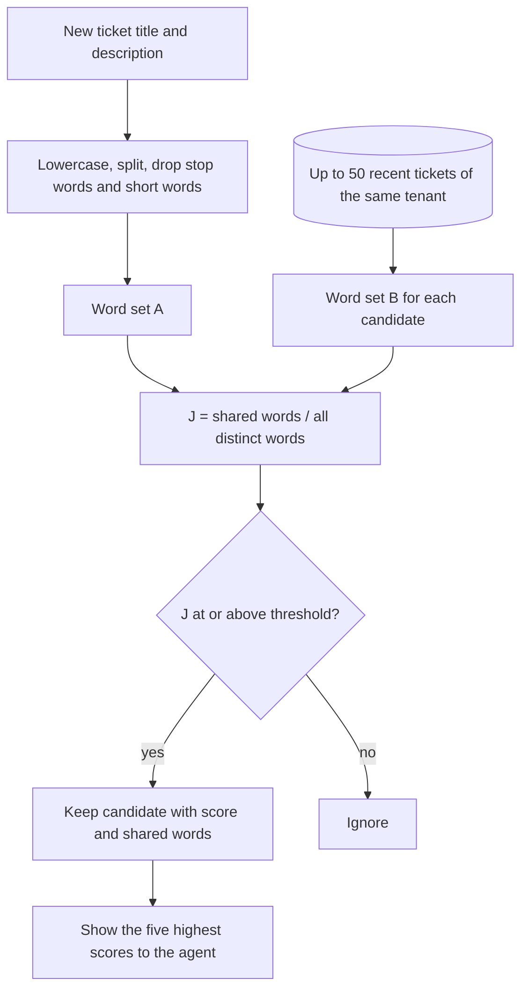

# Duplicate detection — Jaccard Duplicate Check (academic baseline)

Contract: `DuplicateStrategy`. Baseline class: `App\Modules\Automation\Strategies\Baseline\JaccardDuplicates` (`#[AcademicBaseline]`, `@deprecated` pointing to ADR-0023); word extraction in `App\Modules\Automation\Domain\Text\WordSet`. Replaceable after the defence ([ADR-0023](../adr/0023-minimal-replaceable-algorithms.md)); richer candidate: [future/duplicate-detection-advanced.md](future/duplicate-detection-advanced.md). Requirement FR-AUT-06.

## Idea

Two tickets about the same problem tend to **share words**. Turn each ticket into a set of meaningful words and measure how much the two sets overlap with the **Jaccard similarity** [Manning et al.]. The same idea — compare the words of a new report with existing ones and show the closest — is where duplicate bug-report research started [Runeson et al.].

## Step 1 — words of a ticket

```text
function words(title, description):
    text ← lowercase(title + " " + description)
    text ← replace every character that is not a letter, digit or hyphen with a space
    tokens ← split text on spaces
    keep tokens with at least 3 characters that are not in the stop-word list
        and are not made of hyphens only
    return the set of remaining tokens (in order of first appearance)
```

The stop-word list is a short fixed file, `backend/resources/automation/stopwords-en.txt`: one lowercase word per line, `#` comments allowed. It holds 117 words (`the, and, for, with, after, before, from, this, that, are, was, were, have, has, had, you, your, our, but, not, can, will, please, hello, thanks, regards`, …). Words shorter than three characters are not listed because they are dropped anyway. Words that describe a problem are deliberately not listed: `cannot`, `error`, `fails`, `shows`. A different file can be loaded with `WordSet::fromFile($path)`.

| Token rule | Effect |
|---|---|
| Hyphens kept | error codes such as `err-401` survive |
| Hyphen-only tokens (`---`) | dropped |
| Letters | any Unicode letter plus combining marks (`\p{L}\p{M}`), so Devanagari words stay whole |
| Length | counted in characters, not bytes |

## Step 2 — which tickets to compare

The database returns at most 50 candidates from the **same tenant**, created in the last 30 days, not closed, ordered by PostgreSQL trigram similarity of the title. This is a database feature used only to keep the comparison small; the decision is made by our function below.

M2-10 implementation in progress (2026-09-20): `DuplicateCandidates` applies that bounded query through the tenant-scoped Ticket model, and `SuggestDuplicates` calls the configured `DuplicateStrategy` contract. `CreateTicket` stores the best matches in `ticket_duplicate_suggestions` with score, shared words, strategy, version and decision; repeated storage preserves a prior dismiss/accept decision. The preview API scores without writing. Agents can dismiss a suggestion or mark an open Ticket as a duplicate, which closes it and adds an internal note to the original. The SPA has a debounced create preview and a stored-suggestions tab. The per-workspace threshold form awaits the M2-01 Settings service; until then the configured default is used. These paths have not passed the deferred Week 2 acceptance gate yet.

## Step 3 — similarity and decision

```text
J(A, B) = |A ∩ B| ÷ |A ∪ B|          (0 = nothing shared, 1 = same words)

suggest the candidate if J ≥ 0.35 (tenant setting); show the best five
```

Settings (`automation.duplicates.baseline`, class `DuplicateSettings`):

| Setting | Default | Rule | Used by |
|---|---|---|---|
| `threshold` | 0.35 | greater than 0, at most 1 | algorithm |
| `max_suggestions` | 5 | positive | algorithm |
| `candidate_limit` | 50 | positive | candidate loader |
| `window_days` | 30 | positive | candidate loader |

Invalid settings throw `InvalidStrategySettings`.

## Flow



## Algorithm

```text
function find(ticket, candidates):
    A ← words(ticket.title, ticket.description)
    results ← []
    for c in candidates:
        if c.id = ticket.id: skip                // a ticket is never its own duplicate
        B ← words(c.title, c.description)
        shared ← A ∩ B
        score ← |shared| / |A ∪ B|        // 0 when both sets are empty
        if score ≥ threshold:
            results.append(c, score, shared)
    sort results by (−score, newest first, id)  // undated candidates count as oldest
    return first 5 results
```

Scores are compared exactly by cross-multiplication of shared and union counts, so the threshold test and the order are not decided by float rounding. The explanation shows each score rounded to 4 decimals.

The explanation shown to the agent is the score and the list of shared words. `DuplicateResult::explanation()` returns `strategy` (`jaccard_duplicates`), `strategy_version` (`1.0.0`), `words` (the new ticket's set), `candidates_compared`, `settings` and `matches` (ticket id, score, shared words sorted alphabetically, shared count, union count). On the ticket page (M4-06) each stored suggestion shows the candidate's status, the similarity, the shared words as tokens and the strategy with its version.

**Complexity:** O(L) to build a word set of text length L, and O(K × W) to compare with K ≤ 50 candidates of about W words each — a few thousand set operations per new ticket.

### Integration as built (M2-10)

- The orchestration lives in Automation: `Queries\DuplicateCandidates`, `Actions\SuggestDuplicates` (calls the `DuplicateStrategy` contract), `Actions\PersistDuplicateSuggestions`, `Listeners\SuggestDuplicatesOnTicketCreated` and `Http\Controllers\TicketDuplicateController`. The table, model and `MarkDuplicate` action belong to Tickets.
- Candidates are ranked by `similarity(title, ?)`, not filtered by it. A `title % ?` filter would use the GIN index but drop tickets that share words only in the description. The scan is bounded by the tenant's 30-day window through `tickets_tenant_created_idx`.
- Re-running the step keeps earlier decisions (`firstOrCreate` on `(tenant_id, ticket_id, candidate_ticket_id)`).
- Depth 1 holds in both directions: a duplicate cannot be a target, and a ticket that already has duplicates cannot become one. Both answer 422 `duplicate_target_invalid`.
- Dismissing an accepted suggestion answers 409 `already_decided`. Preview is limited to 30 a minute per user.
- Settings come from `config/helpdesk.php` until the Settings service exists (M2-01).

## Worked example

New ticket: *"Cannot login after password reset"* — *"Login page shows error ERR-401 after I reset my password."*
A = {cannot, login, password, reset, page, shows, error, err-401} (8 words)

| Candidate | Words (B) | Shared | Union | J | Decision |
|---|---|---|---|---|---|
| #1031 *"Login fails after resetting password"* — *"Error ERR-401 on login page."* | {login, fails, resetting, password, error, err-401, page} | login, password, error, err-401, page (5) | 10 | **0.50** | suggested |
| #1002 *"Invoice PDF is blank"* — *"The invoice download shows an empty page."* | {invoice, pdf, blank, download, shows, empty, page} | shows, page (2) | 13 | **0.15** | ignored |

"reset" and "resetting" do not match because the baseline does no stemming — a limitation the replacement can fix.

## Tests

Word extraction (case, punctuation, hyphenated codes, short words, stop words); Jaccard at 0, 1 and the example; empty texts; threshold boundary; ordering and limit of five; candidates from another tenant never appear (isolation test with the candidate loader, M2); same input gives the same output (contract test).

## Evaluation (experiment E2)

300 labelled ticket pairs (100 duplicates, 200 non-duplicates, 50 of them from the same category). For thresholds from 0.10 to 0.90: true/false positives and negatives, precision, recall and F1; choose the threshold with the best F1 and report Recall@5 of the suggestion list. Compare title-only and title-plus-description word sets.

**Results (M3-10, seed 42, dataset v1; tables T3–T5, plots 4–6, `experiments/results/v1/e2/`).** Scores come from the `DuplicateStrategy` contract. The threshold is chosen on a seeded, label-stratified 70 % split (210 pairs) and measured on the other 30 % (90 pairs). Recall@5: each duplicate's side a searches the 5 000-ticket haystack plus all 100 side-b tickets; a hit when its own partner is among the five suggestions.

| Word set | Threshold | Test precision | Test recall | Test F1 | Recall@5 (ranking only / at the threshold) |
|---|---|---|---|---|---|
| title + description | 0.35 (default) | 0.95 | 0.70 | 0.81 | 0.92 / 0.75 |
| title + description | **0.30** (best on training) | 0.92 | 0.77 | **0.84** | 0.92 / 0.79 |
| title only | 0.35 | 0.89 | 0.53 | 0.67 | 0.03 / 0.01 |
| title only | 0.15 (best on training) | 0.91 | 1.00 | 0.95 | 0.03 / 0.03 |

On all 300 pairs the default 0.35 gives 76 TP, 3 FP, 24 FN, 197 TN (precision 0.96, recall 0.76). Mean scores: duplicates 0.66, non-duplicates 0.08. All 24 duplicates missed at 0.35 are hand-written paraphrases (different words, no stemming); the 60 generated ones are all found, which shows how much easier generated data is. Title-only word sets separate the labelled pairs well but fail at retrieval: short titles of 5 000 tickets tie with many unrelated tickets, so the partner is rarely in the top five — the description is what makes suggestions useful. The results support keeping title + description and suggest a slightly lower default (0.30); the change is left to the owner because the data is generated.

## Limitations and replacement

No stemming, synonyms or word weighting; common words in a tenant's domain inflate scores; paraphrases with different words are missed. Replacement options: TF-IDF or BM25 ranking with stemming, embeddings with pgvector, or a hybrid with a learned threshold ([future](future/README.md)).
