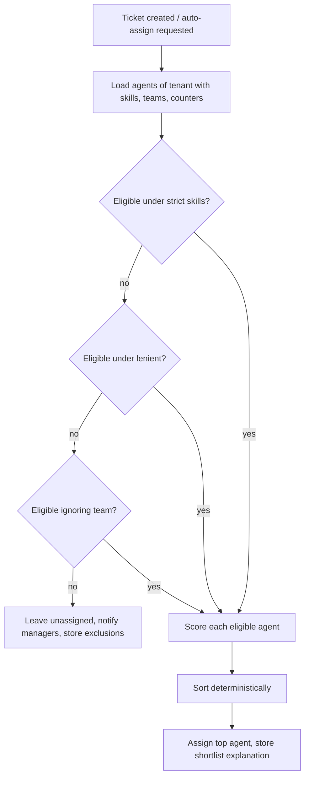

# Agent assignment and load balancing — advanced design (future replacement candidate)

> **Status: not built in the MVP.** This is the richer design produced during research. The MVP ships the minimal academic baseline in [agent-assignment.md](../agent-assignment.md) behind a replaceable strategy interface ([ADR-0023](../../adr/0023-minimal-replaceable-algorithms.md)). After the project defence this design is one of the candidates for replacing the baseline.


Module: `App\Modules\Automation\Domain\Assignment\AgentAssigner`. Requirements FR-AUT-04..05. Data model: [04-domain/agents-and-teams.md](../../04-domain/agents-and-teams.md).

## 1. Background

- **Load balancing** (NGINX/HAProxy documentation): round robin, weighted round robin, least connections (best when processing times vary), weighted least connections `argmin active_i / weight_i` — the ancestor of our capacity term. **Power of two choices** (Mitzenmacher, *IEEE TPDS* 2001) reduces maximum load exponentially at O(1) cost; it is randomised, so we implement it only as an experiment baseline seeded from the ticket id.
- **Skills-based routing** (Gans, Koole & Mandelbaum, *M&SOM* 2003; Koole & Mandelbaum 2002): agents have skill sets, calls have skill requirements, and practical policies are greedy index rules ("least-loaded qualified agent") because optimal policies are intractable. Our scorer is such a greedy index rule.
- **Batch optimum**: the Hungarian method (Kuhn, *NRLQ* 1955) solves the assignment problem in O(n³); offered as an optional batch mode.
- **Fairness**: Jain's index (Jain, Chiu & Hawe, DEC TR-301, 1984) `J = (Σx)² / (n·Σx²)`, scale-independent, bounded [1/n, 1], with `J = 1/(1+CV²)`.
- ITSM routing literature: Shao et al. (KDD 2008) mine transfer sequences; SmartDispatch (Agarwal et al., KDD 2012) suggests a shortlist of resolver groups; Mandal et al. (AAAI/IAAI 2019) combine ML with a configurable rule engine. Our contribution is deterministic *initial* assignment with fairness measurement and a shortlist explanation.

## 2. Problem statement

Given a ticket `t` with tenant, category (required skills, default team), optional team, priority level, requester organisation, and a set of agents `A` with availability, capacity, active weighted load, skills with levels, team memberships and `last_assigned_at`, choose the agent `a*` (or none) and produce an explanation.

## 3. Eligibility (hard constraints)

```text
eligible(t) = { a ∈ A_tenant :
    a.active ∧ a.availability = available
  ∧ a.active_ticket_count < a.capacity
  ∧ teamOk(a, t)              // t.team_id null → any; else a ∈ team
  ∧ skillsOk(a, t, mode) }    // strict: required ⊆ a.skills; lenient: |required ∩ a.skills| ≥ 1; none: true
```

Relaxation ladder when empty (each step recorded in the explanation): `strict → lenient → ignore team (keep skills lenient) → none eligible`. If still empty, the ticket stays unassigned with `team_id` set from the category default, managers are notified (`no_eligible_agent`), and the exclusion reasons per agent are stored.

## 4. Scoring

All terms in [0,1]; higher is better.

```text
score(a,t) = W_skill · skill(a,t)
           + W_load  · (1 − load(a) / L_cap)
           + W_cap   · (1 − a.active_ticket_count / a.capacity)
           + W_rr    · min(1, minutesSince(a.last_assigned_at) / RR_WINDOW)
           + W_aff   · affinity(a,t)
           − W_pen   · penalty(a,t)
```

| Term | Definition | Default weight |
|---|---|---|
| `skill` | `Σ_{s∈required} level(a,s) / (3 · |required|)` (levels 1–3); 1 when no skills required | 0.35 |
| `load` | `Σ_{open tickets o of a} pw[o.level]` with `pw = {P1:4, P2:3, P3:2, P4:1}`, pending tickets at half weight; `L_cap = 4 · a.capacity` (fixed cap for reproducibility rather than max over agents) | 0.25 |
| capacity headroom | separates "busy" from "at contractual ceiling" (part-timer with 2/3 vs full-timer with 4/12) | 0.15 |
| round-robin recency | `RR_WINDOW = 240 min`; the longest-waiting agent wins ties | 0.15 |
| affinity | 1 if the agent handled a ticket from the same organisation in the last 30 days, else 0 | 0.10 |
| penalty | 0.2 if the ticket was previously unassigned from this agent; 0.1 if the agent already holds ≥ 2 P1 tickets | 0.20 (subtractive) |

**Proposition (tested)**: with identical skills, loads and capacities and no affinity/penalty, the scorer degenerates to round robin (least-recently-assigned first).

## 5. Deterministic ordering

Candidates are sorted by `(−round(score, 6), last_assigned_at ASC NULLS FIRST, active_ticket_count ASC, agent_id ASC)`. Rounding before comparison removes floating-point noise; the final `agent_id` key gives a total order, so identical inputs always give identical output.

## 6. Pseudocode

```text
function assign(t, agents, settings, now):
    for mode in [settings.skill_mode, 'lenient', 'ignore_team']:
        (elig, excluded) = filter(agents, t, mode)
        if elig not empty: break
    if elig empty:
        return AssignmentResult(none, excluded, reason='no_eligible_agent')
    ranked = []
    for a in elig:
        terms = computeTerms(a, t, settings, now)
        s = Σ W_i · terms_i  − W_pen · penalty
        ranked.append({a, round(s,6), terms})
    sort ranked by (-score, last_assigned_at, active_count, id)
    return AssignmentResult(ranked[0].a, ranked[0..2] as shortlist, excluded, mode)

// persistence (Tickets module, AssignTicket action):
lock ticket row FOR UPDATE; if already assigned since evaluation → abort (409)
set team/agent; increment agent.active_ticket_count; set last_assigned_at = now
insert ticket_assignments {reason:'auto', explanation: result}
```



## 7. Complexity

Eligibility and scoring are O(|A| · |S|) per ticket (agents × required skills); with |A| ≤ 200 and |S| ≤ 5 this is negligible. Data loading is one query with eager-loaded skills/teams plus one aggregate for loads (or the maintained counter). The optional Hungarian batch mode is O(n³) for n = max(tickets, agent slots) per batch.

## 8. Worked example

Ticket: category Billing (skills: `billing`, `refunds`), P2, org Globex. Agents:

| Agent | skills (level) | active load (weighted) | cap | last assigned | affinity | score |
|---|---|---|---|---|---|---|
| Asha | billing 3, refunds 2 | 6 (cap 40) | 3/10 | 90 min ago | yes | 0.35·0.833 + 0.25·0.85 + 0.15·0.7 + 0.15·0.375 + 0.10·1 = **0.766** |
| Bikram | billing 2, refunds 3 | 14 | 6/10 | 300 min ago | no | 0.35·0.833 + 0.25·0.65 + 0.15·0.4 + 0.15·1 + 0 = 0.664 |
| Chen | billing 3 (no refunds) | 2 | 1/8 | 10 min ago | no | excluded (strict) |

Asha wins; the UI shows the three rows and Chen's exclusion reason ("missing skill: refunds").

## 9. Tests

Unit: eligibility per criterion; relaxation ladder; each term at bounds; round-robin degeneration proposition; determinism (shuffle input order ⇒ same result); penalty and affinity effects; empty agents. Feature: auto-assign on create; manual assign records explanation; concurrent assignment of the same ticket (one wins, other 409); counters reconciled.

## 10. Experiment (E1)

Synthetic tenant (8 agents, 6 categories, 500 tickets, seeded Poisson arrivals with diurnal rate) comparing random, round robin, least-loaded (unweighted), power-of-two-choices (seeded), proposed weighted score, and optional Hungarian batch. Metrics: Jain's index and CV over weighted load, max/min load, max−min spread, skill-match rate, capacity violations (must be 0), P1-to-expert rate. Sweep `W_load` to plot the skill-match vs fairness trade-off frontier. Output CSV + plots per [evaluation-methodology.md](../evaluation-methodology.md).

## 11. Limitations

Greedy per ticket; no forecasting of arrivals; availability is a manual status (no shifts); affinity is binary. V1: shift calendars, batch rebalancing, learned skill proficiency from resolution outcomes.
