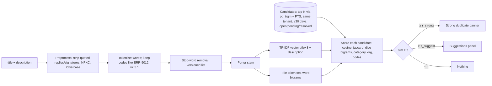

# Duplicate ticket detection — advanced design (future replacement candidate)

> **Status: not built in the MVP.** This is the richer design produced during research. The MVP ships the minimal academic baseline in [duplicate-detection.md](../duplicate-detection.md) behind a replaceable strategy interface ([ADR-0023](../../adr/0023-minimal-replaceable-algorithms.md)). After the project defence this design is one of the candidates for replacing the baseline.


Module: `App\Modules\Automation\Domain\Duplicates\{Tokenizer, StopWords, PorterStemmer, TfIdfVectorizer, Similarity, DuplicateDetector}`. Requirement FR-AUT-06. Lexical, explainable, no external AI.

## 1. Background

- **Text preprocessing** (Manning, Raghavan & Schütze, *Introduction to Information Retrieval*, 2008, ch. 2): tokenisation, case folding, stop words, stemming. **Porter stemmer** (Porter, *Program* 14(3), 1980): rule-based suffix stripping conditioned on the measure *m*; we implement it ourselves (~250 lines) and validate against the Snowball vocabulary/output files.
- **Vector space model and TF-IDF cosine** (IIR ch. 6; SMART `lnc.ltc`). **Jaccard** set similarity (IIR §3.3.4). **Shingling / n-grams** (IIR §19.6). **BM25** (Robertson & Zaragoza, *FnTIR* 2009) as the benchmarked alternative. **MinHash/LSH** (Broder, SEQUENCES 1997) and **SimHash** (Charikar, STOC 2002) as the documented scalability path.
- **Duplicate bug-report detection**: Runeson, Alexandersson & Nyholm (ICSE 2007) — tokenise/stem/stop-word/VSM/cosine, Recall@5 = 30 %, Recall@10 = 38 %, Recall@15 = 42 %; Wang et al. (ICSE 2008) add a second channel (execution traces) — our analogue is structured fields; Jalbert & Weimer (DSN 2008) frame detection as a filter; Sun et al. (ICSE 2010); Sun et al. (ASE 2011) **REP** extends BM25F with non-textual fields (product, component, priority). **Our hybrid score is a hand-weighted, simplified REP.**
- Related open-source helpdesks (osTicket, Zammad, GLPI, FreeScout, UVdesk, Znuny) offer manual merge only; none detects duplicates automatically.

## 2. Pipeline



## 3. Candidate retrieval (stage A, SQL)

```sql
SELECT id FROM tickets
WHERE tenant_id = :tenant AND id <> :self
  AND status IN ('open','assigned','in_progress','pending','resolved')
  AND created_at > now() - interval '30 days'
  AND (similarity(title, :title) > 0.2 OR search_vector @@ websearch_to_tsquery('english', :terms))
ORDER BY similarity(title, :title) DESC, ts_rank_cd(search_vector, websearch_to_tsquery('english', :terms)) DESC, id
LIMIT 50;
```

`:terms` = top 8 stemmed tokens of the new ticket by TF. Bounded K keeps the request-path work small; RLS and the tenant scope both apply.

## 4. Scoring (stage B, PHP)

```text
sim(a,b) = α · cos(tfidf(a), tfidf(b))              // title repeated 3× + description
         + β · jaccard(titleTokens(a), titleTokens(b))
         + γ · dice(bigrams(a), bigrams(b))           // 2|A∩B| / (|A|+|B|)
         + δ · [category(a) = category(b)]
         + ε · [organization(a) = organization(b) ∨ contact(a) = contact(b)]
         + ζ · [codes(a) ∩ codes(b) ≠ ∅]              // error codes, versions, IDs
with α+β+γ+δ+ε+ζ = 1; defaults α 0.45, β 0.20, γ 0.15, δ 0.08, ε 0.07, ζ 0.05.
```

TF-IDF: `tf' = 1 + log tf`, `idf = log(N / df)` with per-tenant document frequencies maintained in `duplicate_term_stats (tenant_id, term, df)` and `N` = tenant ticket count (updated in the create action, one upsert batch per ticket); vectors L2-normalised so cosine is a dot product over the shorter posting list. Deterministic given the stats snapshot; experiments compute stats over the frozen dataset.

Thresholds (tenant settings): `τ_suggest = 0.55` (show), `τ_strong = 0.85` (banner "very likely duplicate of #n"). No automatic closing in the MVP; the agent decides (SmartDispatch/Runeson "shortlist" convention).

## 5. Pseudocode

```text
function detect(newTicket, settings):
    docA = preprocess(newTicket)
    candidates = candidateQuery(newTicket, settings.candidate_limit, settings.window_days)
    stats = termStats(tenant)                    // df map + N
    vA = tfidf(docA, stats)
    results = []
    for c in candidates:
        docB = preprocess(c)                     // cached per ticket in ticket_text_features
        s = α·cosine(vA, tfidf(docB, stats)) + β·jaccard(docA.title, docB.title)
          + γ·dice(docA.bigrams, docB.bigrams) + δ·sameCategory + ε·sameOrgOrContact + ζ·sharedCodes
        if s ≥ settings.suggest_threshold:
            results.append({c.id, round(s,4), breakdown})
    sort results by (-score, created_at DESC, id)
    return results[0..5]

function porterStem(word): steps 1a,1b,1c,2,3,4,5a,5b per Porter (1980) using measure m
```

`ticket_text_features` (ticket_id, tokens JSONB, bigrams JSONB, codes JSONB, vector JSONB) is written on create/update so candidates are not re-tokenised per comparison.

## 6. Complexity

Preprocessing O(L) in text length; candidate SQL uses GIN trigram and FTS indexes; scoring O(K · V) with K ≤ 50 candidates and V the vector length (≈ 50–200 terms) — a few thousand multiplications; total well under 100 ms. Exhaustive comparison would be O(N) per ticket; the pre-filter makes it O(K). LSH is the documented path if K-bounded retrieval loses recall at scale.

## 7. Worked example

New: "Cannot login after password reset — error ERR-401 on the portal". Candidate #1031: "Login fails after resetting password (ERR-401)". Tokens after stemming: {cannot, login, password, reset, error, err-401, portal} vs {login, fail, reset, password, err-401}. Jaccard(title) = 4/8 = 0.50; cosine ≈ 0.62; bigram dice ≈ 0.29; same category (1); different contact (0); shared code (1). `sim = 0.45·0.62 + 0.20·0.50 + 0.15·0.29 + 0.08 + 0 + 0.05 = 0.552` → suggestion (≥ 0.55). Candidate #1002 "Invoice PDF is blank": cosine ≈ 0.02, jaccard 0, dice 0, different category → 0.01 → ignored.

## 8. Tests

Unit: tokenizer (codes preserved, unicode), stop words, **Porter stemmer against the Snowball `voc.txt`/`output.txt` fixture (agreement rate reported)**, tf-idf values on a tiny corpus by hand, cosine/jaccard/dice bounds and symmetry, fusion weights sum, threshold classification, determinism. Feature: preview endpoint returns suggestions; create stores suggestions; mark-as-duplicate transitions; cross-tenant candidates never appear (isolation test).

## 9. Experiment (E2)

Labelled set of 300 pairs (100 duplicates incl. synthetic paraphrases via token dropout/synonym swap/typos with a fixed seed, plus hand-written pairs; 200 negatives incl. 50 hard negatives from the same category). Sweep τ 0.1–0.9: confusion matrix, precision, recall, F1, PR curve, F1-vs-τ; Recall@1/5/10 of candidate retrieval; ablation cosine-only / +jaccard / +bigram / +metadata; BM25 vs cosine comparison; runtime vs corpus size (log-log). Report against Runeson 2007's Recall@K figures. Accuracy is not reported (IIR ch. 8: unsuitable for skewed classes).

## 10. Limitations

Lexical only (paraphrases without shared vocabulary are missed); English stemming; per-tenant IDF needs a few hundred tickets to be informative (cold start: idf defaults to log(N+1)); no automatic action. V1: pgvector embeddings as an additional channel (simplified REP → learned weights), MinHash/LSH for scale, multilingual stemming.
