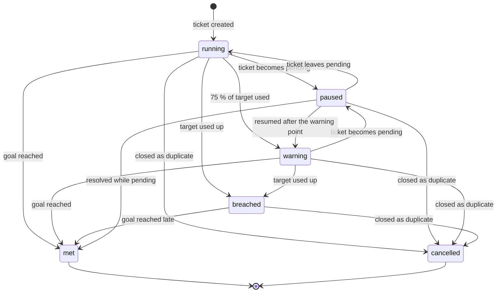

# SLA evaluation — Simple SLA Timer (academic baseline)

Contract: `SlaStrategy`. Baseline class: `App\Modules\Sla\Strategies\Baseline\SimpleSlaTimer`, with `TwentyFourSevenCalendar` and `WorkingHoursCalendar` (`App\Modules\Sla\Domain\Calendar`) behind the `BusinessCalendar` interface and time from the `Clock` interface. The class carries `#[AcademicBaseline]` and `@deprecated` pointing to ADR-0023. Replaceable after the defence ([ADR-0023](../adr/0023-minimal-replaceable-algorithms.md)); richer candidate: [future/sla-evaluation-advanced.md](future/sla-evaluation-advanced.md). Requirements FR-AUT-07..09. Data model: [sla.md](../04-domain/sla.md).

## Idea

Each ticket has two **timers**: time to the first public reply and time to resolution. A timer is a small **state machine** [Harel]: it starts when the ticket is created, stops (pauses) while the team is waiting for the customer, warns when 75 % of the allowed time is used, and is breached when the time runs out. Working hours are handled by a calendar that only counts open hours. Commercial helpdesks use the same two metrics and a pause-while-waiting rule [Zendesk, Jira, Zammad].

## States



Goal reached: the first public reply by an agent (first-response timer) or the ticket becoming resolved (resolution timer). A ticket closed as a duplicate cancels both timers.

The transitions are coded in `TimerState::allowedTransitions()`:

| From | Allowed next states |
|---|---|
| `running` | `paused`, `warning`, `breached`, `met`, `cancelled` |
| `paused` | `running`, `warning`, `met`, `cancelled` |
| `warning` | `paused`, `breached`, `met`, `cancelled` |
| `breached` | `met`, `cancelled` |
| `met`, `cancelled` | none (final) |

A breached timer cannot be paused. An operation the table does not allow throws `InvalidTimerTransition`. Callers check `$timer->state->canTransitionTo(...)` first, for example before pausing when a ticket becomes pending. Completing a paused timer closes the open pause and adds it to `paused_total`.

## Rules

| Event | What the timer does |
|---|---|
| Ticket created | target from the SLA policy for the ticket's priority; `due = cal.add(now, target)`; `warn = cal.add(now, round(0.75 × target))` in whole seconds |
| Ticket becomes pending | remember `paused_at` |
| Ticket leaves pending | `d = cal.elapsed(paused_at, now)`; `due = cal.add(due, d)`; `warn = cal.add(warn, d)`; add `d` to `paused_total`; state back to `warning` if the timer had warned, else `running` |
| Priority changes | new target; `due = cal.add(started_at, target + paused_total)`; `warn = cal.add(started_at, round(0.75 × target) + paused_total)` (always recomputed from the start). The state and the `warned_at` / `breached_at` records stay. A due time now in the past breaches on the next check. For a paused timer the open pause is not in `paused_total` yet; it is added on resume. Not allowed on `met` or `cancelled` timers |
| Ticket reopened | a new resolution timer starts from now |
| Every minute | `running` and `now ≥ warn` and `now < due` → **warning** (notify the assignee); `running` or `warning` and `now ≥ due` → **breached** (notify the assignee and managers) — each at most once. A first check after the due time breaches without a warning |
| Goal reached | state `met`, `met_at = now`; the event records `late = true` when the timer had breached |
| Closed as duplicate | state `cancelled`, `cancelled_at = now` |

## Calendar

`TwentyFourSevenCalendar` adds and subtracts plain elapsed seconds. `WorkingHoursCalendar` knows the tenant's time zone, weekly working hours and holidays:

```php
new WorkingHoursCalendar('Asia/Kathmandu', [
    'sun' => [['10:00', '17:00']],
    // … 'mon' to 'fri' the same; 'sat' omitted = closed
], holidays: ['2026-09-18']);
```

| Rule | Value |
|---|---|
| Weekday keys | `mon`, `tue`, `wed`, `thu`, `fri`, `sat`, `sun` |
| Times | `HH:MM`; `24:00` is allowed as an end |
| Windows per day | several, in any order; they must not overlap and must end after they start |
| Holidays | `Y-m-d` dates in the calendar's time zone |
| At least | one working window in the week |
| Result time zone | the time zone of the input instant |
| Daylight saving | handled; the calendar walks real instants day by day |
| No working time | `add` throws `InvalidCalendar` after walking ten years (3 660 days) |
| Negative duration | throws `InvalidCalendar` |

```text
function add(start, duration):
    t ← start; left ← duration
    for each local day from start's day (at most ten years):
        for each working window of the day (none on a holiday):
            skip windows that closed before t
            free ← close − max(t, open)
            if left ≤ free: return max(t, open) + left
            left ← left − free
    fail: no working time left
```

`elapsed(a, b)` sums the working time between `a` and `b` in the same day-by-day way. It returns 0 when `b` is not after `a`.

## Algorithm (every minute)

`check(timer, now = clock.now())` handles one timer and returns a `TimerOutcome`. The scheduled command selects the due timers, locks each one and stores the outcome.

```text
function check(now):
    for timer in timers where state in (running, warning) and (warn ≤ now or due ≤ now):
        lock timer
        if timer.state = running and now ≥ timer.warn and timer.warned_at is empty and now < timer.due:
            timer.state ← warning; timer.warned_at ← now; notify assignee
        if now ≥ timer.due and timer.breached_at is empty:
            timer.state ← breached; timer.breached_at ← now; notify assignee and managers
        record SLA event and ticket history
```

The query uses an index on `(state, due)` and `(state, warn)`, so each run reads only the timers that are due. The `warned_at` and `breached_at` checks make a repeated run harmless.

**Complexity:** constant time per event; each check is proportional to the number of timers that became due; the working-hours calendar walks one step per day crossed.

## Worked examples

Policy for P2: first response 60 min, resolution 8 h.

| # | Timeline (24×7 calendar) | Result |
|---|---|---|
| 1 | created 09:00; agent replies 09:40 | first response **met** at 09:40; resolution warns at 15:00, due 17:00 |
| 2 | as 1; pending 10:00–12:00 | resolution warns at 17:00, due **19:00** |
| 3 | created 09:00; no reply | first response **warning** 09:45, **breached** 10:00 (once each) |
| 4 | as 2; priority raised to P1 (resolution 4 h) at 13:00 | due = 09:00 + 4 h + 2 h paused = **15:00**, warning 14:00 |
| 5 | resolved 16:00; reopened 16:30 | new resolution timer from 16:30 |

Working-hours example: office hours Sunday–Friday 10:00–17:00 (Asia/Kathmandu), P3 resolution 8 h, ticket created Thursday 15:00 → 2 h on Thursday + 6 h on Friday → due **Friday 16:00**, warning after 6 h → **Friday 14:00**.

| # | Working-hours case | Result |
|---|---|---|
| 6 | created Friday 16:00, 8 h | 1 h Friday + 7 h Sunday → due **Sunday 17:00** (Saturday is closed) |
| 7 | created Thursday 15:00, 8 h, Friday is a holiday | 2 h Thursday + 6 h Sunday → due **Sunday 16:00** |
| 8 | as the main example; pending Thursday 16:00 → Sunday 11:00 | 9 working hours paused → due **Monday 11:00**, warning **Sunday 16:00** |
| 9 | as 8; then the target changes to 4 h | 4 h + 9 h from Thursday 15:00 → due **Sunday 14:00**, warning **Sunday 13:00** |

## API

```php
$sla = new SimpleSlaTimer($clock, warningFraction: 0.75);   // config helpdesk.sla.warning_fraction

$sla->start(TimerKind $kind, int $targetSeconds, BusinessCalendar $calendar): TimerOutcome;
$sla->pause(TimerData $timer): TimerOutcome;
$sla->resume(TimerData $timer, BusinessCalendar $calendar): TimerOutcome;
$sla->complete(TimerData $timer, BusinessCalendar $calendar): TimerOutcome;
$sla->cancel(TimerData $timer): TimerOutcome;
$sla->recompute(TimerData $timer, int $targetSeconds, BusinessCalendar $calendar): TimerOutcome;
$sla->check(TimerData $timer, ?CarbonImmutable $now = null): TimerOutcome;
```

| Item | Rule |
|---|---|
| Calendar | the SLA policy's `BusinessCalendar`, passed to each operation that needs one |
| "now" | from the `Clock`; `check` also accepts an explicit instant |
| `warningFraction` | strictly between 0 and 1, else `InvalidSlaSettings` |
| Target | positive whole seconds, else `InvalidSlaSettings` |
| `TimerData` | immutable stored state (`toArray` / `fromArray`, instants as ISO 8601 UTC) |
| `TimerOutcome` | the new `timer` plus `events` (`started`, `paused`, `resumed`, `recomputed`, `warning`, `breached`, `met`, `cancelled`); `explanation()` returns `strategy` (`simple_sla_timer`), `strategy_version` (`1.0.0`), `timer` and `events` |

## Tests

Each state transition and each illegal one; the five timelines and the working-hours cases (including a holiday inside the timer and a daylight-saving change for a zone that has one); repeated checks emit one warning and one breach; pause with several pending periods; closed-as-duplicate cancels; contract tests with a frozen clock.

## Evaluation (experiment E4)

Ten scripted timelines with hand-computed expectations; the report table lists expected and actual due times and states. Performance: one check over 10 000 running timers.

## Limitations and replacement

One pause rule for both timers; priority changes always recompute from the start; escalation only notifies; no "next reply" or periodic-update metrics. Replacement options: the advanced design with per-metric rules and recomputation modes, and escalation chains with timeouts ([future](future/README.md)).
