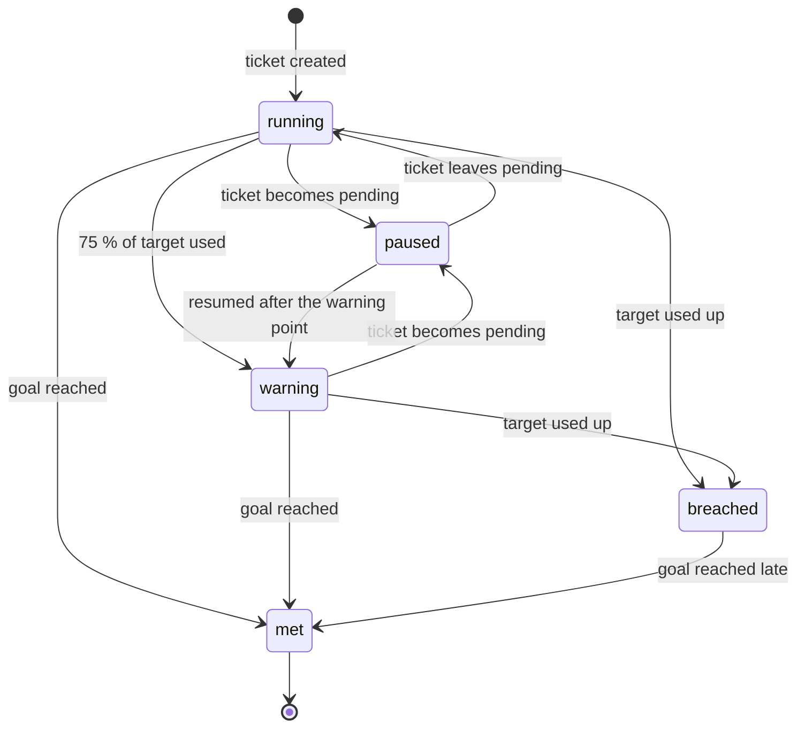

# SLA evaluation — Simple SLA Timer (academic baseline)

Contract: `SlaStrategy`. Baseline class: `App\Modules\Sla\Strategies\Baseline\SimpleSlaTimer`, with `TwentyFourSevenCalendar` and `WorkingHoursCalendar` behind the `BusinessCalendar` interface and time from the `Clock` interface. Replaceable after the defence ([ADR-0023](../adr/0023-minimal-replaceable-algorithms.md)); richer candidate: [future/sla-evaluation-advanced.md](future/sla-evaluation-advanced.md). Requirements FR-AUT-07..09. Data model: [sla.md](../04-domain/sla.md).

## Idea

Each ticket has two **timers**: time to the first public reply and time to resolution. A timer is a small **state machine** [Harel]: it starts when the ticket is created, stops (pauses) while the team is waiting for the customer, warns when 75 % of the allowed time is used, and is breached when the time runs out. Working hours are handled by a calendar that only counts open hours. Commercial helpdesks use the same two metrics and a pause-while-waiting rule [Zendesk, Jira, Zammad].

## States



Goal reached: the first public reply by an agent (first-response timer) or the ticket becoming resolved (resolution timer). A ticket closed as a duplicate cancels both timers.

## Rules

| Event | What the timer does |
|---|---|
| Ticket created | target from the SLA policy for the ticket's priority; `due = cal.add(now, target)`; `warn = cal.add(now, 0.75 × target)` |
| Ticket becomes pending | remember `paused_at` |
| Ticket leaves pending | `d = cal.elapsed(paused_at, now)`; `due = cal.add(due, d)`; `warn = cal.add(warn, d)`; add `d` to `paused_total` |
| Priority changes | new target; `due = cal.add(started_at, target + paused_total)`; `warn` likewise (always recomputed from the start) |
| Ticket reopened | a new resolution timer starts from now |
| Every minute | `running` and `now ≥ warn` → **warning** (notify the assignee); not met and `now ≥ due` → **breached** (notify the assignee and managers) — each at most once |

## Calendar

`TwentyFourSevenCalendar` adds and subtracts plain time. `WorkingHoursCalendar` knows the tenant's time zone, weekly working hours and holidays:

```text
function add(start, duration):
    t ← start; left ← duration
    while left > 0:
        if t is outside working hours or on a holiday: t ← next opening time; continue
        free ← time until today's closing
        if left ≤ free: return t + left
        left ← left − free; t ← next opening time
    return t
```

`elapsed(a, b)` sums the working time between `a` and `b` in the same day-by-day way.

## Algorithm (every minute)

```text
function check(now):
    for timer in timers where state in (running, warning) and (warn ≤ now or due ≤ now):
        lock timer
        if timer.state = running and now ≥ timer.warn and timer.warned_at is empty and now < timer.due:
            timer.state ← warning; timer.warned_at ← now; notify assignee
        if now ≥ timer.due and timer.breached_at is empty:
            timer.state ← breached; timer.breached_at ← now; notify assignee and managers
        record SLA event and ticket history
```

The query uses an index on `(state, due)` and `(state, warn)`, so each run reads only the timers that are due. The `warned_at` and `breached_at` checks make a repeated run harmless.

**Complexity:** constant time per event; each check is proportional to the number of timers that became due; the working-hours calendar walks one step per day crossed.

## Worked examples

Policy for P2: first response 60 min, resolution 8 h.

| # | Timeline (24×7 calendar) | Result |
|---|---|---|
| 1 | created 09:00; agent replies 09:40 | first response **met** at 09:40; resolution warns at 15:00, due 17:00 |
| 2 | as 1; pending 10:00–12:00 | resolution warns at 17:00, due **19:00** |
| 3 | created 09:00; no reply | first response **warning** 09:45, **breached** 10:00 (once each) |
| 4 | as 2; priority raised to P1 (resolution 4 h) at 13:00 | due = 09:00 + 4 h + 2 h paused = **15:00**, warning 14:00 |
| 5 | resolved 16:00; reopened 16:30 | new resolution timer from 16:30 |

Working-hours example: office hours Sunday–Friday 10:00–17:00 (Asia/Kathmandu), P3 resolution 8 h, ticket created Thursday 15:00 → 2 h on Thursday + 6 h on Friday → due **Friday 16:00**, warning after 6 h → **Friday 14:00**. A ticket created Friday 16:00 is due the next Sunday, because Saturday is closed.

## Tests

Each state transition and each illegal one; the five timelines and the working-hours cases (including a holiday inside the timer and a daylight-saving change for a zone that has one); repeated checks emit one warning and one breach; pause with several pending periods; closed-as-duplicate cancels; contract tests with a frozen clock.

## Evaluation (experiment E4)

Ten scripted timelines with hand-computed expectations; the report table lists expected and actual due times and states. Performance: one check over 10 000 running timers.

## Limitations and replacement

One pause rule for both timers; priority changes always recompute from the start; escalation only notifies; no "next reply" or periodic-update metrics. Replacement options: the advanced design with per-metric rules and recomputation modes, and escalation chains with timeouts ([future](future/README.md)).
