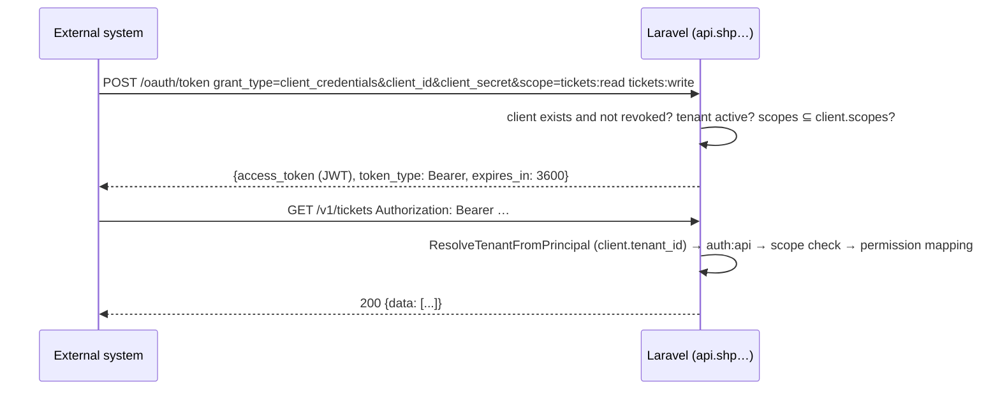

# API authentication

Decision: [ADR-0007](../adr/0007-authentication-and-oauth.md). Two guards on disjoint principals, one permission vocabulary. Security controls: [03-architecture/security.md](../03-architecture/security.md).

| Principal | Guard | Mechanism | Routes |
|---|---|---|---|
| Tenant user in the SPA | `auth:sanctum` | session cookie + CSRF | `/v1/*` |
| Tenant API client (integration) | `auth:api` (Passport) | bearer access token, `client_credentials` | `/v1/*` subset marked **C** in [conventions.md](conventions.md) |
| Platform super admin | `auth:platform` | host-only session cookie on `admin.{PLATFORM_DOMAIN}` | `/platform-api/*` |

Route groups use `auth:sanctum,api` (multi-guard) so one route definition serves both; `EnsureTenantMembership` runs afterwards for both principals.

## 1. SPA session flow (Sanctum)

Hosts per [ADR-0021](../adr/0021-host-layout-and-tenant-resolution.md): the SPA runs on `app.{PLATFORM_DOMAIN}` and calls `api.{PLATFORM_DOMAIN}` with credentials. Both hosts are same-site, so Sanctum's stateful mode works with `SESSION_DOMAIN=.{PLATFORM_DOMAIN}`, `SANCTUM_STATEFUL_DOMAINS=app.{PLATFORM_DOMAIN}` and CORS on `api` allowing that origin with `supports_credentials`. The workspace is chosen at login and stored in the session; it is never sent again.

```mermaid
sequenceDiagram
    participant SPA as SPA (app.shp…/acme)
    participant API as Laravel (api.shp…)
    SPA->>API: GET /sanctum/csrf-cookie
    API-->>SPA: Set-Cookie XSRF-TOKEN, shp_session (domain .shp…)
    SPA->>API: POST /v1/auth/login {workspace: "acme", email, password} + X-XSRF-TOKEN
    API->>API: find active tenant "acme" → initialise tenancy → find user by (tenant_id, email) → verify
    API->>API: regenerate session; session.tenant_id = acme
    API-->>SPA: 200 {data: {user, tenant, permissions}}
    SPA->>API: GET /v1/me (cookie)
    API->>API: ResolveTenantFromPrincipal (session.tenant_id) → auth:sanctum → EnsureTenantMembership
    API-->>SPA: 200 {data: {...}}
    SPA->>SPA: URL workspace == tenant.slug? else redirect to /{tenant.slug}
```

Rules:

- Login looks the user up **within the named workspace** (`users` unique on `(tenant_id, email)`); an unknown or suspended workspace and a wrong password return the same `401 invalid_credentials` (no workspace enumeration).
- `POST /v1/auth/workspaces/lookup {email}` (Should) emails the user the workspaces their address belongs to, so nobody has to remember a slug.
- Session cookie: `HttpOnly`, `Secure`, `SameSite=Lax`, lifetime 12 h idle, regenerated on login; session driver `database`; the session row stores `tenant_id`.
- A session whose user no longer matches `session.tenant_id` is destroyed (401).
- Failed logins: `429 rate_limited` after 5/min per workspace+email+IP; account lockout 15 min after 10 failures (`403 account_locked`).
- Logout: `POST /v1/auth/logout` invalidates the session and CSRF token (204).
- `GET /v1/me` returns `user`, `tenant` (slug, name, branding, settings subset, features), `permissions` (flat list), `unread_notifications`.

```bash
curl -c jar -b jar https://api.shp.localhost/sanctum/csrf-cookie -H 'Origin: https://app.shp.localhost'
curl -c jar -b jar -H 'Origin: https://app.shp.localhost' -H 'Referer: https://app.shp.localhost/' \
  -H "X-XSRF-TOKEN: $(grep XSRF jar | awk '{print $7}' | sed 's/%3D/=/g')" \
  -H 'Content-Type: application/json' -d '{"workspace":"acme","email":"priya@acme.test","password":"..."}' \
  https://api.shp.localhost/v1/auth/login
```

### As built (M1-08)

| Piece | Where |
|---|---|
| Endpoints | `POST /v1/auth/login`, `POST /v1/auth/invitations/{token}/accept`, `POST /v1/auth/password/forgot`, `POST /v1/auth/password/reset` (pre-authentication group), `POST /v1/auth/logout`, `GET /v1/me`, `PATCH /v1/me/preferences` (tenant group) |
| Controllers and actions | `App\Modules\Identity\Http\Controllers\{AuthController, MeController}` over `Actions\{AuthenticateUser, AcceptInvitation, SendPasswordResetLink, ResetUserPassword}` |
| Session rows | `App\Modules\Identity\Session\TenantAwareDatabaseSessionHandler` replaces the built-in database driver and writes `tenant_id` and `guard` |
| Throttling | `throttle:login` (5 a minute per workspace, address and client) plus `LoginThrottle` (10 failures lock the account for 15 minutes) |
| Audit | `user.logged_in`, `user.login_failed`, `user.logged_out`, `user.invitation_accepted`, `user.password_reset` |

Deviations:

- **Invitation and reset links carry a token only, not a Laravel signature.** The link points at the
  SPA, so the API would have to verify a signature for a URL it never issued. The token is 64 random
  characters, stored as a SHA-256 hash, single use, and expires (48 hours for invitations, 60 minutes
  for resets). The workspace in the link must still match the token's tenant.
- **Password resets do not use Laravel's password broker**, because the broker looks tokens up by
  email alone while ours are keyed by `(tenant_id, email)`.
- The lockout counter lives in the rate limiter rather than the cache, so per-tenant cache tagging
  cannot hide it from the next request.
- `GET /v1/me` returns an empty `permissions` list and `unread_notifications: 0` until M1-09 and M2.
- Roles named on an invitation are stored but not assigned yet (M1-09).
- Guests that do not ask for JSON are redirected to `https://app.<domain>/login`; `/v1/*` always
  answers with problem details.

## 2. Invitation and password reset

Both use Laravel signed URLs that point at the **SPA** route, which posts the token back to the API.

| Flow | Endpoint | Token | Expiry |
|---|---|---|---|
| Invitation | `POST /v1/auth/invitations/{token}/accept` `{password, password_confirmation, name?}` | random 64-char token stored hashed in `invitations`; URL `https://app.shp…/acme/accept-invitation?token=…&signature=…` | 48 h, single use |
| Forgot | `POST /v1/auth/password/forgot` `{email}` | always 200 (no user enumeration); token in `password_reset_tokens` (hashed) | 60 min |
| Reset | `POST /v1/auth/password/reset` `{token, email, password, password_confirmation}` | | single use; all other sessions invalidated |

Invitation and reset tokens are stored with `tenant_id`; the API initialises the tenant from the token row, and the workspace in the link must match it.

## 3. API clients (Passport client credentials)



- Clients are created in Settings → Developer (`POST /v1/api-clients` with `name`, `scopes[]`); the secret is shown once and stored hashed by Passport.
- `oauth_clients` carries `tenant_id`; every request made with the token runs in that tenant only. There is no request parameter that can select another tenant, so a leaked secret exposes exactly one tenant's granted scopes until it is revoked.
- Access tokens: 60 minutes, no refresh tokens (re-request). Revocation: `POST /v1/api-clients/{client}/revoke` marks the client revoked; Passport's `CheckClientCredentials` rejects tokens of revoked clients on every request (no grace period).
- Token requests are rate limited 10/min per client id; API calls 120/min per client.
- Actor recorded in audit and history as `api_client:{id}`; `created_via = api` on tickets.

### Scopes → permissions

| Scope | Grants permissions | Typical use |
|---|---|---|
| `tickets:read` | `tickets.view` | polling ticket state |
| `tickets:write` | `tickets.create`, `tickets.update`, `tickets.resolve`, `tickets.close` | monitoring tools creating tickets |
| `contacts:read` | `contacts.view` | |
| `contacts:write` | `contacts.manage` | CRM sync |
| `catalog:read` | `agents.view` (read-only agents, teams, categories, tags, SLA policies) | populating pickers |
| `webhooks:manage` | `integrations.manage` (webhook routes only) | self-service subscriptions |

Scopes never grant `tickets.assign`, `comments.internal`, settings, users, roles or audit access. The mapping is a static array in `Integrations\Domain\ScopeMap` and is unit-tested against the permission catalogue.

```bash
curl -X POST https://api.shp.localhost/oauth/token \
  -d grant_type=client_credentials -d client_id=$ID -d client_secret=$SECRET -d 'scope=tickets:write contacts:read'
curl -H "Authorization: Bearer $TOKEN" -H 'Idempotency-Key: 2b7e…' -H 'Content-Type: application/json' \
  -d '{"title":"Disk full on db-01","description":"...","contact":{"email":"ops@globex.test","create":true},"category_id":"019…","impact":3,"urgency":4}' \
  https://api.shp.localhost/v1/tickets
```

### As built (M3-04)

**Variant: Passport 13.8 client credentials** (not the Sanctum fallback of §5). Passport supplies the
authorization server (JWT signing, hashed secrets, token rows) and the resource server (JWT
validation); everything tenant- or permission-shaped is ours, which is what made it fit inside the
time box:

| Piece | Where |
|---|---|
| Client and token models | `Integrations\Models\ApiClient` (extends Passport's `Client`, is the principal: `Authenticatable`, `Authorizable`, `BelongsToTenant`), `Integrations\Models\AccessToken` (copies `tenant_id` from the client when the token row is written) |
| Tables | `oauth_clients`, `oauth_access_tokens` (credential tables: `tenant_id` NOT NULL with a foreign key, composite `(tenant_id, client_id)` key, immutable `tenant_id`, no row-level security because the token endpoint and the resolver read them before tenancy), `idempotency_keys` (primary tenant table). Passport's auth-code, refresh-token and device-code tables are not created. `tickets.created_by_client_id` now references `oauth_clients` |
| Token endpoint | `POST /oauth/token` on the api host, `Integrations\Http\Controllers\AccessTokenController`; Passport's own routes are off (`Passport::ignoreRoutes()`), `passport:install` is never run and no default clients exist |
| Scope rules at the endpoint | `OAuth\ClientScopeRepository`: an unknown scope, `*`, or a scope the client was not granted is `400 invalid_scope` (Passport would silently drop it); no `scope` parameter means all of the client's scopes |
| Client lookup | `OAuth\TenantClientRepository`: no per-process memoisation (a revocation is seen by the next request), and a client of a suspended workspace is inactive |
| Guard | `api` → `Integrations\Auth\ApiClientGuard` (driver `api-client`). Passport's `TokenGuard` returns no principal for client-credentials tokens, so it cannot drive `auth:` or `can:`. Ours validates the JWT with Passport's resource server (signature, expiry, token row not revoked), then loads the client **inside the resolved tenant** and not revoked; it attaches the token's scopes and touches `last_used_at` at most every 5 minutes |
| Permissions | `Gate::before` in `IntegrationsServiceProvider`: for an `ApiClient` every ability is answered by `ScopeMap::permissionsFor(token scopes ∩ client scopes)`, so roles and policies never widen a client |
| Route opt-in | `RestrictApiClients` (tenant group, after membership) refuses a client on any route without the `api-clients` middleware (403 `forbidden`). This keeps `webhooks:manage` (`integrations.manage`) away from `/v1/api-clients` and keeps clients off user-level routes such as `/v1/me` |
| Tenant resolution | `TenantResolver::bearerTenantId()` reads the unverified JWT `jti`, looks up `oauth_access_tokens.tenant_id` and initialises that tenant; the guard then verifies the token and finds the client only in that tenant |
| Throttles | `throttle:oauth-token` 10/min per `client_id` (per address when absent); `throttle:api-clients` in the tenant group, 120/min per client (`rl:{tenant}:client:{id}`), no limit for SPA users |
| Actor | Audit `actor_type = api_client`, `actor_id = client id` (`RecordAuditLog`); change capture `app.actor_type = api_client` (`RlsTenancyBootstrapper`, refreshed by `EnsureTenantMembership` after authentication for every principal); `ticket_events.actor_type = client` (the column is eight characters); tickets get `created_via = api` and `created_by_client_id` |
| Management API | `GET /v1/api-clients`, `GET /v1/api-clients/scopes`, `POST /v1/api-clients` (201 with `client_id` and `client_secret`, the secret shown once and stored as a bcrypt hash), `POST /v1/api-clients/{client}/revoke` (sets `revoked`, `revoked_at`, revokes all tokens; idempotent). Permission `integrations.manage`; SPA only |
| Audit | `api_client.created` (name, scopes), `api_client.revoked` |
| Idempotency | `idempotent` middleware on `POST /v1/tickets` and `POST /v1/contacts` ([conventions.md](conventions.md) §Headers) |
| Keys | `php artisan passport:keys` writes `storage/oauth-private.key` (0600) and `oauth-public.key` (0660), git-ignored; `infra/scripts/setup.sh` runs it once. Production may pass `PASSPORT_PRIVATE_KEY`/`PASSPORT_PUBLIC_KEY` instead. Tests generate a throwaway pair in the temp directory (`tests/Support/PassportTestKeys.php`) |
| SPA | Settings → API clients (`features/integrations`): list, create with scope checkboxes, secret and client id shown once with copy buttons, revoke through `ConfirmDialog` |

Deviations:

- **Clients open to a subset of the C routes.** Reading tickets, creating tickets, history, public
  comments, categories, tags, contacts and organisations work; editing, transitions, comments and
  media stay SPA-only until those actions accept a client actor (MVP-SHORTCUT in
  `Tickets/Routes/api.php`).
- **Rejected bearer tokens answer `401 unauthenticated`**, not `invalid_client`; `invalid_client`
  is the token endpoint's code.
- **A token of workspace A never reaches workspace B.** The tenant comes from the token itself, so
  the only way to pair them is a request that also carries B's session; the guard then finds no
  such client in B and answers 401.

Live check against the running stack (2026-09-21, dev stack, workspace `acme`):

```bash
# 1. Create a client (or use Settings → API clients) and keep the secret it prints once.
docker compose exec -T app php artisan tinker --execute='
  echo json_encode(App\Modules\Tenancy\Models\Tenant::findBySlug("acme")->run(function () {
    $c = app(App\Modules\Integrations\Actions\CreateApiClient::class)("Monitoring", ["tickets:read", "tickets:write"], null);
    return ["id" => $c->id, "secret" => $c->plainSecret];
  }));'

# 2. Token (client credentials).
curl -s -X POST https://api.shp.localhost/oauth/token \
  -d grant_type=client_credentials -d client_id=$ID -d client_secret=$SECRET -d 'scope=tickets:read tickets:write'
# → {"token_type":"Bearer","expires_in":3600,"access_token":"eyJ0eXAiOiJKV1Qi…"}

# 3. Create a ticket; repeat with the same key to see the replay.
curl -s -H "Authorization: Bearer $TOKEN" -H 'Idempotency-Key: live-check-1' \
  -H 'Content-Type: application/json' -H 'Accept: application/json' \
  -d '{"title":"Disk full on db-01","description":"…","contact_id":"'$CONTACT'","category_id":"'$CATEGORY'","impact":3,"urgency":4}' \
  https://api.shp.localhost/v1/tickets
# → 201, data.created_via = "api"; the repeat → 201 with `idempotent-replayed: true`, no second ticket
# entity_changes for the ticket insert: actor_type = api_client, actor_id = the client id

# 4. Routes not open to clients, a wrong secret, and revocation.
curl -s -H "Authorization: Bearer $TOKEN" https://api.shp.localhost/v1/me          # → 403 forbidden
curl -s -X POST https://api.shp.localhost/oauth/token -d grant_type=client_credentials \
  -d client_id=$ID -d client_secret=wrong                                           # → 401 invalid_client
# after POST /v1/api-clients/$ID/revoke (or RevokeApiClient): the same token → 401 unauthenticated
```

## 4. Middleware order (tenant-api group)

`ResolveTenantFromPrincipal` → `EnsureTenantActive` → `auth:sanctum,api` → `EnsureTenantMembership` → `SetPermissionsTeam` → `SubstituteBindings` → `throttle:{group}` → `can:` (per route) → controller.

`EnsureTenantMembership`: for a user principal, `user.tenant_id === tenant.id` else 401; for a client principal, `client.tenant_id === tenant.id` else 401; platform sessions use a different cookie on the `admin` host and are never accepted on `api`.

As built (M3-04) the `tenant` group is `ResolveTenantFromPrincipal` → `EnsureTenantActive` → `auth:sanctum,api` → `EnsureTenantMembership` (also refreshes the change-capture actor) → `RestrictApiClients` → `throttle:api-clients`; `SetPermissionsTeam` is done by the tenancy bootstrapper, and `can:` runs per route after the bindings.

## 5. Fallback plan (Sanctum tokens)

Not taken: Passport fitted within the M3-04 time box (§3 As built). The plan is kept for reference.

If Passport integration exceeds its one-day box in milestone 3: `ApiClient` model with `HasApiTokens`; `POST /v1/api-clients` returns a plain token once; abilities use the same scope names; `auth:sanctum` accepts the token; `tokenCan('tickets:write')` replaces the scope middleware. `/oauth/token` does not exist in that variant; the developer docs describe a static bearer token. The REST contract, scopes and audit actor are unchanged, so integrations written against either variant behave the same except for token acquisition.

## 6. Platform admins

Separate `platform_users` table and `platform` guard (session, host-only cookie `shp_platform_session` on `admin.{PLATFORM_DOMAIN}`), platform API same-origin at `/platform-api/*`, same login/CSRF mechanics, no tenancy initialised. MFA is V1.

## 7. Errors

`401 unauthenticated`, `401 invalid_client`, `400 invalid_scope`, `400 unsupported_grant_type`, `403 forbidden`, `403 tenant_suspended`, `403 account_locked`, `422 idempotency_key_reused`, `429 rate_limited` — see [errors.md](errors.md). Token-endpoint errors are problem details that also carry the RFC 6749 members `error` and `error_description`.
