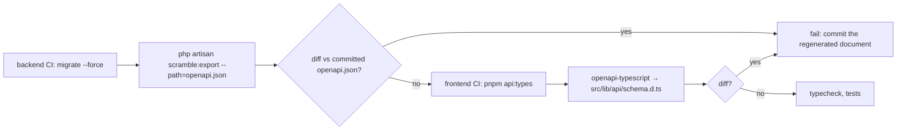

# API documentation pipeline

Decision: [ADR-0010](../adr/0010-api-documentation.md). Generator: `dedoc/scramble` `0.13.*`. As built in M1-13.

## Setup

```php
// backend/config/scramble.php (excerpt)
'api_path' => ['include' => 'v1', 'exclude' => ['v1/health']],  // /v1/health is an operator endpoint
'api_domain' => null,                    // routes are host-agnostic in dev and in single-host mode
'export_path' => 'openapi.json',         // backend/openapi.json, committed
'info' => ['version' => env('API_VERSION', '1.0.0'), 'description' => '…auth, errors, tenancy…'],
'ui' => ['title' => 'Smart Helpdesk API'],
'renderers' => ['elements' => ['theme' => 'system', 'tryItCredentialsPolicy' => 'include', …]],
'servers' => null,                       // set in the transformer from helpdesk.hosts.api
'middleware' => ['web', RestrictedDocsAccess::class],
```

`backend/app/Providers/ApiDocsServiceProvider.php` (registered in `bootstrap/providers.php`) holds everything that is not a plain value:

```php
Gate::define('viewApiDocs', fn (?Authenticatable $user = null) => true);   // public reference, guests included

Scramble::configure()->withDocumentTransformers(function (OpenApi $openApi) {
    $openApi->servers = [Server::make('https://'.config('helpdesk.hosts.api').'/v1')];
    $openApi->secure(SecurityScheme::apiKey('cookie', config('session.cookie'))->as('session'));
    $openApi->secure(SecurityScheme::http('bearer')->as('bearer'));   // API clients (placeholder until OAuth, M3)
    $problem = $openApi->components->addSchema('ProblemDetails', …);  // RFC 9457, shared by every operation
    // every 4xx/5xx response is rewritten to application/problem+json, plus a `default` error response
});
```

Because the server carries the `/v1` prefix, document paths are relative (`/ping`), which is what the typed client and MSW handlers use.

Routes: `GET /docs/api` (UI, Stoplight Elements with the document inlined), `GET /docs/api.json` (document). The platform API (`/platform-api`) is excluded from the public document because `api_path` only includes `v1`.

## Docs host

Caddy maps the docs host onto those two routes ([frontend/docker/Caddyfile](../09-infrastructure/docker.md), site block `docs.{$PLATFORM_DOMAIN}`):

| Public URL | App route |
|---|---|
| `https://docs.<domain>/` | `/docs/api` (UI) |
| `https://docs.<domain>/openapi.json` | `/docs/api.json` (document) |
| single-host mode: `https://<domain>/docs/api`, `/docs/api.json` | passed through unchanged |

The `viewApiDocs` gate allows guests, so the reference is readable without a login; it describes the API only and contains no tenant data. Problem-detail `type` URIs (`https://docs.<domain>/errors/<code>`) resolve to the same host; the per-code error pages are a V1 item.

## Conventions that keep inference accurate

| Do | Why |
|---|---|
| Return `JsonResource`/`ResourceCollection` instances (or `->response()->setStatusCode(201)`) from controllers, with typed `toArray()` keys | Scramble reads resource classes and model casts to type fields |
| Declare `@mixin Ticket` on `TicketResource` and keep resource ↔ model naming conventional | model resolution drives attribute types; unresolved models become `string`, and a resource without a model warns (`JR001`) |
| Use FormRequests with array rules (no closures for shape-defining rules) | rules → request schema |
| Type controller parameters (`Ticket $ticket`) and return types | path params and responses |
| Throw exceptions with literal status codes; use `abort(404)` not `abort($code)` | literal codes are documented |
| Put enums in backed PHP enums used in casts and `Rule::enum()` | enum values appear in the schema |
| List relations in `$with` only when always loaded; for `include`-driven relations use `whenLoaded` and document with `#[QueryParameter('include', ...)]` | avoids documenting optional relations as always present |
| Keep problem-details examples in a shared `#[Response]` attribute set | consistent error documentation |
| Migrate before generating | Scramble introspects columns |

## Per-route overrides

```php
/**
 * Transition a ticket.
 *
 * Moves the ticket through its state machine. Allowed targets depend on the current status.
 *
 * @response 422 array{code: 'invalid_transition', meta: array{allowed: string[]}}
 */
#[Group('Tickets')]
#[Response(status: 200, type: TicketResource::class)]
public function transition(TransitionTicketRequest $request, Ticket $ticket, TransitionTicket $action): TicketResource
```

Overrides are used only where inference is wrong or where a description adds value; a CI lint counts routes without a summary.

## Pipeline



Commands:

| Command | What it does |
|---|---|
| `just api-docs` (alias `just types`) | `scramble:export --path=openapi.json` in the `app` container, then `pnpm -C frontend api:types` |
| `just api-drift` / `infra/scripts/api-drift.sh` | regenerates both files and fails when `git diff` shows a change; prints a note instead for a file that is not committed yet (CI runs the same script) |
| `pnpm -C frontend api:types` | `openapi-typescript` (through `pnpm dlx` with TypeScript 5.9.3) → `src/lib/api/schema.d.ts` |

The committed `backend/openapi.json` and `frontend/src/lib/api/schema.d.ts` make every contract change a reviewable diff: adding a field to a `JsonResource` changes both files, so a stale client cannot reach `main`.

## Typed client

`frontend/src/lib/api/` consumes the document ([03-architecture/frontend.md](../03-architecture/frontend.md)):

| File | Contents |
|---|---|
| `schema.d.ts` | generated; never edited |
| `client.ts` | `openapi-fetch` client: base URL `${config.apiBaseUrl}/v1` from `/config.json`, `credentials: 'include'`, `Accept: application/json`, `X-XSRF-TOKEN` from the `XSRF-TOKEN` cookie on unsafe methods; `unwrap()` returns the `{data}` payload and throws `ApiError` |
| `errors.ts` | `ApiError` (`status`, `code`, `title`, `detail`, `requestId`, `fieldErrors`, `meta`) and the Zod parser for problem details; a failed request without a response becomes `code: 'network'`, a non-problem body `code: 'unexpected_response'` |
| `query-keys.ts` | TanStack Query key factory, one entry per domain |

`frontend/src/test/msw/` mirrors it for tests: `handlers.ts` types handler bodies from the generated `paths` (so a removed endpoint breaks `pnpm typecheck`) and builds problem-details responses; `node.ts` exposes `setupMswServer()` for Node unit tests.

## Publishing

- MVP: the reference is public at `https://docs.shp.subhambhandari.com.np` (Caddy rewrites `/` to the app's `/docs/api` route and `/openapi.json` to `/docs/api.json`); it describes the API only and contains no tenant data.
- The exported `openapi.json` is attached to each release; a static copy of the UI can be published under `docs/api/` on the documentation site when one exists.
- Webhook receiver guidance and the authentication guide ([authentication.md](authentication.md), [webhooks.md](webhooks.md)) are linked from the document's `info.description`.
- V1: per-tenant "public docs" toggle, SDK generation from the same document.
