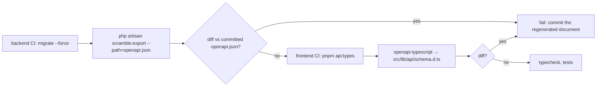

# API documentation pipeline

Decision: [ADR-0010](../adr/0010-api-documentation.md). Generator: `dedoc/scramble` `0.13.*`. As built in M1-13; access, overrides and coverage test in M3-06 (§As built (M3-06)).

## Setup

```php
// backend/config/scramble.php (excerpt)
'api_path' => ['include' => 'v1', 'exclude' => ['v1/health']],  // /v1/health is an operator endpoint
'api_domain' => null,                    // routes are host-agnostic in dev and in single-host mode
'export_path' => 'openapi.json',         // backend/openapi.json, committed
'info' => ['version' => env('API_VERSION', '1.0.0'), 'description' => '…auth, errors, tenancy…'],
'ui' => ['title' => 'Smart Helpdesk API'],
'renderers' => ['elements' => ['theme' => 'system', 'tryItCredentialsPolicy' => 'include', …]],
'servers' => null,                       // set in the transformer from helpdesk.hosts.api
'middleware' => ['web', RestrictedDocsAccess::class],  // unused: Scramble's routes are off (§Access)
'extensions' => [RedirectResponseToSchema::class],    // redirects → 302 + Location
```

`backend/app/Providers/ApiDocsServiceProvider.php` (registered in `bootstrap/providers.php`) holds everything that is not a plain value:

```php
Gate::define('viewApiDocs', fn (?Authenticatable $user = null) => $user instanceof PlatformUser
    || ($user instanceof User && $user->can('integrations.manage')));
Scramble::configure()->expose(false);                      // our routes replace Scramble's (§Access)

Scramble::configure()
    ->withOperationTransformers(OperationConventions::class)   // per-route security, permission, free-form bodies
    ->withDocumentTransformers(function (OpenApi $openApi) {
        $openApi->servers = [Server::make('https://'.config('helpdesk.hosts.api').'/v1')];
        $openApi->secure(SecurityScheme::apiKey('cookie', config('session.cookie'))->as('session'));
        $openApi->secure(SecurityScheme::oauth2()->flow('clientCredentials', …)->as('oauth2'));  // scopes from ScopeMap
        $problem = $openApi->components->addSchema('ProblemDetails', …);  // RFC 9457, with an example
        // shared error responses (validation, authorization, not found) and every inline 4xx/5xx become
        // application/problem+json; authenticated operations get a 401; every operation a `default` error
        $openApi->addPath(/* POST /oauth/token with its own server, outside /v1 */);
        // resource schemas: class summary → description; top-level `*_at` → date-time, `id`/`*_id` → uuid
    });
```

Because the server carries the `/v1` prefix, document paths are relative (`/ping`), which is what the typed client and MSW handlers use.

Routes (`App\Support\Http\Controllers\ApiDocsController`, Stoplight Elements with the document inlined):

| Route | Who | Where |
|---|---|---|
| `GET /docs/api`, `GET /docs/api.json` | workspace users with `integrations.manage` (session cookie; tenant from the session as on the API) | docs host (`routes/web.php`) |
| `GET /platform-api/docs`, `GET /platform-api/docs/openapi.json` | Platform Super Admins (`auth:platform`) | admin host (`Platform/Routes/platform.php`) |

The platform API (`/platform-api`) is excluded from the document because `api_path` only includes `v1`.

## Docs host

Caddy maps the docs host onto those two routes ([frontend/docker/Caddyfile](../09-infrastructure/docker.md), site block `docs.{$PLATFORM_DOMAIN}`):

| Public URL | App route |
|---|---|
| `https://docs.<domain>/` | `/docs/api` (UI) |
| `https://docs.<domain>/openapi.json` | `/docs/api.json` (document) |
| single-host mode: `https://<domain>/docs/api`, `/docs/api.json` | passed through unchanged |

## Access

As built in M3-06: the `viewApiDocs` gate allows workspace users holding `integrations.manage` (owners, admins, developers) and Platform Super Admins. The workspace session cookie is set for the whole platform domain, so it reaches the docs host and the tenant resolves from the session exactly as on the API (`ResolveTenantFromPrincipal`, `EnsureTenantActive`, `auth:web`, `EnsureTenantMembership`, `can:viewApiDocs`). A guest is redirected to the SPA sign-in; a signed-in user without the permission gets 403. The platform cookie is host-only on the admin host and never reaches the docs host, so Platform Super Admins read the same document under `/platform-api/docs` there; the admin host already proxies `/platform-api/*`, so no Caddy change was needed.

Entry points (M5-01): users with `integrations.manage` reach the reference from the sidebar (*Developers → API reference*), from the API clients and webhooks settings pages and from the command palette; each opens `docsUrl` from `config.json` in a new tab.

Problem-detail `type` URIs (`https://docs.<domain>/errors/<code>`) resolve to the docs host; the per-code error pages are a V1 item (today they answer like the reference itself).

## Conventions that keep inference accurate

| Do | Why |
|---|---|
| Return `JsonResource`/`ResourceCollection` instances (or `->response()->setStatusCode(201)`) from controllers, with typed `toArray()` keys | Scramble reads resource classes and model casts to type fields |
| Declare `@mixin Ticket` on `TicketResource` and keep resource ↔ model naming conventional | model resolution drives attribute types; unresolved models become `string`, and a resource without a model warns (`JR001`) |
| Use FormRequests with array rules (no closures for shape-defining rules) | rules → request schema |
| Type controller parameters (`Ticket $ticket`) and return types | path params and responses |
| Throw exceptions with literal status codes; use `abort(404)` not `abort($code)` | literal codes are documented |
| Put enums in backed PHP enums used in casts and `Rule::enum()` | enum values appear in the schema |
| List relations in `$with` only when always loaded; for `include`-driven relations use `whenLoaded` and document with `#[QueryParameter('include', ...)]` | avoids documenting optional relations as always present |
| Keep problem-details examples in a shared `#[Response]` attribute set | consistent error documentation |
| Migrate before generating | Scramble introspects columns |

## Per-route overrides

```php
/**
 * Transition a ticket.
 *
 * Moves the ticket through its state machine. Allowed targets depend on the current status.
 *
 * @response 422 array{code: 'invalid_transition', meta: array{allowed: string[]}}
 */
#[Group('Tickets')]
#[Response(status: 200, type: TicketResource::class)]
public function transition(TransitionTicketRequest $request, Ticket $ticket, TransitionTicket $action): TicketResource
```

Overrides are used only where inference is wrong or where a description adds value. The coverage test (`tests/Feature/System/ApiDocumentTest.php`) fails on an operation without a summary.

## Pipeline



Commands:

| Command | What it does |
|---|---|
| `just api-docs` (alias `just types`) | `scramble:export --path=openapi.json` in the `app` container, then `pnpm -C frontend api:types` |
| `just api-drift` / `infra/scripts/api-drift.sh` | regenerates both files and fails when `git diff` shows a change; prints a note instead for a file that is not committed yet (CI runs the same script) |
| `pnpm -C frontend api:types` | `openapi-typescript` (through `pnpm dlx` with TypeScript 5.9.3) → `src/lib/api/schema.d.ts` |

The committed `backend/openapi.json` and `frontend/src/lib/api/schema.d.ts` make every contract change a reviewable diff: adding a field to a `JsonResource` changes both files, so a stale client cannot reach `main`.

## Typed client

`frontend/src/lib/api/` consumes the document ([03-architecture/frontend.md](../03-architecture/frontend.md)):

| File | Contents |
|---|---|
| `schema.d.ts` | generated; never edited |
| `client.ts` | `openapi-fetch` client: base URL `${config.apiBaseUrl}/v1` from `/config.json`, `credentials: 'include'`, `Accept: application/json`, `X-XSRF-TOKEN` from the `XSRF-TOKEN` cookie on unsafe methods; `unwrap()` returns the `{data}` payload and throws `ApiError` |
| `errors.ts` | `ApiError` (`status`, `code`, `title`, `detail`, `requestId`, `fieldErrors`, `meta`) and the Zod parser for problem details; a failed request without a response becomes `code: 'network'`, a non-problem body `code: 'unexpected_response'` |
| `query-keys.ts` | TanStack Query key factory, one entry per domain |

`frontend/src/test/msw/` mirrors it for tests: `handlers.ts` types handler bodies from the generated `paths` (so a removed endpoint breaks `pnpm typecheck`) and builds problem-details responses; `node.ts` exposes `setupMswServer()` for Node unit tests.

## Publishing

- MVP: the reference is at `https://docs.shp.subhambhandari.com.np` (Caddy rewrites `/` to the app's `/docs/api` route and `/openapi.json` to `/docs/api.json`) for workspace users with `integrations.manage`, and at `https://admin.shp.subhambhandari.com.np/platform-api/docs` for Platform Super Admins (§Access).
- CI: the backend workflow exports the document after the migration round trip, fails when it differs from the committed file, and uploads it as the `openapi` artifact of every run; the frontend workflow regenerates `schema.d.ts` and fails on drift. The same checks run locally with `just api-drift`.
- Changes per release: [CHANGELOG.md](CHANGELOG.md) (1.0.0 lists the MVP surface grouped as in the reference).
- Webhook receiver guidance and the authentication guide ([authentication.md](authentication.md), [webhooks.md](webhooks.md)) are linked from the document's `info.description`.
- V1: per-tenant "public docs" toggle, SDK generation from the same document.

## As built (M3-06)

| Piece | Where | What it fixes |
|---|---|---|
| Access | `viewApiDocs` gate in `ApiDocsServiceProvider`, `ApiDocsController`, routes in `routes/web.php` and `Platform/Routes/platform.php` | the reference was public; now `integrations.manage` or Platform Super Admin (§Access) |
| Per-route access | `App\Support\ApiDocs\OperationConventions` (operation transformer) | Scramble cannot see the `tenant` group or `api-clients`: every authenticated operation now has `security: [session]`, and those open to API clients also `oauth2` with the scopes that grant the route's `can:` permission (`ScopeMap`); the description names the permission and says "SPA session only" or which scope opens it |
| 401 | document transformer | added to every authenticated operation (component response `Unauthenticated`) |
| Problem details everywhere | document transformer | Scramble's shared responses (`ValidationException`, `AuthorizationException`, `ModelNotFoundException`) still carried Laravel's `{message, errors}`; they are rewritten to `ProblemDetails` like the inline ones |
| Token endpoint | document transformer | `POST /oauth/token` (Passport PSR-7, not inferable) is documented by hand: form body, token response, 400/401/429 problems, its own server outside `/v1` |
| Redirects | `App\Support\ApiDocs\RedirectResponseToSchema` (`extensions`) | media download and variant were `200 {}`; now `302` with a `Location` header |
| Free-form bodies | `#[FreeFormRequestBody]` on `SettingsController::update` | `PATCH /settings/{section}` had no request body |
| 204 bodies | `response()->noContent()` in logout, role and tag delete | `new JsonResponse(status: 204)` documented a `[]` body |
| Typing at the source | `@var` / docblocks in resources, a `#[Response]` type on `GET /permissions`, `list` + `.*.*` rules in `SaveCalendarRequest` | untyped `strategy`, `shared_words`, `parts`, `variants_skipped`; tuple rows documented as objects with numeric keys; permission lists without items |
| Descriptions and examples | class summaries on every resource (copied into the schema by the transformer), field docs and `@example` on tickets, contacts, comments, notifications; summaries on every operation (147) | the reference read as bare field lists |
| Coverage test | `tests/Feature/System/ApiDocumentTest.php` | generates the document in-process and asserts: every router route under `v1` (except `v1/health`) and `oauth/token` is in it with a 2xx/3xx response schema, and a request body when the action takes a FormRequest; no resource schema is a string, empty or has an untyped property or item; no response is a bare string or `{}`; every error is problem details and every body-taking operation has a 422; access markers on sample routes; the four access cases (owner, agent, guest, platform admin) |

Remaining weak spots: `priority_explanation`, assignment `explanation`, `metadata`, `external_ids`, settings `values`/`defaults`, history `old`/`new` and report `parameters` stay free-form objects (their keys depend on the strategy, section or record); webhook `events` and API-client `scopes` are `string[]` rather than the enum (the resources declare `@return` shapes with strings); `TicketResource` responses that load relations are an `allOf` of the schema and a `required` list (Scramble's `whenLoaded` handling); SLA and calendar routes have no route names, so their operation ids are Scramble's (`calendar.index`, `slaPolicy.store`).
