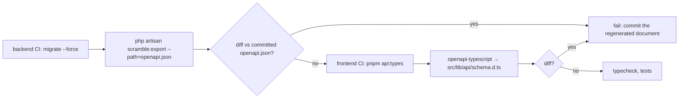

# API documentation pipeline

Decision: [ADR-0010](../adr/0010-api-documentation.md). Generator: `dedoc/scramble` `0.13.*`.

## Setup

```php
// config/scramble.php (excerpt)
'api_path' => 'v1',
'api_domain' => env('API_HOST'),       // api.shp.subhambhandari.com.np
'info' => ['version' => '1.0.0', 'description' => 'Smart Helpdesk REST API'],
'ui' => ['title' => 'Smart Helpdesk API', 'theme' => 'system'],
'servers' => ['Production' => 'https://api.shp.subhambhandari.com.np'],
'middleware' => ['web'],              // public reference on docs.shp…; no tenant data is exposed
```

```php
// AppServiceProvider::boot
Scramble::configure()
    ->withDocumentTransformers(function (OpenApi $openApi) {
        $openApi->secure(SecurityScheme::oauth2()->flow('clientCredentials', fn (OAuthFlow $f) => $f
            ->tokenUrl('/oauth/token')
            ->scopes(ScopeMap::descriptions())));
        $openApi->secure(SecurityScheme::apiKey('cookie', 'helpdesk_session'));
    })
    ->routes(fn (Route $route) => Str::startsWith($route->uri, 'api/v1'));
Gate::define('viewApiDocs', fn (User $user) => true);   // any authenticated tenant user
```

Routes: `GET /docs/api` (UI), `GET /docs/api.json` (document). The platform API (`/platform-api`) is excluded from the public document.

## Conventions that keep inference accurate

| Do | Why |
|---|---|
| Return `JsonResource`/`ResourceCollection` instances (or `->response()->setStatusCode(201)`) from controllers, with typed `toArray()` keys | Scramble reads resource classes and model casts to type fields |
| Declare `@mixin Ticket` on `TicketResource` and keep resource ↔ model naming conventional | model resolution drives attribute types; unresolved models become `string` |
| Use FormRequests with array rules (no closures for shape-defining rules) | rules → request schema |
| Type controller parameters (`Ticket $ticket`) and return types | path params and responses |
| Throw exceptions with literal status codes; use `abort(404)` not `abort($code)` | literal codes are documented |
| Put enums in backed PHP enums used in casts and `Rule::enum()` | enum values appear in the schema |
| List relations in `$with` only when always loaded; for `include`-driven relations use `whenLoaded` and document with `#[QueryParameter('include', ...)]` | avoids documenting optional relations as always present |
| Keep problem-details examples in a shared `#[Response]` attribute set | consistent error documentation |
| Migrate before generating | Scramble introspects columns |

## Per-route overrides

```php
/**
 * Transition a ticket.
 *
 * Moves the ticket through its state machine. Allowed targets depend on the current status.
 *
 * @response 422 array{code: 'invalid_transition', meta: array{allowed: string[]}}
 */
#[Group('Tickets')]
#[Response(status: 200, type: TicketResource::class)]
public function transition(TransitionTicketRequest $request, Ticket $ticket, TransitionTicket $action): TicketResource
```

Overrides are used only where inference is wrong or where a description adds value; a CI lint counts routes without a summary.

## Pipeline



Local: `just api-docs` runs the export and the type generation together. The committed `backend/openapi.json` and `frontend/src/lib/api/schema.d.ts` make every contract change a reviewable diff.

## Publishing

- MVP: the reference is public at `https://docs.shp.subhambhandari.com.np` (Caddy rewrites to the app's `/docs` route); it describes the API only and contains no tenant data.
- The exported `openapi.json` is attached to each release; a static copy of the UI can be published under `docs/api/` on the documentation site when one exists.
- Webhook receiver guidance and the authentication guide ([authentication.md](authentication.md), [webhooks.md](webhooks.md)) are linked from the document's `info.description`.
- V1: per-tenant "public docs" toggle, SDK generation from the same document.
