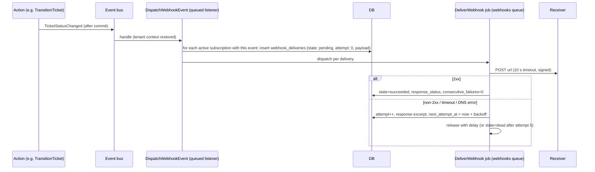

# Webhooks

Outbound HTTP notifications for tenant integrations. Domain model: [04-domain/integrations.md](../04-domain/integrations.md). Module: `Integrations` (`WebhookSubscription`, `WebhookDelivery`, `DispatchWebhookEvent` listener, `DeliverWebhook` job, `WebhookSigner`).

## Subscription model

| Field | Notes |
|---|---|
| `id`, `tenant_id` | UUID v7; tenant-scoped |
| `name`, `url` | `https://` only in production (`http://` allowed for `webhook-echo` in dev/demo profiles) |
| `events[]` | subset of the catalogue; `*` not allowed (explicit list) |
| `secret` | 32 random bytes, base64; shown once; stored with the `encrypted` cast; rotatable (`/rotate-secret` keeps the old secret valid for 24 h, sending both signatures) |
| `api_version` | `v1` |
| `is_active`, `disabled_at`, `disabled_reason` | manual disable or auto-disable |
| `consecutive_failures` | reset on any success |
| `headers` | optional static headers (e.g. `Authorization`) stored encrypted, max 5 |

Managed via `/v1/webhooks` ([conventions.md](conventions.md)); creating, editing, disabling and rotating are audited.

## Event catalogue (v1)

| Event | Emitted when | `data` |
|---|---|---|
| `ticket.created` | after commit of `CreateTicket` | ticket resource (`include=contact,category,assignee`) |
| `ticket.updated` | fields edited via PATCH | ticket + `changes` map |
| `ticket.assigned` | team/agent set or changed | ticket + `assignment` (agent, team, reason) |
| `ticket.status_changed` | any transition | ticket + `from`, `to` |
| `ticket.priority_changed` | level change (auto or override) | ticket + `from`, `to`, `reason` |
| `ticket.resolved`, `ticket.closed` | those transitions (also emitted as `status_changed`) | ticket |
| `ticket.comment_added` | **public** comments only | comment + `ticket_id` |
| `ticket.sla_breached` | timer breach | ticket + `timer` (kind, due_at, breached_at) |
| `contact.created`, `contact.updated` | | contact resource |

Internal notes, notifications and platform events are never delivered.

## Payload envelope

```json
{
  "id": "019a1f2f-5b7c-7e1d-8c3a-1a2b3c4d5e6f",
  "type": "ticket.status_changed",
  "api_version": "v1",
  "tenant_id": "019a1e00-…",
  "occurred_at": "2026-09-17T10:15:32Z",
  "data": {
    "ticket": { "id": "019a…", "number": 1042, "status": "resolved", "…": "…" },
    "from": "in_progress",
    "to": "resolved"
  }
}
```

`id` is the event id (stable across retries); `data.<resource>` reuses the REST resource shape of `api_version`.

## Signing

Headers on every delivery:

| Header | Value |
|---|---|
| `X-Helpdesk-Signature` | `v1=<hex HMAC-SHA256>` (two `v1=` entries during secret rotation, comma-separated) |
| `X-Helpdesk-Timestamp` | Unix seconds when the request was signed (per attempt) |
| `X-Helpdesk-Event-Id` | event `id` |
| `X-Helpdesk-Event-Type` | event `type` |
| `X-Helpdesk-Delivery-Id` | delivery attempt id |
| `User-Agent` | `SmartHelpdesk-Webhooks/1.0` |
| `Content-Type` | `application/json` |

Signature input is `"{timestamp}.{raw_body}"`; the body is the exact bytes sent (no re-serialisation on the receiver side).

Receiver verification (Node):

```js
import { createHmac, timingSafeEqual } from 'node:crypto';
export function verify(rawBody, headers, secret, toleranceSec = 300) {
  const ts = Number(headers['x-helpdesk-timestamp']);
  if (!ts || Math.abs(Date.now() / 1000 - ts) > toleranceSec) return false;
  const expected = createHmac('sha256', secret).update(`${ts}.${rawBody}`).digest('hex');
  return headers['x-helpdesk-signature'].split(',').some(part => {
    const sig = part.trim().replace(/^v1=/, '');
    return sig.length === expected.length && timingSafeEqual(Buffer.from(sig, 'hex'), Buffer.from(expected, 'hex'));
  });
}
```

Receiver verification (PHP):

```php
function verify(string $rawBody, array $headers, string $secret, int $tolerance = 300): bool {
    $ts = (int) ($headers['X-Helpdesk-Timestamp'] ?? 0);
    if ($ts === 0 || abs(time() - $ts) > $tolerance) return false;
    $expected = hash_hmac('sha256', $ts . '.' . $rawBody, $secret);
    foreach (explode(',', $headers['X-Helpdesk-Signature'] ?? '') as $part) {
        if (hash_equals($expected, substr(trim($part), 3))) return true;
    }
    return false;
}
```

Replay protection: receivers reject timestamps older than 300 s and deduplicate on `X-Helpdesk-Event-Id` (retries reuse the event id with a fresh timestamp and signature).

## Delivery



| Rule | Value |
|---|---|
| Success | any `2xx` within 10 s; body ignored (first 1 KB stored as `response_excerpt`) |
| Failure | non-2xx, timeout, TLS/DNS error, redirect (redirects are **not** followed) |
| Backoff | attempts at +1 m, +5 m, +30 m, +2 h, +12 h, each with ±20 % jitter; after the 5th failed attempt state `dead` |
| Auto-disable | 20 consecutive failed deliveries (across events) → `is_active=false`, `disabled_reason=consecutive_failures`, notification to tenant admins, audit entry |
| Manual retry | `POST /webhook-deliveries/{id}/retry` on `failed`/`dead` → new attempt sequence (attempt counter continues; max 5 manual retries) |
| Test | `POST /webhooks/{id}/test` sends `ping` event `{ "type": "ping", "data": { "message": "…" } }` synchronously-queued, returns 202 with the delivery id |
| Ordering | not guaranteed across events; receivers must use `occurred_at` and resource state, not arrival order |
| Retention | deliveries pruned after 30 days (`webhooks:prune-deliveries` daily); subscriptions keep aggregate counters |
| Payload size | ≤ 256 KB; larger `data` is trimmed to ids with `data.truncated=true` |
| Concurrency | `webhooks` queue, Horizon supervisor with 4 processes; `WithoutOverlapping` keyed by subscription id to keep per-endpoint order best-effort |

Job settings: `$tries = 1` per attempt (retries are explicit via `release`), `$timeout = 15`, `$backoff` unused, tags `tenant:{id}`, `webhook:{subscription_id}`.

## SSRF protection

On create/update and again immediately before each send (DNS may change):

1. Scheme `https` (production) with a valid hostname; no userinfo, no ports other than 443/8443 (configurable).
2. Resolve all A/AAAA records; reject loopback, link-local, private (RFC 1918, ULA), multicast, cloud metadata (`169.254.169.254`), and the platform's own hosts.
3. Connect to the resolved IP with `Host` header pinned (Guzzle `force_ip_resolve` + `curl.resolve` option) so a DNS rebinding between check and send cannot redirect the request.
4. Redirects disabled; response body capped at 1 KB read.
5. `webhook_url_rejected` (422) at configuration time; `failed` with `reason=url_rejected` at send time.

## Tenancy

Subscriptions and deliveries carry `tenant_id` and are under RLS; the listener runs with the originating tenant initialised (queue bootstrapper); payloads are built from tenant-scoped resources, so a subscription can never receive another tenant's data. Secrets are per subscription.

## Receiver checklist (published in the developer docs)

Verify signature → check timestamp → deduplicate on event id → respond `2xx` fast (enqueue work) → fetch the resource via the REST API when full state is needed → tolerate unknown event types and fields.
