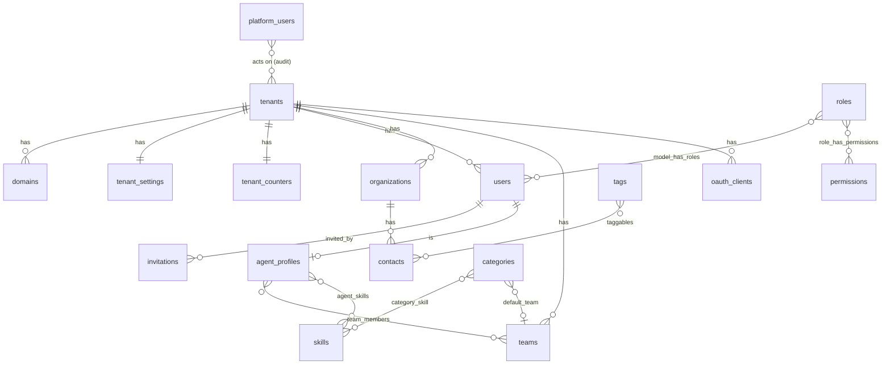
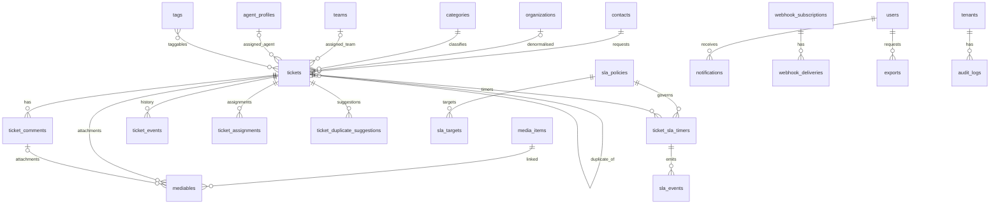

# Entity catalogue

Every table in the MVP schema, grouped by module. Common columns unless stated: `id uuid PK` (UUID v7), `tenant_id uuid NOT NULL FK tenants` (application plane), `created_at`, `updated_at timestamptz NOT NULL`. Types follow [overview.md](overview.md). Domain semantics: [04-domain](../04-domain/tickets.md). Indexes: [indexing.md](indexing.md).

Legend: **PK** primary key, **FK** foreign key (`RESTRICT` unless noted), **U** unique, **N** nullable, **CHK** check constraint, **G** generated.

## ER diagram — control plane, identity, contacts, agents

## ER diagram — tickets, SLA, automation, integrations

## Platform / Tenancy (control plane; no `tenant_id`)

### tenants

| Column | Type | Constraints | Notes |
|---|---|---|---|
| id | uuid | PK | |
| slug | varchar(63) | U, CHK `^[a-z0-9](-?[a-z0-9])*$`, not in the reserved list | workspace slug in SPA URLs and login |
| name | varchar(120) | | |
| status | varchar(16) | CHK `active,suspended,archived` | |
| plan | varchar(32) | default `standard` | informational in MVP |
| placement | varchar(16) | CHK `shared,dedicated`, default `shared` | dedicated = V1 |
| owner_email | varchar(254) | | first owner |
| timezone | varchar(64) | default `UTC` | IANA; used for date filters and calendars |
| suspended_at, archived_at | timestamptz | N | |

### domains

| Column | Type | Constraints | Notes |
|---|---|---|---|
| id | uuid | PK | |
| tenant_id | uuid | FK tenants CASCADE | |
| domain | varchar(253) | U | full host (`app.shp.subhambhandari.com.np/acme` or custom) |
| is_primary | boolean | default false | one per tenant (partial unique) |
| verified_at | timestamptz | N | custom domains (V1 verification) |

### platform_users

| Column | Type | Constraints |
|---|---|---|
| id | uuid | PK |
| name | varchar(120) | |
| email | varchar(254) | U |
| password | varchar(255) | |
| remember_token | varchar(100) | N |
| last_login_at | timestamptz | N |

### platform_settings

| Column | Type | Constraints |
|---|---|---|
| key | varchar(64) | PK |
| value | jsonb | |
| updated_at | timestamptz | |

### tenant_settings (application plane)

| Column | Type | Constraints | Notes |
|---|---|---|---|
| id | uuid | PK | |
| tenant_id | uuid | U, FK CASCADE | one row per tenant |
| data | jsonb | | merged over `config/helpdesk.php` defaults |
| version | integer | default 1 | incremented on each change; recorded by algorithm results |

### tenant_counters

| Column | Type | Constraints | Notes |
|---|---|---|---|
| tenant_id | uuid | PK, FK CASCADE | |
| next_ticket_number | integer | default 1 | locked with `FOR UPDATE` |

## Identity

### users

| Column | Type | Constraints | Notes |
|---|---|---|---|
| id | uuid | PK | |
| tenant_id | uuid | FK | |
| name | varchar(120) | | |
| email | varchar(254) | U `(tenant_id, email)` (lower-cased via index) | |
| password | varchar(255) | N | null until invitation accepted |
| is_active | boolean | default true | disabled users cannot log in |
| preferences | jsonb | default `{}` | theme, density |
| email_verified_at, last_login_at, disabled_at | timestamptz | N | |
| remember_token | varchar(100) | N | |

### invitations

| Column | Type | Constraints | Notes |
|---|---|---|---|
| id | uuid | PK | |
| tenant_id, user_id | uuid | FK | user row pre-created |
| invited_by_user_id | uuid | FK users, N | |
| token_hash | varchar(64) | U | sha256 |
| role_names | text[] | | roles to assign on accept |
| expires_at, accepted_at | timestamptz | N accepted | |

### password_reset_tokens

| Column | Type | Constraints |
|---|---|---|
| tenant_id | uuid | PK part |
| email | varchar(254) | PK part |
| token | varchar(255) | hashed |
| created_at | timestamptz | |

### sessions

Laravel default (`id varchar PK, user_id uuid N, ip_address, user_agent, payload text, last_activity int`) **plus** `tenant_id uuid N` and a `guard varchar(16)`; indexed on `(user_id)` and `(last_activity)`.

### roles, permissions, model_has_roles, model_has_permissions, role_has_permissions (spatie, teams mode)

| Table | Columns | Notes |
|---|---|---|
| roles | id uuid PK, tenant_id uuid **N**, name varchar(64), guard_name varchar(16), is_system boolean, timestamps; U `(tenant_id, name, guard_name)` | `tenant_id NULL` = global default role |
| permissions | id uuid PK, name varchar(64) U with guard_name, guard_name, timestamps | catalogue from ADR-0007; global |
| model_has_roles | tenant_id uuid NOT NULL, role_id uuid FK, model_type varchar, model_id uuid; PK `(tenant_id, role_id, model_id, model_type)` | spatie `team_foreign_key = tenant_id` |
| model_has_permissions | same shape with permission_id | direct grants (rarely used) |
| role_has_permissions | permission_id, role_id; PK both | |

RLS on `model_has_roles` and `model_has_permissions` (tenant-scoped); `roles` policy allows `tenant_id IS NULL OR tenant_id = current`.

### personal_access_tokens (sanctum)

Laravel default plus `tenant_id uuid N`. Present because Sanctum is installed; only used if the Passport fallback is taken.

### oauth_clients, oauth_access_tokens, oauth_refresh_tokens, oauth_auth_codes, oauth_device_codes (passport)

Passport 13 defaults; `oauth_clients` gains `tenant_id uuid NOT NULL FK`, `scopes text[]`, `created_by_user_id uuid N`, `last_used_at timestamptz N`, `revoked_at timestamptz N`; RLS on `oauth_clients`. Access tokens are JWTs; the `oauth_access_tokens` table records `client_id`, `scopes`, `revoked`, `expires_at` (Passport-managed, not RLS'd, no user data).

## Contacts

### organizations

| Column | Type | Constraints | Notes |
|---|---|---|---|
| id, tenant_id | uuid | | |
| name | varchar(120) | U `(tenant_id, name)` | |
| domain | varchar(253) | N | email-domain auto-link (V1) |
| tier | varchar(16) | CHK `standard,premium,enterprise`, default standard | feeds priority + SLA |
| external_ids, metadata | jsonb | default `{}` | ≤ 8 KB |

### contacts

| Column | Type | Constraints | Notes |
|---|---|---|---|
| id, tenant_id | uuid | | |
| organization_id | uuid | N, FK organizations | |
| name | varchar(120) | | |
| email | varchar(254) | U `(tenant_id, lower(email))` | |
| phone | varchar(32) | N | |
| external_ids, metadata | jsonb | default `{}` | |
| last_ticket_at, archived_at | timestamptz | N | |

### tags

| Column | Type | Constraints |
|---|---|---|
| id, tenant_id | uuid | |
| name | varchar(40) | U `(tenant_id, name)` |
| slug | varchar(40) | U `(tenant_id, slug)` |
| color | varchar(16) | N (token name, e.g. `accent-3`) |

### taggables

| Column | Type | Constraints |
|---|---|---|
| tenant_id | uuid | NOT NULL |
| tag_id | uuid | FK tags CASCADE |
| taggable_type | varchar(64) | `ticket`/`contact`/`organization` |
| taggable_id | uuid | |
| PK | `(tenant_id, tag_id, taggable_type, taggable_id)`; `(tenant_id, tag_id)` is a composite FK to tags; every unique key leads with `tenant_id` (isolation suite rule) | |

## Agents

### skills

| Column | Type | Constraints |
|---|---|---|
| id, tenant_id | uuid | |
| name | varchar(60) | U `(tenant_id, name)` |
| slug | varchar(60) | U `(tenant_id, slug)` |
| description | text | N |

### categories (owned by Tickets module; listed here for the routing graph)

| Column | Type | Constraints | Notes |
|---|---|---|---|
| id, tenant_id | uuid | | |
| name | varchar(80) | U `(tenant_id, name)` | |
| default_team_id | uuid | N, FK teams SET NULL | |
| is_active | boolean | default true | |
| sort_order | smallint | default 0 | |

### category_skill

`tenant_id uuid NOT NULL, category_id uuid, skill_id uuid, PK (tenant_id, category_id, skill_id)`; both ids are composite FKs with `tenant_id`, CASCADE.

### teams

| Column | Type | Constraints |
|---|---|---|
| id, tenant_id | uuid | |
| name | varchar(80) | U `(tenant_id, name)` |
| description | text | N |

### agent_profiles

| Column | Type | Constraints | Notes |
|---|---|---|---|
| id, tenant_id | uuid | | |
| user_id | uuid | U, FK users CASCADE | |
| capacity | smallint | CHK 1–100, default 10 | max active tickets |
| availability | varchar(16) | CHK `available,away,offline`, default available | |
| active_ticket_count | integer | default 0, CHK ≥ 0 | maintained + reconciled nightly |
| last_assigned_at | timestamptz | N | round-robin key |

### team_members

`id uuid` (UUID v7 PK), `tenant_id uuid NOT NULL`, `team_id uuid` and `agent_profile_id uuid` (both composite FKs with `tenant_id`, CASCADE), `joined_at timestamptz`; UNIQUE `(tenant_id, team_id, agent_profile_id)`.

### agent_skills

`id uuid` (UUID v7 PK), `tenant_id uuid NOT NULL`, `agent_profile_id uuid` and `skill_id uuid` (both composite FKs with `tenant_id`, CASCADE), `level smallint` (CHK 1–5); UNIQUE `(tenant_id, agent_profile_id, skill_id)`.

## Tickets

### tickets

| Column | Type | Constraints | Notes |
|---|---|---|---|
| id, tenant_id | uuid | | |
| number | integer | U `(tenant_id, number)` | from tenant_counters |
| title | varchar(200) | | |
| description | text | | |
| contact_id | uuid | FK contacts (composite with tenant_id, see [tenancy.md](tenancy.md)) | |
| organization_id | uuid | N, FK | denormalised at creation |
| category_id | uuid | FK categories (composite) | |
| team_id | uuid | N, FK teams (composite) SET NULL | |
| assigned_agent_id | uuid | N, FK agent_profiles (composite) SET NULL | |
| status | varchar(16) | CHK `open,assigned,in_progress,pending,resolved,closed` | |
| impact, urgency | smallint | CHK 1–4 | |
| priority_score | numeric(5,2) | CHK 0–100 | |
| priority_level | varchar(2) | CHK `P1,P2,P3,P4` | computed level |
| priority_override_level | varchar(2) | N, CHK | |
| priority_override_reason | varchar(255) | N | |
| priority_override_by | uuid | N, FK users | |
| priority_explanation | jsonb | default `{}` | breakdown |
| priority_settings_version | integer | | |
| duplicate_of_id | uuid | N, FK tickets | depth 1 enforced in app |
| reopen_count | smallint | default 0 | |
| version | integer | default 1 | optimistic lock (Should-have) |
| first_responded_at, resolved_at, closed_at, last_customer_reply_at, last_agent_reply_at, pending_since | timestamptz | N | |
| paused_total_seconds | integer | default 0 | for age calculation |
| search_vector | tsvector | G STORED `setweight(to_tsvector('english', coalesce(title,'')),'A') \|\| setweight(to_tsvector('english', coalesce(description,'')),'B')` | |
| created_by_user_id | uuid | N, FK users | |
| created_by_client_id | uuid | N, FK oauth_clients | |
| created_via | varchar(8) | CHK `ui,api,seed` | |

### ticket_comments

| Column | Type | Constraints | Notes |
|---|---|---|---|
| id, tenant_id | uuid | | |
| ticket_id | uuid | FK tickets CASCADE | |
| visibility | varchar(8) | CHK `public,internal` | |
| author_type | varchar(8) | CHK `user,contact,client` | |
| author_id | uuid | | user/contact/client id |
| body | text | | |
| edited_at | timestamptz | N | |

Ticket and comment attachments are media items linked through `mediables` (role `attachment`); see [§Media](#media) and [ADR-0019](../adr/0019-media-library.md).

### ticket_events (domain history)

| Column | Type | Constraints | Notes |
|---|---|---|---|
| id, tenant_id | uuid | | |
| ticket_id | uuid | FK tickets CASCADE | |
| type | varchar(32) | CHK list: `created,status_changed,priority_changed,priority_overridden,assigned,unassigned,comment_added,attachment_added,sla_warning,sla_breached,sla_met,sla_recomputed,escalated,duplicate_marked,duplicate_suggested,reopened,tags_changed,edited` | |
| actor_type | varchar(8) | CHK `user,client,system` | |
| actor_id | uuid | N | |
| old_values, new_values | jsonb | default `{}` | |
| note | varchar(255) | N | reason text |
| created_at | timestamptz | | append-only; no updated_at |

### ticket_assignments

| Column | Type | Constraints | Notes |
|---|---|---|---|
| id, tenant_id | uuid | | |
| ticket_id | uuid | FK CASCADE | |
| team_id, agent_profile_id | uuid | N | resulting assignment (both null = unassigned) |
| previous_agent_profile_id | uuid | N | |
| reason | varchar(16) | CHK `auto,manual,reassign,unassign` | |
| assigned_by_user_id | uuid | N | |
| explanation | jsonb | default `{}` | ranking, exclusions, mode |
| settings_version | integer | N | |
| created_at | timestamptz | | |

### ticket_duplicate_suggestions

| Column | Type | Constraints | Notes |
|---|---|---|---|
| id, tenant_id | uuid | | |
| ticket_id | uuid | FK CASCADE | the new ticket |
| candidate_ticket_id | uuid | FK tickets CASCADE | |
| score | numeric(6,4) | CHK 0–1 | |
| breakdown | jsonb | | `{strategy, version, shared_words[]}` |
| decision | varchar(12) | CHK `pending,accepted,dismissed`, default pending | |
| decided_by_user_id | uuid | N | |
| decided_at | timestamptz | N | |
| U | `(ticket_id, candidate_ticket_id)` | | |

## SLA

### sla_policies

| Column | Type | Constraints | Notes |
|---|---|---|---|
| id, tenant_id | uuid | | |
| name | varchar(80) | U `(tenant_id, name)` | |
| is_default | boolean | | partial unique per tenant where true |
| applies_to_tier | varchar(16) | N, CHK tiers | null = any |
| warning_fraction | numeric(3,2) | CHK 0.1–0.95, default 0.75 | |
| calendar_id | uuid | N, FK business_calendars RESTRICT | null = 24×7 |
| version | integer | default 1 | |

### sla_targets

`id uuid PK, tenant_id uuid, policy_id uuid FK CASCADE, priority_level varchar(2) CHK, first_response_minutes integer CHK > 0, resolution_minutes integer CHK > 0, U (policy_id, priority_level)`.

### ticket_sla_timers

| Column | Type | Constraints | Notes |
|---|---|---|---|
| id, tenant_id | uuid | | |
| ticket_id | uuid | FK CASCADE | |
| policy_id | uuid | FK sla_policies | |
| policy_version | integer | | |
| kind | varchar(16) | CHK `first_response,resolution` | |
| cycle | smallint | default 1 | increments on reopen |
| state | varchar(10) | CHK `running,paused,warning,breached,met,cancelled` | |
| paused_from_state | varchar(10) | N | running/warning |
| target_minutes | integer | | copied |
| started_at | timestamptz | | |
| warning_at, due_at | timestamptz | | materialised |
| paused_at | timestamptz | N | |
| paused_total_seconds | integer | default 0 | |
| warned_at, breached_at, met_at, cancelled_at | timestamptz | N | |
| calendar_id | uuid | N | copied from the policy at start; null = 24×7 |
| strategy | varchar(64) | | SLA strategy name and version |
| U | `(tenant_id, ticket_id, kind, cycle)` | | Tenant-leading business uniqueness |

### sla_events

`id uuid PK, tenant_id, timer_id uuid FK CASCADE, ticket_id uuid FK CASCADE, type varchar(24) CHK (started, paused, resumed, warning, breached, met, met_late, recomputed, cancelled), payload jsonb, created_at`. Append-only.

## Notifications

### notifications

Laravel default (`id uuid PK, type varchar, notifiable_type, notifiable_id uuid, data jsonb, read_at timestamptz N, timestamps`) **plus** `tenant_id uuid NOT NULL` and `notification_key varchar(96) N` with U `(tenant_id, notifiable_id, notification_key)` for deduplication.

## Integrations

### webhook_subscriptions

| Column | Type | Constraints | Notes |
|---|---|---|---|
| id, tenant_id | uuid | | |
| name | varchar(80) | | |
| url | varchar(2048) | | validated |
| events | text[] | CHK non-empty | |
| secret | text | | encrypted cast |
| previous_secret | text | N | during rotation |
| previous_secret_expires_at | timestamptz | N | |
| headers | jsonb | N | encrypted cast |
| api_version | varchar(4) | default v1 | |
| is_active | boolean | default true | |
| consecutive_failures | integer | default 0 | |
| disabled_at | timestamptz | N | |
| disabled_reason | varchar(32) | N | |
| created_by_user_id | uuid | N | |

### webhook_deliveries

| Column | Type | Constraints | Notes |
|---|---|---|---|
| id, tenant_id | uuid | | delivery id |
| subscription_id | uuid | FK CASCADE | |
| event_id | uuid | | stable per event |
| event_type | varchar(40) | | |
| payload | jsonb | | envelope |
| state | varchar(10) | CHK `pending,succeeded,failed,dead` | |
| attempt | smallint | default 0 | |
| next_attempt_at | timestamptz | N | |
| last_attempted_at | timestamptz | N | |
| response_status | smallint | N | |
| response_excerpt | varchar(1024) | N | |
| error | varchar(255) | N | timeout/dns/url_rejected |
| duration_ms | integer | N | |
| manual_retries | smallint | default 0 | |

### idempotency_keys

`tenant_id uuid, client_id uuid, key varchar(128), route varchar(128), request_hash varchar(64), response_status smallint, response_body jsonb, created_at, expires_at; PK (tenant_id, client_id, key)`.

## Exports

Exports of reports and of the filtered ticket list share `report_exports` ([§Reporting](#reporting)); the ticket list uses `report_key = 'tickets-list'`.

## Audit

### audit_logs

| Column | Type | Constraints | Notes |
|---|---|---|---|
| id | uuid | PK | |
| tenant_id | uuid | **N**, FK | null = platform action |
| actor_type | varchar(16) | CHK `user,platform_user,client,system` | |
| actor_id | uuid | N | |
| action | varchar(48) | | catalogue in [04-domain/audit.md](../04-domain/audit.md) |
| subject_type | varchar(64) | N | |
| subject_id | uuid | N | |
| changes | jsonb | default `{}` | old/new |
| ip_address | inet | N | |
| user_agent | varchar(255) | N | |
| request_id | varchar(64) | N | |
| created_at | timestamptz | | append-only |

## Media

### media_folders

| Column | Type | Constraints | Notes |
|---|---|---|---|
| id, tenant_id | uuid | | |
| parent_id | uuid | N, FK media_folders RESTRICT | depth ≤ 5 (application check) |
| name | varchar(120) | U `(tenant_id, parent_id, name)` | |
| system_key | varchar(20) | N, CHK `tickets,email,branding` | system folders cannot be renamed or deleted |
| created_at, updated_at | timestamptz | | |

### media_items

| Column | Type | Constraints | Notes |
|---|---|---|---|
| id, tenant_id | uuid | | |
| folder_id | uuid | N, FK media_folders SET NULL | |
| name | varchar(255) | | display name, trigram index |
| storage_key | varchar(512) | U `(tenant_id, storage_key)` | Tenant-relative `media/{id}/original.{ext}`, server-generated; filesystem adds `tenants/{tenant}/` |
| mime_type | varchar(127) | | verified by sniffing |
| size_bytes | bigint | CHK > 0 and ≤ 26214400 | |
| width, height | integer | N | images only |
| checksum_sha256 | char(64) | N | set on complete |
| variants | jsonb | default `{}` | `{thumb:{key,width,height}, preview:{...}}` |
| source | varchar(8) | CHK `upload,email,api,system` | |
| state | varchar(8) | CHK `pending,ready,trashed,failed` | |
| uploaded_by_user_id | uuid | N, FK users | null for email/system |
| trashed_at, completed_at | timestamptz | N | |
| created_at, updated_at | timestamptz | | |

### mediables

| Column | Type | Constraints | Notes |
|---|---|---|---|
| id | uuid | PK | UUID v7 for change-capture history |
| tenant_id | uuid | | |
| media_item_id | uuid | FK media_items RESTRICT | purge requires unlink |
| mediable_type | varchar(40) | CHK `ticket,ticket_comment,tenant_branding,inbound_email` | |
| mediable_id | uuid | | |
| role | varchar(12) | CHK `attachment,logo,inline` | |
| created_at | timestamptz | | U `(tenant_id, media_item_id, mediable_type, mediable_id, role)` |

Quota: `tenants.storage_quota_bytes` (bigint, default from platform settings) and `tenant_counters.storage_used_bytes` updated on complete/purge under the counter row lock.

## Calendars and shifts

### business_calendars

| Column | Type | Constraints | Notes |
|---|---|---|---|
| id, tenant_id | uuid | | |
| name | varchar(80) | U `(tenant_id, name)` | |
| timezone | varchar(64) | | IANA zone |
| weekly_hours | jsonb | | `{"sun":[["09:00","17:00"]], "mon":[...], ...}`; validated, non-overlapping |
| is_default | boolean | partial U `(tenant_id) WHERE is_default` | |
| created_at, updated_at | timestamptz | | |

### calendar_holidays

| Column | Type | Constraints | Notes |
|---|---|---|---|
| id, tenant_id | uuid | | |
| calendar_id | uuid | FK business_calendars CASCADE | |
| date | date | U `(calendar_id, date)` | whole day closed |
| name | varchar(120) | | |
| recurs_yearly | boolean | default false | |

`sla_policies.calendar_id` (uuid, N, FK business_calendars RESTRICT; null = 24×7) and `ticket_sla_timers.calendar_id` (copied at start) join these tables.

### agent_shifts

| Column | Type | Constraints | Notes |
|---|---|---|---|
| id, tenant_id | uuid | | |
| agent_profile_id | uuid | composite FK `(tenant_id, agent_profile_id)` to agent_profiles CASCADE | |
| weekday | smallint | N, CHK 0–6 | weekly template row |
| date | date | N | date exception row (exactly one of weekday/date set; CHK) |
| starts_at, ends_at | time | CHK ends_at > starts_at | in the tenant default calendar zone |
| is_off | boolean | default false | exception marking a day off |

## Mail

### inbound_emails

| Column | Type | Constraints | Notes |
|---|---|---|---|
| id | uuid | | |
| tenant_id | uuid | N until routed | RLS policy allows NULL rows only to the owner role; routing job runs on the owner connection, then sets tenant |
| message_id | varchar(512) | U | idempotency |
| from_address, to_address | varchar(320) | | |
| subject | varchar(500) | | |
| headers | jsonb | | selected headers incl. auth results (SPF/DKIM/DMARC) |
| text_body, html_body | text | N | original |
| reply_text | text | N | after `ReplyParser` |
| state | varchar(10) | CHK `comment,ticket,ignored,unrouted,rejected,failed` | |
| ticket_id | uuid | N, FK tickets SET NULL | |
| comment_id | uuid | N, FK ticket_comments SET NULL | |
| error | text | N | |
| received_at, processed_at | timestamptz | | |

`ticket_comments.source` (`ui,api,email`) and `tickets.created_via` gain the value `email`.

## Reporting

### entity_changes

| Column | Type | Constraints | Notes |
|---|---|---|---|
| id | uuid | | UUID v7 generated in the trigger (`uuidv7()`, PostgreSQL 18) |
| tenant_id | uuid | FK tenants CASCADE | from the changed row; a delete caused by the tenant's own deletion is not recorded |
| entity_type | varchar(64) | | table name |
| entity_id | uuid | | |
| version | integer | U `(entity_type, entity_id, version)` | consecutive per entity |
| operation | varchar(6) | CHK `insert,update,delete` | |
| changes | jsonb | | `{attribute: {old, new}}`; excluded columns never present |
| actor_type | varchar(12) | N | `user, api_client, system, email, platform` |
| actor_id | uuid | N | |
| request_id | varchar(64) | N | correlates with logs and audit |
| occurred_at | timestamptz(6) | | `clock_timestamp()`, microseconds so changes in one transaction keep their order |

Append-only: the application role has `INSERT` (through the trigger) and `SELECT` only (`UPDATE`,
`DELETE` and `TRUNCATE` are revoked in the migration). Indexes as in [indexing.md](indexing.md):
UNIQUE `(entity_type, entity_id, version)`, `(tenant_id, entity_type, entity_id, occurred_at DESC)`,
`(tenant_id, occurred_at DESC)`, `(tenant_id, actor_id, occurred_at DESC)`.

**As built (M1-23).** Rows are written only by `record_entity_change()`
(docs/05-algorithms/history-and-time-analytics.md §2), which a table's own migration attaches with
`App\Modules\Reporting\Support\ReportableTables::captureChanges($table)` — the registry of reportable
tables and of the columns that are never recorded. `updated_at` is excluded everywhere; `users`
additionally excludes `password` and `remember_token`; `tenant_settings` excludes nothing. Captured so
far: `users`, `tenant_settings` (the rest of the ADR-0022 list follows with its tables in M2).
`tenant_id` is taken from the changed row and falls back to `app.current_tenant`; `actor_type`,
`actor_id` and `request_id` come from the session settings that `RlsTenancyBootstrapper` sets, and an
unset actor is stored as `system`, so the column is nullable but never null in practice. Rows are read
through `App\Modules\Reporting\Models\EntityChange` (tenant-scoped, append-only).

### report_ticket_intervals

| Column | Type | Constraints | Notes |
|---|---|---|---|
| id, tenant_id | uuid | | |
| ticket_id | uuid | FK tickets CASCADE | |
| seq | integer | U `(ticket_id, seq)` | order within the ticket |
| status | varchar(12) | | |
| assigned_agent_id, team_id | uuid | N | |
| priority_level | varchar(2) | | |
| starts_at | timestamptz | | |
| ends_at | timestamptz | N | null = current interval |
| wall_seconds, business_seconds | bigint | N | null while open (computed at query time) |

### report_ticket_facts

As built (M2-13): a surrogate `id` primary key; `(tenant_id, ticket_id)` is unique.

| Column | Type | Notes |
|---|---|---|
| ticket_id (PK), tenant_id | uuid | one row per ticket |
| created_at, first_responded_at, resolved_at, closed_at | timestamptz | copied for fast filtering |
| channel | varchar(8) | `ui, api, email, seed` |
| category_id, team_id, assigned_agent_id, organization_id, contact_id | uuid | current values |
| priority_level, initial_priority_level | varchar(2) | |
| first_response_wall_s, first_response_business_s, resolution_wall_s, resolution_business_s, pending_s, unassigned_s | bigint | null until known |
| reopen_count, reassign_count, comment_count, public_reply_count, email_in_count | integer | |
| first_response_sla, resolution_sla | varchar(24) | `met, breached, running, cancelled` |
| priority_overridden, closed_as_duplicate | boolean | |
| priority_strategy, assignment_strategy | varchar(64) | strategy name and version that made the decision |
| refreshed_at | timestamptz | |

### report_daily_snapshots

| Column | Type | Constraints | Notes |
|---|---|---|---|
| tenant_id | uuid | | |
| day | date | | tenant calendar time zone |
| dimension | varchar(16) | | `none, team, agent, priority, category, status` |
| dimension_key | uuid or varchar(64) as text | | `-` for `none` |
| metrics | jsonb | | `{backlog, weighted_load, created, resolved, reopened, breached, ...}` |
| | | UNIQUE `(tenant_id, day, dimension, dimension_key)`, surrogate `id` PK (M2-13) | the day's rows are replaced |

### saved_reports

| Column | Type | Notes |
|---|---|---|
| id, tenant_id | uuid | |
| report_key | varchar(16) | e.g. `rpt-t06` |
| name | varchar(120) | |
| parameters | jsonb | validated against the report definition |
| owner_user_id | uuid | FK users |
| shared_with_roles | jsonb | role ids |
| schedule | jsonb | N; Could-have: `{cron, recipients}` |

### report_exports

| Column | Type | Notes |
|---|---|---|
| id, tenant_id | uuid | |
| report_key, parameters, format (`csv`, `xlsx`) | | `report_key` is a catalogue id or `tickets-list` |
| state | varchar(10) | `queued, running, ready, failed` |
| media_item_id | uuid | N, FK media_items (folder `Reports`), `ON DELETE SET NULL (media_item_id)` |
| requested_by_user_id | uuid | FK users, cascade |
| row_count | integer | N; data rows, without header and `Total` |
| error | varchar(40) | N; `too_large, quota_exceeded, forbidden, failed` |
| started_at, finished_at | timestamptz | N |

Index `(tenant_id, requested_by_user_id, created_at)`; not reportable (no change capture), like `notifications`. As built: M3-09, [reporting.md](../04-domain/reporting.md#as-built-m3-09).

`sessions` gains `tenant_id` (central table, no RLS, see [ADR-0021](../adr/0021-host-layout-and-tenant-resolution.md)).

## Framework tables (global)

| Table | Notes |
|---|---|
| migrations | Laravel default |
| jobs, failed_jobs, job_batches | present for the `database` fallback and failed-job storage (Horizon reads `failed_jobs`); `failed_jobs.payload` includes tenant tags |
| cache, cache_locks | unused when Valkey is configured; kept for tests |
| health_check_result_history_items | spatie/laravel-health |
| telescope_* | dev only (`TELESCOPE_ENABLED=false` in prod; migrations still run) |

## Table counts

Control plane 5 · Identity 11 (incl. spatie/sanctum/passport) · Contacts 4 · Agents 6 · Tickets 5 · SLA 4 · Media 3 · Calendars and shifts 3 · Mail 1 · Reporting 6 · Notifications 1 · Integrations 3 · Audit 1 · Framework 8 — about 61 tables, 49 of them under RLS.
