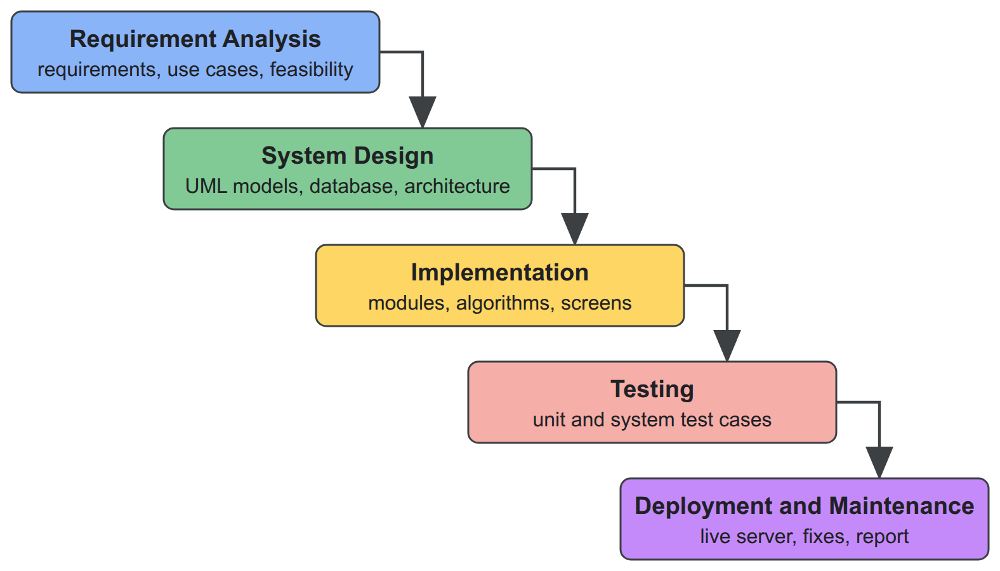

# Chapter 1: Introduction

## 1.1 Introduction

Every organisation that serves customers or employees receives requests: a login that fails, an invoice that is wrong, a server that is down. A helpdesk turns these requests into **tickets** that can be prioritised, assigned, tracked against a promised response time and closed with a record of what was done. Commercial platforms such as Zendesk, ServiceNow and Jira Service Management provide this for large enterprises, while small and medium teams often rely on shared mailboxes or open-source tools that store tickets well but leave most decisions to people.

Smart Helpdesk is a web-based support ticket management system built for such teams. One installation serves many independent organisations, called **tenants**, each with its own users, agents, customers, tickets and settings, and the same software can run as a hosted service or on an organisation's own server. Beyond storing tickets, the system makes four decisions automatically and explains each one: how urgent a ticket is, which agent should handle it, whether it repeats an existing ticket, and whether its service-level agreement (SLA) is at risk. It also records how every record changed over time, offers reports on tickets, customers, agents and service levels, sends notifications by email and in the application, turns customer emails into tickets, and lets other systems integrate through a documented API and webhooks.

## 1.2 Problem Statement

A review of how small support teams work and of existing open-source helpdesks (Section 2.2) shows the following problems:

1. **Inconsistent prioritisation.** Priority is chosen by whoever creates the ticket, and a ticket's urgency does not grow while it waits.
2. **Unbalanced assignment.** Tickets are assigned by hand or by simple rotation, so work piles up on experienced agents while skills and current workload are ignored.
3. **Duplicate tickets.** One outage produces many tickets that describe the same problem in different words, and agents work on them in parallel.
4. **Late SLA awareness.** Response and resolution targets are checked in reports after the fact instead of warning agents before a breach.
5. **Shallow reporting.** Managers see current counts but not how the backlog or a customer's record looked on a past date.
6. **Isolation and deployment.** A hosted helpdesk must guarantee that one organisation never sees another's data, while some organisations need the same software on their own servers.

## 1.3 Objectives

The objectives of the project are:

1. To design and implement a multi-tenant helpdesk in which each organisation's data is strictly isolated, and which can run on any virtual machine or on an organisation's own server.
2. To implement simple, explainable algorithms for **priority scoring**, **agent assignment**, **duplicate ticket detection** and **SLA monitoring** with working-hours calendars.
3. To provide the supporting features needed for real use: the ticket lifecycle with public replies and internal notes, a media library, email notifications and email-to-ticket, a dashboard, an audit trail, a REST API and signed webhooks.
4. To implement a **reporting module** that records every change to the main records and shows any record as it was at a past moment.

The algorithms are intentionally minimal and replaceable, so that they can be understood completely and later substituted with stronger techniques.

## 1.4 Scope and Limitation

**Scope.** The system covers workspace provisioning by a platform administrator; sign-in, invitations, roles and permissions within each workspace; contacts and organisations with customer tiers; teams, skills, categories, agent capacity, availability and shifts; the complete ticket lifecycle with comments, attachments and history; the four algorithms with explanations shown to agents; SLA policies with business calendars and warning and breach notifications; in-application and email notifications; email-to-ticket; a media library; a dashboard and a catalogue of reports with drill-down and point-in-time views; a REST API with client credentials and signed webhooks; light and dark themes; and deployment with Docker to any virtual machine, demonstrated on an Amazon Web Services instance.

**Limitations.**

- The algorithm weights and thresholds are set by administrators rather than learned from history.
- Duplicate detection compares words, so two tickets that describe the same problem in different vocabulary are not detected.
- Load testing was not carried out; the system runs on a single small virtual machine.
- A customer self-service portal, live chat, a knowledge base, custom fields and billing are outside the scope.
- The agent application is designed for desktop and laptop screens; layouts for phones are not provided.

## 1.5 Development Methodology

The project followed the **waterfall model** (Figure 1.1). The requirements of the system were known at the start from the problem statement and the course requirements, and the project had a fixed period of three months, from 16 June to 15 September 2026, so the work was divided into phases that were completed one after another, each ending with a document or product that was reviewed before the next phase began.

1. **Requirement analysis:** study of existing helpdesk systems, collection of functional and non-functional requirements, use cases and feasibility study.
2. **System design:** class, object, state, sequence and activity diagrams, database design, component and deployment design, and the design of the four algorithms.
3. **Implementation:** development of the modules, from tenancy, sign-in and the ticket model to the algorithms, SLA timers, email, reports, integrations and the user interface.
4. **Testing:** manual unit testing of each function and system testing of the complete workflows.
5. **Deployment and maintenance:** installation on a cloud virtual machine, correction of the problems found, and completion of the documentation.

The two team members worked on separate features during implementation and reviewed each other's work before it was merged. Table 1.1 lists the output of each phase.

Table 1.1: Phases of the waterfall model and their outputs

| Phase | Main activities | Output |
|---|---|---|
| Requirement analysis | study of existing systems, requirements, use cases, feasibility | requirement specification |
| System design | UML models, database and architecture design, algorithm design | design documents and diagrams |
| Implementation | backend modules, algorithms, web application screens | working system |
| Testing | unit and system test cases | tested system and test report |
| Deployment and maintenance | cloud deployment, fixes, documentation | live system and project report |

## 1.6 Report Organization

Chapter 2 introduces the concepts the system is built on and reviews existing helpdesk systems and related research. Chapter 3 presents the requirement and feasibility analysis, the object, dynamic and process models, the system design and the details of the algorithms. Chapter 4 describes the tools, the implementation of each module, the test cases and the analysis of the results. Chapter 5 concludes the report and recommends future work.
