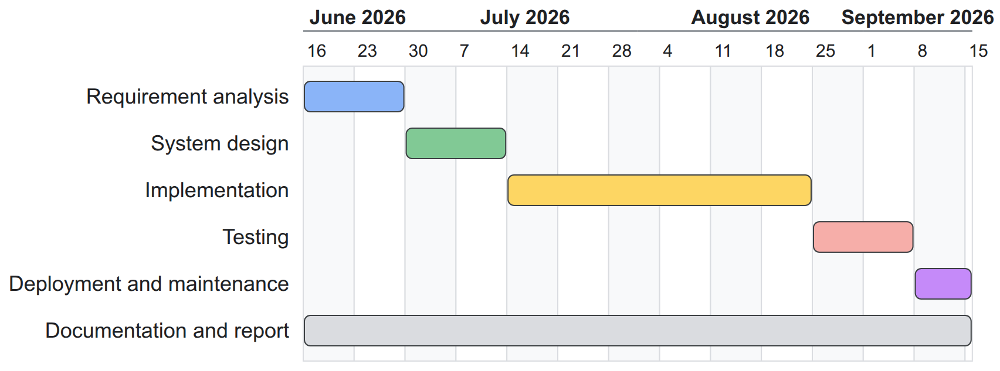

# Chapter 3: System Analysis and Design

## 3.1 System Analysis

### 3.1.1 Requirement Analysis

**i. Functional requirements**

The actors of the system are the Platform Super Admin, who manages workspaces; the Tenant Admin, who configures a workspace; the Support Manager, who oversees queues and reports; the Support Agent, who works tickets; external systems, which use the API and receive webhooks; the Contact, who raises requests by email; and the scheduler, which drives time-based processing. Figures 3.1 and 3.2 show the use cases.


Table 3.1: Functional requirements by module

| Module | Requirement |
|---|---|
| Tenancy | Create, suspend and reactivate workspaces; take the workspace of every request from the signed-in session or API client; seed default roles, categories, SLA policy and settings |
| Identity | Sign in with email and password; invite users; assign roles made of permissions; check a permission on every action |
| Contacts and agents | Manage contacts and organisations with customer tier; teams, skills, categories, agent capacity, availability and shifts |
| Tickets | Create tickets; move them through the lifecycle; add public replies and internal notes; attach files; keep history; list, filter and search |
| Automation | Score priority; assign agents; suggest duplicates; explain every automatic decision |
| SLA | Define policies and business calendars; run first-response and resolution timers; pause while pending; warn before and record breaches |
| Media and email | Store files in a workspace library; send notification emails; turn customer replies into comments and new emails into tickets |
| Integrations | REST API, client credentials, API documentation, signed webhooks with retries |
| Reporting | Record every change to the main records; report catalogue with filters and drill-down; record history and point-in-time view; CSV and XLSX export |

Table 3.2: Description of use case "Create ticket"

| Field | Description |
|---|---|
| Actors | Support Agent; external system through the API; Contact through email |
| Precondition | The actor is signed in to the workspace (or the email is routed to it) |
| Main flow | 1. Actor enters title, description, contact, category, impact, urgency and attachments. 2. System shows likely duplicates. 3. Actor confirms. 4. System numbers the ticket, computes its priority, starts SLA timers and assigns an agent. 5. System records history and sends notifications. |
| Alternative flows | 2a. Actor marks the ticket as a duplicate; it is closed and linked to the original. 4a. No agent is eligible; the ticket stays unassigned and managers are notified. |
| Postcondition | The ticket exists with number, priority, explanation, SLA timers and assignment |

Table 3.3: Description of use case "Assign ticket"

| Field | Description |
|---|---|
| Actors | System (automatic), Support Manager (manual) |
| Main flow | 1. System keeps the agents who are available, on shift, below capacity, in the team and hold the required skills. 2. System orders them by open tickets per unit of capacity. 3. System assigns the first agent and stores the ordered list. 4. Agent is notified. |
| Alternative flow | 1a. A manager reviews the ranking and chooses a different agent with a reason. |

**ii. Non-functional requirements**

Table 3.4: Non-functional requirements

| Quality | Requirement |
|---|---|
| Security | No access to another workspace through any screen or API; permission check on every action; sign-in throttling; signed webhooks and emails; private file storage |
| Performance | Ticket list and ticket creation respond within about one second for a workspace with many thousands of tickets |
| Reliability | Background work is queued and retried; daily backups with a tested restore |
| Usability | Light and dark themes; keyboard operation; readable contrast; loading, empty and error states on every screen |
| Portability | Runs on any Linux virtual machine with Docker |

### 3.1.2 Feasibility Analysis

**i. Technical feasibility.** All components are mature open-source software: Laravel on PHP, React, PostgreSQL, Valkey, object storage and a mail server. They run together with Docker Compose on one virtual machine; the live deployment uses an Amazon Web Services instance with two virtual CPUs and 2 GB of memory.

**ii. Operational feasibility.** The system follows the workflow support teams already use and explains every automatic decision, so agents can trust or override it. Administrators adjust the algorithms through forms rather than code.

**iii. Economic feasibility.** No software licence is required. A virtual machine of the required size costs roughly US$8 to 35 per month, and an organisation's own server can be used instead. Development used free tools.

**iv. Schedule feasibility.** The project was planned over three months, from 16 June to 15 September 2026, following the phases of the waterfall model (Section 1.5), each phase starting when the previous one was complete, with documentation written throughout (Table 3.5 and Figure 3.3).

Table 3.5: Project schedule

| S.N. | Phase | Start | End | Duration |
|---|---|---|---|---|
| 1 | Requirement analysis | 16 Jun 2026 | 29 Jun 2026 | 2 weeks |
| 2 | System design | 30 Jun 2026 | 13 Jul 2026 | 2 weeks |
| 3 | Implementation | 14 Jul 2026 | 24 Aug 2026 | 6 weeks |
| 4 | Testing | 25 Aug 2026 | 7 Sep 2026 | 2 weeks |
| 5 | Deployment and maintenance | 8 Sep 2026 | 15 Sep 2026 | 8 days |
| 6 | Documentation and report | 16 Jun 2026 | 15 Sep 2026 | 3 months |



### 3.1.3 Object Modelling using Class and Object Diagrams

The domain model (Figure 3.4) is centred on the **Ticket**. A ticket belongs to one workspace, is requested by one contact (who may belong to an organisation with a customer tier), has one category, and may be assigned to a team and an agent. A ticket has comments, history events, assignments, two SLA timers, duplicate suggestions and attached files. A category requires skills; an agent holds skills, belongs to teams and has shifts. An SLA policy has targets per priority level and uses a business calendar with holidays. For reporting, a change record stores every change of a main record.


Figure 3.5 shows an object diagram of a seeded ticket: ticket #1042 requested by a contact of a premium organisation, in the Billing category, assigned to agent Asha of the Finance Support team, with an eight-hour resolution timer.


### 3.1.4 Dynamic Modelling using State and Sequence Diagrams

The ticket lifecycle (Figure 3.6) has six states. A new ticket is open; assignment moves it to assigned; work moves it to in progress; waiting for the customer moves it to pending; a resolved ticket is closed manually or automatically and can be reopened. Any other transition is rejected.


Each ticket also has SLA timers that run alongside the lifecycle (Figure 3.7). A timer is running, paused, in warning, breached, met or cancelled.


Figure 3.8 shows the creation of a ticket, in which priority, SLA, duplicate and assignment decisions are made in one database transaction. Figure 3.9 shows the SLA check that runs every minute, and Figure 3.10 the processing of an inbound email.


### 3.1.5 Process Modelling using Activity Diagrams

Figure 3.11 shows agent assignment, including the case where no agent is eligible; Figure 3.12 shows duplicate detection; and Figure 3.13 shows how an inbound email becomes a comment, a new ticket or a rejection.


## 3.2 System Design

### 3.2.1 Refinement of Class, Object, State, Sequence and Activity Diagrams

The analysis classes were refined into modules. Each algorithm became an interface with a simple baseline implementation that receives plain input values and returns a result together with its explanation (Figure 3.14), so that a stronger algorithm can replace it without changing the rest of the system. Each write operation, such as creating, assigning or resolving a ticket, became a single step that runs inside one database transaction and announces what happened once it is saved. The ticket state diagram became a transition table, and the SLA state diagram a table of allowed timer transitions.


The database design (Figure 3.15) follows the refined classes. Every workspace-owned table carries the workspace identifier and a row-level security policy; ticket numbers are allocated per workspace; and text indexes support search and duplicate candidate retrieval.


### 3.2.2 Component Diagrams

The backend is divided into modules (Figure 3.16): platform, tenancy, identity, contacts, agents, tickets, SLA, automation, media, mail, notifications, integrations, reporting and audit. Dependencies point in one direction, and notification, integration, reporting and audit components only react to events. The frontend is a single-page application divided into features on top of a shared design system.


### 3.2.3 Deployment Diagrams

Figure 3.17 shows the deployment on one virtual machine. A reverse proxy terminates HTTPS for the application, API, administration, documentation, file and mail hosts and serves the web application; the PHP application, queue workers and scheduler run from one container image; PostgreSQL, Valkey, object storage and the mail server run as separate containers on an internal network. The same arrangement runs on a developer computer, an organisation's own server or any cloud virtual machine.


## 3.3 Algorithm Details

The four decision algorithms are deliberately simple baselines. Each is implemented behind an interface (strategy) so that it can be replaced by a stronger technique after this project without changing the rest of the system, and each decision stores the name and version of the strategy that made it.

### 3.3.1 Priority scoring: basic weighted priority

The priority score is a weighted sum of four values scaled to the range 0–1, a form of simple additive weighting [@saw2016]. Impact and urgency are the inputs commonly used by service-management tools [@atlassianPriority]; customer tier reflects the importance of the requester; waiting time is an ageing term that raises tickets that have waited long.

Table 3.6: Inputs of the priority score

| Input | Values | Scaled value | Weight |
|---|---|---|---|
| Impact | 1 (one user) to 4 (whole organisation) | (impact − 1) ÷ 3 | 0.40 |
| Urgency | 1 (low) to 4 (immediate) | (urgency − 1) ÷ 3 | 0.35 |
| Customer tier | standard, premium, enterprise | 0, 0.5, 1 | 0.15 |
| Waiting time | hours since creation | min(1, hours ÷ 72) | 0.10 |

```text
score = 100 × (0.40 × impact' + 0.35 × urgency' + 0.15 × tier' + 0.10 × age')
level = P1 if score ≥ 75, P2 if score ≥ 50, P3 if score ≥ 25, otherwise P4

function score(ticket, now):
    total ← 0
    for each (name, weight, scaled value) of the four inputs:
        part ← 100 × weight × value
        total ← total + part
        record (name, value, weight, part) in the explanation
    return total, level(total), explanation
```

The score is computed on creation, when an input changes and hourly for open tickets; a manager's manual priority always takes precedence. The cost is constant per ticket. For example, a ticket with impact 2, urgency 3 and a premium customer scores 13.3 + 23.3 + 7.5 + 3.3 = 47.5 (P3) after 24 hours and 54.2 (P2) after 72 hours, which shows the ageing effect.

### 3.3.2 Agent assignment: least-loaded eligible agent

The rule combines the least-loaded choice of load balancers with the skill filter used in contact centres [@gans2003]. An agent is eligible when available (and on shift if shifts are enforced), holding all skills the category requires, in the ticket's team if one is set, and below capacity. Among eligible agents the one with the smallest ratio of open tickets to capacity is chosen; ties go to the agent assigned least recently, which behaves like round robin.

```text
function choose(ticket, agents):
    eligible ← agents that pass every eligibility rule (others recorded with the failed rule)
    if eligible is empty: leave the ticket unassigned and notify managers
    sort eligible by (open ÷ capacity, last assignment time, id)
    return the first agent and the sorted list as explanation
```

The cost is O(A log A) for A agents. For example, if Asha and Chen both have 3 of 10 tickets and Bikram has 2 of 5, Bikram's load (0.40) is higher than theirs (0.30); Chen, assigned earlier than Asha, receives the ticket.

### 3.3.3 Duplicate detection: Jaccard word overlap

Following the first duplicate-report detectors, which compared the words of a new report with existing reports [@runeson2007], each ticket is reduced to a set of words: the title and description are lower-cased, split on characters other than letters, digits and hyphens, and stripped of a fixed list of 117 stop words and of words shorter than three characters; hyphens are kept so that error codes such as `err-401` survive, and any Unicode letter counts, so Devanagari words stay whole. Two sets are compared with the Jaccard similarity [@manning2008]:

```text
J(A, B) = |A ∩ B| ÷ |A ∪ B|

function find(ticket, candidates):              // same tenant, last 30 days, not closed, at most 50
    A ← words(ticket)
    for c in candidates:
        B ← words(c)
        if |A ∩ B| ÷ |A ∪ B| ≥ 0.35: keep (c, score, A ∩ B)
    return the five highest scores
```

For "Cannot login after password reset" against "Login fails after resetting password", the sets share five of ten distinct words (J = 0.50) and the older ticket is suggested; an unrelated invoice ticket scores 0.15 and is ignored. The comparison costs O(K × W) for K candidates of about W words. The method is transparent but misses paraphrases and word forms, which a stronger replacement would address.

### 3.3.4 SLA evaluation: simple SLA timer

Each ticket has a first-response timer and a resolution timer, each a small state machine [@harel1987] with the states running, paused, warning, breached, met and cancelled. Deadlines are computed through a calendar that counts either all hours or only the organisation's working hours.

```text
start:            due ← cal.add(now, target); warn ← cal.add(now, f × target)   // f: the policy's warning fraction, default 0.75
enter pending:    paused_at ← now
leave pending:    d ← cal.elapsed(paused_at, now); due ← cal.add(due, d); warn ← cal.add(warn, d)
priority change:  due ← cal.add(started_at, new target + paused time)
goal reached:     state ← met   (first public reply, or ticket resolved)
every minute:     running and now ≥ warn → warning, notify assignee (once)
                  not met and now ≥ due  → breached, notify assignee and managers (once)
```

For a P2 ticket with an eight-hour resolution target created at 09:00 and waiting for the customer from 10:00 to 12:00, the warning moves from 15:00 to 17:00 and the deadline from 17:00 to 19:00. With office hours of 10:00–17:00, an eight-hour target starting on Thursday at 15:00 ends on Friday at 16:00. The minute check reads only due timers through an index and records when each notification was sent, so running it twice has no additional effect.

### 3.3.5 History reconstruction and time analytics

A database trigger records each insert, update and delete on reportable tables as a change row containing only the attributes that changed, with their old and new values, the actor and the time. The state of a record at a past instant t is rebuilt by starting from the current row and undoing, newest first, every change made after t:

```text
function asOf(entity, t):
    changes ← changes of entity with occurred_at > t, newest first
    state ← current row (or the last values stored in its delete change)
    for c in changes:
        if c is the creation: return "did not exist at t"
        for (attribute, old, new) in c: state[attribute] ← old
    return state
```

For analysis over time, each ticket's ordered events are swept into non-overlapping intervals of constant status, assignee, team and priority:

```text
function intervals(events, calendar, now):
    state ← initial state; start ← creation time; result ← []
    for e in events ordered by time:
        next ← apply(state, e)
        if next ≠ state:
            result.append(state, start, e.time, calendar.elapsed(start, e.time))
            state, start ← next, e.time
    result.append(state, start, open, calendar.elapsed(start, now))
    return result
```

Time in a status is the sum of the matching intervals; the backlog at an instant is the number of unresolved intervals containing it; an agent's workload over time is the priority-weighted count of that agent's intervals. Reconstruction costs O(k) for k later changes and interval building O(e) for e events of a ticket. Daily snapshots are computed from the intervals after midnight in the organisation's time zone, and every derived table can be rebuilt from the recorded history and checked for drift.

