# Chapter 3: System Analysis and Design

## 3.1 System Analysis

### 3.1.1 Requirement Analysis

**i. Functional requirements**

The actors of the system are the Platform Super Admin, who manages tenants; the Tenant Admin (and Tenant Owner), who configures a tenant; the Support Manager, who oversees queues and reports; the Support Agent, who works tickets; the Integration Developer and external systems, which use the API and receive webhooks; the Contact, who raises requests by email; and the scheduler, which drives time-based processing. Figures 3.1 and 3.2 show the use cases.

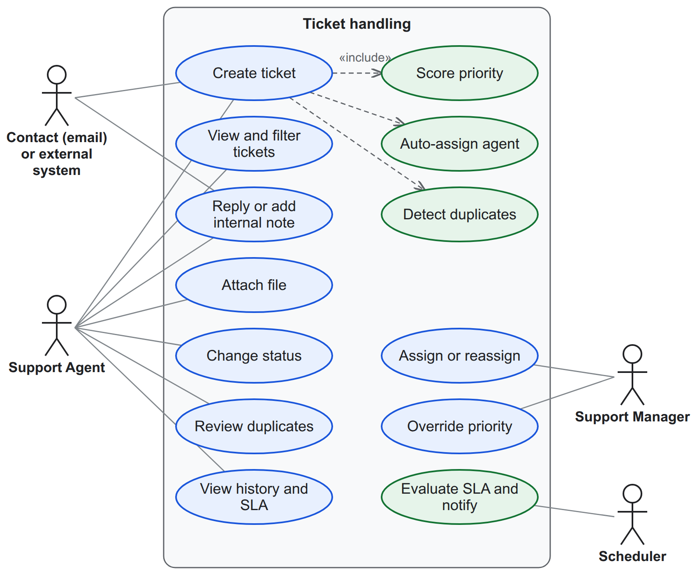

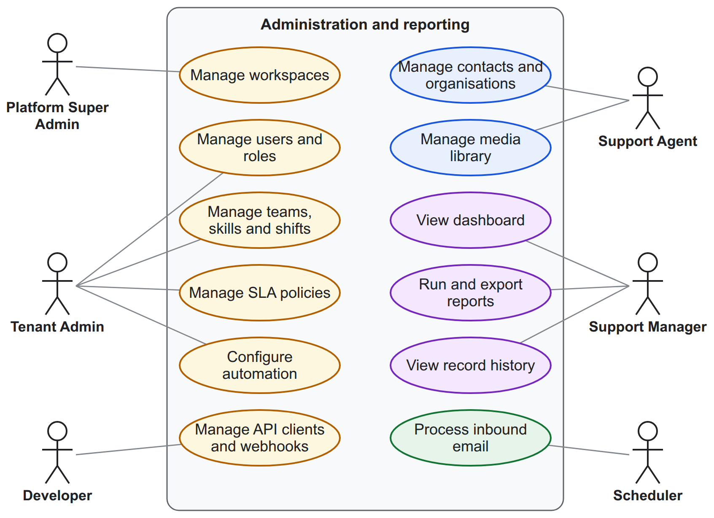

Table 3.1: Functional requirements by module

| Module | Requirement |
|---|---|
| Tenancy | Create, suspend and reactivate tenants; resolve the tenant of every request from its host; seed default roles, categories, SLA policy, calendar and settings |
| Identity | Log in with email and password; invite users; assign tenant-scoped roles made of granular permissions; enforce a permission on every endpoint |
| Contacts | Manage contacts and organisations with customer tier, tags and external identifiers |
| Agents | Manage teams, skills with levels, categories with required skills, agent capacity, availability and shifts |
| Tickets | Create tickets; move them through the lifecycle; add public replies and internal notes; attach files; record history; list, filter, sort and search |
| Automation | Score priority; assign agents; suggest duplicates; show an explanation for every automatic decision |
| SLA | Define policies and business calendars; run first-response and resolution timers; pause while pending; warn, detect breaches and escalate |
| Media | Store every file in a tenant library with folders, tags, thumbnails and a storage quota |
| Email | Send DKIM-signed notification emails; convert customer replies into comments and new emails into tickets |
| Notifications | In-app and email notifications for assignment, replies, SLA warnings and breaches |
| Integrations | Versioned REST API, OAuth2 client credentials, interactive API documentation, signed webhooks with retries |
| Reporting | Record every change to the main entities; catalogue of reports for tickets, contacts, organisations, agents, teams, SLA, email, media and integrations with filters, grouping, period comparison and drill-down; record 360 pages with history and point-in-time view; CSV and XLSX export |
| Dashboard and audit | Dashboard indicators and charts; security audit log of administrative actions |

Table 3.2: Description of use case "Create ticket"

| Field | Description |
|---|---|
| Actors | Support Agent; external system through the API; Contact through email |
| Precondition | The actor is authenticated in the tenant (or the email is routed to the tenant) |
| Main flow | 1. Actor enters title, description, contact, category, impact, urgency and attachments. 2. System shows likely duplicates. 3. Actor confirms. 4. System allocates the ticket number, computes the priority score, starts SLA timers, stores duplicate suggestions and assigns an agent. 5. System records history and sends notifications and webhooks. |
| Alternative flows | 2a. Actor marks the ticket as a duplicate; it is closed and linked to the original. 4a. No eligible agent exists; the ticket stays unassigned and managers are notified. |
| Postcondition | The ticket exists with number, priority level, explanation, SLA timers and assignment |

Table 3.3: Description of use case "Evaluate SLA and notify"

| Field | Description |
|---|---|
| Actor | Scheduler (every minute) |
| Precondition | Running timers exist |
| Main flow | 1. Select timers whose warning or due time has passed. 2. Move each to warning or breached exactly once. 3. Record SLA events and ticket history. 4. Notify the assignee (warning) or the assignee and managers (breach). |
| Postcondition | Timer states reflect the current time; notifications and webhooks are queued |

Table 3.4: Description of use case "Assign ticket"

| Field | Description |
|---|---|
| Actors | System (automatic), Support Manager (manual) |
| Main flow | 1. System filters eligible agents by availability, shift, capacity, team and skills. 2. System orders them by open tickets per unit of capacity. 3. System assigns the first agent and stores the ordered list. 4. Agent is notified. |
| Alternative flow | 1a. A manager opens the assign dialog, reviews the ranking and selects a different agent. |

Table 3.5: Description of use case "View entity history"

| Field | Description |
|---|---|
| Actor | Support Manager, Tenant Admin |
| Precondition | The actor has the history permission |
| Main flow | 1. Actor opens a contact, ticket, organisation, agent or team. 2. System shows its current state, metrics and a timeline of changes with actor and old and new values. 3. Actor selects a past date and time. 4. System reconstructs the record's attributes at that moment and highlights the differences from today. |
| Postcondition | No data is modified |

Use cases for tenant management, user and role management, SLA and calendar configuration, comments, media management, inbound email, dashboard and webhook management follow the same pattern and are listed in Appendix A.

**ii. Non-functional requirements**

Table 3.6: Non-functional requirements

| Quality | Requirement |
|---|---|
| Security | No cross-tenant access through any interface; permission check on every endpoint; login throttling; signed webhooks and emails; private object storage with short-lived signed URLs |
| Performance | Ticket list responds within 300 ms at the 95th percentile with 100 000 tickets in one tenant; ticket creation with all automation within 800 ms; SLA evaluation of 10 000 timers within 5 s |
| Reliability | Background work is queued and retried; failed webhook deliveries are retried with back-off; daily backups with a tested restore |
| Usability and accessibility | Light, dark and system themes; keyboard operation; text contrast of at least 4.5:1 [@wcag22]; loading, empty and error states on every view |
| Portability | Runs on any Linux virtual machine with Docker; storage, mail and database endpoints are configuration |
| Maintainability | Modular structure with enforced dependencies; static analysis; automated tests with full coverage of the algorithms |

### 3.1.2 Feasibility Analysis

**i. Technical feasibility.** All components are mature open-source software: Laravel 13 on PHP 8.5 [@laravel13], React 19 with the TanStack libraries [@react; @tanstack], PostgreSQL 18, Valkey, RustFS object storage and the Stalwart mail server. They run together in Docker Compose on one virtual machine with two virtual CPUs and 4 GB of memory, which was confirmed during development.

**ii. Operational feasibility.** The system follows the workflow support teams already use and adds explanations to every automatic decision so that agents can trust or override it. Administrators configure the algorithms through forms with live previews rather than code.

**iii. Economic feasibility.** No software licence is required. A single virtual machine of the required size costs roughly US$8–35 per month depending on the provider, and on-premise installations use existing hardware. Development used free tools.

**iv. Schedule feasibility.** The work was divided into 57 tasks across three milestones with an explicit dependency graph. With four parallel development tracks and continuous sessions of about sixteen hours a day, the plan computes to about seven working days plus buffer; a documented cut list protects the deadline if the estimates prove optimistic.

Table 3.7: Schedule of milestones

| Milestone | Effort (days) | Main risk | Mitigation |
|---|---|---|---|
| 1 Foundation | <<pending>> | tenancy integration | isolation test suite from the first day |
| 2 Core product | <<pending>> | algorithm complexity | algorithms built as pure classes with tests first |
| 3 Hardening and evaluation | <<pending>> | deployment and mail setup | time boxes and fallbacks |

### 3.1.3 Object Modelling using Class and Object Diagrams

The domain model (Figure 3.3) is centred on **Ticket**. A Ticket belongs to one Tenant, is requested by one Contact (which may belong to an Organisation with a customer tier), is classified by one Category, and may be assigned to one Team and one AgentProfile. A Ticket has many Comments, many ticket events (history), many Assignments, two SlaTimers, many DuplicateSuggestions and many linked MediaItems. A Category requires Skills; an AgentProfile belongs to a User, holds Skills with a level, belongs to Teams and has Shifts. An SlaPolicy has SlaTargets per priority level and may use a BusinessCalendar with Holidays. A MediaItem lives in a MediaFolder and can be linked to tickets, comments or branding. Integration classes are WebhookSubscription, WebhookDelivery and ApiClient; InboundEmail records received messages. For reporting, EntityChange records every change of a reportable entity, TicketInterval describes a continuous period of a ticket's state, TicketFact summarises a ticket's lifecycle, DailySnapshot stores end-of-day values, and ReportDefinition describes a catalogue report.

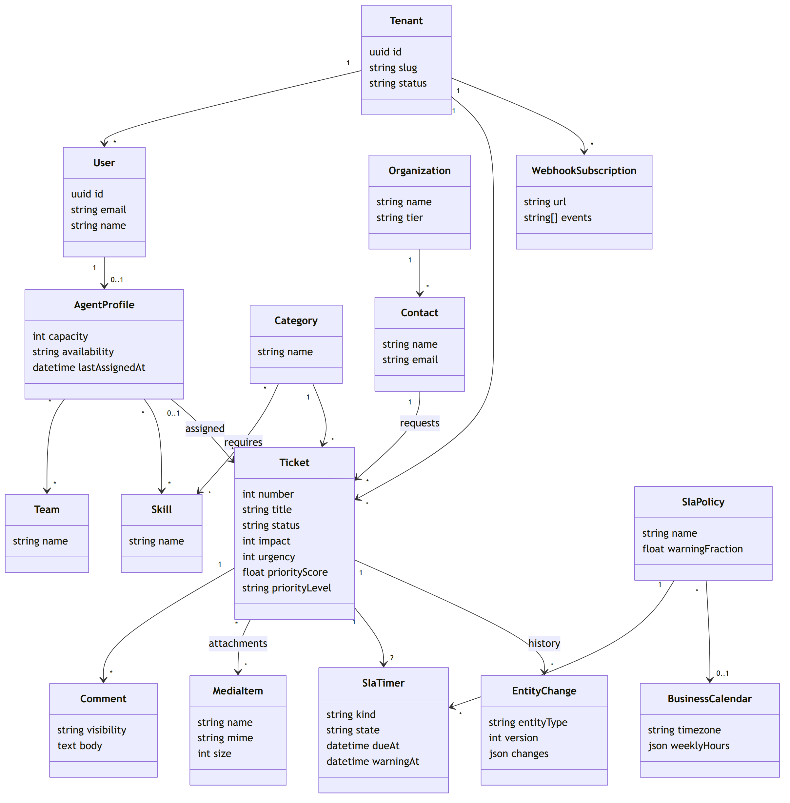

Figure 3.4 shows an object diagram for a seeded tenant "Acme": ticket #1042 requested by contact Ravi of organisation Globex (tier premium), in category Billing requiring skills billing and refunds, assigned to agent Asha of team Finance Support, with a resolution timer of 8 hours under the policy "Default" using the calendar "Kathmandu office hours".

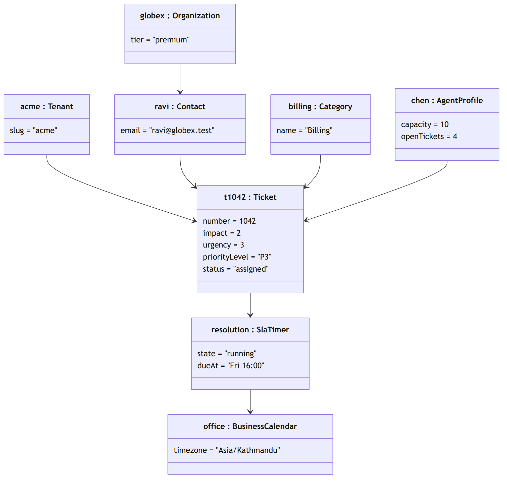

### 3.1.4 Dynamic Modelling using State and Sequence Diagrams

The ticket lifecycle (Figure 3.5) has six states. A new ticket is open; assignment moves it to assigned; work moves it to in progress; waiting for the customer moves it to pending; resolution requires a resolution comment; a resolved ticket is closed manually or automatically, and can be reopened within the reopen window. Any other transition is rejected by the server.

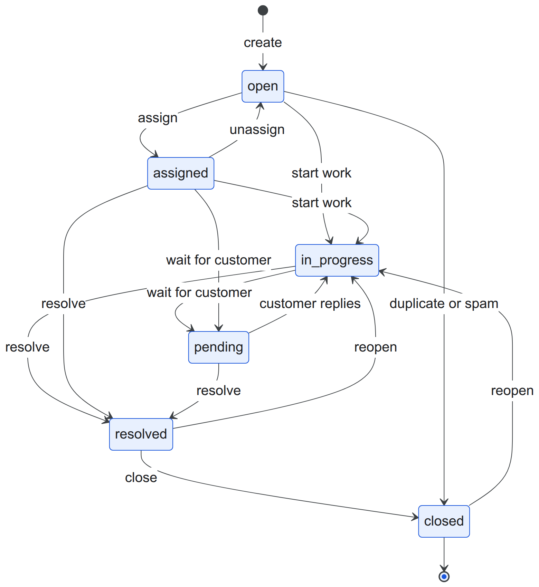

Each ticket also has SLA timers that run concurrently with the lifecycle (Figure 3.6). A timer is running, paused, in warning, breached, met or cancelled; the two state machines interact only through events such as "ticket became pending" and "first public reply".

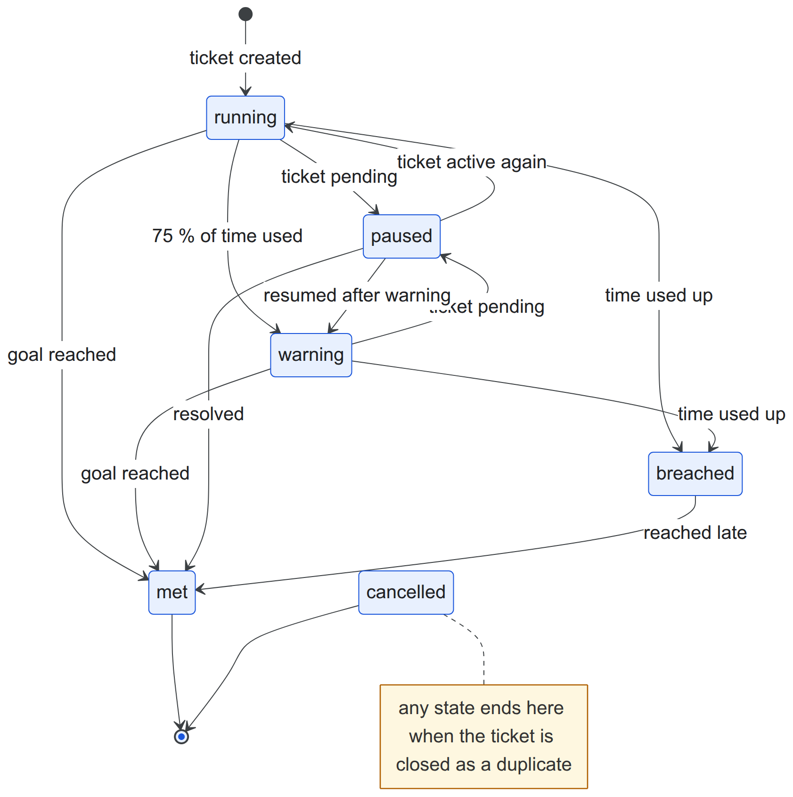

Figure 3.7 shows the sequence of creating a ticket, in which the create-ticket action calls the priority, SLA, duplicate and assignment strategies inside one database transaction and publishes events after commit. Figure 3.8 shows tenant resolution and login, Figure 3.9 the SLA sweep, Figure 3.10 webhook delivery with retries and Figure 3.11 processing of an inbound email.

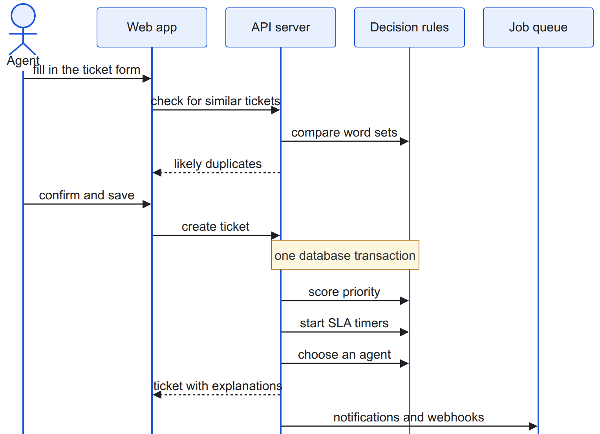

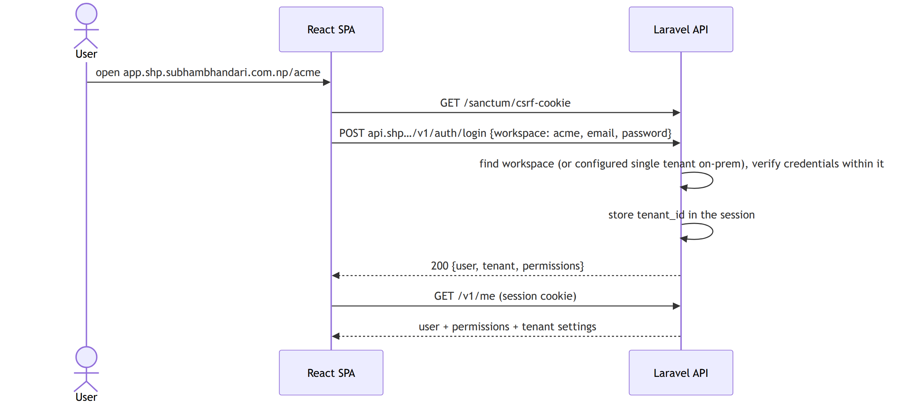

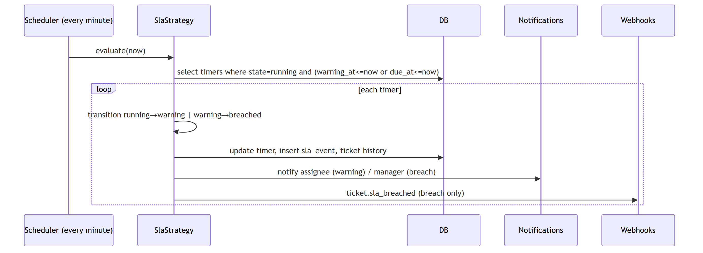

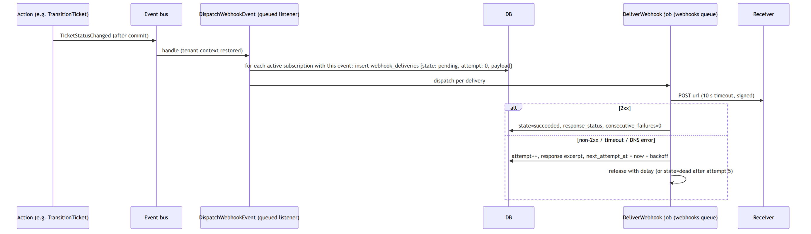

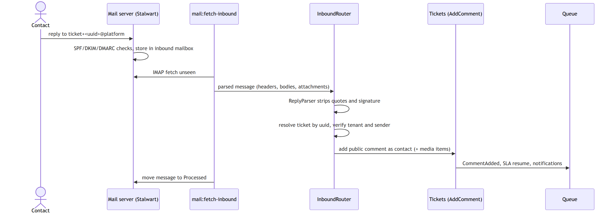

### 3.1.5 Process Modelling using Activity Diagrams

Figure 3.12 shows the agent assignment activity, including the case where no agent is eligible. Figure 3.13 shows duplicate detection from word extraction to the threshold decision. Figure 3.14 shows the hourly re-evaluation of open tickets, and Figure 3.15 the routing of an inbound email to a comment, a new ticket or rejection.

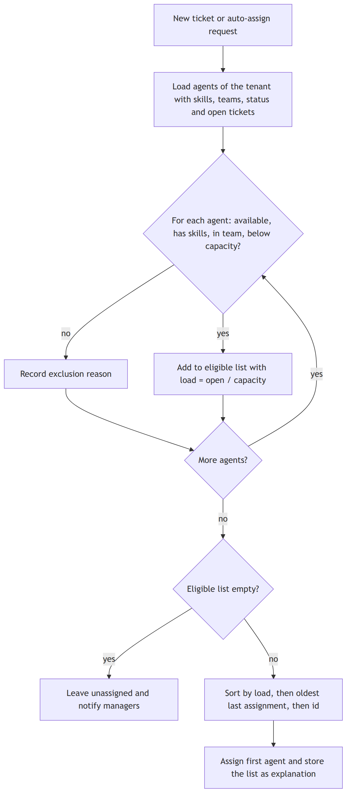

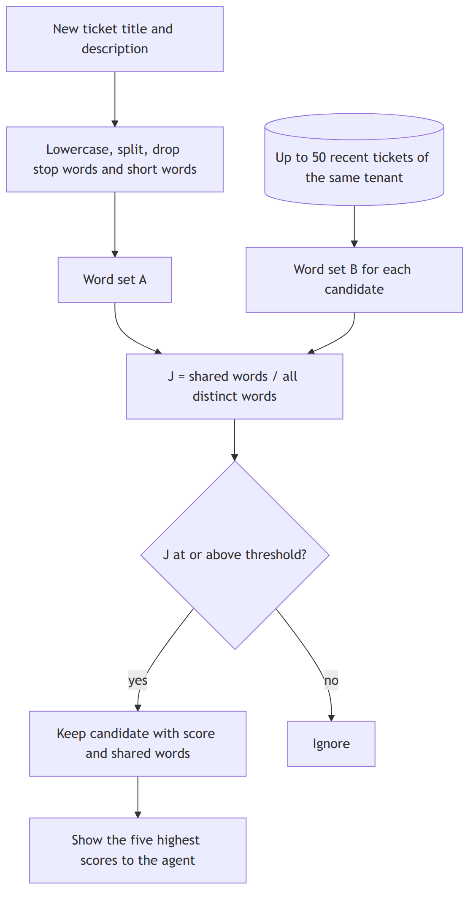

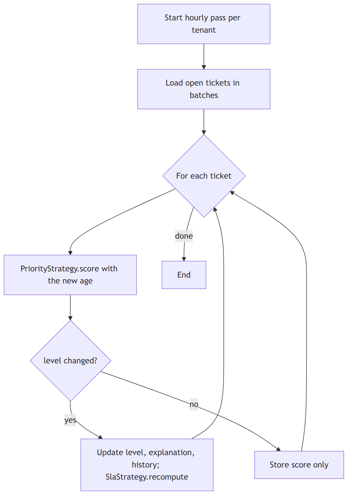

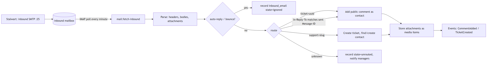

## 3.2 System Design

### 3.2.1 Refinement of Class, Object, State, Sequence and Activity Diagrams

The analysis classes were refined into implementation classes organised by module. Algorithms became strategy interfaces (`PriorityStrategy`, `AssignmentStrategy`, `DuplicateStrategy`, `SlaStrategy`) with baseline implementations (`BasicWeightedPriority`, `LeastLoadedAgent`, `JaccardDuplicates`, `SimpleSlaTimer`) and helper classes (`WorkingHoursCalendar`, `ReplyParser`) that receive plain input objects and return result objects containing an explanation. Write operations became single-purpose action classes (`CreateTicket`, `AssignTicket`, `TransitionTicket`, `AddComment`, `RegisterUpload`) that run inside transactions and publish events. The ticket state diagram became an enumeration with a transition table, and the SLA state diagram became a table-driven transition function. Figure 3.16 shows the refined class diagram of the automation module.

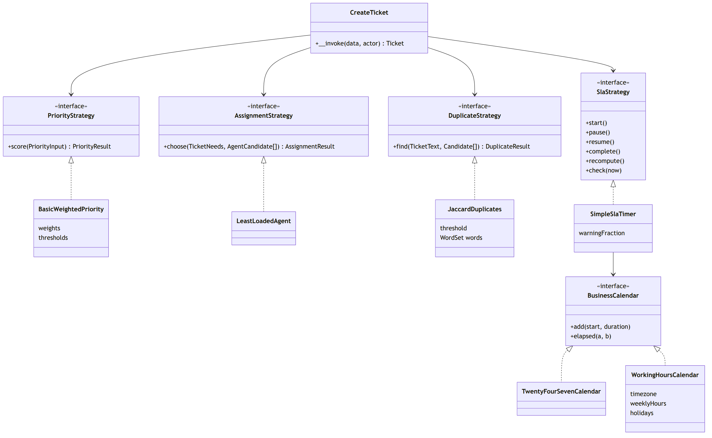

The database design follows the refined classes (Figure 3.17). Every tenant-owned table has a `tenant_id` column and a row-level security policy; primary keys are UUID version 7; ticket numbers are allocated per tenant under a row lock; a generated full-text vector and trigram indexes support search and duplicate candidate retrieval.

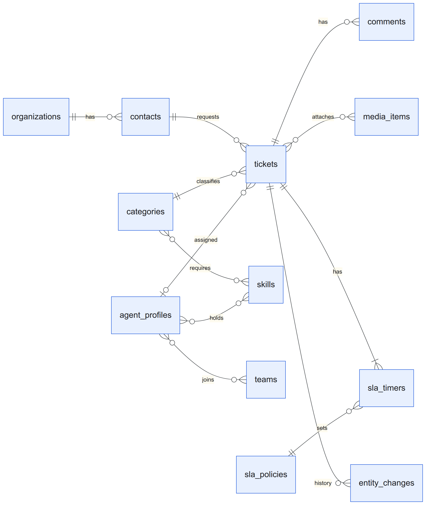

### 3.2.2 Component Diagrams

The backend is a modular monolith (Figure 3.18): Platform, Tenancy, Identity, Contacts, Agents, Tickets, SLA, Automation, Media, Mail, Notifications, Integrations, Reporting and Audit. Dependencies point in one direction; notification, integration, analytics and audit components only react to events or read data. The frontend is a single-page application divided into feature components (tickets, contacts, agents, SLA, automation settings, media, reports, dashboard, integrations) on top of a shared design system.

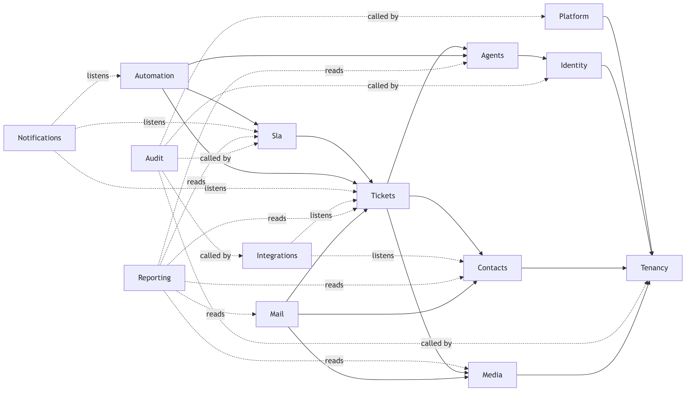

### 3.2.3 Deployment Diagrams

Figure 3.19 shows the deployment on one virtual machine. The platform is published under shp.subhambhandari.com.np with separate hosts for the application (app), API (api), platform administration (admin), monitoring (monitor), documentation (docs), file storage (files) and mail (mail); organisations are workspaces within the application's address, and the organisation of each request is taken from the user's session or the API client, never from the address. A Caddy reverse proxy terminates TLS for the fixed application hosts (application, API, administration, monitoring, documentation, files and mail under shp.subhambhandari.com.np) and serves the application; the PHP application, queue workers and scheduler run from one container image; PostgreSQL, Valkey, RustFS and the Stalwart mail server run as separate containers on an internal network. The same arrangement is used on a developer workstation, on an organisation's own server and on a virtual machine from any cloud provider; Ansible configures the host.

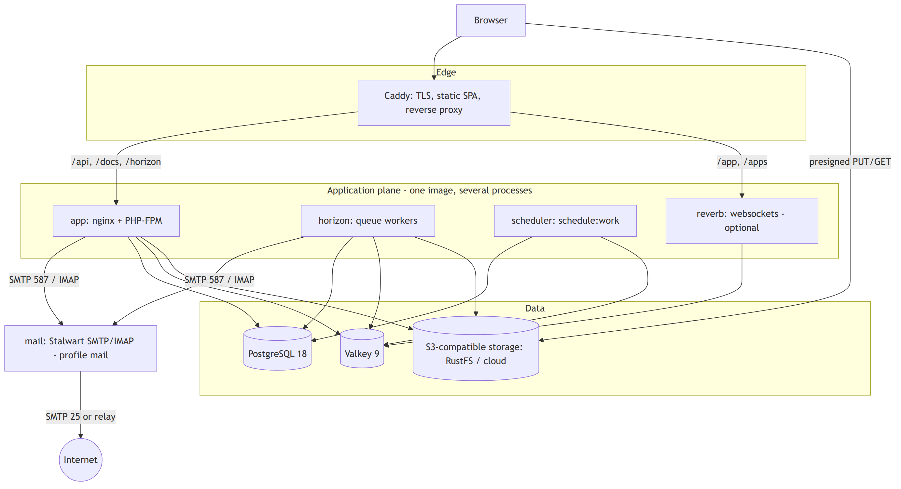

## 3.3 Algorithm Details

The four decision algorithms are deliberately simple baselines. Each is implemented behind an interface (strategy) so that it can be replaced by a stronger technique after this project without changing the rest of the system, and each decision stores the name and version of the strategy that made it.

### 3.3.1 Priority scoring: basic weighted priority

The priority score is a weighted sum of four values scaled to the range 0–1, a form of simple additive weighting [@saw2016]. Impact and urgency are the inputs commonly used by service-management tools [@atlassianPriority]; customer tier reflects the importance of the requester; waiting time is an ageing term that raises tickets that have waited long [@silberschatz].

Table 3.8: Inputs of the priority score

| Input | Values | Scaled value | Weight |
|---|---|---|---|
| Impact | 1 (one user) to 4 (whole organisation) | (impact − 1) ÷ 3 | 0.40 |
| Urgency | 1 (low) to 4 (immediate) | (urgency − 1) ÷ 3 | 0.35 |
| Customer tier | standard, premium, enterprise | 0, 0.5, 1 | 0.15 |
| Waiting time | hours since creation | min(1, hours ÷ 72) | 0.10 |

```text
score = 100 × (0.40 × impact' + 0.35 × urgency' + 0.15 × tier' + 0.10 × age')
level = P1 if score ≥ 75, P2 if score ≥ 50, P3 if score ≥ 25, otherwise P4

function score(ticket, now):
    total ← 0
    for each (name, weight, scaled value) of the four inputs:
        part ← 100 × weight × value
        total ← total + part
        record (name, value, weight, part) in the explanation
    return total, level(total), explanation
```

The score is computed on creation, when an input changes and hourly for open tickets; a manager's manual priority always takes precedence. The cost is constant per ticket. For example, a ticket with impact 2, urgency 3 and a premium customer scores 13.3 + 23.3 + 7.5 + 3.3 = 47.5 (P3) after 24 hours and 54.2 (P2) after 72 hours, which shows the ageing effect.

### 3.3.2 Agent assignment: least-loaded eligible agent

The rule combines the least-connections method of load balancers [@nginxLB] with the skill filter used in contact centres [@gans2003]. An agent is eligible when available (and on shift if shifts are enforced), holding all skills the category requires, in the ticket's team if one is set, and below capacity. Among eligible agents the one with the smallest ratio of open tickets to capacity is chosen; ties go to the agent assigned least recently, which behaves like round robin.

```text
function choose(ticket, agents):
    eligible ← agents that pass every eligibility rule (others recorded with the failed rule)
    if eligible is empty: leave the ticket unassigned and notify managers
    sort eligible by (open ÷ capacity, last assignment time, id)
    return the first agent and the sorted list as explanation
```

The cost is O(A log A) for A agents. For example, if Asha and Chen both have 3 of 10 tickets and Bikram has 2 of 5, Bikram's load (0.40) is higher than theirs (0.30); Chen, assigned earlier than Asha, receives the ticket. Fairness is measured with Jain's index [@jain1984].

### 3.3.3 Duplicate detection: Jaccard word overlap

Following the first duplicate-report detectors, which compared the words of a new report with existing reports [@runeson2007], each ticket is reduced to a set of words: the title and description are lower-cased, split on characters other than letters, digits and hyphens, and stripped of stop words and words shorter than three characters. Two sets are compared with the Jaccard similarity [@manning2008]:

```text
J(A, B) = |A ∩ B| ÷ |A ∪ B|

function find(ticket, candidates):              // same tenant, last 30 days, not closed, at most 50
    A ← words(ticket)
    for c in candidates:
        B ← words(c)
        if |A ∩ B| ÷ |A ∪ B| ≥ 0.35: keep (c, score, A ∩ B)
    return the five highest scores
```

For "Cannot login after password reset" against "Login fails after resetting password", the sets share five of ten distinct words (J = 0.50) and the older ticket is suggested; an unrelated invoice ticket scores 0.15 and is ignored. The comparison costs O(K × W) for K candidates of about W words. The method is transparent but misses paraphrases and word forms, which the planned replacement addresses [@robertson2009; @sun2011].

### 3.3.4 SLA evaluation: simple SLA timer

Each ticket has a first-response timer and a resolution timer, each a small state machine [@harel1987] with the states running, paused, warning, breached, met and cancelled. Deadlines are computed through a calendar that counts either all hours or only the organisation's working hours.

```text
start:            due ← cal.add(now, target); warn ← cal.add(now, 0.75 × target)
enter pending:    paused_at ← now
leave pending:    d ← cal.elapsed(paused_at, now); due ← cal.add(due, d); warn ← cal.add(warn, d)
priority change:  due ← cal.add(started_at, new target + paused time)
goal reached:     state ← met   (first public reply, or ticket resolved)
every minute:     running and now ≥ warn → warning, notify assignee (once)
                  not met and now ≥ due  → breached, notify assignee and managers (once)
```

For a P2 ticket with an eight-hour resolution target created at 09:00 and waiting for the customer from 10:00 to 12:00, the warning moves from 15:00 to 17:00 and the deadline from 17:00 to 19:00. With office hours of 10:00–17:00, an eight-hour target starting on Thursday at 15:00 ends on Friday at 16:00. The minute check reads only due timers through an index and records when each notification was sent, so running it twice has no additional effect.

### 3.3.5 History reconstruction and time analytics

A database trigger records each insert, update and delete on reportable tables as a change row containing only the attributes that changed, with their old and new values, the actor and the time. The state of a record at a past instant t is rebuilt by starting from the current row and undoing, newest first, every change made after t:

```text
function asOf(entity, t):
    changes ← changes of entity with occurred_at > t, newest first
    state ← current row (or the last values stored in its delete change)
    for c in changes:
        if c is the creation: return "did not exist at t"
        for (attribute, old, new) in c: state[attribute] ← old
    return state
```

For analysis over time, each ticket's ordered events are swept into non-overlapping intervals of constant status, assignee, team and priority:

```text
function intervals(events, calendar, now):
    state ← initial state; start ← creation time; result ← []
    for e in events ordered by time:
        next ← apply(state, e)
        if next ≠ state:
            result.append(state, start, e.time, calendar.elapsed(start, e.time))
            state, start ← next, e.time
    result.append(state, start, open, calendar.elapsed(start, now))
    return result
```

Time in a status is the sum of the matching intervals; the backlog at an instant is the number of unresolved intervals containing it; an agent's workload over time is the priority-weighted count of that agent's intervals. Reconstruction costs O(k) for k later changes and interval building O(e) for e events of a ticket. Daily snapshots are computed from the intervals after midnight in the organisation's time zone, and every derived table can be rebuilt from the recorded history and checked for drift.

