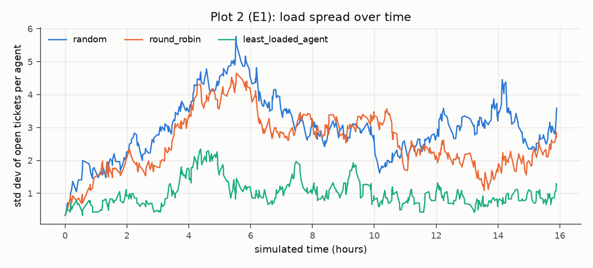

# Chapter 4: Implementation and Testing

## 4.1 Implementation

### 4.1.1 Tools Used

Table 4.1: Tools and technologies

| Category | Tool | Version | Purpose |
|---|---|---|---|
| Backend language and framework | PHP, Laravel | 8.5, 13 | API, queues, scheduling, mail, validation |
| Frontend | React, TypeScript, Vite | 19.3, 7.0, 8.3 | single-page application |
| Reporting export | openspout | 5.11 | XLSX export |
| Frontend libraries | TanStack Router, Query, Table, Form; Zod | 1.x, 5.x, 9.x, 1.x; 4.x | routing, server state, tables, forms, validation |
| UI and styling | Tailwind CSS, shadcn/ui on Base UI, Lucide, Recharts | 4.3, CLI 4.x, 1.8, 1.x, 3.10 | design system, components, icons, charts |
| Database | PostgreSQL | 18 | relational data, full-text and trigram search, row-level security |
| Cache and queues | Valkey, Laravel Horizon | 9, 5.49 | cache, queues, locks, queue monitoring |
| Tenancy and access | Tenancy for Laravel, spatie/laravel-permission, Sanctum, Passport | 3.10, 8.3, 4.3, 13.8 | tenant resolution, permissions, sessions, OAuth2 |
| Files and email | RustFS, intervention/image, Stalwart, webklex/laravel-imap | 1.0, 4.3, 0.16, 6.2 | object storage, thumbnails, mail server, inbound email |
| API documentation | Scramble | 0.13 | OpenAPI 3.1 and interactive documentation |
| Testing | Pest, Vitest, Playwright, axe-core | 5.2, 5.0, 1.63, 4.13 | unit, component, end-to-end and accessibility tests |
| Code quality | Larastan, Pint, Biome | 3.12, 1.32, 2.5 | static analysis, formatting, linting |
| Infrastructure | Docker Compose, Caddy, Ansible, OpenTofu | 5.x, 2.11, 2.21, 1.12 | containers, reverse proxy and TLS, host configuration, optional provisioning |
| CASE and diagramming | Mermaid, draw.io | — | UML and architecture diagrams |
| Editors and assistance | VS Code, Claude Code | — | development and AI-assisted coding |
| Version control and CI | Git, GitHub Actions | — | source control and automated checks |

### 4.1.2 Implementation Details of Modules

Each backend module is a namespace under `app/Modules` with its own routes, models, actions, domain classes, jobs, events, policies and migrations. The descriptions below name the main classes and methods; detailed listings are in Appendix B. <<to be completed after implementation with the final class and method names>>

**Tenancy module.** `ResolveTenant` middleware identifies the tenant from the request host or the single-tenant setting; `EnsureTenantMembership` rejects users and API clients of other tenants; `RlsTenancyBootstrapper` sets the PostgreSQL session variable used by row-level security and the permission team identifier; `ProvisionTenant` creates a tenant with its defaults.

**Identity module.** Authentication controllers implement login, logout, invitation acceptance and password reset on top of Sanctum sessions; `SetPermissionsTeam` scopes roles to the tenant; the permission catalogue seeder defines permissions such as `tickets.assign` and `sla.manage`.

**Tickets module.** `TicketStatus` holds the transition table; `CreateTicket` allocates the ticket number with a row lock and orchestrates the automation; `TransitionTicket`, `AddComment`, `AssignTicket` and `MarkDuplicate` implement the lifecycle; `TicketListQuery` applies filters, sorting and full-text search with server-side pagination.

**Automation module.** The interfaces `PriorityStrategy`, `AssignmentStrategy` and `DuplicateStrategy` are bound in configuration to the baselines `BasicWeightedPriority` (returns a `PriorityResult` with four parts), `LeastLoadedAgent` (returns an `AssignmentResult` with the ordered candidates and exclusion reasons) and `JaccardDuplicates` (uses `WordSet` and returns matches with shared words). Each baseline carries an `AcademicBaseline` attribute marking it for replacement after the defence.

**SLA module.** `SimpleSlaTimer`, the baseline of `SlaStrategy`, implements start, pause, resume, complete, cancel, recompute and check; `WorkingHoursCalendar` and `TwentyFourSevenCalendar` implement the `BusinessCalendar` interface; the `sla:evaluate` command runs every minute.

**Media module.** `RegisterUpload` issues presigned upload URLs; `CompleteUpload` verifies size, MIME type and checksum; `GenerateImageVariants` creates thumbnails; quota counters are maintained under a row lock.

**Mail module.** Outbound mailables set threading headers and reply addresses; `FetchInboundEmail` reads the inbound mailbox; `ReplyParser` removes quoted text and signatures; `InboundRouter` decides whether a message becomes a comment, a new ticket or is rejected.

**Reporting module.** The migration installs `record_entity_change()` and attaches it to every reportable table; the tenancy bootstrapper sets the actor and request identifiers used by the trigger. `ChangeReplayer::asOf()` reconstructs records; `IntervalBuilder` and the `RefreshTicketReport` job maintain intervals and facts; `reports:snapshot-daily`, `reports:rebuild` and `reports:verify` maintain snapshots and detect drift; `ReportRunner` executes catalogue `ReportDefinition` classes with allow-listed dimensions and measures; `ExportReport` writes CSV and XLSX files to the media library.

**Integrations module.** Passport client-credentials clients are bound to tenants; `DeliverWebhook` signs payloads with HMAC-SHA256, enforces timeouts and SSRF protection, and retries with exponential back-off.

**Frontend.** Features are organised by domain. `DataTable` binds TanStack Table to URL search parameters for server-side paging, sorting and filtering; forms use TanStack Form with Zod schemas; explanation panels render the stored algorithm explanations; the design system defines semantic colour, typography, spacing and motion tokens with light, dark and system themes.

## 4.2 Testing

Testing followed a pyramid of fast unit tests for the algorithms and domain classes, feature tests for every API endpoint, a tenant isolation suite, a permission matrix, component tests for interactive UI parts and end-to-end tests of the main workflows. All tests ran in continuous integration against PostgreSQL.

Table 4.2: Test summary

| Level | Tool | Number of tests | Passed | Coverage |
|---|---|---|---|---|
| Backend unit (algorithms and domain) | Pest | <<pending>> | <<pending>> | <<pending>> |
| Backend feature and API | Pest | <<pending>> | <<pending>> | <<pending>> |
| Tenant isolation | Pest | <<pending>> | <<pending>> | — |
| Permission matrix | Pest | <<pending>> | <<pending>> | — |
| Frontend unit and component | Vitest | <<pending>> | <<pending>> | <<pending>> |
| End-to-end and accessibility | Playwright, axe | <<pending>> | <<pending>> | — |

### 4.2.1 Test Cases for Unit Testing

Table 4.3: Unit test cases (selection)

| ID | Module | Description | Input | Expected result | Actual | Status |
|---|---|---|---|---|---|---|
| UT-01 | Priority | Parts add up to the score | any ticket | sum of parts equals score | <<pending>> | <<pending>> |
| UT-02 | Priority | Outage for the whole organisation | impact 4, urgency 4, enterprise, 0 h | score 90.0, level P1 | <<pending>> | <<pending>> |
| UT-03 | Priority | Ageing raises level | impact 2, urgency 3, premium at 24 h and 72 h | 47.5 (P3), then 54.2 (P2) | <<pending>> | <<pending>> |
| UT-04 | Priority | Threshold boundary | score exactly 50 | level P2 | <<pending>> | <<pending>> |
| UT-05 | Priority | Manual override | computed P3, override P1 | effective level P1, score still shown | <<pending>> | <<pending>> |
| UT-06 | Assignment | Missing skill excludes agent | agent without required skill | excluded with reason | <<pending>> | <<pending>> |
| UT-07 | Assignment | Lowest load wins | 3/10, 2/5, 3/10 | an agent with load 0.30 | <<pending>> | <<pending>> |
| UT-08 | Assignment | Tie goes to oldest assignment | equal loads, last assigned 09:40 and 09:10 | agent assigned at 09:10 | <<pending>> | <<pending>> |
| UT-09 | Assignment | No eligible agent | all agents away | no assignment, reasons recorded | <<pending>> | <<pending>> |
| UT-10 | Assignment | Full capacity | agent with 10 of 10 | excluded | <<pending>> | <<pending>> |
| UT-11 | Duplicates | Word extraction | "Login page shows ERR-401 after I reset" | {login, page, shows, err-401, reset} | <<pending>> | <<pending>> |
| UT-12 | Duplicates | Jaccard bounds | identical / disjoint word sets | 1 / 0 | <<pending>> | <<pending>> |
| UT-13 | Duplicates | Worked example | login-after-reset pair; invoice ticket | 0.50 suggested; 0.15 ignored | <<pending>> | <<pending>> |
| UT-14 | Duplicates | At most five suggestions | eight candidates above threshold | five highest returned | <<pending>> | <<pending>> |
| UT-15 | SLA | Warning fires once | check twice after warning time | one warning event | <<pending>> | <<pending>> |
| UT-16 | SLA | Pause extends deadline | pending for 2 h | due time + 2 h | <<pending>> | <<pending>> |
| UT-17 | SLA | Working hours | 8 h target from Thursday 15:00, office 10–17 | due Friday 16:00 | <<pending>> | <<pending>> |
| UT-18 | SLA | Holiday skipped | due date falls on a holiday | due on next working day | <<pending>> | <<pending>> |
| UT-19 | SLA | Priority change recomputes from start | P2 → P1 at 13:00 after 2 h pause | due 15:00 | <<pending>> | <<pending>> |
| UT-20 | Tickets | Illegal transition rejected | closed → pending | error `invalid_transition` | <<pending>> | <<pending>> |
| UT-21 | Mail | Quoted reply removed | Gmail reply with quote | only new text kept | <<pending>> | <<pending>> |
| UT-22 | Strategies | Contract suite | each baseline | deterministic, bounded, explanation has strategy name and version | <<pending>> | <<pending>> |
| UT-23 | History | Reconstruction equals saved versions | random update sequence with saved rows | as-of result equals each saved row | <<pending>> | <<pending>> |
| UT-24 | History | Interval sweep | created, assigned, pending, resolved, reopened events | five intervals with correct durations | <<pending>> | <<pending>> |
| UT-25 | History | Trigger ignores no-op update | update with identical values | no change row | <<pending>> | <<pending>> |
| UT-26 | Webhooks | Signature verification | payload, secret, timestamp | valid signature accepted; altered body rejected | <<pending>> | <<pending>> |

### 4.2.2 Test Cases for System Testing

Table 4.4: System test cases

| ID | Scenario | Steps | Expected result | Status |
|---|---|---|---|---|
| ST-01 | Tenant onboarding | platform admin creates tenant; owner accepts invitation; owner logs in | tenant reachable at its subdomain with defaults | <<pending>> |
| ST-02 | Golden path | agent creates contact and ticket; system prioritises, assigns and starts SLA; agent replies; resolves; closes | each step visible with explanations; contact receives emails | <<pending>> |
| ST-03 | Duplicate handling | create a ticket similar to an existing one; mark as duplicate | suggestion shown with score; ticket closed and linked | <<pending>> |
| ST-04 | SLA escalation | advance the clock past warning and due times | warning and breach notifications; priority raised | <<pending>> |
| ST-05 | Tenant isolation | user of tenant B opens tenant A's ticket URL and API resource | 404 for every resource; no data in search or files | <<pending>> |
| ST-06 | Email reply | contact replies to a notification email | reply appears as a public comment | <<pending>> |
| ST-07 | Integration | API client obtains token and creates a ticket; webhook receiver verifies delivery | ticket created; signed delivery verified | <<pending>> |
| ST-08 | Media library | upload images; view thumbnails; exceed quota | thumbnails generated; upload beyond quota rejected | <<pending>> |
| ST-09 | Theme and accessibility | switch themes; navigate with keyboard; run accessibility scan | preference persisted; no serious violations | <<pending>> |
| ST-11 | Reporting and history | open backlog report for 30 days; drill into a day; open a ticket's history; view it as of three days earlier; export XLSX | numbers match the records; earlier state shown; file downloads | <<pending>> |
| ST-10 | Deployment | run Ansible against a fresh virtual machine | HTTPS instance with demo data | <<pending>> |

## 4.3 Result Analysis

All experiments were executed with fixed random seeds on versioned datasets; each result table below is generated from the experiment output files.

### 4.3.1 Agent assignment fairness

The synthetic workload contained eight agents with different skills and capacities and 500 tickets with seeded arrival times [@harchol2013]. Three policies were compared.

Table 4.5: Assignment fairness by policy

| Policy | Jain's index | Standard deviation | Max load | Min load | Capacity overflows |
|---|---|---|---|---|---|
| Random (skills respected) | <<pending>> | <<pending>> | <<pending>> | <<pending>> | <<pending>> |
| Round robin (skills respected) | <<pending>> | <<pending>> | <<pending>> | <<pending>> | <<pending>> |
| Least-loaded eligible agent (baseline) | <<pending>> | <<pending>> | <<pending>> | <<pending>> | <<pending>> |

### 4.3.2 Duplicate detection accuracy

The labelled dataset contained 300 ticket pairs (100 duplicates, 200 non-duplicates of which 50 were from the same category). The threshold was chosen on 70 % of the pairs and the results are reported on the remaining 30 %. Accuracy is not reported because non-duplicates dominate [@manning2008].

Table 4.6: Jaccard duplicate check at selected thresholds

| Threshold | TP | FP | FN | Precision | Recall | F1 |
|---|---|---|---|---|---|---|
| 0.25 | <<pending>> | <<pending>> | <<pending>> | <<pending>> | <<pending>> | <<pending>> |
| 0.35 | <<pending>> | <<pending>> | <<pending>> | <<pending>> | <<pending>> | <<pending>> |
| 0.45 | <<pending>> | <<pending>> | <<pending>> | <<pending>> | <<pending>> | <<pending>> |
| 0.55 | <<pending>> | <<pending>> | <<pending>> | <<pending>> | <<pending>> | <<pending>> |

Table 4.7: Word sets compared

| Configuration | F1 at chosen threshold | Recall@5 |
|---|---|---|
| Title only | <<pending>> | <<pending>> |
| Title and description (baseline) | <<pending>> | <<pending>> |
| Runeson et al., top five (reported) [@runeson2007] | — | 0.30 |

### 4.3.3 Priority scoring behaviour

Each weight was changed by ±0.1 while the others were rescaled so that the weights still sum to one; the table counts how many of 200 generated tickets changed level [@saltelli2008].

Table 4.8: Effect of weight changes on priority levels

| Weight changed | −0.1: tickets changing level (%) | +0.1: tickets changing level (%) |
|---|---|---|
| Impact (0.40) | <<pending>> | <<pending>> |
| Urgency (0.35) | <<pending>> | <<pending>> |
| Customer tier (0.15) | <<pending>> | <<pending>> |
| Waiting time (0.10) | <<pending>> | <<pending>> |

### 4.3.4 SLA scenario verification

Table 4.9: SLA scenarios

| Scenario | Expected outcome | Actual | Status |
|---|---|---|---|
| Reply within target | first response met | <<pending>> | <<pending>> |
| Pending for two hours | resolution due moved by two hours | <<pending>> | <<pending>> |
| No reply | warning then breach, once each | <<pending>> | <<pending>> |
| Priority raised after a pause | deadline recomputed from the start | <<pending>> | <<pending>> |
| Reopened ticket | new resolution cycle | <<pending>> | <<pending>> |
| Closed as duplicate | timers cancelled | <<pending>> | <<pending>> |
| Business hours overnight | deadline next working morning | <<pending>> | <<pending>> |
| Holiday inside timer | holiday skipped | <<pending>> | <<pending>> |
| Sweep run twice | events emitted once | <<pending>> | <<pending>> |

### 4.3.5 Performance

Table 4.10: Response times with 100 000 tickets in one tenant

| Operation | Requests | Median (ms) | 95th percentile (ms) | Errors |
|---|---|---|---|---|
| List tickets (25 rows, filtered) | <<pending>> | <<pending>> | <<pending>> | <<pending>> |
| Ticket detail | <<pending>> | <<pending>> | <<pending>> | <<pending>> |
| Create ticket with automation | <<pending>> | <<pending>> | <<pending>> | <<pending>> |
| Dashboard | <<pending>> | <<pending>> | <<pending>> | <<pending>> |
| SLA sweep (10 000 timers) | — | <<pending>> | — | — |

### 4.3.6 Reporting correctness and cost

Table 4.11: History and reporting results

| Measure | Expected | Actual |
|---|---|---|
| As-of reconstruction correct (1 000 random samples) | 100 % | <<pending>> |
| Incremental and rebuilt read models agree | 100 % | <<pending>> |
| Heaviest report, 95th percentile (ms) | < 1 000 | <<pending>> |
| Ticket update latency overhead from change capture | small | <<pending>> |

### 4.3.7 Discussion and threats to validity

<<to be written after the experiments>>: interpretation of the fairness results, the chosen duplicate threshold and the words that caused errors, the most influential priority weight and the performance margin; what each result implies for the replacement strategies. Threats to validity to discuss: the algorithms are intentionally simple baselines; synthetic data is easier than real tickets; hand-labelled pairs were produced by a single annotator; thresholds were tuned on 70 % of the pairs and reported on the remaining 30 %; performance was measured on one machine.
