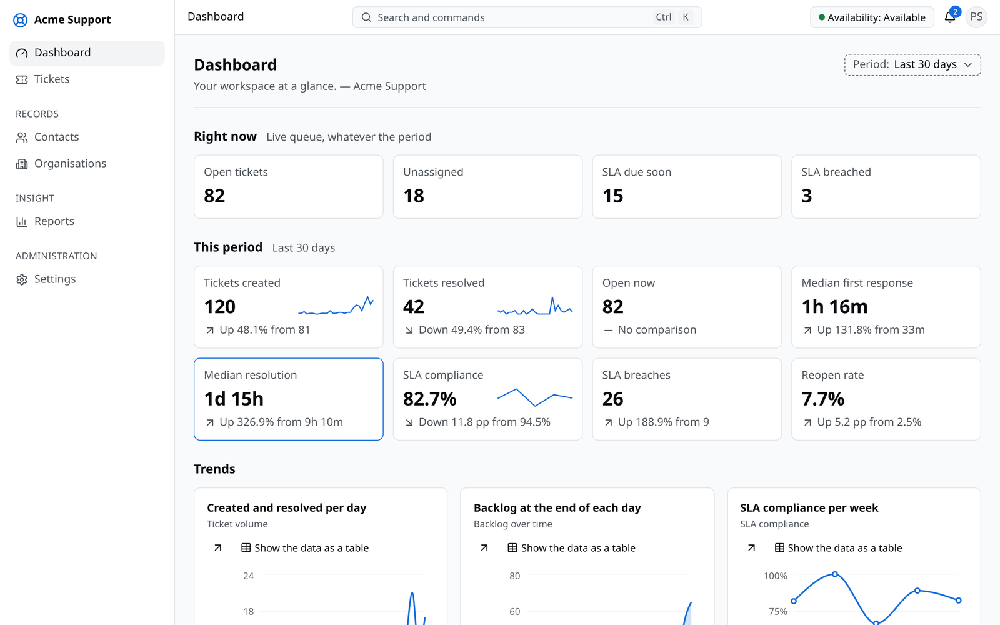
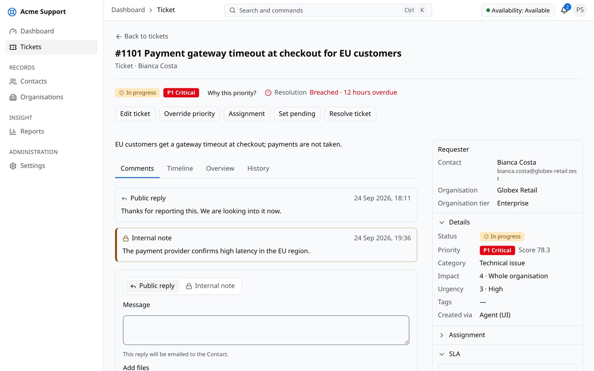
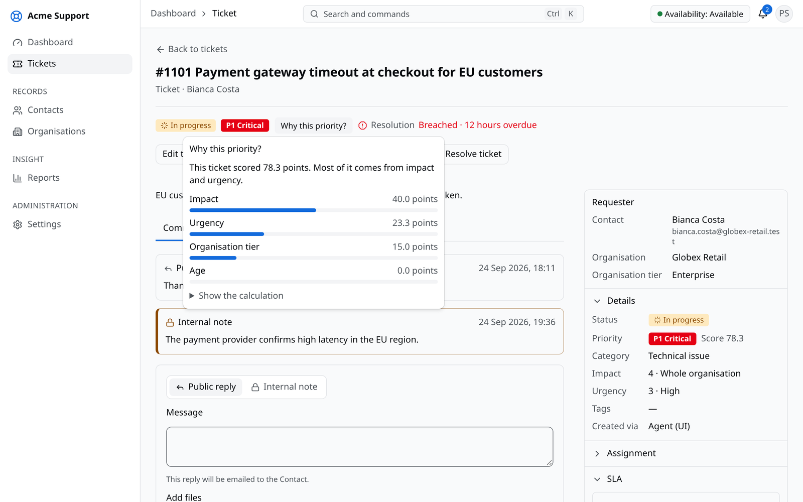

# Chapter 4: Implementation and Testing

## 4.1 Implementation

### 4.1.1 Tools Used

Table 4.1 lists the tools and technologies used to build and test the system.

Table 4.1: Tools and technologies

| Category | Tool | Purpose |
|---|---|---|
| Backend | PHP 8.5, Laravel 13 | API, background jobs, scheduling, mail, validation |
| Frontend | React 19, TypeScript, Vite | single-page web application |
| Frontend libraries | TanStack Router, Query, Table and Form; Zod | routing, server data, tables, forms, validation |
| User interface | Tailwind CSS, shadcn/ui, Lucide icons, Recharts | design system, components, icons, charts |
| Database | PostgreSQL 18 | relational data, text search, row-level security |
| Cache and queues | Valkey, Laravel Horizon | cache, background job queues and their monitoring |
| Files and email | RustFS object storage, Stalwart mail server | file storage, sending and receiving email |
| API documentation | Scramble | interactive API reference |
| Infrastructure | Docker Compose, Caddy, Ansible, OpenTofu | containers, HTTPS proxy, server setup, cloud provisioning |
| Diagrams | Mermaid | use case, class, object, state, sequence, activity, component and deployment diagrams |
| Testing | Google Chrome, Mozilla Firefox | manual testing of every screen and workflow |
| Editor and version control | Visual Studio Code, Git, GitHub | development and source control |

### 4.1.2 Implementation Details of Modules

The backend is divided into modules, each with its own routes, data models, business rules and database tables, and a module may depend only on the modules below it. Every change of data runs as one step inside a database transaction, so a failure leaves nothing half saved. The four algorithms are written as plain functions behind interfaces, so the rest of the system never depends on a particular algorithm.

**Tenancy and platform.** After sign-in, the workspace of every request is taken from the user's session or from the API client that made the request, never from the web address. Requests from users of another workspace and requests to a suspended workspace are refused. The database then limits every query to the current workspace through row-level security. A new workspace is created with default roles, categories, an SLA policy, a calendar and settings. The platform administrators have their own sign-in, separate from the workspaces.

**Identity.** Users sign in with email and password, accept invitations and reset forgotten passwords by email. Roles are sets of permissions within a workspace, such as "assign tickets" or "manage SLA policies", and every action checks the permission it needs.

**Tickets.** Creating a ticket gives it the next number of its workspace and, in the same transaction, computes its priority, starts its SLA timers, looks for duplicates and assigns an agent. Status changes are allowed only along the lifecycle of Figure 3.6. Replies, internal notes and attachments are stored with the ticket, and the ticket list supports filtering, sorting, text search and paging.

**Automation.** The priority, assignment and duplicate algorithms each return their decision together with an explanation, which is stored and shown to agents in words. A manager may override a priority or an assignment with a recorded reason.

**SLA.** Each ticket has a first-response timer and a resolution timer that start, pause, resume, finish and recompute as the ticket changes. Deadlines are counted on a business calendar with working hours and holidays, and a scheduled task checks due timers every minute and sends warning and breach notifications.

**Media and mail.** Files are uploaded directly to object storage through short-lived signed links, checked for size and type, and given thumbnails. Notification emails carry a reply address that identifies the ticket; incoming emails are read from the mail server every minute, cleaned of quoted text and added as a comment or turned into a new ticket.

**Reporting.** A database trigger records every change to the main tables with the old and new values. From these records the system can show any record as it was at a past moment, build the periods a ticket spent in each state, keep daily summaries, and run a catalogue of reports that can be filtered, drilled into and exported as CSV or XLSX files.

**Integrations.** External systems obtain an access token with their client identifier and secret and can use only the permissions granted to them. Webhook messages are signed with a shared secret so that receivers can verify them, and failed deliveries are retried.

**Frontend.** The web application is organised by feature on a shared design system with light and dark themes. Lists keep their filters in the address bar, forms warn about unsaved changes, and every automatic decision is shown in words with its explanation. Figures 4.1 to 4.3 show the main screens; more screens are in the appendix.

## 4.2 Testing

The system was tested manually in the testing phase. Each function was first tested on its own (unit testing), and complete workflows were then tested through the web application on the development machine and on the deployed server (system testing). Every test was run in both the light and the dark theme in Google Chrome, and tests were repeated after each correction.

### 4.2.1 Test Cases for Unit Testing

Table 4.2: Unit test cases

| ID | Test case | Input | Expected output | Actual output | Result |
|---|---|---|---|---|---|
| UT-01 | Sign in with correct details | registered email and password | dashboard opens | dashboard opened | Pass |
| UT-02 | Sign in with a wrong password | registered email, wrong password | error message, no sign-in | "The workspace, email or password is incorrect." shown | Pass |
| UT-03 | Create a contact | name and email | contact saved and listed | contact listed | Pass |
| UT-04 | Create a contact without an email | name only | validation message | "Enter an email address." shown | Pass |
| UT-05 | Edit an organisation | new customer tier | tier updated | tier updated | Pass |
| UT-06 | Create a category | name and required skill | category saved | category listed | Pass |
| UT-07 | Delete a category in use | category with tickets | deletion refused | category kept, error shown | Pass |
| UT-08 | Create a ticket | title, description, contact, category | ticket saved with a number | ticket #1043 created | Pass |
| UT-09 | Create a ticket without a title | empty title | validation message | "Enter a title." shown | Pass |
| UT-10 | Add a public reply | reply text | reply shown in the conversation | reply shown | Pass |
| UT-11 | Add an internal note | note text | note shown only to agents | note marked internal | Pass |
| UT-12 | Attach a file | PNG image of 1 MB | file attached with a thumbnail | thumbnail shown | Pass |
| UT-13 | Invite a user | email and role | invitation email sent | invitation received | Pass |
| UT-14 | Create a team | name and members | team saved | team listed | Pass |
| UT-15 | Create an SLA policy | targets per priority | policy saved | policy listed | Pass |

### 4.2.2 Test Cases for System Testing

Table 4.3: System test cases

| ID | Scenario | Steps | Expected result | Result |
|---|---|---|---|---|
| ST-01 | New user | owner invites a user; user accepts and signs in | user works with the invited role | Pass |
| ST-02 | Ticket workflow | agent creates a ticket, replies, sets it pending, resolves and closes it | status changes shown; ticket closed | Pass |
| ST-03 | Automatic handling | create a ticket in a category with eligible agents | priority, SLA timers and an assigned agent shown with explanations | Pass |
| ST-04 | Duplicate suggestion | type a ticket similar to an existing one | existing ticket suggested before saving | Pass |
| ST-05 | Email reply | contact replies to a notification email | reply appears on the ticket | Pass |
| ST-06 | Workspace separation | user of workspace B opens a ticket link of workspace A | "not found" shown | Pass |
| ST-07 | Report export | open a report and export CSV | file downloaded with the listed rows | Pass |
| ST-08 | Deployment | open the live site and sign in | site served over HTTPS with the demonstration workspace | Pass |

## 4.3 Result Analysis

All unit and system test cases passed. The main workflows worked end to end both on the development machine and on the deployed server, and the screens behaved the same in both themes.

The four algorithms were checked with worked examples calculated by hand. The priority level shown on each test ticket matched the hand calculation, and its explanation listed the share of each factor. New tickets went to the eligible agent with the fewest open tickets for their capacity, and agents without the required skill, off shift or at capacity were listed with the reason. Tickets typed with the same key words as an existing ticket were suggested as duplicates with the shared words shown, while unrelated tickets were not. SLA timers paused while a ticket waited for the customer, and the warning and breach notifications were sent at the expected times on working hours.

Reports showed the same numbers as the ticket list, and a ticket viewed at a past moment matched its earlier state. The limitations found were that duplicates written in completely different words are not detected, and that the behaviour under heavy load was not tested.
