# Chapter 4: Implementation and Testing

## 4.1 Implementation

### 4.1.1 Tools Used

Table 4.1 lists the tools and the versions used in the final build, taken from the dependency lock files of the project.

Table 4.1: Tools and technologies

| Category | Tool | Version | Purpose |
|---|---|---|---|
| Backend language and framework | PHP, Laravel | 8.5, 13.32 | API, queues, scheduling, mail, validation |
| Frontend | React, TypeScript, Vite | 19.3, 7.0, 8.3 | single-page application |
| Frontend libraries | TanStack Router, Query, Table, Form; Zod | 1.170, 5.103, 9.2, 1.33; 4.6 | routing, server state, tables, forms, validation |
| UI and styling | Tailwind CSS, shadcn/ui on Base UI, Lucide, Recharts | 4.3, 1.8 (Base UI), 1.47, 3.10 | design system, components, icons, charts |
| Database | PostgreSQL | 18.6 | relational data, full-text and trigram search, row-level security |
| Cache and queues | Valkey, Laravel Horizon | 9.1, 5.49 | cache, queues, locks, queue monitoring |
| Tenancy and access | Tenancy for Laravel, spatie/laravel-permission, Sanctum, Passport | 3.10, 8.3, 4.3, 13.8 | tenant context, permissions, sessions, OAuth 2.0 |
| Real-time updates | Laravel Reverb | 1.11 | WebSocket broadcasting of ticket changes |
| Files and email | RustFS, intervention/image, Stalwart, webklex/laravel-imap | 1.0, 4.3, 0.16, 6.2 | object storage, thumbnails, mail server, inbound email |
| Reporting export | OpenSpout | 5.11 | XLSX export |
| API documentation | Scramble | 0.13 | OpenAPI 3.1 document and interactive reference |
| Testing | Pest, Vitest, Playwright, axe-core, MSW | 5.2, 5.0, 1.63, 4.13, 2.15 | unit, feature, component, end-to-end and accessibility tests |
| Code quality | Larastan, Pint, Biome | 3.12, 1.32, 2.5 | static analysis, formatting, linting |
| Infrastructure | Docker Compose, Caddy, Ansible, OpenTofu | 5.x, 2.11, 2.21, 1.12 | containers, reverse proxy and TLS, host configuration, cloud provisioning |
| CASE and diagramming | Mermaid | 11 | use case, class, object, state, sequence, activity, component and deployment diagrams |
| Editors and assistance | Visual Studio Code, Claude Code | — | development and AI-assisted coding under review |
| Version control and CI | Git, GitHub Actions | — | source control and automated checks on every push |

### 4.1.2 Implementation Details of Modules

The backend is a modular monolith: each module is a namespace under `app/Modules` with its own routes, models, actions, domain classes, jobs, events, policies and migrations, and an architecture test rejects dependencies that point the wrong way. Write operations are single-purpose action classes that run inside one database transaction and publish events after commit. The four algorithms are pure PHP classes behind strategy interfaces; callers depend on the interface, never on the baseline class. The main classes of each module are described below.

**Tenancy and platform.** `ResolveTenantFromPrincipal` initialises the tenant of every authenticated request from the session set at login or from the API client's token, never from the host name; `InitializeTenancyFromWorkspace` handles the workspace named in the login request; `EnsureTenantMembership` rejects users and clients of other tenants and `EnsureTenantActive` blocks suspended tenants. `RlsTenancyBootstrapper` sets the PostgreSQL session variables used by row-level security and by the change-capture trigger, and the permission team of the current tenant. `ProvisionTenant` creates a tenant with its default roles, categories, SLA policy, calendar and settings. The platform console has its own guard and sign-in, separate from the tenants.

**Identity.** Session authentication (Sanctum) implements login, logout, invitation acceptance and password reset; roles are tenant-scoped sets of granular permissions (spatie/laravel-permission), and every endpoint declares the permission it needs, for example `tickets.assign` or `sla.manage`.

**Tickets.** `TicketStatus` is an enumeration holding the transition table of Figure 3.6. `CreateTicket` allocates the per-tenant ticket number under a row lock and calls the priority, SLA, duplicate and assignment strategies in one transaction; `TransitionTicket`, `AddComment` and `MarkDuplicate` implement the lifecycle; `TicketListQuery` applies filters, sorting and full-text search with server-side pagination.

**Automation.** The interfaces `PriorityStrategy`, `AssignmentStrategy` and `DuplicateStrategy` are bound in configuration to the baselines `BasicWeightedPriority` (returns a `PriorityResult` with its four parts), `LeastLoadedAgent` (returns an `AssignmentResult` with the ordered candidates and exclusion reasons) and `JaccardDuplicates` (uses `WordSet` and returns matches with their shared words). `AssignTicket` stores every assignment with its explanation, and a manager may override the choice with a recorded reason. Each baseline carries the `AcademicBaseline` attribute, which marks it for replacement after the defence.

**SLA.** `SimpleSlaTimer`, the baseline of `SlaStrategy`, implements start, pause, resume, complete, cancel, recompute and check as a table-driven state machine. `WorkingHoursCalendar` and `TwentyFourSevenCalendar` implement the `BusinessCalendar` interface, including holidays and daylight-saving changes; a scheduled command evaluates due timers every minute.

**Media.** `RegisterUpload` issues a short-lived presigned upload URL to object storage; `CompleteUpload` verifies size, type and checksum; the `GenerateImageVariants` job creates thumbnails; the tenant's storage quota is maintained under a row lock.

**Mail.** Outbound notifications carry threading headers and a reply address that identifies the ticket. The `mail:fetch-inbound` command reads the inbound mailbox through `ImapInboundMailbox`; `ProcessInboundEmail` parses the message, `ReplyParser` removes quoted text and signatures, and `InboundRouter` decides whether it becomes a comment, a new ticket or a recorded rejection.

**Reporting.** A migration installs the trigger function `record_entity_change()` on every reportable table. `ChangeReplayer` reconstructs a record as of any instant; `IntervalBuilder` and the `RefreshTicketReport` job maintain intervals and per-ticket facts; scheduled commands build daily snapshots and rebuild or verify the derived tables; `ReportRunner` executes the 28 catalogue `ReportDefinition` classes with allow-listed dimensions, measures and filters; the `ExportReport` job writes CSV and XLSX files to the media library.

**Integrations.** API clients obtain tokens with the OAuth 2.0 client credentials grant (Passport) and are bound to one tenant and a set of scopes. `WebhookSigner` signs each delivery with HMAC-SHA256 over a timestamp and the body; the `DeliverWebhook` job enforces timeouts and protection against requests to private addresses, and retries with exponential back-off.

**Frontend.** The single-page application is organised by feature (tickets, contacts, agents, SLA, automation, media, reports, integrations, settings) on a shared design system of semantic colour, typography, spacing and motion tokens with light, dark and system themes. `DataTable` binds TanStack Table to URL search parameters for server-side paging, sorting and filtering; forms use TanStack Form with Zod schemas and a save bar that warns about unsaved changes; every automated decision is shown in words with its stored explanation, and a record can be viewed as it was at a past moment. Figures 4.1 to 4.6 show the main screens.

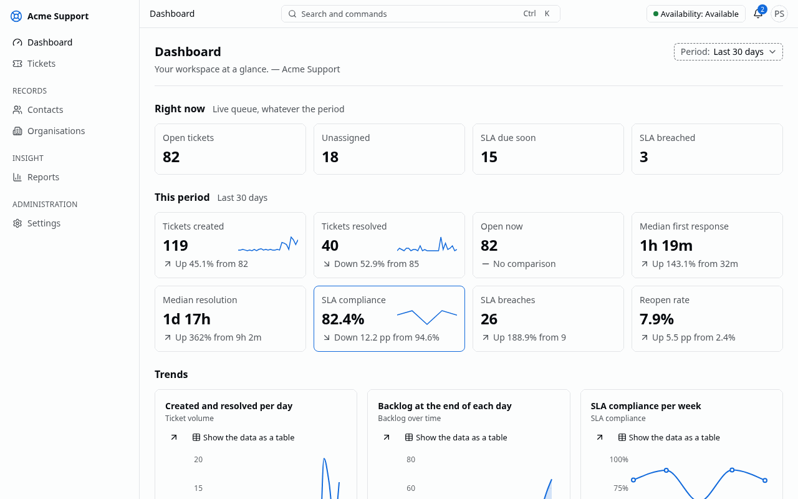

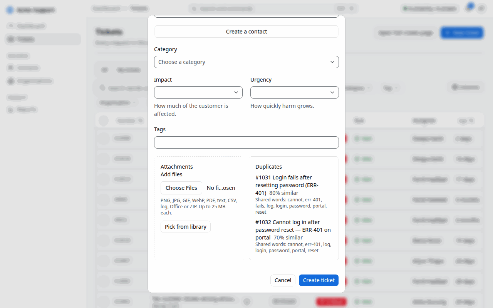

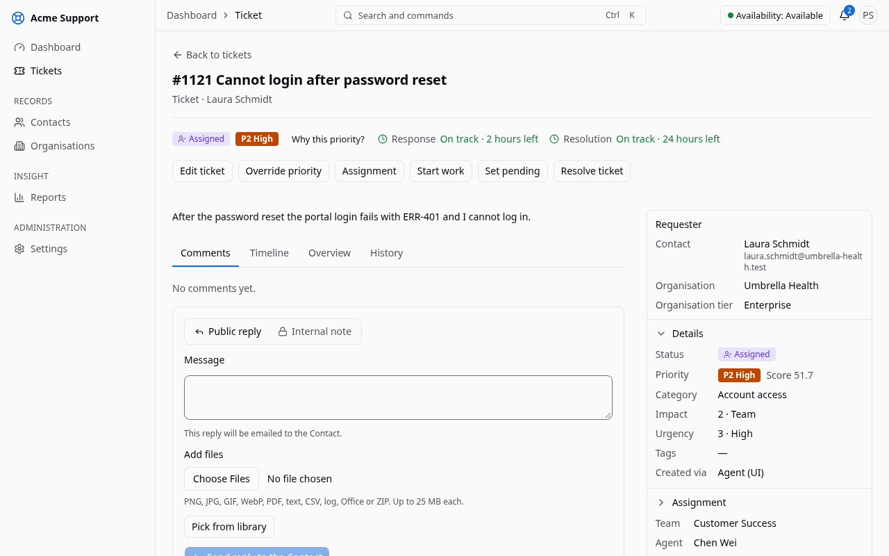

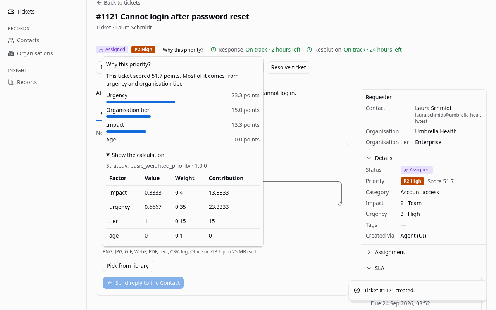

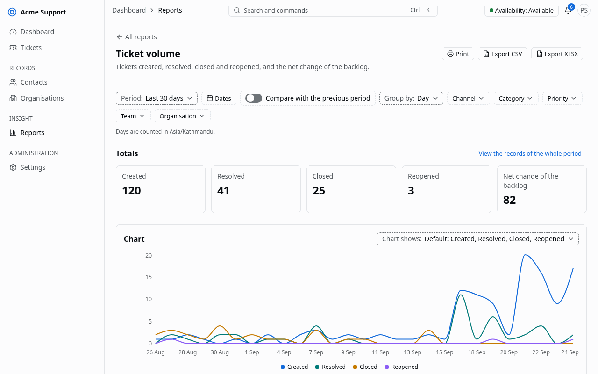

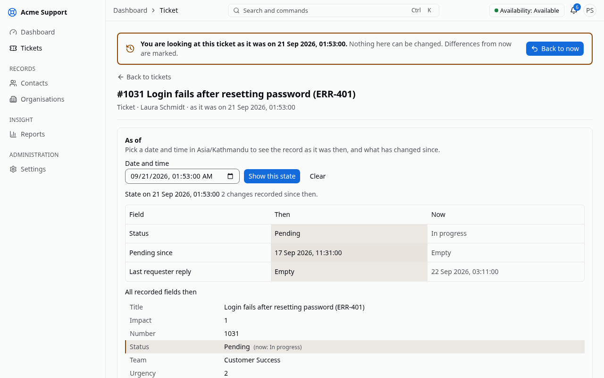

## 4.2 Testing

Testing followed a pyramid: fast unit tests for the algorithms and domain classes; feature tests for every API endpoint against PostgreSQL; a tenant isolation suite that tries to reach every tenant-owned model and endpoint from another tenant; a permission matrix for every role; contract tests that every strategy must pass; component tests of interactive screens in a real browser; and end-to-end tests of the main workflows against the running system, including automated accessibility scans. All suites ran in continuous integration on every push.

Table 4.2: Test summary

| Level | Tool | Number of tests | Passed | Coverage |
|---|---|---|---|---|
| Backend unit (algorithms and domain) | Pest | {{tests_unit}} | {{tests_unit}} | algorithm baselines {{cov_algorithms}} |
| Backend feature and API | Pest | {{tests_feature}} | {{tests_feature_passed}} | backend overall {{cov_backend}} |
| Tenant isolation | Pest | {{tests_isolation}} | {{tests_isolation_passed}} | — |
| Permission matrix | Pest | {{tests_permissions}} | {{tests_permissions}} | — |
| Strategy contracts and architecture | Pest | {{tests_contracts}} | {{tests_contracts}} | — |
| Frontend unit | Vitest | 279 | 279 | — |
| Frontend component (real browser) | Vitest, MSW, axe-core | 319 | 319 | — |
| End-to-end and accessibility | Playwright, axe-core | 41 | 41 | — |

No test failed. The seven backend tests not counted as passed were skipped, not failed: six reproducibility checks that regenerate the experiment tables need the `experiments/` folder, which the application container does not mount, so the tables in Section 4.3 were reproduced separately with the experiment commands; one isolation check had no model of the kind it inspects. Coverage is line coverage measured with PCOV over the whole backend suite.

### 4.2.1 Test Cases for Unit Testing

Table 4.3 lists representative unit test cases. Each row is an automated test in the project; the last column names the test file under `backend/tests`.

Table 4.3: Unit test cases

| ID | Module | Test case and input | Expected result | Result | Test file |
|---|---|---|---|---|---|
| UT-01 | Priority | Worked examples, e.g. impact 4, urgency 4, enterprise, 0 h | score 90.0, level P1; parts add up to the score | Pass | `Unit/Automation/BasicWeightedPriorityTest` |
| UT-02 | Priority | Ageing: impact 2, urgency 3, premium at 24 h and 72 h | 47.5 (P3), then 54.2 (P2) | Pass | `Unit/Automation/BasicWeightedPriorityTest` |
| UT-03 | Priority | Scores exactly 75, 50 and 25 | levels P1, P2 and P3 at the boundary | Pass | `Unit/Automation/BasicWeightedPriorityTest` |
| UT-04 | Priority | Manual override of a computed P3 to P1 | effective level P1, computed score kept | Pass | `Unit/Automation/BasicWeightedPriorityTest` |
| UT-05 | Priority | Weights not adding up to 1; impact 5 | rejected with a settings or input error | Pass | `Unit/Automation/BasicWeightedPriorityTest` |
| UT-06 | Assignment | Agent without a required skill, at capacity, off shift, away | excluded, each with its reason | Pass | `Unit/Automation/LeastLoadedAgentTest` |
| UT-07 | Assignment | Loads 3/10, 2/5, 3/10 | an agent with load 0.30 wins, not the one with fewest tickets | Pass | `Unit/Automation/LeastLoadedAgentTest` |
| UT-08 | Assignment | Equal loads, different last assignments | the agent assigned longest ago wins (worked example: Chen) | Pass | `Unit/Automation/LeastLoadedAgentTest` |
| UT-09 | Assignment | No eligible agent | nobody assigned, every candidate explained | Pass | `Contracts/BaselineStrategiesTest` |
| UT-10 | Assignment | Jain's index for equal loads and for one agent holding everything | 1 and 1/n | Pass | `Unit/Automation/FairnessIndexTest` |
| UT-11 | Duplicates | Word extraction of a ticket with the code "ERR-401" | lower-case words, `err-401` kept, stop words and short words dropped | Pass | `Unit/Automation/WordSetTest` |
| UT-12 | Duplicates | Identical and disjoint word sets | Jaccard 1 and 0 | Pass | `Unit/Automation/JaccardDuplicatesTest` |
| UT-13 | Duplicates | Worked example: login-after-reset pair and an invoice ticket | 0.50 suggested, 0.15 ignored | Pass | `Unit/Automation/JaccardDuplicatesTest` |
| UT-14 | Duplicates | Eight candidates above the threshold | the five best, ordered by score, then newest, then id | Pass | `Unit/Automation/JaccardDuplicatesTest` |
| UT-15 | SLA | No reply, checked every minute | warning at 09:45 and breach at 10:00, once each | Pass | `Unit/Sla/SimpleSlaTimerTest` |
| UT-16 | SLA | Pending from 10:00 to 12:00 | warning moves to 17:00 and due time to 19:00 | Pass | `Unit/Sla/SimpleSlaTimerTest` |
| UT-17 | SLA | 8 h target from Thursday 15:00, office 10:00–17:00 | due Friday 16:00 | Pass | `Unit/Sla/WorkingHoursCalendarTest` |
| UT-18 | SLA | Holiday inside the timer | holiday skipped | Pass | `Unit/Sla/WorkingHoursCalendarTest` |
| UT-19 | SLA | Priority raised to P1 at 13:00 after a pause | due 15:00, warning 14:00, recomputed from the start | Pass | `Unit/Sla/SimpleSlaTimerTest` |
| UT-20 | Tickets | Every pair of the six statuses | exactly the documented transitions allowed | Pass | `Unit/Tickets/TicketStatusTest` |
| UT-21 | Mail | Replies from Gmail, Outlook and Apple Mail | only the new text kept | Pass | `Unit/Automation/ReplyParserTest` |
| UT-22 | Strategies | Each baseline through its contract | deterministic, bounded, order-independent, explained with strategy name and version | Pass | `Contracts/BaselineStrategiesTest` |
| UT-23 | History | 500 random seeded histories | as-of result equals every saved version and forward replay | Pass | `Unit/Reporting/ChangeReplayerTest` |
| UT-24 | History | Created, assigned, pending, resolved and reopened events | intervals with correct wall-clock and business durations | Pass | `Unit/Reporting/IntervalBuilderTest` |
| UT-25 | History | Update that changes nothing reportable | no change row written | Pass | `Feature/Reporting/ChangeCaptureTest` |
| UT-26 | Webhooks | Known payload, secret and timestamp; tampered body; old timestamp | matches the test vector; tampered and replayed deliveries rejected | Pass | `Unit/Integrations/WebhookSignerTest` |

### 4.2.2 Test Cases for System Testing

System tests exercise the complete system: browser, API, queues, database, object storage and mail. Rows marked E2E are automated Playwright tests run against the running stack; rows marked rehearsal were verified by the scripted demonstration rehearsal (`tools/demo-rehearsal`), which passed all 25 of its steps on the final build; the deployment row was verified on the live cloud instance.

Table 4.4: System test cases

| ID | Scenario | Steps | Expected result | Evidence | Status |
|---|---|---|---|---|---|
| ST-01 | User onboarding | owner invites a user; user accepts; user signs in | user pending until acceptance, then works with the invited role | E2E `users.spec` | Pass |
| ST-02 | Golden path | agent creates a ticket; system prioritises, suggests duplicates, assigns and starts SLA; agent replies, sets pending, resolves and closes | each step visible with its explanation; first response met; SLA paused while pending | E2E `golden-path.spec` | Pass |
| ST-03 | Duplicate handling | create a ticket similar to an existing one | suggestion with score and shared words before saving | E2E `golden-path.spec`; rehearsal | Pass |
| ST-04 | SLA warning and breach | advance the clock past the warning and due times | timer shows due soon, then breached; assignee and managers notified; webhook sent | rehearsal (`demo-tick`) | Pass |
| ST-05 | Tenant isolation | a user of tenant B opens tenant A's ticket URL and API resource | not found in the interface and 404 from the API; list holds only B's tickets | E2E `isolation.spec` | Pass |
| ST-06 | Email reply | contact replies to a notification email | reply appears as a public comment on the ticket | rehearsal; live mail round trip | Pass |
| ST-07 | Integration | API client gets a token and creates a ticket; client revoked; webhook receiver verifies a delivery; a refused delivery is retried | ticket created; revoked token refused; signed delivery verified; retry succeeds | E2E `api-clients.spec`, `webhooks.spec` | Pass |
| ST-08 | Reporting and history | open a report, export CSV; drill into a day's number; open a ticket's history as of three days earlier | numbers match the records; earlier state shown; file downloaded | E2E `reports.spec` | Pass |
| ST-09 | Theme and accessibility | switch themes; reload; scan the main screens and dialogs in light and dark | preference kept; no serious or critical accessibility violations | E2E `theme.spec`, `accessibility.spec` | Pass |
| ST-10 | Deployment | provision a cloud virtual machine with OpenTofu and configure it with Ansible | HTTPS instance with the demonstration workspace and working mail | live instance | Pass |

## 4.3 Result Analysis

All experiments were run with fixed random seeds on versioned datasets, and every number below is taken from the experiment output files (`experiments/results/v1`). Two runs with the same seed produce identical results, which an automated test checks.

### 4.3.1 Agent assignment fairness

The synthetic workload contained eight agents with different skills and capacities and 500 tickets with seeded arrival times and handling times [@harchol2013]. Three policies were compared on the same workload: random choice among qualified agents, round robin among qualified agents, and the least-loaded baseline.

Table 4.5: Assignment fairness by policy (final state after 500 tickets)

| Policy | Jain's index | Std. deviation | Max open | Min open | Capacity overflows |
|---|---|---|---|---|---|
| Random (skills respected) | 0.786 | 3.59 | 14 | 3 | 74 |
| Round robin (skills respected) | 0.865 | 2.71 | 13 | 4 | 36 |
| Least-loaded eligible agent (baseline) | 0.967 | 1.27 | 9 | 5 | 0 |

The least-loaded rule distributed work most evenly: its Jain's index was 0.967 against 0.865 for round robin, and the spread between the busiest and the least busy agent fell from 11 tickets (random) to 4. It is also the only policy that never placed an agent above capacity, because capacity is part of its eligibility rule; round robin overloaded agents 36 times and random choice 74 times. Averaged over the whole run, its index stayed at 0.955, so the fairness is not an artefact of the final moment (Figures 4.7 and 4.8).

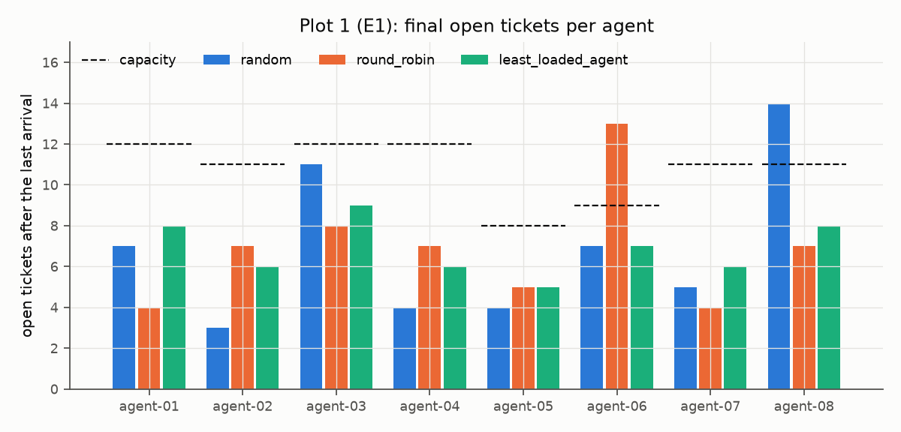

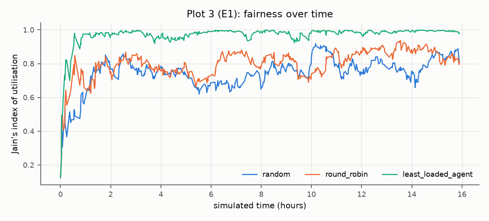

### 4.3.2 Duplicate detection accuracy

The labelled dataset contained 300 ticket pairs: 100 duplicates (60 generated by dropping and swapping words, 40 written by hand) and 200 non-duplicates, 50 of which came from the same category to make them hard. Table 4.6 shows the Jaccard check on all pairs at several thresholds. The threshold was then chosen on 70 % of the pairs and the result reported on the remaining 30 %. Accuracy is not reported because non-duplicates dominate [@manning2008].

Table 4.6: Jaccard duplicate check at selected thresholds (all 300 pairs, title and description)

| Threshold | TP | FP | FN | Precision | Recall | F1 |
|---|---|---|---|---|---|---|
| 0.25 | 84 | 12 | 16 | 0.875 | 0.84 | 0.857 |
| 0.35 (default) | 76 | 3 | 24 | 0.962 | 0.76 | 0.849 |
| 0.45 | 66 | 0 | 34 | 1.000 | 0.66 | 0.795 |
| 0.55 | 62 | 0 | 38 | 1.000 | 0.62 | 0.765 |

On the held-out 30 %, the default threshold of 0.35 gave precision 0.95, recall 0.70 and F1 0.81; the threshold chosen on the training pairs (0.30) gave F1 0.84. Raising the threshold removes false suggestions but loses duplicates quickly, and the default keeps false suggestions rare, which matters because every wrong suggestion costs an agent's attention.

Table 4.7: Word sets compared (held-out F1 and Recall@5 among 5 100 tickets)

| Configuration | Best threshold | F1 at best threshold | F1 at 0.35 | Recall@5 (ranking) |
|---|---|---|---|---|
| Title only | 0.15 | 0.952 | 0.667 | 0.03 |
| Title and description (baseline) | 0.30 | 0.836 | 0.808 | 0.92 |
| Runeson et al., top five (reported) [@runeson2007] | — | — | — | 0.30 |

Titles alone separate the labelled pairs well only at a very low threshold, and they fail when the duplicate must be found among 5 100 tickets: Recall@5 drops to 0.03 because short titles share few words with each other and many with unrelated tickets. With the description included, the true duplicate was among the top five suggestions for 92 % of the queries, well above the 30 % that Runeson et al. reported for a comparable lexical method on real bug reports. The synthetic data is cleaner than real tickets, so this comparison indicates the method's potential rather than its field performance.

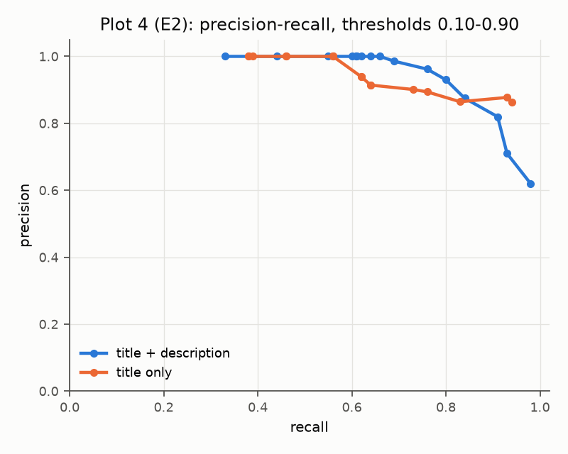

### 4.3.3 Priority scoring behaviour

All 12 designed scenarios produced the expected score and level. For sensitivity, each weight was changed by ±0.1 while the others were rescaled so that the weights still sum to one, and the table counts how many of 200 generated tickets changed level [@saltelli2008].

Table 4.8: Effect of weight changes on priority levels (200 tickets)

| Weight changed | −0.1: tickets changing level (%) | +0.1: tickets changing level (%) |
|---|---|---|
| Impact (0.40) | 29 (14.5) | 33 (16.5) |
| Urgency (0.35) | 32 (16.0) | 28 (14.0) |
| Customer tier (0.15) | 43 (21.5) | 22 (11.0) |
| Waiting time (0.10) | 21 (10.5) | 35 (17.5) |

No single change moved more than about a fifth of the tickets, so the levels are stable against small configuration mistakes. The customer tier is the most influential weight despite its small default: lowering it moved 43 tickets, 32 of them upwards, because the weight it releases is redistributed to impact and urgency. The ageing term works as intended: a ticket with impact 2, urgency 3 and a premium customer starts at P3 and becomes P2 after 42 hours of waiting (Figure 4.10).

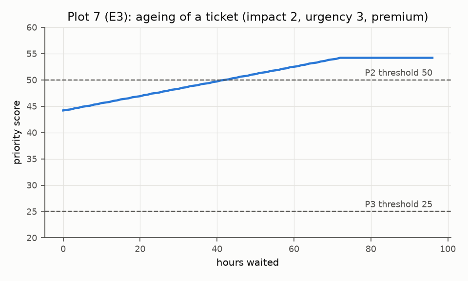

### 4.3.4 SLA scenario verification

Ten timelines were replayed with a frozen clock against the SLA strategy, five on a 24×7 calendar and five on working hours. All ten produced the expected state, warning time, due time and notification counts (Table 4.9).

Table 4.9: SLA scenarios

| ID | Scenario | Expected outcome | Status |
|---|---|---|---|
| L01 | Agent replies within the first-response target | met; warning 09:45, due 10:00 | Pass |
| L02 | Resolution timer paused while pending 10:00–12:00 | running; warning 17:00, due 19:00 | Pass |
| L03 | No reply, checked every minute | warning and breach, once each | Pass |
| L04 | As L02, then priority raised to P1 at 13:00 | due recomputed from the start to 15:00 | Pass |
| L05 | Resolved at 16:00, reopened at 16:30 | new resolution timer | Pass |
| L06 | Working hours: created Thursday 15:00, 8 h | due Friday 16:00 | Pass |
| L07 | Working hours: created Friday 16:00, Saturday closed | Saturday skipped | Pass |
| L08 | Working hours: Friday is a holiday | holiday skipped | Pass |
| L09 | Working hours: pending Thursday 16:00 to Sunday 11:00 | nine working hours added | Pass |
| L10 | As L09, then the target changes to 4 h | recomputed including the paused time | Pass |

### 4.3.5 History, reporting and performance

The history experiment replayed 90 days of activity on 300 tickets (2 664 recorded changes). Reconstruction was correct for all 1 000 sampled record versions, both backward from the current row and forward from the creation, and the incremental read models matched a full rebuild for every ticket and every day (Table 4.10).

Table 4.10: History and reporting results

| Measure | Result |
|---|---|
| As-of reconstruction, backward replay (1 000 samples) | 100 % correct |
| As-of reconstruction, forward replay (1 000 samples) | 100 % correct |
| Intervals, facts and daily snapshots: incremental vs rebuilt | 100 % agree (300 tickets, 90 days) |
| Backlog by team per day for 90 days, from snapshots (95th percentile) | 0.28 ms |
| Backlog per day for 90 days, from intervals (95th percentile) | 21.4 ms |
| Ticket as-of view (95th percentile) | 0.98 ms |
| Ticket update with / without change capture (median) | 0.40 ms / 0.20 ms |

Daily snapshots make the heaviest trend report more than seventy times faster than computing it from intervals, and change capture adds about 0.2 ms to a ticket update, an acceptable price for a complete history. Load testing of the whole application (response times of the ticket list, ticket creation and the dashboard under many concurrent users) was planned but not carried out within the project period; the performance targets of Table 3.6 are therefore not yet verified and are listed as future work.

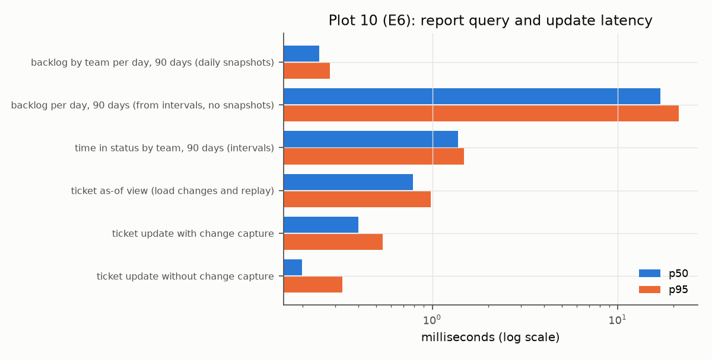

### 4.3.6 Discussion and threats to validity

The results support the design choice of simple, explainable baselines. Least-loaded assignment is clearly fairer than the rotation most small teams use and never exceeds an agent's capacity. The Jaccard check finds most duplicates with very few false suggestions when titles and descriptions are compared, and its errors are explainable from the shared words it displays. The priority score behaves predictably under small weight changes, and the SLA timers and history reconstruction were correct in every tested case.

Several threats limit these conclusions. The algorithms are intentionally minimal and would be outperformed by stronger techniques on real data. The workload and most duplicate pairs were generated from a small phrase bank per category, and generated text is cleaner than real tickets; the 40 hand-written pairs were written and labelled by one person rather than by independent annotators. Thresholds were tuned on 70 % of the pairs and reported on the remaining 30 %, which is a small test set. The SLA and priority scenarios verify the specification rather than measure effectiveness in a real support team. Finally, the application was not load-tested, so its behaviour under heavy concurrent use is unknown.
