# Appendices

## Appendix A: Use case list

Table A.1: Use cases of the system

| ID | Use case | Primary actor |
|---|---|---|
| UC-01 | Manage tenants | Platform Super Admin |
| UC-02 | Manage users and roles | Tenant Admin |
| UC-03 | Manage teams, skills, categories and shifts | Tenant Admin |
| UC-04 | Manage SLA policies and business calendars | Tenant Admin |
| UC-05 | Manage priority, assignment and duplicate settings | Tenant Admin |
| UC-06 | Manage API clients and webhooks | Tenant Admin, Developer |
| UC-10 | Create ticket | Agent, external system, contact by email |
| UC-11 | View and filter tickets | Agent, Manager |
| UC-12 | Add public reply or internal note | Agent, contact by email |
| UC-13 | Attach file | Agent |
| UC-14 | Assign or reassign ticket | Manager, system |
| UC-15 | Change ticket status | Agent |
| UC-16 | Override priority | Manager |
| UC-17 | Review duplicate suggestions | Agent |
| UC-18 | View ticket history and SLA | Agent |
| UC-20 | Score priority | System |
| UC-21 | Auto-assign | System |
| UC-22 | Detect duplicates | System |
| UC-23 | Evaluate SLA and notify | Scheduler |
| UC-30 | Manage contacts and organisations | Agent, Admin |
| UC-40 | View dashboard | Manager |
| UC-41 | Export report | Manager |
| UC-42 | Run detailed report | Manager, Admin |
| UC-43 | View entity 360 and history | Manager, Admin |
| UC-50 | Manage media library | Agent, Admin |
| UC-60 | Process inbound email | Scheduler |

## Appendix B: Source code excerpts

The excerpts below are copied from the project's source code with comments shortened. Each algorithm class implements its strategy interface and is called only through that interface.

### B.1 Priority score (`BasicWeightedPriority::score`)

```php
public function score(PriorityInput $input): PriorityResult
{
    $values = [
        'impact' => ($input->impact - 1) / 3,
        'urgency' => ($input->urgency - 1) / 3,
        'tier' => $input->tier->scaled(),
        'age' => min(1.0, $input->hoursWaited / $this->settings->ageFullHours),
    ];
    $parts = [];
    $total = 0.0;
    foreach ($values as $name => $value) {
        $weight = $this->settings->weights[$name];
        $contribution = 100 * $weight * $value;
        $total += $contribution;
        $parts[] = new PriorityPart($name, $value, $weight, $contribution);
    }
    // Rounding to 6 places first removes float noise before the one-decimal value.
    $score = round(round($total, 6), 1);

    return new PriorityResult(score: $score, level: $this->settings->levelFor($score),
        parts: $parts, strategy: self::NAME, strategyVersion: self::VERSION,
        settings: $this->settings->toArray());
}
```

### B.2 Least-loaded assignment (`LeastLoadedAgent`)

```php
public function choose(TicketNeeds $ticket, array $candidates): AssignmentResult
{
    $eligible = [];
    $exclusions = [];
    foreach ($candidates as $agent) {
        $exclusion = $this->whyNotEligible($agent, $ticket);
        if ($exclusion === null) {
            $eligible[] = $agent;
        } else {
            $exclusions[] = $exclusion;
        }
    }
    usort($eligible, $this->compare(...));

    return new AssignmentResult(
        agentId: $eligible === [] ? null : $eligible[0]->id,
        ranking: $eligible, exclusions: $exclusions,
        strategy: self::NAME, strategyVersion: self::VERSION);
}

// Lowest load relative to capacity first, then the agent assigned longest ago,
// then the smallest id, so the result never depends on input order.
private function compare(AgentCandidate $a, AgentCandidate $b): int
{
    return $a->compareLoad($b)
        ?: $this->compareLastAssigned($a, $b)
        ?: strcmp($a->id, $b->id);
}
```

### B.3 Duplicate detection (`WordSet::words` and `JaccardDuplicates`)

```php
public function words(string ...$texts): array
{
    $text = mb_strtolower(implode(' ', $texts));
    // Letters include combining marks so that Devanagari words are not split apart.
    $text = (string) preg_replace('/[^\p{L}\p{M}\p{N}-]+/u', ' ', $text);
    $words = [];
    foreach (explode(' ', $text) as $token) {
        if (mb_strlen($token) < self::MIN_LENGTH
            || isset($this->stopWords[$token])
            || trim($token, '-') === '') {
            continue;
        }
        $words[$token] = true;
    }

    return array_map(strval(...), array_keys($words));
}

// JaccardDuplicates: |A ∩ B| / |A ∪ B| for each candidate ticket
private function compare(array $words, TicketText $candidate): DuplicateMatch
{
    $other = $this->wordSet->words($candidate->title, $candidate->description);
    $shared = array_values(array_intersect($words, $other));
    sort($shared);
    $union = count($words) + count($other) - count($shared);

    return new DuplicateMatch($candidate->id, $shared, $union, $candidate->createdAt);
}
```

### B.4 SLA warning and breach check (`SimpleSlaTimer::check`)

```php
public function check(TimerData $timer, ?CarbonImmutable $now = null): TimerOutcome
{
    $now ??= $this->now();
    $events = [];
    if (! $timer->state->isCounting()) {
        return $this->outcome($timer);
    }
    if ($timer->state === TimerState::Running && $timer->warnedAt === null
        && $now->greaterThanOrEqualTo($timer->warningAt) && $now->lessThan($timer->dueAt)) {
        $timer = $timer->with(['state' => TimerState::Warning, 'warnedAt' => $now]);
        $events[] = $this->event(SlaEventType::Warning, $timer, $now,
            ['due_at' => TimerData::format($timer->dueAt)]);
    }
    if ($timer->breachedAt === null && $now->greaterThanOrEqualTo($timer->dueAt)) {
        $timer = $timer->with(['state' => TimerState::Breached, 'breachedAt' => $now]);
        $events[] = $this->event(SlaEventType::Breached, $timer, $now,
            ['due_at' => TimerData::format($timer->dueAt)]);
    }

    return $this->outcome($timer, ...$events);
}
```

### B.5 Ticket status transitions (`TicketStatus`)

```php
public function allowedTargets(): array
{
    return match ($this) {
        self::Open => [self::Assigned, self::InProgress, self::Closed],
        self::Assigned => [self::InProgress, self::Pending, self::Resolved, self::Open],
        self::InProgress => [self::Pending, self::Resolved, self::Open],
        self::Pending => [self::InProgress, self::Resolved],
        self::Resolved => [self::Closed, self::InProgress],
        self::Closed => [self::InProgress],
    };
}

public function transitionTo(self $target): self
{
    if (! $this->canTransitionTo($target)) {
        throw InvalidTransition::between($this, $target);
    }

    return $target;
}
```

### B.6 Row-level security policy (`TenantTables`)

```php
public const CURRENT_TENANT_SQL =
    "NULLIF(current_setting('app.current_tenant', true), '')::uuid";

// Called by the migration of every tenant table. FORCE applies the policy
// to the table owner too, so no connection reads across tenants.
DB::statement("ALTER TABLE {$table} ENABLE ROW LEVEL SECURITY");
DB::statement("ALTER TABLE {$table} FORCE ROW LEVEL SECURITY");
DB::statement(sprintf('DROP POLICY IF EXISTS %s ON %s', self::POLICY, $table));
DB::statement(sprintf('CREATE POLICY %s ON %s USING (%s) WITH CHECK (%s)',
    self::POLICY, $table, $predicate, $predicate));
```

### B.7 Webhook signature (`WebhookSigner`)

```php
public static function signature(string $secret, int $timestamp, string $body): string
{
    return hash_hmac('sha256', $timestamp.'.'.$body, $secret);
}

// Receiver-side verification: any v1= entry matches and the timestamp
// is within the five-minute tolerance.
public static function verify(string $body, string $signatureHeader, int $timestamp,
    string $secret, int $now, int $tolerance = self::TOLERANCE_SECONDS): bool
{
    if ($timestamp === 0 || abs($now - $timestamp) > $tolerance) {
        return false;
    }
    $expected = self::signature($secret, $timestamp, $body);
    foreach (explode(',', $signatureHeader) as $part) {
        $part = trim($part);
        if (str_starts_with($part, self::SCHEME.'=') && hash_equals($expected, substr($part, 3))) {
            return true;
        }
    }

    return false;
}
```

## Appendix C: Screenshots

The screenshots were captured from the demonstration workspace in the order of the final demonstration, in addition to Figures 4.1 to 4.6.

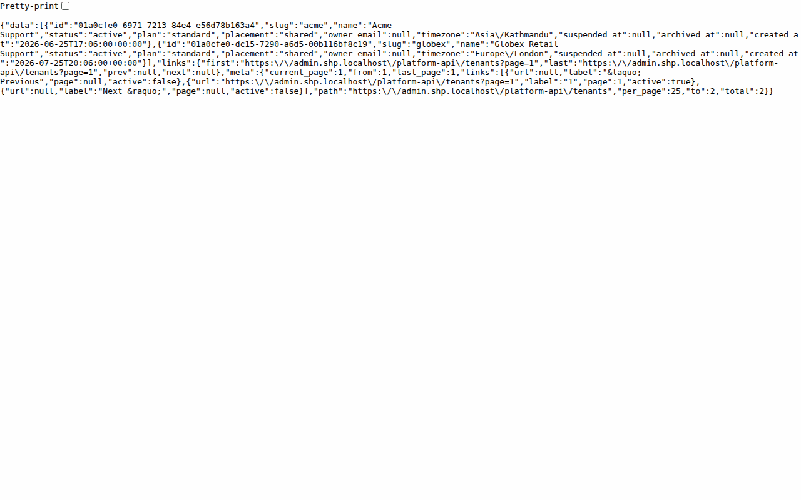

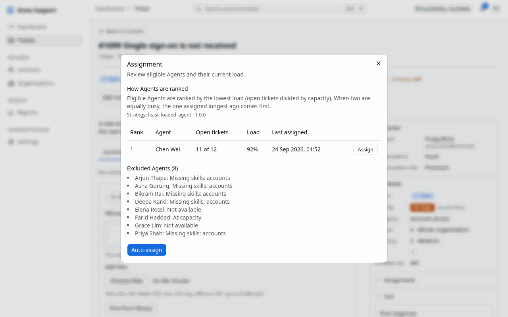

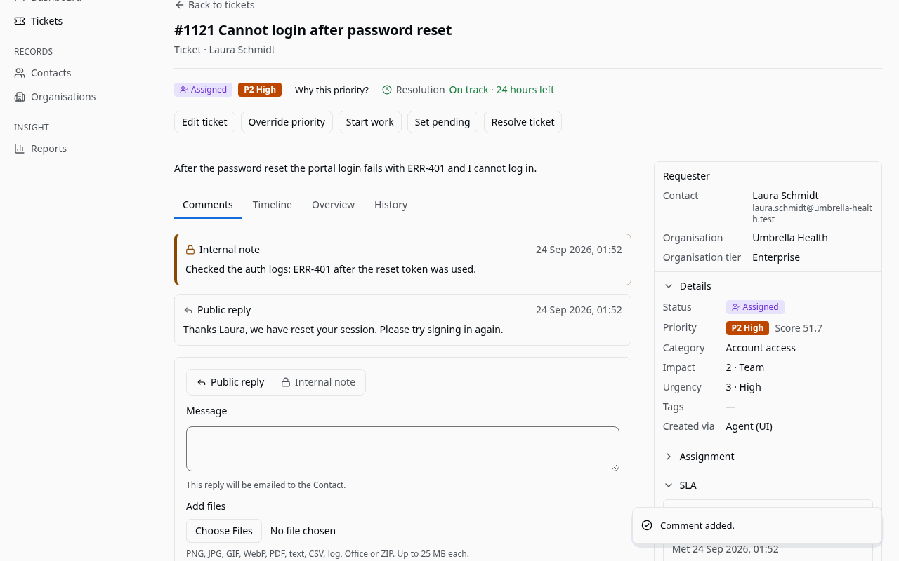

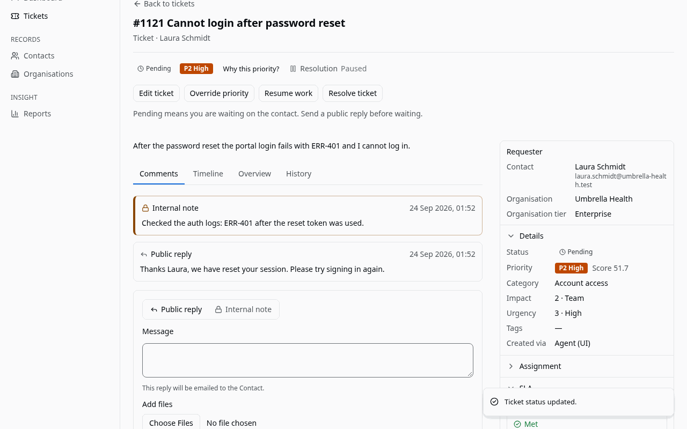

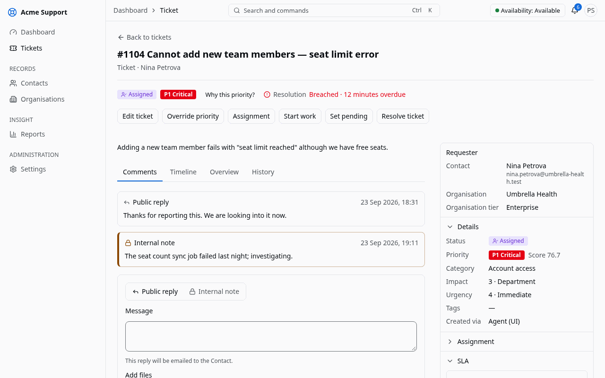

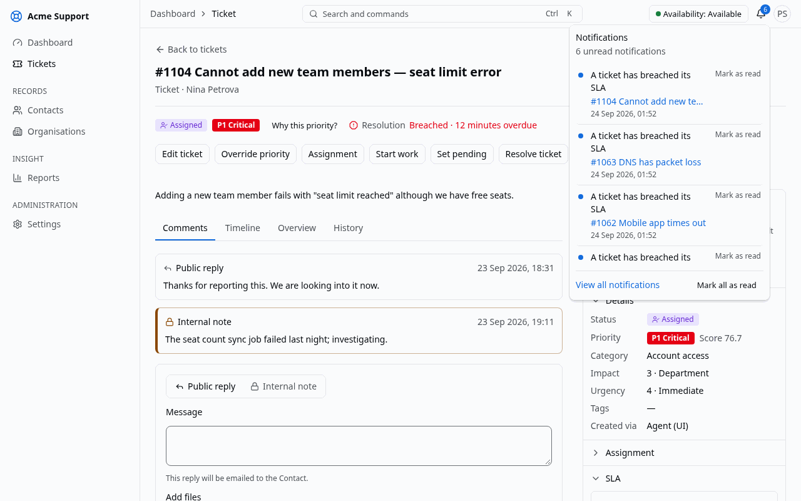

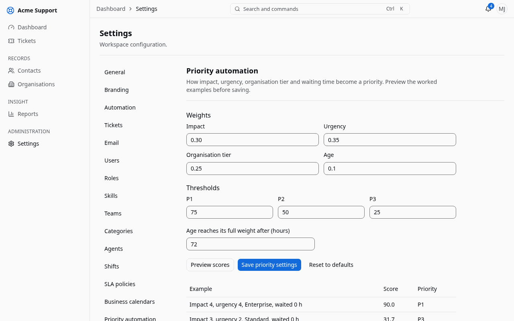

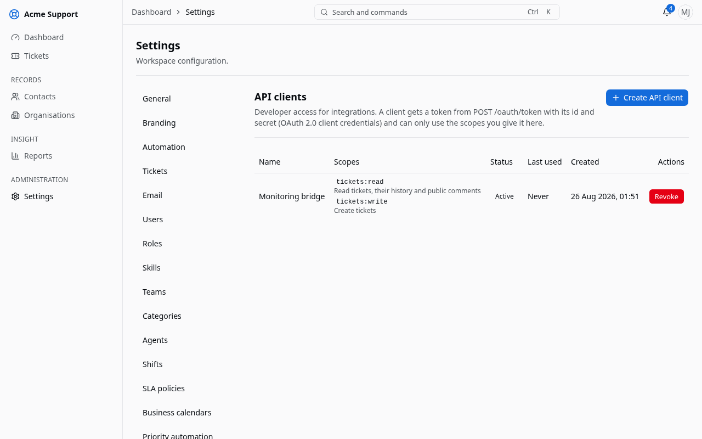

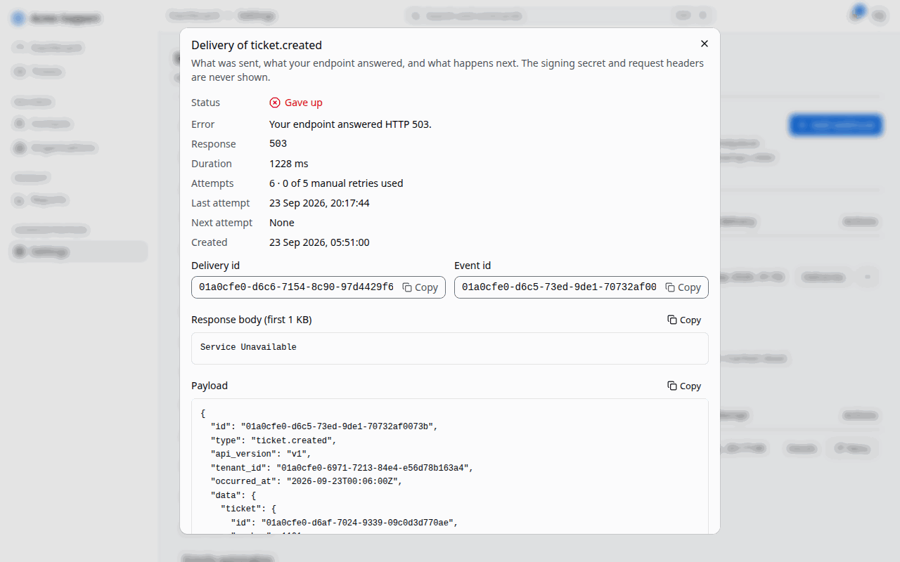

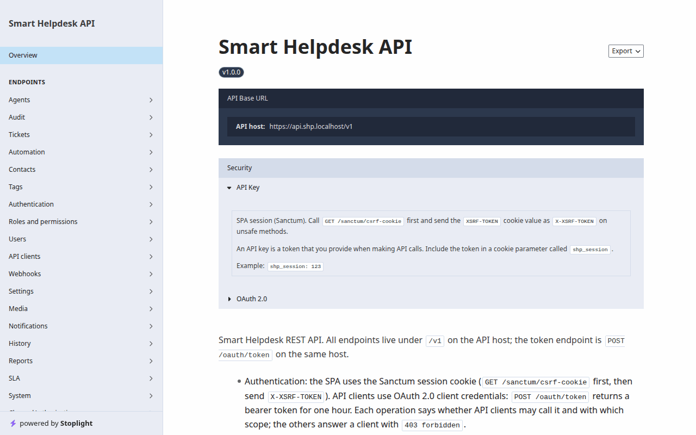

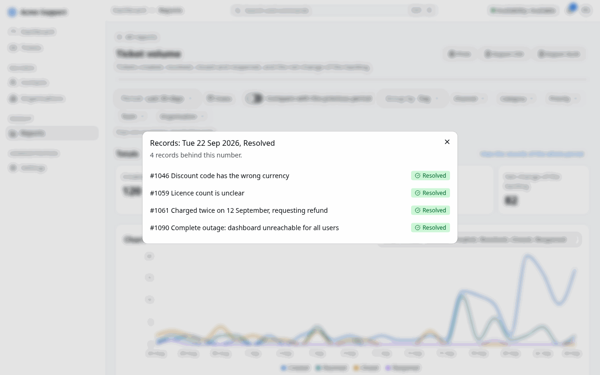

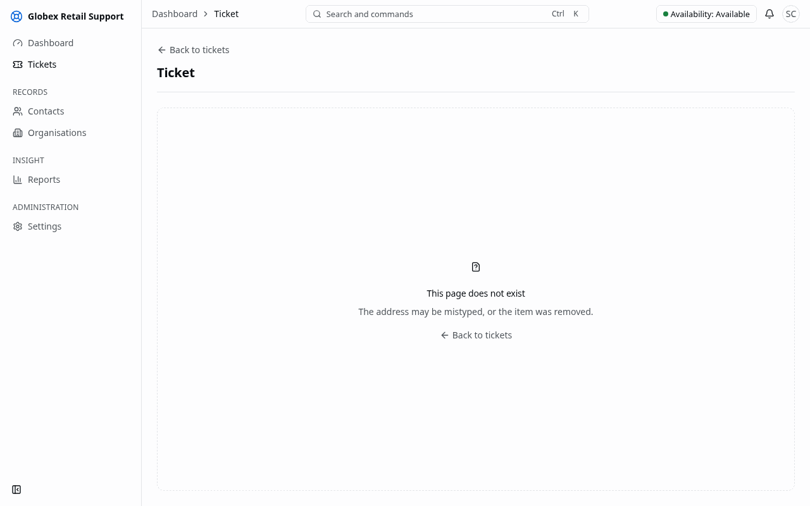

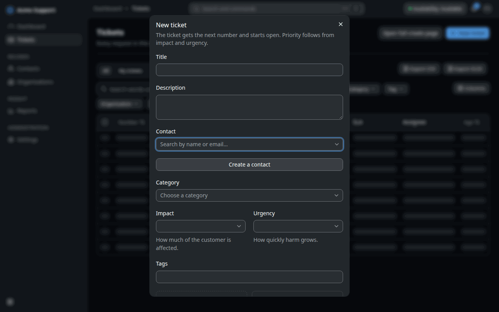

## Appendix D: API excerpt

### D.1 Creating a ticket

An API client with the `tickets:write` scope creates a ticket with a bearer token obtained through the OAuth 2.0 client credentials grant. The `Idempotency-Key` header makes a retried request safe.

```http
POST /v1/tickets HTTP/1.1
Host: api.shp.subhambhandari.com.np
Authorization: Bearer <access token>
Idempotency-Key: 5f7d2c1e-order-1042
Content-Type: application/json

{
  "title": "Cannot log in to the billing portal",
  "description": "Since this morning the login page shows an error after the password.",
  "contact_id": "019a1e10-…",
  "category_id": "019a1e11-…",
  "impact": 3,
  "urgency": 4,
  "tags": ["billing", "login"]
}
```

The answer is `201 Created` with the ticket. Priority scoring and automatic assignment run in the same transaction as the creation, so the answer already carries the priority, its explanation and the assigned agent (fields shortened). With the default weights, impact 3, urgency 4, a standard-tier contact and no waiting time give 26.7 + 35.0 = 61.7, which is level P2:

```json
{
  "data": {
    "id": "019a1f2f-…",
    "number": 1042,
    "status": "assigned",
    "priority_score": 61.7,
    "priority_level": "P2",
    "priority_explanation": {
      "strategy": "basic_weighted_priority",
      "strategy_version": "1.0.0",
      "score": 61.7,
      "level": "P2",
      "parts": ["…"]
    },
    "assigned_agent_id": "019a1e20-…",
    "created_via": "api",
    "created_at": "2026-09-21T10:15:32Z"
  }
}
```

An invalid request returns an RFC 9457 problem document with a stable code, for example `422` with `"code": "validation_failed"` and the field errors.

### D.2 Webhook payload envelope

Every webhook delivery has the same envelope. The body is signed with HMAC-SHA256 over `timestamp.body` (Appendix B.7), and the signature is sent in a request header.

```json
{
  "id": "019a1f2f-5b7c-7e1d-8c3a-1a2b3c4d5e6f",
  "type": "ticket.status_changed",
  "api_version": "v1",
  "tenant_id": "019a1e00-…",
  "occurred_at": "2026-09-17T10:15:32Z",
  "data": {
    "ticket": { "id": "019a…", "number": 1042, "status": "resolved", "…": "…" },
    "from": "in_progress",
    "to": "resolved"
  }
}
```

## Appendix E: Experiment datasets

The experiments in Section 4.3 use version 1 of the datasets, created on 21 September 2026. A dataset is never edited in place; a change creates a new version. Every table and figure in Section 4.3 is regenerated from these files by the experiment commands.

Table E.1: Experiment datasets

| File | Content | Made by | Seed |
|---|---|---|---|
| `workload/` | 8 agents (capacities 5–12, 2–3 skills), 6 categories, 500 tickets with exponential inter-arrival (mean 120 s) and handling times (mean 90 min) | `experiment:generate-workload` | 42 |
| `duplicates.json` | 300 labelled pairs: 100 duplicates (60 generated, 40 hand-written) and 200 non-duplicates (50 same category, 150 different categories) | `experiment:generate-duplicates` | 42 |
| `duplicates-haystack.json` | 5 000 generated tickets for the top-five search | same command | 43 |
| `priority-scenarios.json` | 12 tickets with the expected score and level | hand-written | — |
| `sla-scenarios.json` | 10 timelines (5 on 24×7, 5 on working hours Sunday–Friday 10:00–17:00 Asia/Kathmandu, one with a holiday) with expected states, times and notification counts | hand-written | — |

Generated ticket texts come from a small phrase bank per category, so tickets of one category share words, and the hand-written pairs were written and labelled by one person. Both are discussed as threats to validity in Section 4.3.6.
