# Dependency graph and critical path

Task IDs refer to the milestone files. Sizes: XS/S/M/L/XL. Dates are computed by [tools/schedule.py](tools/schedule.py) from this graph.

## Graph

```mermaid
flowchart TB
    subgraph M1[Milestone 1 - Foundation]
        W1_01[M1-01 Repo skeleton S]
        W1_02[M1-02 Backend scaffold M]
        W1_03[M1-03 Frontend scaffold M]
        W1_04[M1-04 Compose dev stack L]
        W1_05[M1-05 CI basics M]
        W1_06[M1-06 Tenancy core L]
        W1_07[M1-07 Platform admin + provisioning M]
        W1_08[M1-08 SPA auth + invitations M]
        W1_09[M1-09 RBAC M]
        W1_10[M1-10 Isolation suite v1 M]
        W1_11[M1-11 Tokens + themes M]
        W1_12[M1-12 App shell + session L]
        W1_13[M1-13 OpenAPI + API client pipeline M]
        W1_14[M1-14 DataTable L]
        W1_15[M1-15 Contacts L]
        W1_16[M1-16 Cross-cutting: errors, audit, clock, health, logs M]
        W1_17[M1-17 Ticket model + list API/UI L]
        W1_18[M1-18 SLA + calendar core M]
        W1_19[M1-19 Priority core S]
        W1_20[M1-20 Assignment core S]
        W1_21[M1-21 Duplicate core M]
        W1_22[M1-22 History + interval core S]
        W1_23[M1-23 Change capture trigger S]
    end
    subgraph M2[Milestone 2 - Product]
        W2_01[M2-01 Settings framework + branding M]
        W2_02[M2-02 Agents, teams, skills, categories, shifts L]
        W2_03[M2-03 SLA integration + calendars L]
        W2_04[M2-04 Priority integration M]
        W2_05[M2-05 Assignment integration M]
        W2_06[M2-06 Ticket UI: create/detail/transitions XL]
        W2_07[M2-07 Comments M]
        W2_08[M2-08 Media library + attachments XL]
        W2_09[M2-09 Notifications M]
        W2_10[M2-10 Duplicate integration L]
        W2_11[M2-11 Ticket list UX + bulk M]
        W2_12[M2-12 Users + roles UI M]
        W2_13[M2-13 Reporting read models L]
    end
    subgraph M3[Milestone 3 - Hardening and demo]
        W3_02[M3-02 Report catalogue + runner L]
        W3_01[M3-01 Dashboard M]
        W3_20[M3-20 Reports UI XL]
        W3_21[M3-21 Entity 360 + history UI L]
        W3_03[M3-03 Audit viewer S]
        W3_04[M3-04 API clients OAuth2 L]
        W3_05[M3-05 Webhooks L]
        W3_06[M3-06 API docs polish S]
        W3_07[M3-07 RLS M]
        W3_08[M3-08 Security review M]
        W3_09[M3-09 Report exports CSV/XLSX M]
        W3_10[M3-10 Experiments L]
        W3_11[M3-11 Performance M]
        W3_12[M3-12 E2E + axe M]
        W3_13[M3-13 Demo seed + rehearsal M]
        W3_14[M3-14 Prod compose + Ansible + optional OpenTofu L]
        W3_15[M3-15 Docs + report artefacts M]
        W3_16[M3-16 Reverb S]
        W3_18[M3-18 Mail server + outbound M]
        W3_19[M3-19 Inbound email-to-ticket L]
    end
    W1_01 --> W1_02
    W1_01 --> W1_03
    W1_02 --> W1_04
    W1_03 --> W1_04
    W1_04 --> W1_05
    W1_04 --> W1_06
    W1_06 --> W1_07
    W1_06 --> W1_08
    W1_08 --> W1_09
    W1_06 --> W1_10
    W1_03 --> W1_11
    W1_08 --> W1_12
    W1_11 --> W1_12
    W1_13 --> W1_12
    W1_02 --> W1_13
    W1_12 --> W1_14
    W1_09 --> W1_15
    W1_14 --> W1_15
    W1_02 --> W1_16
    W1_09 --> W1_17
    W1_14 --> W1_17
    W1_16 --> W1_17
    W1_02 --> W1_18
    W1_02 --> W1_19
    W1_02 --> W1_20
    W1_02 --> W1_21
    W1_18 --> W1_22
    W1_06 --> W1_23
    W1_17 --> W2_01
    W1_17 --> W2_02
    W1_17 --> W2_03
    W1_18 --> W2_03
    W2_03 --> W2_04
    W2_02 --> W2_04
    W1_19 --> W2_04
    W2_02 --> W2_05
    W2_04 --> W2_05
    W1_20 --> W2_05
    W1_17 --> W2_06
    W1_13 --> W2_06
    W1_14 --> W2_06
    W2_06 --> W2_07
    W2_06 --> W2_08
    W2_07 --> W2_09
    W2_03 --> W2_09
    W2_05 --> W2_09
    W1_17 --> W2_10
    W1_21 --> W2_10
    W2_03 --> W2_13
    W1_22 --> W2_13
    W1_23 --> W2_13
    W1_14 --> W2_11
    W2_06 --> W2_11
    W1_09 --> W2_12
    W2_13 --> W3_02
    W2_05 --> W3_02
    W2_08 --> W3_02
    W3_02 --> W3_01
    W3_02 --> W3_20
    W1_14 --> W3_20
    W3_02 --> W3_21
    W1_16 --> W3_03
    W1_09 --> W3_04
    W1_13 --> W3_04
    W3_04 --> W3_05
    W1_17 --> W3_05
    W1_13 --> W3_06
    W1_04 --> W3_18
    W2_09 --> W3_18
    W3_18 --> W3_19
    W2_07 --> W3_19
    W2_08 --> W3_19
    W1_04 --> W3_14
    W1_06 --> W3_07
    W1_10 --> W3_07
    W3_05 --> W3_08
    W3_07 --> W3_08
    W3_02 --> W3_09
    W2_08 --> W3_09
    W2_04 --> W3_10
    W2_05 --> W3_10
    W2_10 --> W3_10
    W2_03 --> W3_10
    W1_17 --> W3_11
    W2_03 --> W3_11
    W2_10 --> W3_12
    W3_05 --> W3_12
    W2_10 --> W3_13
    W3_05 --> W3_13
    W3_01 --> W3_13
    W3_10 --> W3_15
    W3_12 --> W3_15
    W2_09 --> W3_16
    W1_09 --> W3_17
```

## Critical path

Computed by `python3 roadmap/tools/schedule.py` with the sprint profile: `M1-01 → M1-03 → M1-04 → M1-06 → M1-08 → M1-09 → M1-12/M1-14 → M1-17 → M2-03 → M2-13 → M3-02 → M3-20 → M3-01 → M3-13`, with the algorithm cores (M1-18 … M1-21) and the ticket UI (M2-06) running beside it. Tasks marked `critical` have zero slack; a slip of more than half an effort-day triggers the cut list in [00-mvp-definition.md](00-mvp-definition.md). The riskiest are **M1-04** (Compose, image, host layout, TLS), **M2-13** (read models) and **M3-20** (reports UI, the largest frontend task).

## Parallel tracks

The tracks below are indicative; the calculator assigns order within a track by earliest start and longest remaining chain.

| Track A (backend platform) | Track B (frontend) | Track C (infra, mail, media, quality, academic) | Track D (algorithm cores, reporting) |
|---|---|---|---|
| M1-01, M1-02, M1-06, M1-07, M1-08, M1-09, M1-17 | M1-03, M1-11, M1-12, M1-13, M1-14, M1-15 | M1-04, M1-05, M1-10, M1-16, M1-23 | M1-18, M1-19, M1-20, M1-21, M1-22 |
| M2-03, M2-04, M2-05, M2-10, M2-12 | M2-01, M2-02, M2-06, M2-07 | M2-08, M2-09 | M2-13, M2-11 |
| M3-04, M3-05, M3-19, M3-07, M3-10, M3-03, M3-16, M3-17 | M3-01, M3-20 | M3-06, M3-18, M3-14, M3-09, M3-08, M3-13, M3-15 | M3-02, M3-21, M3-11, M3-12 |

Tracks own disjoint folders ([12-schedule.md](12-schedule.md)), so each runs in its own git worktree.

## External dependencies and de-risking (do in Milestone 1)

| Dependency | De-risk task |
|---|---|
| `*.shp.localhost` resolution + Caddy `tls internal` on the developer OS/browser | M1-04 acceptance includes Firefox and Chrome checks; fallback: `/etc/hosts` entries and plain HTTP in dev |
| RustFS 1.0 presigned PUT + CORS | M1-04 includes a smoke test uploading via presigned URL; fallback: Garage |
| TanStack Table v9 server mode | M1-14 time-boxed to one day; fallback v8 |
| Scramble inference on our resources | M1-13 exports the spec for the first two resources; fallback: per-route overrides |
| stancl single-DB + spatie teams ordering | M1-06/09 tests; fallback: hand-rolled scope keeping the same trait name |
| Passport client credentials with tenant binding | M3-04 time-boxed; fallback: Sanctum tokens |
| Stalwart DKIM and port 25 on the target host | M3-18 checks with a test VM; fallback: `MAIL_RELAY_HOST` |
| intervention/image drivers in the PHP image | M1-04 installs GD (and Imagick if available); M2-08 variant job test |
