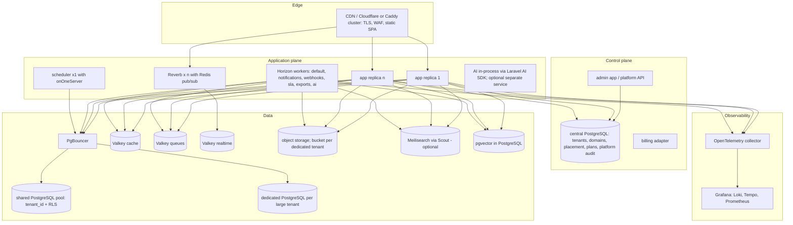

# Future architecture

How the MVP architecture evolves toward V1 and beyond without rewrites. Every step is additive to the seams listed in [ADR index](../docs/adr/README.md); the "must not change" list at the end is the contract the MVP must honour.

## Target state (V1+)

## Evolution steps

| Step | Change | Enabled by (MVP seam) | Trigger |
|---|---|---|---|
| 1. Control-plane split | `tenants`, `domains`, `placement`, plans and platform audit move to a central connection; platform admin becomes its own app or route group on the central host | central vs tenant tables already separate; platform routes on `admin.` host | billing or > 1 operator |
| 2. Dedicated tenant databases | `tenants.placement = 'dedicated'`; enable stancl `DatabaseTenancyBootstrapper` for those tenants; `tenants:migrate --tenants=`; per-tenant `pg_dump`; provisioning job creates the database | every table has `tenant_id`; all access via Eloquent scopes; stancl installed | a tenant > 500k tickets or a contractual isolation requirement |
| 3. Connection pooling | PgBouncer transaction pooling; RLS setting issued with `SET LOCAL` inside a per-request transaction (middleware) instead of session `SET` | RLS policy reads `current_setting(..., true)` either way | > 50 concurrent DB connections or > 3 app replicas |
| 4. Horizontal app scaling | n stateless `app` replicas behind the edge; sessions already in the database; Horizon workers scaled per queue; `scheduler` stays single with `onOneServer` | stateless image, DB sessions, `onOneServer` on every task | p95 latency targets missed at 1 replica |
| 5. Reverb scaling | `REVERB_SCALING_ENABLED=true` with a dedicated Valkey; multiple `reverb` replicas | Reverb chosen; channels tenant-prefixed | > 1 000 concurrent sockets |
| 6. Valkey separation | separate instances for cache, queues, realtime | logical DB separation in MVP config | memory pressure or eviction of queue keys |
| 7. Object storage per tenant | bucket per dedicated tenant, lifecycle rules, per-tenant credentials | `AttachmentPath` central key builder; `s3` disk config per tenant via tenant settings | dedicated tenants |
| 8. Search engine | Scout + Meilisearch behind `Ticket::search()`; per-tenant index or tenant filter enforced in one place | scope seam; RLS remains for SQL paths | instant-search requirement or FTS p95 > 200 ms |
| 9. AI boundary | Laravel AI SDK in-process (embeddings, summaries) on the `ai` queue; a separate Python service only if a model must run locally on GPU | ``DuplicateStrategy` replacement` channel fusion; comments API | AI features in V1 |
| 10. Event outbox | domain events written to an `outbox` table in the same transaction; a relay publishes to webhooks/queues, giving exactly-once semantics | events dispatched after commit; `webhook_deliveries` idempotency | delivery guarantees demanded by integrators |
| 11. Partitioning | monthly range partitions for `ticket_events`, `audit_logs`, `webhook_deliveries`, `sla_events`; retention jobs | append-only tables keyed by `created_at` | any of these tables > 50M rows |
| 12. Observability | OpenTelemetry PHP SDK + collector; Loki/Tempo/Prometheus; Pulse or Nightwatch for Laravel-level views | JSON logs with `request_id`/`tenant_id`; health endpoint | > 1 operator or SLA reporting to customers |
| 13. Multi-region / data residency | regional application planes with region-pinned tenants (placement gains `region`); control plane global | placement field; provider-neutral tofu modules | EU/US residency demand |

## Kubernetes adoption criteria

Compose on one VM (or a few VMs with Ansible) remains the deployment model until **all** of the following hold; then a Helm chart is written from the same images:

1. More than three application replicas or more than two hosts per environment.
2. Need for zero-downtime deploys with automated rollback.
3. A second operator/on-call person exists.
4. Managed PostgreSQL and object storage are already in use (Kubernetes does not run the stateful tier).

Before that point, Kubernetes adds operational surface without benefit, and on-prem customers still receive Compose.

## Things that must not change

| Invariant | Reason |
|---|---|
| Permission vocabulary `resource.action` and the default role bundles | roles, API scopes, UI `useCan` and audit all key on it |
| `/v1` contract: resource shapes, error codes, pagination, filter syntax | integrators and the generated SDKs; breaking changes go to `/api/v2` |
| `tenant_id` on every application-plane table, never dropped even for dedicated databases | allows moving a tenant between placements with a copy |
| All data access through Eloquent with the tenant scope; raw SQL only in `Queries/` with tenant predicate | dedicated-DB switch and RLS both depend on it |
| Events are the only cross-module reaction mechanism | outbox and integrations build on them |
| Storage keys under `tenants/{id}/` | per-tenant buckets and erasure |
| `Clock` and `BusinessCalendar` interfaces in all time computations | calendars and simulations |
| UUID v7 identifiers and tenant-scoped ticket numbers | external references in webhooks and emails |
| Configuration layering (env → platform → tenant → user) | billing and white-label build on it |
| Explainability outputs of the four algorithms persisted with settings version | audit, AI suggestion layers compare against them |

## Explicit non-goals even for V1

A microservice split of the core domain modules; a custom message bus; abstracting Laravel behind ports; building our own auth server; running stateful services in Kubernetes.
